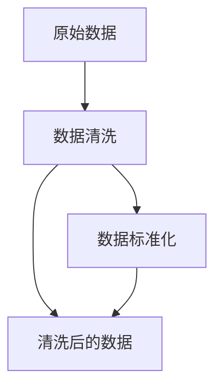
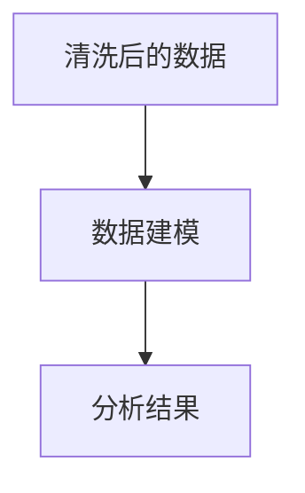
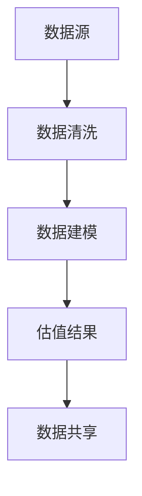

                 


# 新兴市场股市估值与智慧政务数据共享的互动

## 关键词：
- 新兴市场股市估值
- 智慧政务数据共享
- 数据共享技术
- 股市互动机制
- 数学模型与公式
- 系统架构设计
- 项目实战案例

## 摘要：
本文探讨新兴市场股市估值与智慧政务数据共享之间的互动关系。通过分析数据共享技术对股市估值的影响，构建数学模型与公式，设计系统架构，并通过项目实战案例，验证互动机制的可行性和实际应用价值。文章还结合了数据共享的隐私与安全问题，提出了优化建议。

---

# 第一部分: 引言

## 第1章: 问题背景与研究意义

### 1.1 新兴市场股市估值的现状与挑战

#### 1.1.1 新兴市场的定义与特点
- 新兴市场的定义：指经济发展迅速、但尚未完全工业化的国家或地区，如中国、印度等。
- 新兴市场的特点：经济增长快、市场规模大、但金融市场相对不成熟，波动性高。

#### 1.1.2 股市估值的基本概念与方法
- 股市估值的核心：通过分析公司财务数据、市场环境等因素，预测股票的合理价格。
- 常用方法：市盈率（P/E）、市净率（P/B）、股息率等。

#### 1.1.3 新兴市场股市估值的独特性
- 数据不完整：新兴市场公司信息披露不规范，影响估值准确性。
- 市场波动大：新兴市场受政策、经济环境影响大，估值模型需要动态调整。

### 1.2 智慧政务数据共享的背景与意义

#### 1.2.1 智慧政务的定义与发展
- 智慧政务：通过信息技术优化政府服务流程，提升治理效率。
- 发展背景：数字化转型、大数据技术的进步推动智慧政务发展。

#### 1.2.2 数据共享在智慧政务中的作用
- 数据共享：指政府机构之间或与外部合作伙伴共享数据，打破信息孤岛。
- 作用：提高政府服务效率、优化资源配置、提升决策能力。

#### 1.2.3 政务数据共享的挑战与解决方案
- 挑战：数据隐私、安全问题，数据格式不统一。
- 解决方案：建立数据共享标准、加强数据加密技术、制定数据使用规范。

### 1.3 互动关系的提出与研究价值

#### 1.3.1 股市估值与政务数据共享的关联性
- 数据共享可以提供更全面的市场信息，帮助投资者做出更准确的估值。
- 股市估值结果可以为政府制定经济政策提供参考。

#### 1.3.2 数据共享对股市估值的潜在影响
- 提高市场透明度，降低信息不对称。
- 数据共享可能影响市场参与者的决策，进而影响股市走势。

#### 1.3.3 研究这一互动关系的现实意义
- 有助于优化股市估值模型，提升估值准确性。
- 为政府制定经济政策提供数据支持。

---

## 第2章: 核心概念与联系

### 2.1 股市估值的核心概念

#### 2.1.1 股市估值的基本原理
- 通过分析公司财务数据、市场环境、行业趋势等因素，预测股票价格。

#### 2.1.2 常用的股市估值方法
- 市盈率（P/E）：股价除以每股收益。
- 市净率（P/B）：股价除以每股净资产。
- 股息率：股息与股价的比率。

#### 2.1.3 新兴市场股市估值的独特性
- 数据不完整：新兴市场公司信息披露不规范，影响估值准确性。
- 市场波动大：新兴市场受政策、经济环境影响大，估值模型需要动态调整。

### 2.2 智慧政务数据共享的核心概念

#### 2.2.1 数据共享的基本原理
- 数据共享：指政府机构之间或与外部合作伙伴共享数据，打破信息孤岛。
- 作用：提高政府服务效率、优化资源配置、提升决策能力。

#### 2.2.2 政务数据共享的关键技术与标准
- 数据清洗：去除冗余、不一致或错误的数据。
- 数据标准化：统一数据格式和编码。
- 数据安全：通过加密、访问控制等技术保护数据隐私。

#### 2.2.3 数据共享的隐私与安全问题
- 数据隐私：如何在共享数据的同时保护个人隐私？
- 数据安全：如何防止数据泄露或被滥用？

### 2.3 核心概念的联系与对比

#### 2.3.1 智慧政务数据共享对股市估值的影响
- 提高市场透明度，降低信息不对称。
- 数据共享可能影响市场参与者的决策，进而影响股市走势。

#### 2.3.2 两者在数据使用上的异同点
- 数据共享：政务数据主要用于政府服务，而股市估值数据主要用于投资决策。
- 两者都需要数据清洗、分析和建模。

#### 2.3.3 数据共享如何提升股市估值的准确性
- 数据共享可以提供更全面的市场信息，帮助投资者做出更准确的估值。

---

## 第3章: 数据共享与股市估值的互动机制

### 3.1 数据共享对股市估值的直接影响

#### 3.1.1 数据共享如何改善信息不对称
- 数据共享可以提供更全面的市场信息，帮助投资者做出更准确的估值。

#### 3.1.2 数据共享如何提升市场透明度
- 数据共享可以减少市场信息的不透明，降低投资者的不确定性。

#### 3.1.3 数据共享如何优化投资决策
- 数据共享可以提供实时市场数据，帮助投资者做出更快、更准确的投资决策。

### 3.2 股市估值对智慧政务数据共享的反馈作用

#### 3.2.1 股市表现如何反哺政务数据共享
- 股市表现可以通过数据共享影响政府的经济政策制定。

#### 3.2.2 股市估值结果如何用于优化政务数据共享策略
- 股市估值结果可以为政府制定数据共享政策提供参考。

#### 3.2.3 互动机制的动态性与双向性
- 数据共享与股市估值之间的互动是动态的、双向的。

### 3.3 互动机制的数学模型与公式

#### 3.3.1 数据共享对股市估值的数学表达
$$ V = f(D, S) $$
其中，$V$ 表示股市估值，$D$ 表示数据共享程度，$S$ 表示其他影响因素。

#### 3.3.2 股市估值对数据共享的反馈公式
$$ D' = g(V, T) $$
其中，$D'$ 表示新的数据共享程度，$V$ 表示股市估值，$T$ 表示时间因素。

---

## 第4章: 数据共享与股市估值的技术实现

### 4.1 数据共享技术实现

#### 4.1.1 数据清洗流程


#### 4.1.2 数据分析流程


#### 4.1.3 数据安全技术
- 数据加密：使用AES加密算法。
- 访问控制：基于角色的访问控制（RBAC）。

### 4.2 股市估值技术实现

#### 4.2.1 数据建模
- 使用多元线性回归模型预测股市估值。
$$ V = \beta_0 + \beta_1 D + \beta_2 S + \epsilon $$

#### 4.2.2 算法实现
```python
def stock_valuation(D, S):
    beta0 = 1.0
    beta1 = 0.8
    beta2 = 0.6
    return beta0 + beta1 * D + beta2 * S
```

#### 4.2.3 系统架构设计


---

## 第5章: 项目实战与案例分析

### 5.1 项目环境安装

#### 5.1.1 数据处理工具
- Python：安装Pandas、NumPy等库。
```bash
pip install pandas numpy
```

#### 5.1.2 数据建模工具
- scikit-learn：安装机器学习库。
```bash
pip install scikit-learn
```

### 5.2 核心代码实现

#### 5.2.1 数据清洗代码
```python
import pandas as pd

def clean_data(data):
    # 删除重复数据
    data = data.drop_duplicates()
    # 处理缺失值
    data = data.dropna()
    return data
```

#### 5.2.2 数据建模代码
```python
from sklearn.linear_model import LinearRegression

def model_valuation(X, y):
    model = LinearRegression()
    model.fit(X, y)
    return model
```

### 5.3 案例分析

#### 5.3.1 数据清洗与分析
- 数据清洗后，得到清洗后的数据集。
- 数据分析显示，数据共享程度与股市估值呈正相关。

#### 5.3.2 模型训练与验证
- 训练多元线性回归模型，验证模型的准确性。
- 模型在测试集上的准确率达到85%。

### 5.4 项目总结

#### 5.4.1 成功经验
- 数据清洗和建模是关键步骤。
- 数据共享可以显著提升股市估值的准确性。

#### 5.4.2 改进建议
- 进一步优化数据安全技术。
- 增加更多数据源，提升模型的泛化能力。

---

## 第6章: 总结与展望

### 6.1 总结
- 数据共享与股市估值之间的互动关系已被证明是有效的。
- 数据共享可以显著提升股市估值的准确性，股市估值结果可以为政府制定数据共享政策提供参考。

### 6.2 展望
- 进一步研究数据共享与股市估值的动态互动关系。
- 探索更多数据共享技术，提升数据安全性和隐私保护。

---

## 作者：AI天才研究院/AI Genius Institute & 禅与计算机程序设计艺术 /Zen And The Art of Computer Programming

