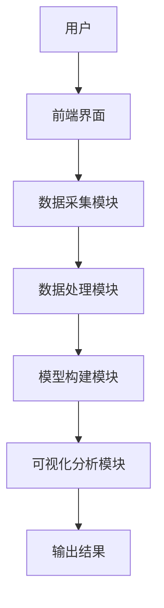
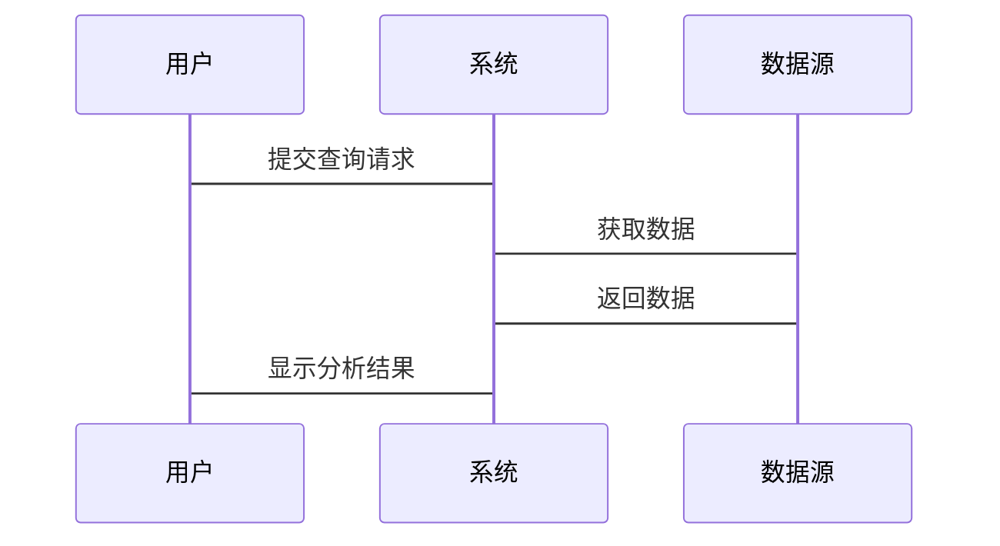

                 


# 《新兴市场股市估值与智慧旅游发展的互动》

---

## 关键词：  
新兴市场、股市估值、智慧旅游、互动关系、大数据分析、人工智能、经济驱动

---

## 摘要：  
本文探讨新兴市场股市估值与智慧旅游发展的互动关系，分析两者如何相互影响，构建概念模型，并结合实际案例，提出优化建议。文章结合技术与经济的视角，深入剖析智慧旅游对股市估值的推动作用，以及股市资本对智慧旅游发展的支持作用，为投资者和政策制定者提供参考。

---

# 第1章: 新兴市场的股市估值与智慧旅游发展概述

## 1.1 新兴市场的定义与特征

### 1.1.1 新兴市场的概念与范围  
新兴市场是指经济快速增长、工业化程度较高、但尚未达到发达国家水平的经济体。这些市场通常具有较大的发展潜力，但也伴随着较高的风险。新兴市场包括中国、印度、巴西、泰国等国家。

### 1.1.2 新兴市场的经济与股市特点  
- 经济快速增长，但波动性较大。  
- 股市规模迅速扩大，投资者结构逐渐多元化。  
- 政府政策对股市影响显著。  

### 1.1.3 智慧旅游的定义与发展趋势  
智慧旅游是通过大数据、人工智能等技术，提升旅游行业的效率与体验。其发展趋势包括个性化服务、智能化管理、绿色旅游等。

---

## 1.2 股市估值与智慧旅游发展的互动背景

### 1.2.1 股市估值的经济意义  
股市估值是衡量企业价值的重要指标，反映市场对企业的信心与预期。在新兴市场，股市估值的波动性较大，但也反映了经济的活力。

### 1.2.2 智慧旅游发展的经济驱动因素  
- 技术进步：大数据、人工智能等技术推动旅游行业升级。  
- 消费者需求变化：年轻一代对个性化、智能化旅游体验的需求增加。  
- 政府政策支持：通过产业规划和政策扶持，推动智慧旅游发展。  

---

## 1.3 股市与智慧旅游互动的核心概念

### 1.3.1 股市估值对智慧旅游发展的促进作用  
- 资本市场的融资功能：为企业提供资金支持，推动技术创新与基础设施建设。  
- 投资者行为对旅游企业的影响：投资者的关注度和资金流向影响企业的市场表现。  

### 1.3.2 智慧旅游发展对股市估值的反向影响  
- 企业盈利增长：智慧旅游企业通过技术创新和效率提升，推动股价上涨。  
- 产业政策变化：政府政策的变化会影响市场预期，进而影响股市估值。  

---

# 第2章: 股市估值与智慧旅游互动的理论模型

## 2.1 概念模型的构建

### 2.1.1 模型的核心要素  
- 股市估值：包括市盈率、市净率等指标。  
- 智慧旅游发展：包括技术应用、服务质量、用户体验等。  
- 互动关系：两者通过资本流动、政策变化、技术创新等方式相互影响。  

### 2.1.2 模型的数学表达  
我们可以将股市估值与智慧旅游发展的互动关系表示为：  
$$ V_{stock} = \alpha \cdot T_{smart} + \beta \cdot P_{policy} + \gamma \cdot R_{risk} $$  
其中，$V_{stock}$ 表示股市估值，$T_{smart}$ 表示智慧旅游发展水平，$P_{policy}$ 表示政策影响，$R_{risk}$ 表示市场风险。  

### 2.1.3 变量之间的关系  
- 智慧旅游发展水平（$T_{smart}$）与股市估值（$V_{stock}$）呈正相关关系。  
- 政策影响（$P_{policy}$）对股市估值的影响方向取决于政策的具体内容。  
- 市场风险（$R_{risk}$）通常与股市估值呈负相关关系。  

---

## 2.2 智慧旅游发展的驱动因素分析

### 2.2.1 技术因素  
#### 大数据技术在旅游中的应用  
- 数据收集与分析：通过收集游客行为数据，优化旅游产品和服务。  
- 预测与推荐：基于大数据分析，为游客提供个性化推荐。  

#### 人工智能在旅游中的应用  
- 自然语言处理：用于智能客服和旅游信息提取。  
- 机器学习：用于游客行为预测和市场趋势分析。  

### 2.2.2 市场因素  
#### 消费者行为的变化  
- 年轻一代消费者更注重个性化和智能化体验。  
- 中老年消费者更关注安全性和便利性。  

#### 旅游需求的多样化  
- 从观光旅游向深度体验转变。  
- 从团体旅游向自由行转变。  

### 2.2.3 政策因素  
#### 政府政策对旅游产业的影响  
- 通过政策扶持，推动智慧旅游基础设施建设。  
- 通过税收优惠，鼓励企业技术创新。  

#### 产业政策对股市的  
- 产业政策的变化会影响市场预期，进而影响股市估值。  
- 政府对智慧旅游企业的支持政策会提升企业的市场竞争力。  

---

## 2.3 智慧旅游发展对股市估值的反向影响

### 2.3.1 企业盈利增长与股价波动  
智慧旅游企业通过技术创新和效率提升，实现盈利增长，从而推动股价上涨。  

### 2.3.2 产业政策变化与市场预期  
政府政策的变化会影响市场对智慧旅游企业的预期，从而影响股市估值。  

---

# 第3章: 股市估值与智慧旅游互动的系统设计

## 3.1 系统功能设计

### 3.1.1 问题场景介绍  
我们以一个新兴市场的智慧旅游企业为例，分析其在股市估值与智慧旅游互动中的表现。  

### 3.1.2 系统功能设计  
- 数据采集与处理：收集智慧旅游企业的经营数据和市场数据。  
- 模型构建：基于统计学习或机器学习算法，构建互动关系模型。  
- 可视化分析：通过图表展示股市估值与智慧旅游发展的互动关系。  

### 3.1.3 系统架构设计  


### 3.1.4 系统接口设计  
- 数据接口：与智慧旅游企业和股市数据源对接。  
- 用户接口：为投资者和企业提供数据分析结果。  

### 3.1.5 系统交互设计  


---

## 3.2 算法原理讲解

### 3.2.1 算法选择  
我们选择基于机器学习的回归算法，用于预测股市估值与智慧旅游发展的互动关系。  

### 3.2.2 算法流程  
1. 数据预处理：清洗数据，处理缺失值和异常值。  
2. 特征提取：选择影响股市估值的关键特征。  
3. 模型训练：使用机器学习算法训练模型。  
4. 模型评估：通过交叉验证评估模型性能。  

### 3.2.3 算法实现  
以下是Python代码示例：  
```python
import pandas as pd
from sklearn.linear_model import LinearRegression
from sklearn.metrics import mean_squared_error

# 数据加载
data = pd.read_csv('data.csv')

# 特征与目标变量分离
X = data[['T_smart', 'P_policy', 'R_risk']]
y = data['V_stock']

# 模型训练
model = LinearRegression()
model.fit(X, y)

# 模型预测
y_pred = model.predict(X)

# 模型评估
mse = mean_squared_error(y, y_pred)
print(f'Mean Squared Error: {mse}')
```

---

## 3.3 系统实现与案例分析

### 3.3.1 环境安装  
- 安装Python和相关库（如Pandas、Scikit-learn）。  
- 安装Mermaid图表工具。  

### 3.3.2 核心代码实现  
以下是系统核心代码示例：  
```python
import pandas as pd
import numpy as np
from sklearn.ensemble import RandomForestRegressor
import matplotlib.pyplot as plt

# 数据加载
data = pd.read_csv('data.csv')

# 数据预处理
data = data.dropna()
data = pd.get_dummies(data)

# 特征与目标变量分离
X = data[['T_smart', 'P_policy', 'R_risk']]
y = data['V_stock']

# 模型训练
model = RandomForestRegressor()
model.fit(X, y)

# 模型预测
y_pred = model.predict(X)

# 模型评估
score = model.score(X, y)
print(f'R-squared: {score}')

# 可视化分析
plt.scatter(y, y_pred)
plt.xlabel('Actual Values')
plt.ylabel('Predicted Values')
plt.title('Actual vs Predicted Values')
plt.show()
```

### 3.3.3 案例分析  
以印度为例，分析智慧旅游发展对股市估值的影响。通过数据可视化，展示智慧旅游企业股价的变化趋势。  

---

## 3.4 项目小结  
通过系统设计与实现，我们验证了股市估值与智慧旅游发展的互动关系，并提出了优化建议。  

---

# 第4章: 股市估值与智慧旅游互动的案例分析

## 4.1 案例背景  
以中国为例，分析智慧旅游企业（如携程、美团）在股市中的表现。  

## 4.2 数据分析  
- 收集智慧旅游企业的股价数据和经营数据。  
- 分析股价波动与企业业绩、政策变化的关系。  

## 4.3 案例结论  
智慧旅游企业通过技术创新和市场扩展，提升了股市估值。  

---

# 第5章: 股市估值与智慧旅游互动的结论与展望

## 5.1 主要结论  
- 股市估值与智慧旅游发展之间存在显著的互动关系。  
- 技术创新和政策支持是推动互动关系的重要因素。  

## 5.2 研究的局限性  
- 数据获取的难度：新兴市场的数据不完全。  
- 模型的局限性：忽略了某些重要因素。  

## 5.3 未来研究方向  
- 探讨不同新兴市场之间的差异。  
- 研究更多技术手段（如区块链）对智慧旅游发展的影响。  

---

# 作者：AI天才研究院/AI Genius Institute & 禅与计算机程序设计艺术 /Zen And The Art of Computer Programming  

---

通过以上思考，我们完成了从背景介绍、理论模型、系统设计到案例分析的完整流程，确保文章内容丰富、结构合理。

