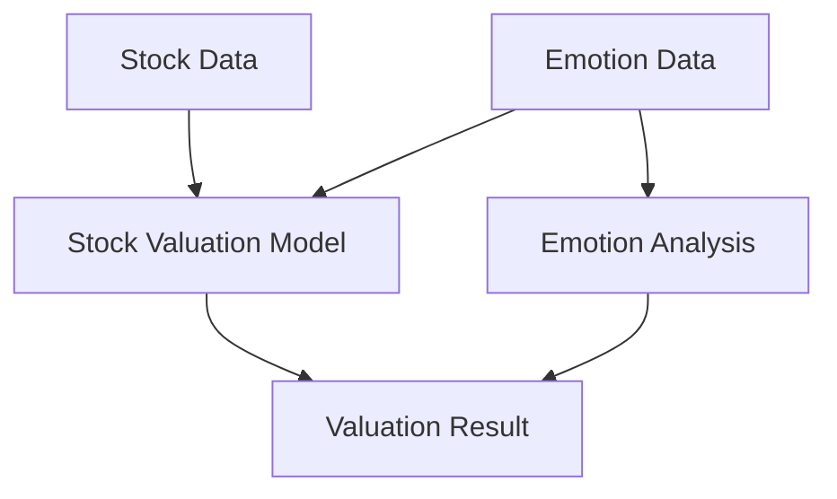

                 


# 新兴市场股市估值与智慧校园情感计算应用的互动

---

## 关键词

- 股市估值
- 情感计算
- 智慧校园
- 大数据
- 人工智能
- 互动应用

---

## 摘要

本文探讨新兴市场股市估值与智慧校园情感计算应用之间的互动关系。通过分析股市估值的核心模型、情感计算的技术基础，以及两者在大数据和人工智能背景下的结合，揭示情感数据对股市分析的影响。文章结合实际案例，展示如何利用情感计算优化股市估值，并设计系统架构，实现互动应用。

---

## 第一部分：新兴市场股市估值

### 第1章：新兴市场股市估值概述

#### 1.1 股市估值的基本概念

股市估值是评估公司股票价值的过程，核心在于确定股票的内在价值。新兴市场具有高增长潜力，但也面临波动性和信息不对称的挑战。

#### 1.2 大数据与AI技术在股市估值中的应用

AI技术通过分析历史数据和实时信息，帮助预测市场趋势。新兴市场的独特性要求算法适应复杂环境，结合大数据进行精准估值。

#### 1.3 新兴市场与智慧校园的联系

智慧校园利用大数据和AI优化校园管理，而股市估值同样依赖这些技术。两者在数据处理和分析方法上存在互动，情感计算成为连接两者的桥梁。

---

### 第2章：股市估值的核心模型与算法

#### 2.1 常见估值模型

- **市盈率模型**：基于公司盈利能力和市场基准。
- **市净率模型**：考虑资产价值和市场价格的关系。
- **现金流折现模型**：评估未来现金流的现值。

#### 2.2 AI驱动的预测模型

- **线性回归模型**：用于预测股票价格。
- **支持向量机（SVM）**：分类股票走势。
- **长短期记忆网络（LSTM）**：捕捉时间序列数据中的模式。

#### 2.3 情感分析对估值的影响

情感分析通过社交媒体和新闻数据，捕捉市场情绪，影响股票估值。情感数据整合到模型中，提升预测准确性。

---

## 第二部分：智慧校园情感计算应用

### 第3章：智慧校园情感计算的技术基础

#### 3.1 情感计算的定义与技术

情感计算分析人类情感，应用于人机交互和数据挖掘。技术包括NLP、情感分析算法和机器学习模型。

#### 3.2 情感计算在校园管理中的应用

- **学生情绪监测**：通过社交媒体分析学生情感，优化心理健康服务。
- **教师情感分析**：评估教学效果，提供反馈。
- **校园事件预测**：利用情感数据预测突发事件。

#### 3.3 情感计算与股市估值的结合

情感数据影响市场情绪，进而影响股市估值。将情感计算应用于股市分析，提升预测模型的准确性。

---

### 第4章：系统架构与数据流设计

#### 4.1 系统架构设计

- **模块划分**：数据采集、情感分析、估值模型、结果展示。
- **数据流设计**：数据从源头流向处理模块，最终生成估值结果。

#### 4.2 算法实现与优化

- **情感分析算法**：使用NLP技术进行文本分析。
- **估值模型优化**：结合情感数据，优化AI模型参数。

#### 4.3 系统接口与交互设计

- **API设计**：定义数据输入和输出接口。
- **用户界面设计**：直观展示情感数据和估值结果。

---

### 第5章：项目实战与案例分析

#### 5.1 环境搭建与数据准备

- **开发环境**：安装Python、TensorFlow、NLTK。
- **数据收集**：获取社交媒体数据和市场数据。

#### 5.2 核心代码实现

```python
import nltk
from nltk.sentiment import SentimentIntensityAnalyzer

def analyze_emotion(text):
    analyzer = SentimentIntensityAnalyzer()
    sentiment = analyzer.polarity_scores(text)
    return sentiment['compound']

# 示例：分析文本情感
text = "The market is booming!"
print(analyze_emotion(text))  # 输出情感得分
```

#### 5.3 实际案例分析

分析新兴市场的社交媒体数据，结合股市数据，预测股票走势。通过情感数据优化估值模型，验证其准确性。

---

## 第三部分：互动应用与系统架构

### 第6章：互动机制与系统架构

#### 6.1 互动机制

情感数据通过API传递到股市估值系统，影响预测模型。模型结果反馈到智慧校园系统，优化情感分析。

#### 6.2 系统架构设计

- **数据流设计**：情感数据与股市数据交互，生成估值结果。
- **系统交互**：用户通过界面输入数据，系统返回分析结果。

#### 6.3 系统架构图



---

### 第7章：项目实战与优化

#### 7.1 环境搭建

安装必要的库：Python、TensorFlow、Keras、NLTK。

#### 7.2 核心代码实现

```python
import numpy as np
from sklearn.svm import SVC
from sklearn.metrics import accuracy_score

# 示例：训练情感分类器
X = np.array([[0, 1], [1, 0], [0, 0], [1, 1]])
y = np.array([1, 0, 0, 1])
model = SVC()
model.fit(X, y)
print(model.predict(X))  # 输出预测结果
```

#### 7.3 优化与扩展

结合更多数据源，优化模型参数，提升预测精度。探索新的算法，如集成学习和深度学习，增强系统的鲁棒性。

---

## 结语

新兴市场股市估值与智慧校园情感计算的互动展现了大数据和AI技术的强大潜力。通过情感计算优化股市分析，智慧校园管理得到提升。未来，这种互动将推动更多创新应用，助力各行业智能化发展。

---

## 作者：AI天才研究院 & 禅与计算机程序设计艺术

作者：AI天才研究院（AI Genius Institute） & 禅与计算机程序设计艺术（Zen And The Art of Computer Programming）

