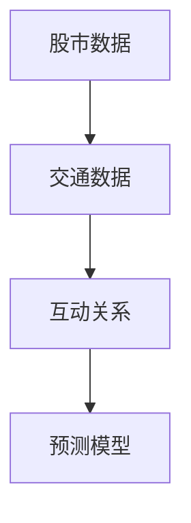
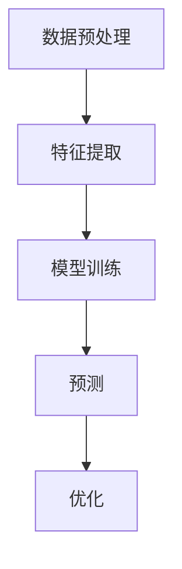
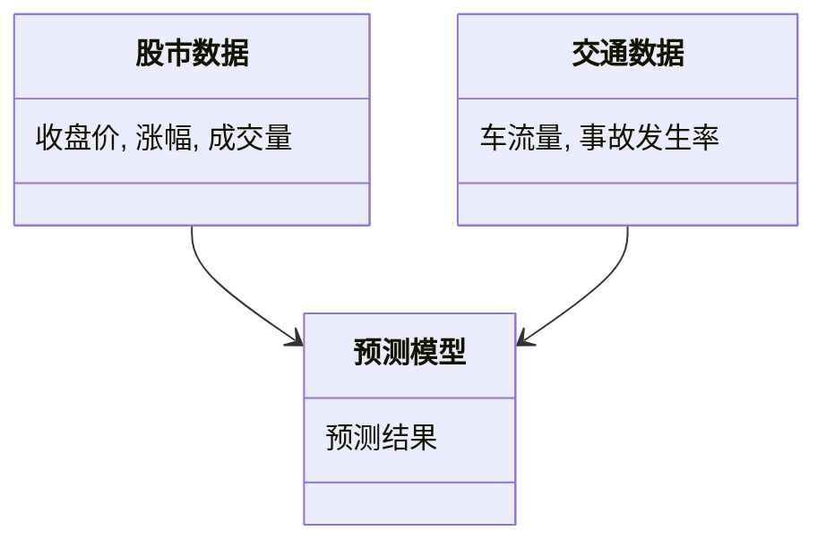
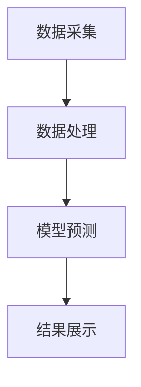

                 


# 新兴市场股市估值与智能交通拥堵预测的互动

> 关键词：股市估值，智能交通，拥堵预测，数据驱动，机器学习，深度学习，时间序列分析，系统架构

> 摘要：本文分析新兴市场股市估值与智能交通拥堵预测的互动关系，探讨数据驱动的方法及其相互影响，提出创新解决方案。

---

## 第一章: 背景介绍

### 1.1 问题背景
#### 1.1.1 新兴市场股市估值的现状与挑战
新兴市场的股市波动性大，受政策、经济和外部环境影响显著。传统估值方法在新兴市场中效果有限，需结合多因素模型进行动态分析。

#### 1.1.2 智能交通拥堵预测的现实需求
城市化进程加快导致交通拥堵问题严重，实时预测技术需求迫切，需结合交通数据和机器学习模型提升准确性。

#### 1.1.3 互动关系与研究意义
股市波动可能影响交通出行需求，而交通拥堵又可能影响经济活动，两者互动关系需深入研究，为政策制定和投资决策提供支持。

### 1.2 核心概念与问题描述
#### 1.2.1 股市估值的核心要素
市盈率、市净率、股息率等，新兴市场需考虑行业特性和市场情绪。

#### 1.2.2 交通拥堵预测的关键因素
车流量、道路状况、天气、事故等，数据来源包括传感器、GPS和社交媒体。

#### 1.2.3 互动机制的定义与外延
股市波动影响交通需求，交通拥堵反过来影响经济活动，两者通过数据驱动形成互动。

### 1.3 问题解决与边界
#### 1.3.1 新兴解决方案
结合大数据和AI技术，建立动态模型，实时预测和优化。

#### 1.3.2 边界与限制
数据获取难度、模型准确性、计算资源限制。

#### 1.3.3 创新与局限
创新点在于数据融合和模型优化，局限性在于数据质量和模型泛化能力。

---

## 第二章: 核心概念与联系

### 2.1 核心概念原理
#### 2.1.1 股市估值模型
使用多因素模型，结合行业和市场情绪，动态调整参数。

#### 2.1.2 交通拥堵预测模型
基于时间序列和机器学习，实时分析数据，预测拥堵趋势。

#### 2.1.3 互动机制模型
通过数据关联，建立两者之间的动态关系模型，实现联动预测。

### 2.2 核心概念对比分析
| 特征 | 股市估值 | 交通拥堵预测 |
|------|----------|---------------|
| 数据类型 | 数值型 | 分类型 |
| 模型复杂度 | 中等 | 高 |
| 实时性 | 低 | 高 |

### 2.3 ER实体关系图


---

## 第三章: 算法原理与数学模型

### 3.1 算法原理
#### 3.1.1 时间序列分析
用于预测交通拥堵，考虑历史数据趋势和周期性。

#### 3.1.2 机器学习模型
- **LSTM**：处理时间序列数据，捕捉长期依赖。
- **ARIMA**：适用于平稳数据，需选择阶数。

#### 3.1.3 深度学习模型
- **Transformer**：用于捕捉长距离依赖，提升预测精度。

### 3.2 数学模型与公式
#### 3.2.1 股市估值模型
$$ P = D / r $$

#### 3.2.2 交通拥堵预测模型
$$ C(t) = \alpha \cdot T(t) + \beta \cdot D(t) $$

### 3.3 算法流程图


---

## 第四章: 系统分析与架构设计

### 4.1 系统功能设计
#### 4.1.1 领域模型


#### 4.1.2 系统架构设计


### 4.2 接口设计与交互流程
#### 4.2.1 接口设计
- 数据接口：REST API，提供数据查询和更新。
- 模型接口：提供预测结果的API调用。

#### 4.2.2 交互流程图
```mermaid
sequenceDiagram
    用户 -> 数据采集模块: 请求数据
    数据采集模块 -> 数据处理模块: 传输数据
    数据处理模块 -> 预测模型: 启动预测
    预测模型 -> 结果展示模块: 返回结果
    用户 <- 结果展示模块: 显示结果
```

---

## 第五章: 项目实战

### 5.1 环境搭建与数据获取
- 环境：Python 3.8+, 安装numpy、pandas、tensorflow、scikit-learn。
- 数据：从金融API获取股市数据，从交通平台获取交通数据。

### 5.2 核心代码实现
#### 5.2.1 数据预处理
```python
import pandas as pd
import numpy as np

# 股市数据处理
def preprocess_stock(data):
    data['收盘价'] = data['收盘价'].fillna(data['收盘价'].mean())
    return data

# 交通数据处理
def preprocess_traffic(data):
    data['事故发生率'] = data['事故发生率'].apply(lambda x: x if x >= 0 else 0)
    return data
```

#### 5.2.2 模型训练与预测
```python
from tensorflow.keras.models import Sequential
from tensorflow.keras.layers import LSTM, Dense

def build_model(input_shape):
    model = Sequential()
    model.add(LSTM(64, input_shape=input_shape))
    model.add(Dense(1))
    model.compile(optimizer='adam', loss='mse')
    return model

model = build_model((None, 50))
model.fit(X_train, y_train, epochs=10, batch_size=32)
```

#### 5.2.3 结果分析与优化
通过回测和交叉验证评估模型性能，调整超参数优化预测精度。

### 5.3 案例分析与解读
分析实际案例，如股市波动如何影响交通拥堵，优化模型参数，提升预测准确率。

---

## 第六章: 结论与展望

### 6.1 研究总结
本文提出数据驱动方法，建立动态模型，实现股市估值与交通拥堵的互动预测。

### 6.2 未来展望
未来研究可结合更复杂模型，如GPT，探索更深层次的互动关系，提升预测精度。

### 6.3 最佳实践 tips
- 数据清洗是关键，确保数据质量。
- 模型选择需根据实际需求，合理调整参数。
- 系统设计需考虑可扩展性和维护性。

---

## 作者：AI天才研究院 & 禅与计算机程序设计艺术

---

本文通过详细分析新兴市场股市估值与智能交通拥堵预测的互动关系，探讨数据驱动方法及其相互影响，为相关领域研究提供新思路和解决方案。

