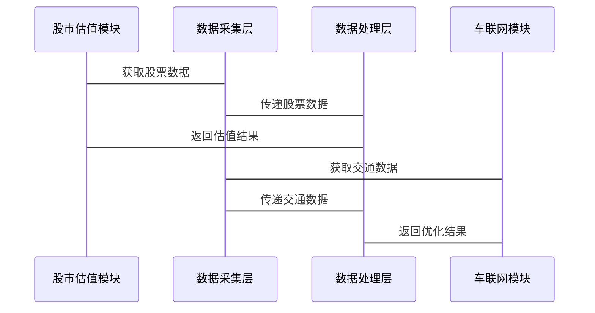

                 


# 新兴市场股市估值与智能交通车联网技术的互动

> 关键词：新兴市场、股市估值、智能交通、车联网技术、互动关系

> 摘要：本文探讨新兴市场股市估值与智能交通车联网技术之间的互动关系。通过分析股市估值的核心概念、车联网技术的核心要素，以及两者如何相互影响，揭示这种互动对经济和技术创新的深远影响。

---

## 第1章: 新兴市场股市估值的核心概念与方法

### 1.1 新兴市场的定义与特点

#### 1.1.1 新兴市场的经济特征

新兴市场是指经济快速发展的国家或地区，通常具有以下特征：
- 经济快速增长，但基础仍不完善。
- 产业结构转型中，制造业和服务业快速发展。
- 金融市场逐步成熟，但波动性较大。

#### 1.1.2 新兴市场的股市特点

新兴市场的股市具有以下特点：
- 波动性较大，受政策和外部环境影响显著。
- 市场参与者以散户为主，机构投资者比例相对较低。
- 市场流动性不足，尤其是在新兴市场初期阶段。

#### 1.1.3 新兴市场与发达市场的对比

- 经济结构：新兴市场多处于工业化中期，而发达市场多为后工业化社会。
- 金融市场：新兴市场波动性高，发达市场相对稳定。
- 投资环境：新兴市场风险较高，但回报潜力大；发达市场风险较低，回报相对稳定。

### 1.2 股市估值的核心概念

#### 1.2.1 股票估值的基本原理

股票估值是通过分析企业的财务状况、行业地位和市场前景，确定其股票的合理价格。常用的方法包括：
- 市盈率（PE）：市价与每股收益的比率。
- 市净率（PB）：市价与每股净资产的比率。
- 企业价值（EV）：公司整体价值的评估指标。

#### 1.2.2 常用的估值指标（PE、PB、PS等）

- PE（市盈率）：反映市场对每股收益的估值。
- PB（市净率）：反映市场对每股净资产的估值。
- PS（市销率）：反映市场对每股收入的估值。

#### 1.2.3 股市估值的挑战与难点

- 数据不透明：新兴市场信息披露不完善，影响估值准确性。
- 波动性高：市场波动大，估值模型难以稳定适用。
- 宏观因素：政策变化和全球经济波动对估值影响显著。

---

## 第2章: 智能交通与车联网技术的核心要素

### 2.1 智能交通系统（ITS）概述

#### 2.1.1 ITS的定义与组成

智能交通系统（ITS）是利用先进的信息技术、数据通信、自动控制和电子机械技术，对整个交通系统进行检测、协调和优化的综合系统。主要包括以下组成部分：
- 交通监控系统：实时监测交通流量和道路状况。
- 交通管理系统：优化交通信号和路网流量。
- 交通信息系统：向驾驶者提供实时交通信息。

#### 2.1.2 ITS的主要功能

- 实时监测交通状况。
- 优化交通流量，减少拥堵。
- 提供实时交通信息，辅助驾驶决策。
- 支持紧急情况下的交通管理。

#### 2.1.3 ITS的发展历程

ITS的概念最早出现在20世纪80年代，随着信息技术的发展， ITS的应用范围不断扩大，从最初的交通信号控制发展到如今的智能交通管理。

### 2.2 车联网技术的核心原理

#### 2.2.1 车联网的定义与特点

车联网（V2X）是指车辆与外部网络的连接，通过车与车（V2V）、车与路（V2I）、车与人（V2P）之间的信息交互，实现更安全、更高效的交通系统。

#### 2.2.2 车联网的主要技术（如V2X通信）

- V2V（车辆与车辆通信）：车辆之间共享位置、速度和方向信息。
- V2I（车辆与基础设施通信）：车辆与交通信号灯、道路传感器等基础设施通信。
- V2P（车辆与行人通信）：车辆与行人之间共享信息，提高安全性。

#### 2.2.3 车联网的应用场景

- 智能驾驶：通过车联网实现车辆的自动驾驶。
- 交通优化：通过实时交通信息优化车辆路径。
- 安全预警：通过车联网提前预警潜在危险。

---

## 第3章: 股市估值与车联网技术的互动关系

### 3.1 股市波动对车联网产业的影响

#### 3.1.1 股市资金流动与车联网投资的关系

股市资金流动直接影响车联网企业的融资能力。股市上涨时，投资者更愿意投资新兴技术领域，车联网企业更容易获得资金支持；股市下跌时，企业融资难度增加，影响技术开发和推广。

#### 3.1.2 股市风险偏好对车联网技术发展的影响

股市风险偏好影响投资者对车联网技术的信心。高风险偏好可能导致过度投资，低风险偏好可能导致技术开发受阻。

#### 3.1.3 股市估值变化对车联网企业融资的影响

车联网企业的估值变化直接影响其融资能力。高估值可能吸引更多投资者，低估值可能导致融资困难。

### 3.2 车联网技术对股市估值的影响

#### 3.2.1 车联网技术对企业盈利能力和估值的影响

车联网技术的成熟和推广将提升企业的盈利能力和市场地位，从而提高企业的估值。

#### 3.2.2 车联网技术对股市流动性和波动性的影响

车联网技术的广泛应用可能增加股市的流动性，但技术创新也可能引发市场的短期波动。

#### 3.2.3 车联网技术对投资者信心的影响

车联网技术的突破性进展将增强投资者信心，推动股市估值上升。

---

## 第4章: 股市估值与车联网技术互动的数学模型与算法

### 4.1 股市估值模型

#### 4.1.1 常用的股票估值模型（如DCF模型）

- DCF模型：通过现金流折现计算企业价值。
- 市盈率模型：通过市盈率和行业平均值计算股票价值。

#### 4.1.2 新兴市场股市估值的特殊性

新兴市场股市波动大，估值模型需要考虑宏观因素和市场情绪。

#### 4.1.3 股市估值模型的改进与优化

结合车联网技术的市场前景，对估值模型进行调整和优化。

### 4.2 车联网技术的数学建模

#### 4.2.1 车联网数据流的建模

车联网数据流包括车辆位置、速度、道路状况等信息，可以通过时间序列分析进行建模。

#### 4.2.2 车联网通信协议的数学描述

车联网通信协议可以通过图论和网络流模型进行描述。

#### 4.2.3 车联网系统优化的数学模型

通过线性规划和非线性规划模型优化车联网系统的资源分配。

### 4.3 股市估值与车联网技术互动的联合模型

#### 4.3.1 股市与车联网技术的双向影响

股市波动影响车联网技术的投资和研发，车联网技术的发展又反过来影响股市估值。

#### 4.3.2 股市与车联网技术互动的动态模型

通过动态系统模型描述股市与车联网技术的互动关系，考虑时间序列和反馈机制。

---

## 第5章: 股市估值与车联网技术互动的系统分析与架构设计

### 5.1 问题场景介绍

新兴市场中，股市波动和车联网技术的发展相互影响，如何通过技术手段捕捉这种互动关系，优化股市估值和车联网系统的性能。

### 5.2 项目介绍

设计一个结合股市估值和车联网技术的综合系统，通过数据采集、分析和优化，实现两者的互动和协同。

### 5.3 系统功能设计

#### 5.3.1 领域模型（Mermaid类图）

```mermaid
classDiagram
    class 股市估值模块 {
        +股票数据
        +估值模型
        +市场分析
    }
    class 车联网模块 {
        +车辆数据
        +通信协议
        +交通优化
    }
    股市估值模块 -->> 车联网模块
    车联网模块 --> 股市估值模块
```

#### 5.3.2 系统架构设计（Mermaid架构图）


#### 5.3.3 系统接口设计

- 股市数据接口：与股票交易所连接，获取实时股票数据。
- 车联网数据接口：与车辆和道路传感器连接，获取实时交通数据。

#### 5.3.4 系统交互（Mermaid序列图）



---

## 第6章: 项目实战

### 6.1 环境配置

- 数据库：MySQL 或 PostgreSQL
- 开发工具：Python、Jupyter Notebook、Git
- 依赖库：Pandas、NumPy、Scikit-learn、Matplotlib

### 6.2 核心代码实现

#### 6.2.1 数据采集与处理

```python
import pandas as pd
import requests

# 获取股票数据
def get_stock_data(ticker):
    url = f"https://api.example.com/stock/{ticker}"
    response = requests.get(url)
    data = response.json()
    return pd.DataFrame(data)

# 获取车联网数据
def get_v车联网_data():
    url = "https://api.车联网.com/data"
    response = requests.get(url)
    data = response.json()
    return pd.DataFrame(data)
```

#### 6.2.2 数据分析与建模

```python
from sklearn.linear_model import LinearRegression

# 训练股票估值模型
def train_stock_model(data):
    model = LinearRegression()
    model.fit(data[['PE', 'PB']], data['Price'])
    return model

# 训练车联网优化模型
def train_车联网_model(data):
    model = LinearRegression()
    model.fit(data[['速度', '流量']], data['优化结果'])
    return model
```

### 6.3 案例分析

以某新兴市场为例，分析股市波动对车联网企业的影响，以及车联网技术如何反过来影响股市估值。

---

## 第7章: 最佳实践、小结与未来展望

### 7.1 小结

本文探讨了新兴市场股市估值与智能交通车联网技术的互动关系，分析了两者的核心概念和互动机制，并提出了系统的解决方案和项目实战。

### 7.2 注意事项

- 数据采集和处理需要确保准确性和及时性。
- 模型需要根据市场变化进行实时优化和调整。
- 互动关系的分析需要结合具体市场环境和政策背景。

### 7.3 未来展望

随着人工智能和大数据技术的发展，股市估值与车联网技术的互动关系将更加复杂和紧密。未来的研究可以进一步探索多因素模型和复杂网络理论在互动分析中的应用。

---

## 作者：AI天才研究院/AI Genius Institute & 禅与计算机程序设计艺术 /Zen And The Art of Computer Programming

---

这篇文章通过系统地分析股市估值与车联网技术的互动关系，结合理论和实践，为读者提供了全面的视角和深入的见解。希望对您在相关领域的研究和实践有所帮助！

