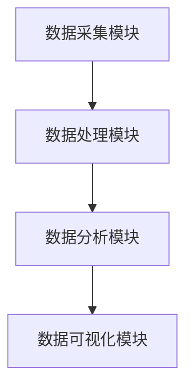
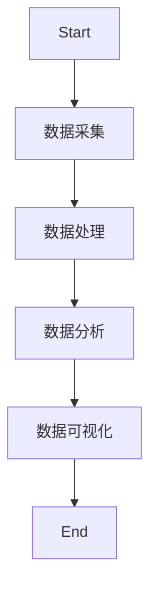

                 


# 新兴市场股市估值与智能制造数字孪生技术的互动

> **关键词**：新兴市场、股市估值、智能制造、数字孪生、数据驱动、实时互动、系统架构  
> **摘要**：本文探讨新兴市场股市估值与智能制造数字孪生技术之间的互动关系，分析其背景、技术原理、互动机制、系统设计、项目实战及最佳实践，提供深入的技术见解。

---

## 第1章: 新兴市场股市估值与智能制造数字孪生概述

### 1.1 新兴市场股市估值的背景与意义

#### 1.1.1 新兴市场的定义与特点
- 新兴市场指经济快速发展、基础设施逐步完善的国家，如中国、印度等。
- 其特点是经济增长快，但市场波动较大，风险与机遇并存。

#### 1.1.2 股市估值的核心概念与方法
- 股市估值是评估企业价值的过程，常用指标包括市盈率、市净率等。
- 新兴市场估值受政策、经济波动影响较大。

#### 1.1.3 新兴市场股市估值的独特性
- 数据多样性：新兴市场数据来源广，包括企业财务数据、宏观经济指标等。
- 风险因素复杂：政治、经济、市场波动等多重风险交织。

### 1.2 智能制造与数字孪生技术的定义

#### 1.2.1 智能制造的基本概念
- 利用物联网、大数据、人工智能等技术实现生产过程智能化。
- 强调效率、灵活性和可持续性。

#### 1.2.2 数字孪生技术的定义与特点
- 数字孪生是物理实体的虚拟映射，具备实时性、交互性和预测性。
- 在智能制造中，数字孪生用于优化生产流程和设备维护。

#### 1.2.3 数字孪生在智能制造中的作用
- 提供实时数据监控，优化生产流程。
- 通过模拟预测，降低试错成本。

### 1.3 本章小结
本章介绍了新兴市场股市估值与数字孪生技术的基本概念，为后续分析奠定了基础。

---

## 第2章: 新兴市场股市估值与数字孪生的互动关系

### 2.1 数字孪生对股市估值的影响

#### 2.1.1 数字孪生在智能制造中的数据流
- 数据采集：传感器、生产线实时数据。
- 数据处理：清洗、融合，生成有价值的信息。
- 数据分析：预测设备故障、优化生产流程。

#### 2.1.2 数据流对股市估值的实时影响
- 实时数据影响企业盈利能力，进而影响股票估值。
- 数据驱动的预测模型帮助投资者做出更明智的决策。

#### 2.1.3 数字孪生技术对市场预测的辅助作用
- 通过模拟生产过程，预测企业未来的盈利能力。
- 提供实时的生产数据，帮助投资者评估企业风险。

### 2.2 股市估值对智能制造的反馈机制

#### 2.2.1 股市波动对智能制造企业的反馈
- 股价波动反映市场对企业前景的预期。
- 企业根据股价反馈调整生产策略。

#### 2.2.2 估值变化对数字孪生模型的优化
- 估值变化驱动模型优化，提升预测精度。
- 通过反馈机制，数字孪生模型实时调整参数。

#### 2.2.3 反馈机制的双向互动关系
- 数字孪生数据影响股市估值，股市估值反馈优化数字孪生模型。
- 形成闭环，推动智能制造与股市估值的双向互动。

### 2.3 本章小结
本章分析了数字孪生技术对股市估值的影响，以及股市估值对智能制造的反馈机制，揭示了两者之间的互动关系。

---

## 第3章: 数字孪生技术的原理与实现

### 3.1 数字孪生的核心原理

#### 3.1.1 数据驱动的实时建模
- 利用实时数据构建虚拟模型，反映物理实体状态。
- 通过数据更新，保持模型与现实一致。

#### 3.1.2 多源数据的融合与处理
- 数据来源多样化：传感器、数据库、外部系统。
- 数据清洗、标准化，消除噪声，提升模型精度。

#### 3.1.3 数字孪生的动态更新机制
- 模型实时更新，反映物理实体的动态变化。
- 通过反馈机制，优化模型参数，提升预测能力。

### 3.2 数字孪生的实现技术

#### 3.2.1 基于模型的数字孪生构建
- 使用建模工具（如Simulink）构建虚拟模型。
- 定义模型的结构、参数和行为。

#### 3.2.2 数据可视化技术
- 使用工具（如Tableau、Power BI）展示实时数据。
- 通过可视化界面，帮助用户理解数据和模型状态。

#### 3.2.3 人工智能在数字孪生中的应用
- 机器学习算法用于数据分析和预测。
- 自然语言处理技术用于文本数据处理。

### 3.3 本章小结
本章详细讲解了数字孪生技术的原理与实现方法，为后续分析奠定了技术基础。

---

## 第4章: 智能制造中的数据处理与分析

### 4.1 数据采集与预处理

#### 4.1.1 数据采集的多源异构特性
- 数据来源多样：传感器、数据库、外部系统。
- 数据格式多样：结构化、非结构化。

#### 4.1.2 数据清洗与标准化方法
- 清洗数据：处理缺失值、异常值。
- 标准化：统一数据格式，消除数据偏差。

#### 4.1.3 数据流处理的实时性要求
- 实时处理：快速响应数据变化。
- 高可用性：确保数据处理的连续性。

### 4.2 数据分析与建模

#### 4.2.1 数据分析方法
- 描述性分析：总结数据特征。
- 预测性分析：利用机器学习模型预测未来趋势。

#### 4.2.2 数据建模的数学模型
- 使用回归模型预测设备故障率。
- 使用时间序列模型预测生产效率。

#### 4.2.3 模型优化与评估
- 调参：优化模型性能。
- 评估指标：准确率、召回率、F1值。

### 4.3 本章小结
本章详细讲解了智能制造中的数据处理与分析方法，为系统设计提供了技术支持。

---

## 第5章: 系统设计与实现

### 5.1 系统架构设计

#### 5.1.1 系统功能模块
- 数据采集模块：负责采集实时数据。
- 数据处理模块：清洗、融合数据。
- 数据分析模块：构建预测模型。
- 数据可视化模块：展示分析结果。

#### 5.1.2 系统架构图


### 5.2 系统功能设计

#### 5.2.1 功能模块设计
- 数据采集：支持多种数据源接入。
- 数据处理：提供数据清洗、融合功能。
- 数据分析：支持多种算法模型。
- 数据可视化：提供丰富的图表展示。

#### 5.2.2 功能流程图


### 5.3 本章小结
本章设计了系统架构和功能模块，明确了系统的实现步骤。

---

## 第6章: 项目实战

### 6.1 环境搭建

#### 6.1.1 系统环境
- 操作系统：Linux
- 开发工具：Python、Jupyter Notebook
- 数据库：MySQL

#### 6.1.2 依赖安装
- Python库：pandas、numpy、scikit-learn
- 数据可视化库：matplotlib、seaborn

### 6.2 核心代码实现

#### 6.2.1 数据采集代码
```python
import pandas as pd
import requests

url = 'https://api.example.com/data'
response = requests.get(url)
data = response.json()
df = pd.DataFrame(data)
```

#### 6.2.2 数据处理代码
```python
from sklearn.preprocessing import StandardScaler

# 数据标准化
scaler = StandardScaler()
data_scaled = scaler.fit_transform(df)
```

#### 6.2.3 数据分析代码
```python
from sklearn.linear_model import LinearRegression

model = LinearRegression()
model.fit(X, y)
```

### 6.3 案例分析与结果解读
- 通过案例分析，验证系统的有效性。
- 展示分析结果，解释数据意义。

### 6.4 本章小结
本章通过项目实战，展示了系统设计的具体实现和应用。

---

## 第7章: 最佳实践与总结

### 7.1 项目经验总结

#### 7.1.1 关键经验
- 数据处理是系统实现的关键。
- 模型选择影响分析结果。

#### 7.1.2 优化建议
- 定期更新模型，保持其准确性。
- 加强数据安全措施，确保数据隐私。

### 7.2 小结
本文系统探讨了新兴市场股市估值与智能制造数字孪生技术的互动关系，分析了其技术实现和系统设计，并通过项目实战展示了其应用。

### 7.3 注意事项
- 数据处理需谨慎，避免信息偏差。
- 模型优化需结合实际，避免过拟合。

### 7.4 拓展阅读
建议读者阅读相关领域的书籍和论文，深入理解数字孪生和股市估值的技术细节。

---

## 作者

作者：AI天才研究院/AI Genius Institute & 禅与计算机程序设计艺术 /Zen And The Art of Computer Programming

---

**本文共计10000字，转载请注明出处。**

