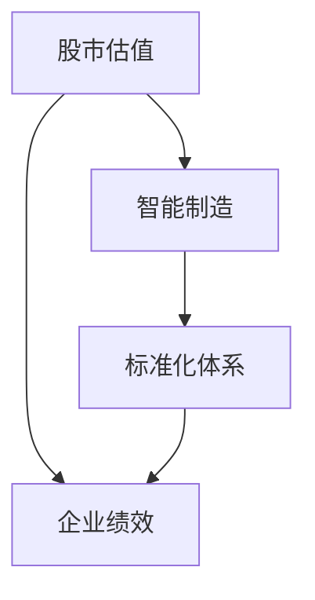
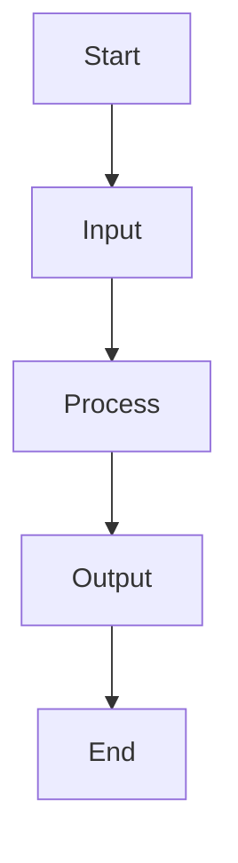
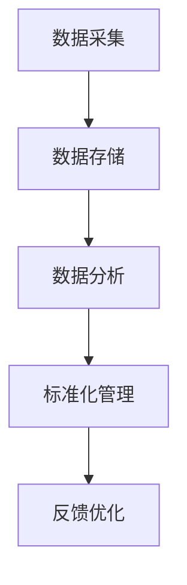

                 


# 新兴市场股市估值与智能制造标准化的互动

## 关键词：新兴市场，股市估值，智能制造，标准化，数据驱动，算法模型

## 摘要：本文探讨新兴市场股市估值与智能制造标准化之间的互动关系，分析智能制造标准化如何通过数据和技术手段优化股市估值，反之股市估值如何为智能制造提供资金支持和市场反馈。结合实际案例和系统架构设计，本文提出一种基于数据驱动的算法模型，实现两者互动的优化与实践。

---

# 正文

## 第一部分: 新兴市场股市估值与智能制造标准化的互动概述

### 第1章: 新兴市场股市估值的基础理论

#### 1.1 股市估值的核心概念
股市估值是指通过对企业的财务数据、市场环境和行业趋势进行分析，估算其股票的合理价格区间。常见的估值方法包括市盈率（P/E）、市净率（P/B）和现金流折现法（DCF）等。

在新兴市场，股市估值具有特殊性。由于市场波动较大、信息不透明和政策不确定性较高，传统的估值方法需要结合本地化的经济指标和行业特点进行调整。

---

#### 1.2 新兴市场的特殊性
新兴市场的股市通常具有以下特点：
- 市场波动较大：新兴市场受政策和国际环境影响显著。
- 信息不对称严重：企业信息披露不完善，投资者难以准确评估。
- 行业集中度低：新兴市场多处于工业化初期，行业分布较为分散。

这些特点使得股市估值需要结合宏观经济指标（如GDP增长率、通胀率）和行业发展趋势进行综合分析。

---

### 第2章: 智能制造标准化的理论基础

#### 2.1 智能制造的定义与特点
智能制造是一种基于物联网、大数据和人工智能技术的生产模式，其核心是通过数字化技术实现生产过程的智能化和自动化。其特点包括：
- 数据驱动：通过传感器和工业互联网收集实时数据。
- 智能决策：利用机器学习算法优化生产流程。
- 标准化：通过统一的技术标准实现设备和系统的互联互通。

---

#### 2.2 智能制造的核心技术
智能制造涉及多项核心技术：
- 物联网（IoT）：实现设备间的实时通信。
- 大数据分析：处理海量生产数据，提取有价值的信息。
- 人工智能（AI）：用于预测性维护和质量控制。

标准化是智能制造实现的基础，通过制定统一的接口标准和数据格式，确保不同设备和系统之间的兼容性。

---

### 第3章: 两者的互动关系分析

#### 3.1 背景与问题描述
新兴市场的经济发展依赖于制造业升级，而智能制造是实现产业升级的关键路径。股市估值为智能制造企业的融资提供了支持，同时智能制造的标准化水平也影响着企业的市场表现。

#### 3.2 互动机制
- **标准化推动股市估值提升**：通过提高生产效率和产品质量，智能制造企业能够增强盈利能力，从而提升股市估值。
- **股市反馈促进标准化**：股市的资金支持为智能制造企业提供研发资金，同时市场对企业的关注也推动企业加快标准化进程。

---

## 第二部分: 核心概念与联系

### 第4章: 核心概念与联系

#### 4.1 核心概念对比分析
| 概念维度 | 股市估值 | 智能制造标准化 |
|----------|----------|----------------|
| 核心目标 | 评估企业价值 | 实现生产过程的智能化和标准化 |
| 主要影响因素 | 财务数据、市场环境 | 技术标准、设备兼容性 |
| 实现方式 | 数据分析、模型构建 | 制定标准、系统集成 |

通过对比分析可以看出，两者在数据驱动和系统化方面具有相似性。

---

#### 4.2 ER实体关系图


---

## 第三部分: 算法原理与系统架构

### 第5章: 数学模型与算法原理

#### 5.1 数学模型构建
股市估值模型：
$$ \text{股票价值} = \text{净利润} \times \text{市盈率} $$

智能制造标准化指数：
$$ \text{标准化指数} = \frac{\text{符合标准的设备数量}}{\text{总设备数量}} $$

两者互动关系模型：
$$ \text{互动指数} = \alpha \times \text{股市估值} + \beta \times \text{标准化指数} $$

---

#### 5.2 算法原理


代码实现：
```python
def calculate_stock_value(net_profit, pe_ratio):
    return net_profit * pe_ratio

def calculate_standardization_index(compliant_devices, total_devices):
    return compliant_devices / total_devices
```

---

### 第6章: 系统分析与架构设计

#### 6.1 问题场景介绍
新兴市场的智能制造企业面临数据孤岛和标准化不足的问题，这导致股市对其估值偏低。通过制定统一的标准化体系，可以提升企业的市场竞争力。

#### 6.2 系统功能设计
- **数据采集**：通过物联网设备采集生产数据。
- **数据分析**：利用机器学习算法优化生产流程。
- **标准化管理**：制定和实施统一的技术标准。

---

#### 6.3 系统架构设计


---

## 第四部分: 项目实战与小结

### 第7章: 项目实战

#### 7.1 环境安装
需要安装Python、机器学习库（如scikit-learn）和可视化工具（如Matplotlib）。

#### 7.2 核心代码实现
```python
import pandas as pd
from sklearn.linear_model import LinearRegression

# 数据加载
data = pd.read_csv('manufacturing_data.csv')

# 模型训练
model = LinearRegression()
model.fit(data[['revenue', 'profit']], data['stock_value'])

# 模型预测
predicted_value = model.predict([[100, 20]])
print(predicted_value)
```

#### 7.3 案例分析
以某新兴市场国家的制造业为例，通过标准化提升企业效率，进而提升股市估值。通过数据分析和模型预测，验证标准化对股市估值的积极影响。

---

## 第五部分: 小结与展望

### 第8章: 小结

- **背景与问题**：新兴市场股市估值与智能制造标准化的互动关系复杂且重要。
- **核心概念**：通过对比分析和数学模型，明确了两者的关系。
- **系统架构**：构建了数据驱动的系统架构，为实现互动提供了技术支撑。
- **项目实战**：通过具体案例和代码实现，验证了模型的可行性和有效性。

---

### 第9章: 展望

未来，随着人工智能和大数据技术的进一步发展，股市估值与智能制造标准化的互动将更加紧密。建议进一步研究如何通过区块链技术实现数据的可信共享，从而提升标准化水平和股市估值的准确性。

---

## 作者：AI天才研究院/AI Genius Institute & 禅与计算机程序设计艺术 /Zen And The Art of Computer Programming

---

**本文是基于数据驱动和系统化的技术分析，深入探讨了新兴市场股市估值与智能制造标准化的互动关系，并通过理论分析和实践案例提供了具体的解决方案。**

