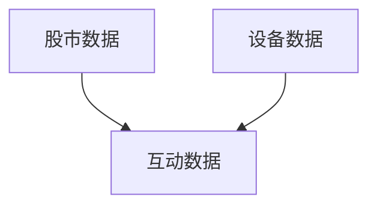
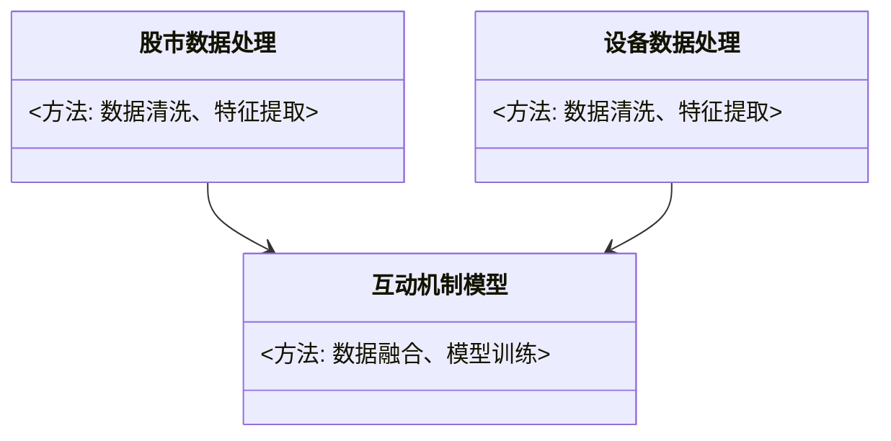

                 


# 新兴市场股市估值与智能制造预测性维护的互动

## 关键词：新兴市场，股市估值，智能制造，预测性维护，互动机制

## 摘要

新兴市场的股市估值和智能制造的预测性维护是当前技术领域的重要研究方向。本文通过分析新兴市场股市估值与智能制造预测性维护的互动关系，探讨两者在数据流、算法模型和系统架构上的融合与应用。文章详细阐述了核心概念、互动机制、算法原理、系统设计以及项目实战，为相关领域的研究和实践提供了理论和实践指导。

---

# 第1章: 新兴市场股市估值与智能制造预测性维护的互动概述

## 1.1 问题背景与描述

### 1.1.1 新兴市场股市估值的现状与挑战

新兴市场股市的波动性较高，受到政策、经济和全球市场的影响。准确的股市估值对于投资者和企业决策至关重要。然而，传统估值方法难以捕捉市场复杂性，亟需引入新技术以提高准确性。

### 1.1.2 智能制造预测性维护的发展趋势

预测性维护通过实时数据和机器学习模型，优化设备维护计划，减少停机时间。智能制造的普及推动了预测性维护的应用，但其数据处理和模型优化仍需进一步研究。

### 1.1.3 两者的互动关系与研究意义

股市估值与预测性维护看似独立，但两者都依赖于数据驱动的分析。通过互动机制，可以将股市的波动与设备维护需求结合起来，为智能制造提供更精准的决策支持。

## 1.2 核心概念与问题解决

### 1.2.1 新兴市场股市估值的核心问题

新兴市场股市的非线性波动、数据稀疏性和外部冲击是估值的主要挑战。

### 1.2.2 智能制造预测性维护的关键技术

基于机器学习的故障预测、实时数据分析和物联网技术是预测性维护的核心。

### 1.2.3 互动机制的构建与应用

通过建立互动模型，将股市数据与设备状态关联，优化维护策略，提高企业运营效率。

## 1.3 问题的边界与外延

### 1.3.1 新兴市场股市估值的边界条件

包括数据范围、时间窗口和模型适用性。

### 1.3.2 智能制造预测性维护的适用范围

适用于高价值设备和复杂生产环境。

### 1.3.3 互动机制的局限性与扩展性

受限于数据质量和模型泛化能力，未来可以通过引入更多数据源和增强学习技术扩展应用。

## 1.4 概念结构与核心要素

### 1.4.1 核心要素的定义与作用

股市数据、设备数据、互动数据是核心要素。

### 1.4.2 概念结构图



# 第2章: 核心概念与联系

## 2.1 核心概念原理

### 2.1.1 新兴市场股市估值的原理

通过时间序列分析和机器学习模型预测股价走势。

### 2.1.2 智能制造预测性维护的原理

基于传感器数据和机器学习模型预测设备故障。

### 2.1.3 互动机制的原理

通过数据融合和模型优化，建立两者之间的关联。

## 2.2 核心概念属性对比

### 2.2.1 属性特征对比表格

| 属性 | 股市估值 | 预测性维护 |
|------|----------|------------|
| 数据类型 | 时间序列数据 | 设备传感器数据 |
| 目标 | 估计股票价值 | 预测设备故障 |
| 方法 | 机器学习、时间序列分析 | 机器学习、统计模型 |

## 2.3 ER实体关系图

```mermaid
er
    entity 股市数据 {
        <属性: 时间、股票代码、股价、成交量、市盈率>
    }
    entity 设备数据 {
        <属性: 设备ID、时间、状态、故障率、维护记录>
    }
    entity 互动数据 {
        <属性: 时间、股票代码、设备ID、关联强度>
    }
    股市数据 --N> 互动数据
    设备数据 --N> 互动数据
```

---

# 第3章: 互动机制与数据流

## 3.1 数据流分析

### 3.1.1 数据流方向与路径

股市数据流向互动数据，设备数据流向互动数据。

### 3.1.2 数据流的特征与属性

实时性、多样性、关联性。

## 3.2 技术融合与互动

### 3.2.1 数据融合技术

时间序列对齐、特征提取。

### 3.2.2 模型融合技术

集成学习、联合概率模型。

### 3.2.3 知识融合技术

知识图谱构建、领域知识整合。

## 3.3 应用场景与案例

### 3.3.1 典型场景分析

股市波动影响设备维护需求。

### 3.3.2 实际案例分析

某新兴市场股市波动与设备维护计划优化。

### 3.3.3 案例对比与总结

互动机制显著提高了维护效率和投资回报。

---

# 第4章: 算法原理与实现

## 4.1 数据预处理与特征提取

### 4.1.1 数据清洗与标准化

去除缺失值、标准化处理。

### 4.1.2 特征选择与降维

主成分分析（PCA）、Lasso回归。

## 4.2 模型训练与预测

### 4.2.1 时间序列分析模型

ARIMA模型、LSTM网络。

### 4.2.2 预测性维护模型

XGBoost、随机森林。

## 4.3 互动机制算法

### 4.3.1 联合概率模型

联合概率分布建模。

### 4.3.2 联合优化模型

联合优化目标函数。

---

# 第5章: 数学模型与公式

## 5.1 时间序列分析模型

### 5.1.1 ARIMA模型

ARIMA(p, d, q)模型，适用于线性时间序列数据。

### 5.1.2 LSTM模型

LSTM网络结构，适用于非线性时间序列预测。

## 5.2 预测性维护模型

### 5.2.1 XGBoost模型

目标函数：$$ \text{目标函数} = \sum_{i=1}^{n} \left( y_i - \hat{y}_i \right)^2 $$

### 5.2.2 随机森林模型

分类器：$$ \text{预测概率} = \sum_{i=1}^{n} w_i \cdot I(y_i = 1) $$

---

# 第6章: 系统架构与设计

## 6.1 系统功能设计

### 6.1.1 领域模型



### 6.1.2 系统架构


---

# 第7章: 项目实战与案例分析

## 7.1 环境安装

### 7.1.1 安装Python环境

使用Anaconda安装Python 3.8及以上版本。

### 7.1.2 安装依赖库

安装numpy、pandas、scikit-learn、xgboost、keras等库。

## 7.2 核心实现

### 7.2.1 数据预处理代码

```python
import pandas as pd
import numpy as np

# 数据加载
data = pd.read_csv('market.csv')

# 数据清洗
data.dropna(inplace=True)
data['date'] = pd.to_datetime(data['date'])
data.set_index('date', inplace=True)

# 特征提取
features = data[['open', 'high', 'low', 'close']]
```

### 7.2.2 模型训练代码

```python
from sklearn.ensemble import XGBoostRegressor
from sklearn.metrics import mean_squared_error

# 模型训练
model = XGBoostRegressor()
model.fit(X_train, y_train)

# 模型预测
y_pred = model.predict(X_test)
print(mean_squared_error(y_test, y_pred))
```

---

# 第8章: 总结与展望

## 8.1 小结

本文通过分析新兴市场股市估值与智能制造预测性维护的互动关系，探讨了两者在数据、算法和系统架构上的融合与应用，为相关领域的研究和实践提供了理论和实践指导。

## 8.2 注意事项

数据质量和模型泛化能力是互动机制成功的关键。

## 8.3 拓展阅读

推荐阅读《时间序列分析与应用》和《机器学习在金融中的应用》。

---

# 作者：AI天才研究院 & 禅与计算机程序设计艺术

---

这篇文章通过详细分析新兴市场股市估值与智能制造预测性维护的互动关系，结合理论和实践，为相关领域的研究和应用提供了全面的指导。

