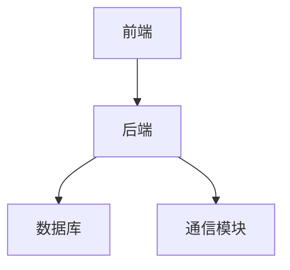

                 


# 新兴市场股市估值与智能家居互操作性标准的互动

> 关键词：新兴市场，股市估值，智能家居，互操作性标准，技术互动

> 摘要：本文探讨新兴市场股市估值与智能家居互操作性标准的互动关系，分析技术标准如何影响股市估值，以及股市波动如何影响智能家居市场的发展。通过技术与经济的双重视角，揭示两者互动的内在机制和潜在影响。

---

## 第一部分: 背景与核心概念

### 第1章: 新兴市场股市估值与智能家居互操作性标准的背景

#### 1.1 新兴市场的定义与特征
- **新兴市场的经济特点**：经济增长快、市场波动大、投资者结构多元化。
- **新兴市场的股市特点**：市场规模迅速扩大，但监管体系尚不完善，容易受到外部经济波动的影响。
- **新兴市场与发达市场的对比**：新兴市场更具增长潜力，但风险也更大。

#### 1.2 智能家居的发展现状
- **智能家居的定义与范围**：通过物联网技术实现家居设备的智能化控制与数据互通。
- **智能家居技术的演进**：从单一设备智能到全屋智能，再到社区级智能系统的整合。
- **智能家居市场的主要参与者**：设备制造商、软件开发商、通信服务商。

#### 1.3 问题背景与研究意义
- **问题背景**：新兴市场中，股市波动与智能家居市场的发展存在双向互动关系。
- **研究意义**：理解这种互动关系有助于优化股市估值模型，推动智能家居技术的普及。

### 第2章: 核心概念与理论框架

#### 2.1 股市估值的核心原理
- **股票估值的基本方法**：市盈率（P/E）、市净率（P/B）、股息率等。
- **股市波动的驱动因素**：宏观经济指标、政策变化、市场情绪等。
- **新兴市场股市的独特性**：市场参与者结构复杂，信息不对称问题突出。

#### 2.2 智能家居互操作性标准的构建
- **互操作性的定义与属性**：设备间能够无缝通信和协作。
- **智能家居设备的通信协议**：Wi-Fi、蓝牙、ZigBee等。
- **互操作性标准的制定原则**：兼容性、可扩展性、安全性。

#### 2.3 核心概念的联系与对比
- **股市估值与智能家居的互动关系**：股市波动影响智能家居企业的融资能力，而智能家居技术的普及反过来影响股市估值。
- **新兴市场的特殊性**：新兴市场中，智能家居技术的普及速度更快，但股市波动也更剧烈。

---

## 第二部分: 核心概念与联系

### 第3章: 核心概念的原理分析

#### 3.1 股市估值的数学模型
- **市盈率公式**：P/E = 市场价 / 每股收益。
- **市净率公式**：P/B = 市场价 / 每股净资产。
- **新兴市场的特殊估值方法**：考虑市场增长率和风险因素。

#### 3.2 智能家居互操作性标准的实现原理
- **通信协议的层次结构**：物理层、数据链路层、网络层、传输层、应用层。
- **设备间的互操作性机制**：通过统一的协议标准实现设备间的通信与协作。
- **标准化对设备兼容性的影响**：统一标准降低设备间的兼容性问题。

#### 3.3 核心概念的对比分析
- **对比表格**：列出股市估值与智能家居互操作性标准在定义、影响因素、目标等方面的对比。
- **ER实体关系图**：展示智能家居系统中设备、用户、协议之间的关系。

---

## 第三部分: 算法原理与数学模型

### 第4章: 算法原理与流程图

#### 4.1 股市估值算法
- **基于历史数据的预测模型**：使用时间序列分析预测未来股价。
- **机器学习在股市预测中的应用**：利用神经网络模型捕捉市场趋势。
- **时间序列分析的流程图**：展示数据采集、清洗、建模、预测的流程。

#### 4.2 智能家居互操作性算法
- **设备识别与配对算法**：通过设备特征匹配实现自动配对。
- **通信协议的自动适配算法**：根据网络环境动态调整通信协议。

#### 4.3 算法实现的代码示例
```python
# 示例：时间序列分析的Python代码
import pandas as pd
from statsmodels.tsa.arima_model import ARIMA

data = pd.read_csv('stock_data.csv')
model = ARIMA(data, order=(5,1,0))
model_fit = model.fit()
forecast = model_fit.forecast(steps=10)
print(forecast)
```

### 第5章: 数学模型与公式推导

#### 5.1 股市估值的数学模型
- **市盈率公式**：$$P/E = \frac{\text{市场价}}{\text{每股收益}}$$
- **市净率公式**：$$P/B = \frac{\text{市场价}}{\text{每股净资产}}$$
- **新兴市场的特殊估值模型**：综合考虑市场增长率和风险因素。

#### 5.2 智能家居互操作性标准的数学模型
- **设备间通信的延迟模型**：$$D = f(n, c)$$，其中n为网络节点数，c为带宽。

---

## 第四部分: 系统分析与架构设计

### 第6章: 系统分析与架构设计方案

#### 6.1 问题场景介绍
- **股市波动对智能家居企业的融资影响**：股市下跌可能导致企业融资困难，影响技术研发投入。
- **智能家居技术对股市的影响**：技术创新可能提升企业的估值。

#### 6.2 系统功能设计
- **领域模型**：通过Mermaid类图展示智能家居系统中各组件的关系。
- **系统架构设计**：展示系统整体架构，包括前端、后端、数据库、通信模块等。

#### 6.3 系统架构图


#### 6.4 系统接口设计
- **API接口**：定义智能家居设备与外部系统之间的接口规范。

---

## 第五部分: 项目实战

### 第7章: 项目实战与案例分析

#### 7.1 环境安装
- **工具安装**：安装Python、Pandas、Statsmodels等工具。

#### 7.2 系统核心实现
- **代码实现**：实现时间序列分析模型，用于预测股市走势。

#### 7.3 数据可视化
- **可视化工具**：使用Matplotlib绘制股市波动图和智能家居设备的通信时序图。

#### 7.4 案例分析
- **实际案例**：分析某新兴市场股市与智能家居市场的互动关系。

---

## 第六部分: 总结与展望

### 第8章: 总结与展望

#### 8.1 研究总结
- **研究发现**：新兴市场股市波动与智能家居互操作性标准的互动关系显著。
- **研究意义**：为投资者和技术开发者提供双重视角。

#### 8.2 未来展望
- **技术发展**：智能家居设备的进一步智能化和互操作性提升。
- **经济趋势**：新兴市场股市的波动性将继续影响智能家居市场的发展。

---

## 作者：AI天才研究院 & 禅与计算机程序设计艺术

---

通过以上分析，我们可以看到，新兴市场股市估值与智能家居互操作性标准的互动关系是一个复杂但具有重要研究价值的领域。理解这一互动关系，不仅有助于优化股市估值模型，还能推动智能家居技术的普及与发展。

