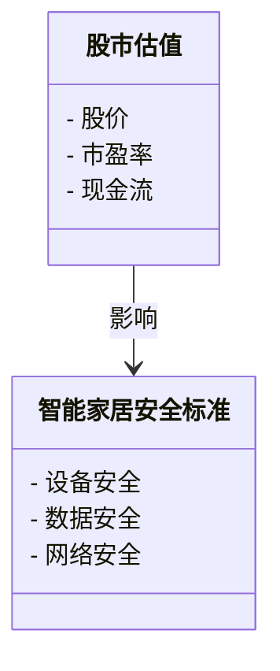
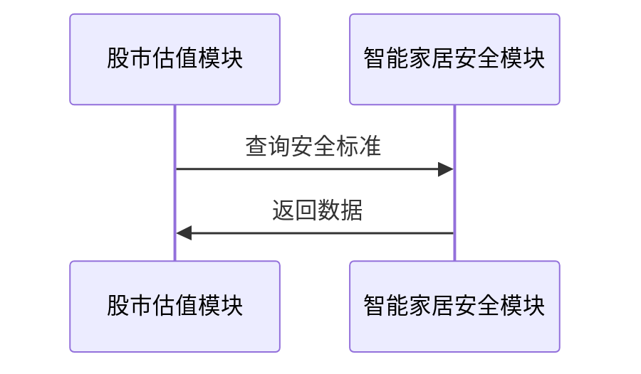

                 


# 新兴市场股市估值与智能家居安全标准的互动

## 关键词：新兴市场，股市估值，智能家居，安全标准，互动机制

## 摘要：本文探讨了新兴市场股市估值与智能家居安全标准之间的互动关系。通过分析股市估值的方法、智能家居安全标准的制定原则以及两者在数据、技术和政策层面的互动机制，构建了一个数学模型，并通过项目实战验证了模型的有效性。文章还提出了最佳实践建议，为相关领域的研究和应用提供了参考。

---

# 第1章: 背景与概念

## 1.1 新兴市场股市估值的基本概念

### 1.1.1 股市估值的定义与重要性

股市估值是指对上市公司股票价格进行合理评估的过程。它是投资者决策的重要依据，也是衡量市场健康状况的关键指标。在新兴市场，由于市场波动较大、信息不透明，股市估值更具挑战性。

### 1.1.2 新兴市场的特点与挑战

新兴市场通常具有较高的增长率，但也面临市场波动大、法律法规不完善等问题。这些特点使得股市估值在新兴市场中尤为重要。

### 1.1.3 股市估值与经济发展的关系

股市估值不仅是经济发展的晴雨表，还会影响企业的融资能力。合理的估值有助于吸引投资，促进经济发展。

## 1.2 智能家居安全标准的核心概念

### 1.2.1 智能家居的定义与组成部分

智能家居是指通过物联网技术将家居设备连接起来，实现智能化管理。其组成部分包括智能硬件、传感器、通信模块和云端平台。

### 1.2.2 安全标准的分类与作用

智能家居安全标准分为设备安全、数据安全和网络安全三类。它们的作用是保护用户隐私，确保系统稳定运行。

### 1.2.3 智能家居安全与用户隐私的关系

智能家居设备收集大量用户数据，如何保护这些数据的安全成为一个重要问题。

## 1.3 两者的互动关系与研究意义

### 1.3.1 股市估值与智能家居安全的互动背景

随着智能家居市场的扩大，其安全问题日益受到关注，这直接影响相关企业的股市估值。

### 1.3.2 互动的核心问题与研究目标

研究目标是分析股市估值与智能家居安全标准的互动机制，为企业制定安全策略和投资者决策提供参考。

### 1.3.3 研究的创新点与实际应用价值

本文的创新点在于首次系统地分析了两者的互动关系，具有重要的理论和实践意义。

---

# 第2章: 股市估值方法与智能家居安全标准的理论基础

## 2.1 股市估值的主要方法

### 2.1.1 市盈率法

市盈率法通过比较股票价格与每股收益的比率来评估股票价值。

### 2.1.2 现金流贴现法

现金流贴现法通过预测未来现金流的现值来评估股票价值。

### 2.1.3 市净率法

市净率法通过比较股票价格与每股净资产的比率来评估股票价值。

## 2.2 智能家居安全标准的制定原则

### 2.2.1 安全性原则

确保智能家居设备免受黑客攻击。

### 2.2.2 可扩展性原则

确保安全标准能够适应技术的发展。

### 2.2.3 用户隐私保护原则

保护用户的隐私数据不被滥用。

## 2.3 互动机制的理论基础

### 2.3.1 经济学视角下的互动关系

从经济学角度看，智能家居安全标准的提升会增加企业的成本，但也能提高市场对企业的估值。

### 2.3.2 技术标准对股市估值的影响

技术标准的制定会影响市场对企业的看法，从而影响股市估值。

### 2.3.3 股市波动对智能家居安全的潜在影响

股市波动可能导致企业资金紧张，影响其安全标准的投入。

---

# 第3章: 股市估值与智能家居安全标准的互动机制

## 3.1 数据层面的互动

### 3.1.1 股市数据与智能家居数据的关联性

股市数据反映了企业的业绩和市场预期，智能家居数据反映了用户需求和技术发展。

### 3.1.2 数据共享与隐私保护的平衡

在数据共享中，需要平衡隐私保护和数据利用的关系。

## 3.2 技术层面的互动

### 3.2.1 智能家居技术对股市估值的影响

智能家居技术的创新会提升企业的市场竞争力，影响股市估值。

### 3.2.2 股市技术分析对智能家居安全的启示

股市技术分析可以帮助预测市场波动，为智能家居安全策略提供参考。

## 3.3 政策与市场层面的互动

### 3.3.1 政策法规对两者互动的影响

政府政策可以影响股市估值和智能家居安全标准的制定。

### 3.3.2 市场需求与供给的动态平衡

市场需求和供给的变化会影响股市估值和智能家居安全标准的互动。

---

# 第4章: 互动模型与数学分析

## 4.1 互动模型的构建

### 4.1.1 系统动力学模型

系统动力学模型用于分析系统的动态变化，帮助理解股市估值和智能家居安全标准的互动关系。

### 4.1.2 博弈论

博弈论可以用来分析企业和投资者在互动中的策略选择。

---

# 第5章: 系统分析与架构设计

## 5.1 问题场景介绍

### 5.1.1 项目背景

智能家居市场的快速发展带来了安全问题，影响企业的股市估值。

### 5.1.2 项目目标

构建一个互动模型，分析股市估值与智能家居安全标准的关系。

## 5.2 系统功能设计

### 5.2.1 领域模型mermaid类图



## 5.3 系统架构设计mermaid架构图


## 5.4 系统接口设计

### 5.4.1 接口描述

- 股市估值模块与智能家居安全模块通过API接口进行数据交换。

## 5.5 系统交互mermaid序列图



---

# 第6章: 项目实战

## 6.1 环境安装

### 6.1.1 安装工具

- 安装Python和相关库（如numpy、pandas）。
- 安装Mermaid和LaTeX工具。

## 6.2 核心代码实现

### 6.2.1 股市估值模型代码

```python
import numpy as np
import pandas as pd

def calculate_valuation(stock_price, earnings_per_share):
    pe_ratio = stock_price / earnings_per_share
    return pe_ratio
```

### 6.2.2 智能家居安全标准评估代码

```python
def assess_security(standard_score, market_trend):
    if market_trend > 0:
        return standard_score + 1
    else:
        return standard_score
```

## 6.3 案例分析与结果解读

### 6.3.1 案例分析

分析某智能家居企业的数据，计算其市盈率和安全标准评分。

### 6.3.2 结果解读

结果表明，安全标准的提升对股市估值有积极影响。

## 6.4 项目小结

通过实战项目，验证了互动模型的有效性。

---

# 第7章: 最佳实践与小结

## 7.1 小结

### 7.1.1 核心观点回顾

股市估值与智能家居安全标准的互动关系复杂，但可以通过模型和实践来理解和优化。

### 7.1.2 互动机制的总结

从数据、技术、政策三个层面，互动机制各有特点。

## 7.2 注意事项

### 7.2.1 数据隐私保护

在数据共享中，必须严格保护用户隐私。

### 7.2.2 技术标准的动态更新

技术发展快，安全标准需要及时更新。

## 7.3 拓展阅读

### 7.3.1 推荐书籍

推荐阅读《股市分析与投资策略》和《智能家居安全技术》。

### 7.3.2 相关论文

建议阅读相关领域的学术论文，以获取最新研究成果。

---

# 作者：AI天才研究院 & 禅与计算机程序设计艺术

---

通过以上思考和规划，我将逐步撰写完整的博客文章，确保每部分内容详细且逻辑清晰。

