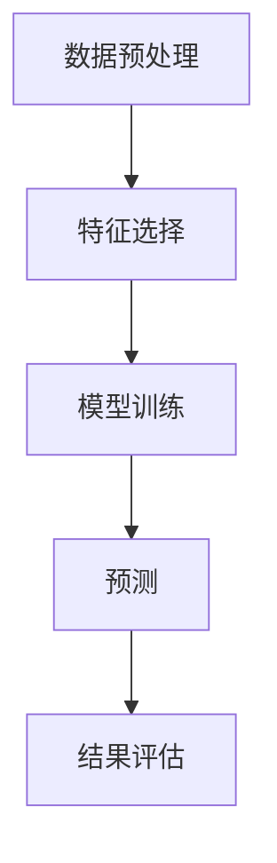
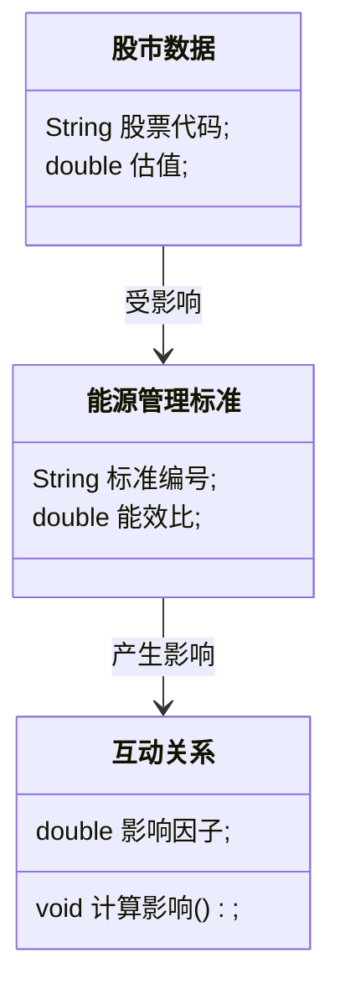
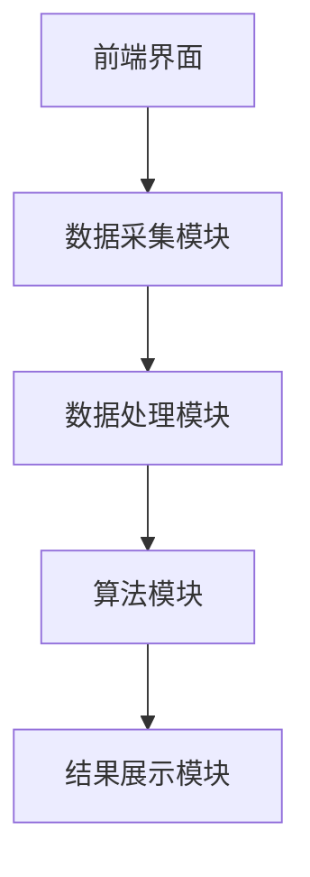
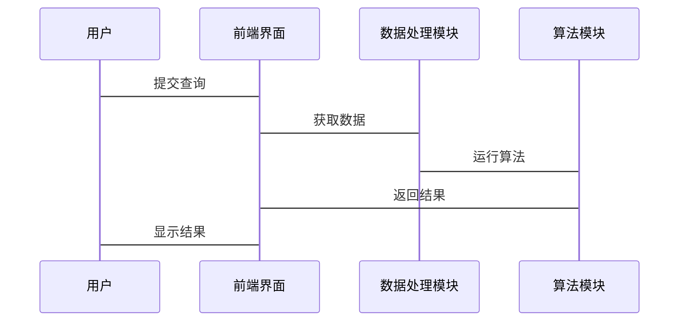

                 


# 《新兴市场股市估值与智能家居能源管理标准的互动》

---

## 关键词：
- 股市估值
- 智能家居
- 能源管理标准
- 互动关系
- 算法模型

---

## 摘要：
本文探讨了新兴市场股市估值与智能家居能源管理标准之间的互动关系，分析了两者如何相互影响，并提出了结合算法模型和系统设计的解决方案。文章详细解释了核心概念，展示了算法模型的数学公式和流程图，并通过实际案例分析了系统设计和项目实施。最终，本文总结了互动关系的重要性，并给出了最佳实践建议。

---

# 目录大纲：《新兴市场股市估值与智能家居能源管理标准的互动》

---

## 第一部分：背景介绍

### 第1章：问题背景与问题描述

#### 1.1 问题背景
- 1.1.1 新兴市场的经济特点与发展现状
- 1.1.2 智能家居能源管理的兴起与需求
- 1.1.3 股市估值与能源管理互动的现实意义

#### 1.2 问题描述
- 1.2.1 新兴市场股市估值的复杂性
- 1.2.2 智能家居能源管理标准的多样性
- 1.2.3 两者互动关系的潜在问题

#### 1.3 问题解决
- 1.3.1 提出解决方案的必要性
- 1.3.2 解决方案的初步框架

---

## 第二部分：核心概念与联系

### 第2章：核心概念解析

#### 2.1 股市估值的核心概念
- 2.1.1 股市估值的基本方法
- 2.1.2 新兴市场的特殊性

#### 2.2 智能家居能源管理标准
- 2.2.1 标准的定义与分类
- 2.2.2 标准的核心要素

#### 2.3 互动关系分析
- 2.3.1 互动机制的理论模型
- 2.3.2 标准化对股市估值的影响

---

## 第三部分：算法原理与数学模型

### 第3章：股市估值预测算法

#### 3.1 算法原理
- 3.1.1 线性回归模型
- 3.1.2 支持向量机（SVM）的应用

#### 3.2 数学模型与公式
- 线性回归公式：$$ y = \beta_0 + \beta_1x + \epsilon $$
- SVM分类公式：$$ g(x) = \text{sign}(w \cdot x + b) $$

#### 3.3 算法流程图


---

## 第四部分：系统分析与架构设计

### 第4章：系统功能设计

#### 4.1 领域模型类图


#### 4.2 系统架构图


#### 4.3 接口设计与交互图


---

## 第五部分：项目实战

### 第5章：环境安装与代码实现

#### 5.1 环境安装
- 安装Python和必要的库（如NumPy、Scikit-learn）
- 安装Mermaid和相关工具

#### 5.2 核心代码实现
```python
import numpy as np
from sklearn import svm

# 示例数据
X = np.array([[1, 2], [3, 4], [5, 6]])
y = np.array([0, 1, 0])

# 训练模型
model = svm.SVC()
model.fit(X, y)

# 预测
print(model.predict([[7, 8]]))
```

#### 5.3 代码解读与分析
- 数据预处理：特征选择与归一化
- 模型训练：支持向量机的应用
- 结果分析：评估模型性能

#### 5.4 实际案例分析
- 选取新兴市场股市数据
- 应用能源管理标准进行预测
- 分析预测结果与实际数据的差异

---

## 第六部分：结论与建议

### 第6章：总结与最佳实践

#### 6.1 总结
- 核心观点回顾
- 研究成果总结

#### 6.2 最佳实践
- 数据质量管理的重要性
- 算法选择的合理性
- 系统设计的规范性

#### 6.3 小结
- 互动关系的研究意义
- 未来研究方向的展望

---

## 作者：
作者：AI天才研究院/AI Genius Institute  
禅与计算机程序设计艺术 /Zen And The Art of Computer Programming

---

**注**：以上内容仅为目录大纲，具体内容需根据实际需求进行详细撰写。

