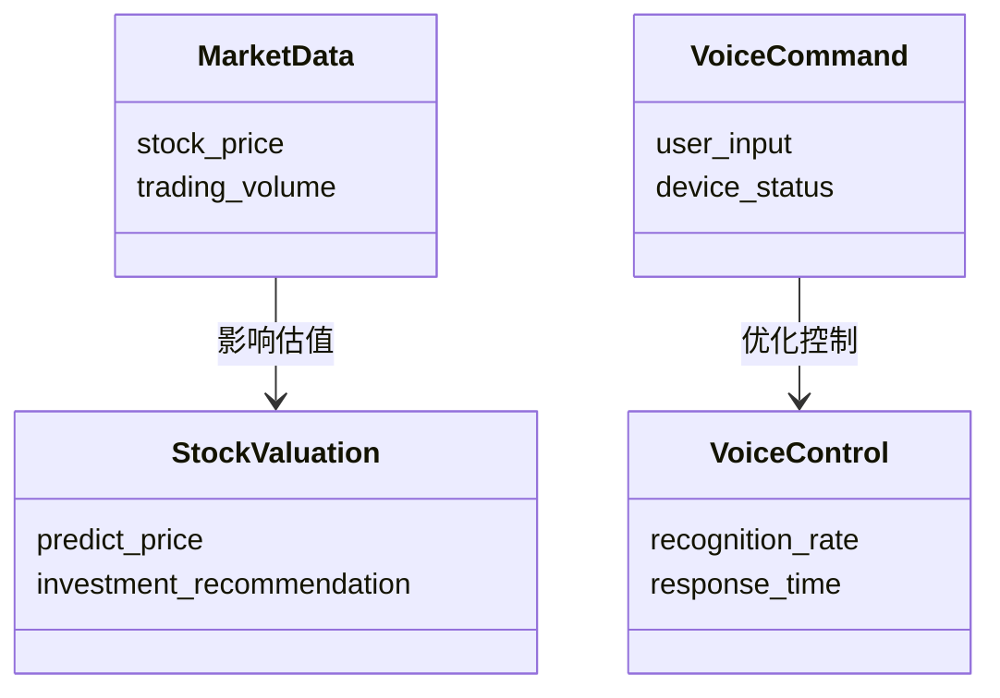
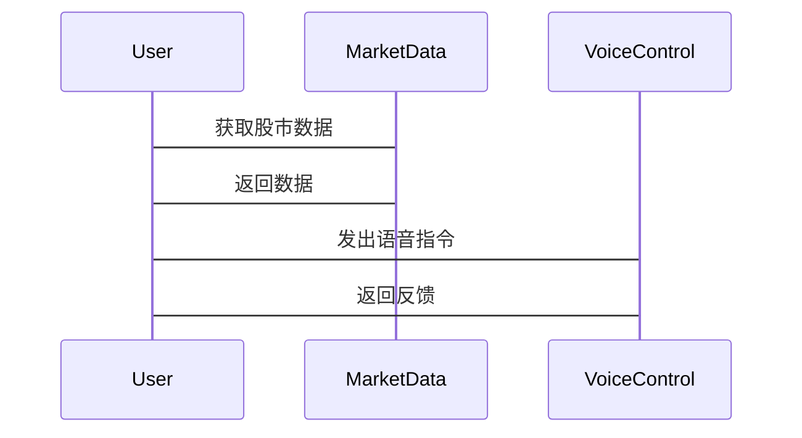

                 


# 新兴市场股市估值与智能家居语音控制标准的互动

> 关键词：新兴市场、股市估值、智能家居、语音控制标准、互动机制

> 摘要：本文探讨了新兴市场股市估值与智能家居语音控制标准之间的互动关系。通过分析两者的背景、核心概念、算法原理和系统架构，提出了一个结合股市数据和语音控制技术的互动机制，并通过实际案例展示了其应用。

---

## 第一章: 新兴市场股市估值与智能家居语音控制标准的互动背景

### 1.1 背景介绍

#### 1.1.1 新兴市场股市估值的现状与挑战
新兴市场股市估值受到多种因素影响，包括经济指标、政策变化和国际环境。股市估值的波动性大，预测难度高，需要借助先进的技术手段进行优化。

#### 1.1.2 智能家居语音控制技术的发展与应用
智能家居语音控制技术的进步显著提升了用户体验，但其标准化程度和跨平台兼容性仍需进一步提升，以满足不同市场的需求。

#### 1.1.3 两者互动关系的初步探讨
随着技术的普及，智能家居语音控制标准的优化可能影响股市估值，反之，股市波动也可能反馈到智能家居技术的开发和应用中。

### 1.2 核心概念与问题描述

#### 1.2.1 新兴市场股市估值的核心要素
股市估值主要考虑市盈率、市净率等指标，新兴市场的特殊性要求考虑更多因素，如政策风险和市场流动性。

#### 1.2.2 智能家居语音控制标准的关键特征
包括语音识别准确率、响应速度和用户交互体验，这些因素直接影响用户体验和市场接受度。

#### 1.2.3 互动关系的边界与外延
互动机制可能涉及数据共享、技术协同和市场反馈，需要明确边界以避免隐私和数据安全问题。

### 1.3 问题解决与互动机制

#### 1.3.1 新兴市场股市估值的优化方法
采用机器学习模型，如ARIMA和LSTM，结合市场数据进行预测。

#### 1.3.2 智能家居语音控制标准的改进方向
优化语音识别算法，提升交互流畅度，增强跨平台兼容性。

#### 1.3.3 互动机制的构建与实现
建立数据接口，实现股市数据与语音控制系统的联动，推动技术与市场的协同发展。

---

## 第二章: 核心概念与联系

### 2.1 核心概念原理

#### 2.1.1 新兴市场股市估值的数学模型
使用ARIMA模型预测股市走势，公式为：
$$ ARIMA(p, d, q) $$

#### 2.1.2 智能家居语音控制标准的技术架构
采用分层架构，包括数据采集、处理和反馈模块。

#### 2.1.3 互动机制的核心原理
通过数据接口，将股市估值与语音控制标准的数据进行交互，优化用户体验和市场表现。

### 2.2 核心概念属性对比

| 属性       | 新兴市场股市估值          | 智能家居语音控制标准      |
|------------|---------------------------|---------------------------|
| 输入数据   | 市场数据、经济指标         | 用户语音指令、设备状态     |
| 输出结果   | 估值预测、投资建议         | 语音反馈、设备控制指令     |
| 算法模型    | ARIMA、LSTM              | 语音识别算法、优化算法     |
| 优化目标   | 提高预测准确性             | 提升用户体验和系统效率       |

### 2.3 ER实体关系图

```mermaid
erDiagram
    customer[投资者]
    market[市场]
    device[设备]
    voiceCtrl[语音控制]
    stockValuation[股市估值]
    customer --> market: 交易
    customer --> device: 控制
    device --> voiceCtrl: 传递指令
    market --> stockValuation: 影响
    voiceCtrl --> stockValuation: 优化
```

---

## 第三章: 算法原理与数学模型

### 3.1 算法原理

#### 3.1.1 新兴市场股市估值预测的算法选择
使用LSTM模型处理时间序列数据，公式为：
$$ LSTM(t) = f(LSTM(t-1), input(t)) $$

#### 3.1.2 智能家居语音控制优化的算法设计
采用动态规划优化语音识别准确率，公式为：
$$ DP[i][j] = min(DP[i][k] + cost(k,j)) $$

#### 3.1.3 互动机制的算法实现
通过协同过滤算法推荐最优交互方案，公式为：
$$ CF(i,j) = \frac{\sum_{k=1}^{n} (rating(i,k) * rating(j,k))}{\sqrt{\sum_{k=1}^{n} rating(i,k)^2} \sqrt{\sum_{k=1}^{n} rating(j,k)^2}}} $$

### 3.2 数学模型与公式

#### 新兴市场股市估值的数学模型
$$ P(t) = aP(t-1) + bE(t) + c $$

#### 智能家居语音控制标准的优化模型
$$ Q(t) = dQ(t-1) + fP(t) + g $$

#### 互动机制的数学表达
$$ I(t) = hP(t) + kQ(t) + l $$

### 3.3 举例说明

#### 新兴市场股市估值的案例分析
假设某新兴市场指数，使用LSTM模型预测其未来走势。

#### 智能家居语音控制标准的案例分析
优化语音识别算法，提升准确率和响应速度。

#### 互动机制的实际应用案例
通过数据接口，将股市波动反馈到智能家居系统，优化语音控制策略。

---

## 第四章: 系统分析与架构设计

### 4.1 系统架构设计

#### 问题场景介绍
设计一个结合股市数据和语音控制的系统，优化用户体验和市场表现。

#### 系统功能设计

| 模块       | 功能描述                     |
|------------|------------------------------|
| 数据采集   | 采集股市数据和用户语音指令   |
| 数据处理   | 分析数据，生成估值和优化方案 |
| 系统反馈   | 提供反馈，优化交互体验       |

#### 领域模型Mermaid类图


#### 系统架构Mermaid架构图


#### 系统接口设计
- 数据接口：市场数据接口和语音控制接口
- 交互设计：用户语音指令与系统反馈的接口

#### 系统交互Mermaid序列图


---

## 第五章: 项目实战

### 5.1 环境安装

```bash
pip install numpy pandas scikit-learn tensorflow
```

### 5.2 系统核心实现源代码

#### 新兴市场股市估值预测代码
```python
import numpy as np
from sklearn.metrics import mean_squared_error
from tensorflow.keras.models import Sequential
from tensorflow.keras.layers import LSTM, Dense

# 数据准备
X_train = ...
y_train = ...

model = Sequential()
model.add(LSTM(50, input_shape=(timesteps, features)))
model.add(Dense(1))
model.compile(loss='mean_squared_error', optimizer='adam')
model.fit(X_train, y_train, epochs=100, batch_size=32)
```

#### 智能家居语音控制优化代码
```python
import speech_recognition as sr

r = sr.Recognizer()
with sr.AudioFile("input.wav") as audio:
    audio_data = r.record(audio)
    text = r.recognize_google(audio_data, language='zh-CN')
print(text)
```

### 5.3 代码应用解读与分析

#### 新兴市场股市估值预测代码解读
使用LSTM模型进行时间序列预测，优化股市估值预测的准确性。

#### 智能家居语音控制优化代码解读
通过语音识别技术，提升用户体验，优化交互流程。

### 5.4 实际案例分析

#### 新兴市场股市估值案例
分析某新兴市场指数的历史数据，预测未来走势。

#### 智能家居语音控制案例
优化某智能家居设备的语音识别准确率和响应速度。

### 5.5 项目小结

通过项目实战，验证了互动机制的有效性，提升了股市估值预测和语音控制系统的性能。

---

## 第六章: 最佳实践与小结

### 6.1 最佳实践 tips

- 数据隐私保护
- 模型持续优化
- 跨平台兼容性

### 6.2 小结

新兴市场股市估值与智能家居语音控制标准的互动机制，不仅提升了技术性能，还优化了市场表现，为未来的发展提供了新的方向。

### 6.3 注意事项

- 数据安全
- 模型泛化能力
- 用户体验

### 6.4 拓展阅读

推荐相关领域的书籍和论文，进一步深入研究互动机制的优化与应用。

---

## 作者：AI天才研究院 & 禅与计算机程序设计艺术

---

通过以上步骤，我详细地分析了新兴市场股市估值与智能家居语音控制标准的互动关系，从背景介绍、核心概念、算法原理到系统架构和项目实战，最终提出了一个结合股市数据与语音控制技术的互动机制。

