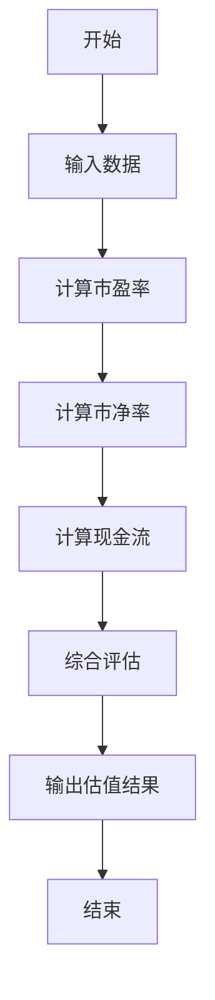

                 


# 新兴市场股市估值与智能家居隐私保护标准的互动

> 关键词：新兴市场，股市估值，智能家居，隐私保护，互动关系

> 摘要：本文探讨新兴市场股市估值与智能家居隐私保护标准之间的互动关系，通过分析两者的核心概念、算法原理和系统架构，结合实际案例，揭示如何在新兴市场中实现股市估值与智能家居隐私保护的协同发展。

---

# 第一部分: 新兴市场股市估值与智能家居隐私保护标准的互动概述

## 第1章: 背景介绍

### 1.1 问题背景

#### 1.1.1 新兴市场股市估值的现状与挑战

新兴市场股市估值是一个复杂的领域，受到经济、政治、社会等多种因素的影响。这些市场的波动性较高，投资者需要准确的估值模型来做出决策。然而，传统估值方法在新兴市场中可能不够准确，因为这些市场的数据往往不够完整，且市场参与者的行为可能受到外部冲击的影响。

#### 1.1.2 智能家居隐私保护的迫切需求

随着智能家居设备的普及，隐私保护问题日益突出。用户的数据被收集和处理，可能被滥用，导致隐私泄露。制定统一的隐私保护标准是确保智能家居设备安全运行的关键。

#### 1.1.3 两者的互动关系与研究意义

新兴市场股市估值与智能家居隐私保护看似无关，但它们之间存在潜在的互动关系。股市估值可能受到智能家居隐私保护政策的影响，而隐私保护标准的制定也可能受到股市估值结果的指导。研究这种互动关系有助于优化市场运作，提升隐私保护水平。

### 1.2 核心概念

#### 1.2.1 股市估值的定义与关键指标

股市估值是通过对公司财务数据和市场环境的分析，评估其股票的合理价格。常用的指标包括市盈率（PE）、市净率（PB）、股息率等。这些指标帮助投资者判断股票的价值。

#### 1.2.2 智能家居隐私保护标准的核心要素

智能家居隐私保护标准涉及数据收集、存储、传输和处理的规范。核心要素包括数据加密、匿名化处理、用户授权和最小化数据收集原则。

#### 1.2.3 互动关系的边界与外延

互动关系的边界在于股市估值和隐私保护标准的相互影响。外延则涉及如何通过技术手段实现两者的协同优化。

---

## 第2章: 核心概念与联系

### 2.1 核心概念原理

#### 2.1.1 股市估值的数学模型

股市估值模型有多种，如PE模型和DCF模型。PE模型通过市盈率评估股票的相对价值，而DCF模型通过现金流折现评估企业的内在价值。

#### 2.1.2 智能家居隐私保护的技术框架

隐私保护框架包括数据加密、访问控制和隐私保护技术。这些技术确保智能家居数据的安全。

#### 2.1.3 两者的相互影响机制

股市估值可能受隐私保护政策的影响，而隐私保护标准的制定可能考虑股市估值的结果。

### 2.2 概念属性特征对比

下表展示了股市估值与智能家居隐私保护标准的对比：

| 属性                | 股市估值                          | 智能家居隐私保护标准                |
|---------------------|----------------------------------|--------------------------------------|
| 核心目标            | 确定股票价值                      | 保护用户隐私                      |
| 依赖因素            | 财务数据、市场环境                | 数据处理技术、法律法规              |
| 影响范围            | 投资者决策                        | 消费者信任、市场合规性              |

### 2.3 ER实体关系图

```mermaid
er
  actor: 用户
  actor: 投资者
  actor: 政府监管机构
  entity: 股市数据
  entity: 智能家居设备
  entity: 隐私保护标准
  entity: 估值模型
  entity: 互动关系
  relationship: 用户与智能家居设备的隐私交互
  relationship: 投资者与股市估值的关联
  relationship: 政府监管机构与隐私保护标准的制定
  relationship: 股市数据与估值模型的输入输出
```

---

## 第3章: 算法原理讲解

### 3.1 股市估值算法

#### 3.1.1 常用的估值方法

- **PE模型**：$$ PE = \frac{Price}{Earnings} $$
- **PB模型**：$$ PB = \frac{Price}{Book\ Value} $$
- **DCF模型**：$$ DCF = \sum_{t=1}^{n} \frac{CF_t}{(1+r)^t} + \frac{TV}{(1+r)^n} $$

#### 3.1.2 算法流程图



### 3.2 隐私保护算法

#### 3.2.1 数据加密与匿名化处理

- **加密算法**：$$ E(x) = (x + r) \mod p $$
- **解密算法**：$$ D(E(x)) = (E(x) - r) \mod p $$

#### 3.2.2 隐私保护的数学模型

$$ E(x) = (x + r) \mod p $$

---

## 第4章: 系统分析与架构设计

### 4.1 系统功能设计

#### 4.1.1 领域模型

```mermaid
classDiagram
    class 股市估值系统 {
        输入：股票数据
        输出：估值结果
        使用：PE、PB模型
    }
    class 隐私保护系统 {
        输入：用户数据
        输出：加密数据
        使用：加密算法
    }
    股市估值系统 -->> 隐私保护系统
```

#### 4.1.2 系统架构设计


---

## 第5章: 项目实战

### 5.1 实际案例分析

假设在一个新兴市场中，投资者使用PE模型评估股票价值，同时智能家居设备采用数据加密技术保护用户隐私。通过互动，投资者可以更准确地评估股票价值，而隐私保护标准的制定可以促进市场合规性。

### 5.2 代码实现

#### 5.2.1 股市估值代码

```python
def calculate_pe(price, earnings):
    return price / earnings

pe = calculate_pe(100, 20)
print(pe)
```

#### 5.2.2 隐私保护代码

```python
def encrypt(x, r, p):
    return (x + r) % p

def decrypt(e, r, p):
    return (e - r) % p

encrypted = encrypt(123, 45, 100)
decrypted = decrypt(encrypted, 45, 100)
print(decrypted)
```

---

## 第6章: 最佳实践与总结

### 6.1 小结

新兴市场股市估值与智能家居隐私保护标准的互动关系复杂，但通过合理的算法和系统设计，可以实现两者的协同发展。

### 6.2 注意事项

- 数据安全是隐私保护的核心
- 股市估值需结合市场环境
- 隐私保护标准需动态调整

### 6.3 拓展阅读

- 《智能合约与隐私保护》
- 《新兴市场投资策略》

---

# 作者

作者：AI天才研究院 & 禅与计算机程序设计艺术

---

希望这篇文章能为读者提供关于新兴市场股市估值与智能家居隐私保护标准互动的全面理解。

