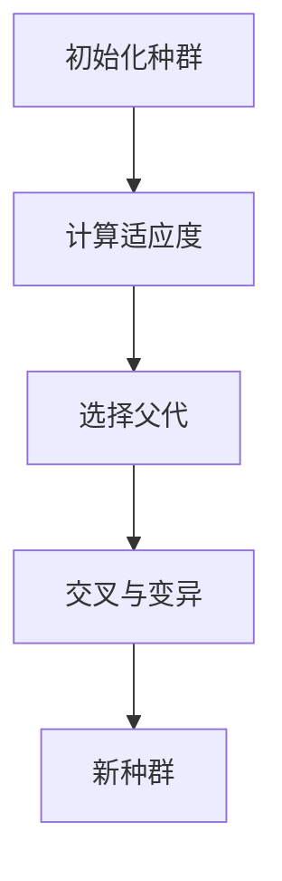
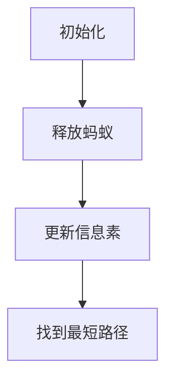
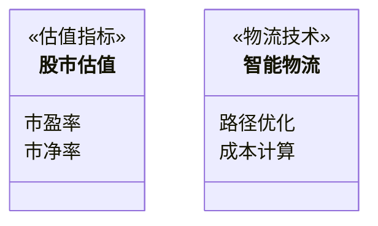
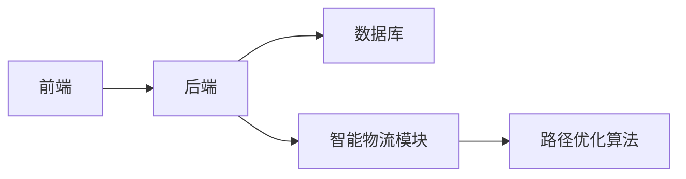
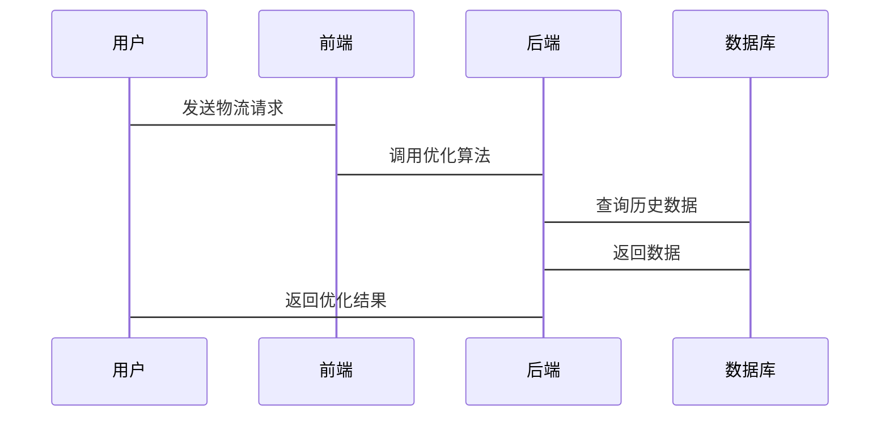

                 


# 新兴市场股市估值与智能物流发展的互动

> 关键词：新兴市场、股市估值、智能物流、路径优化算法、系统架构、项目实战

> 摘要：本文探讨新兴市场股市估值与智能物流发展的互动关系，分析股市估值的核心概念与智能物流技术的相互影响。通过路径优化算法和系统架构设计，结合项目实战，揭示两者如何协同促进经济发展。

---

## 第1章：背景介绍

### 1.1 问题背景

#### 1.1.1 新兴市场的定义与特点
新兴市场通常指经济快速增长、工业化进程中的国家，如中国、印度等。这些市场具有高增长潜力，但也面临股市波动大、物流效率低等问题。

#### 1.1.2 股市估值的基本概念
股市估值是通过市盈率、市净率等指标评估企业价值的过程。在新兴市场，由于信息不对称和市场波动，估值更具挑战性。

#### 1.1.3 智能物流的定义与技术基础
智能物流利用物联网、大数据和人工智能优化物流流程，提升效率和降低成本。

### 1.2 问题描述

#### 1.2.1 新兴市场股市波动的原因
新兴市场股市波动受政策、经济和外部环境影响，影响投资者信心和股市估值。

#### 1.2.2 智能物流在新兴市场中的应用现状
智能物流技术逐步普及，但面临技术标准不统一、基础设施落后等问题。

#### 1.2.3 两者互动关系的初步探讨
智能物流效率提升可能间接影响企业盈利，进而影响股市估值。股市估值波动也可能影响物流企业的融资能力。

### 1.3 问题解决

#### 1.3.1 新兴市场股市估值的计算方法
使用市盈率、市净率等指标，结合行业基准进行调整。

#### 1.3.2 智能物流对股市的影响机制
物流效率提升企业利润，进而提升股价；股市波动影响物流企业融资。

#### 1.3.3 互动关系的理论模型构建
构建包含物流成本、企业利润和股市估值的互动模型，分析相互影响。

### 1.4 边界与外延

#### 1.4.1 新兴市场的边界条件
新兴市场的定义、经济规模和政策环境。

#### 1.4.2 智能物流的适用范围
适用于制造业、零售业和电子商务等领域。

#### 1.4.3 互动关系的外延分析
考虑政策、经济和技术因素对外部环境的影响。

### 1.5 核心概念

#### 1.5.1 核心概念的定义与属性
股市估值：通过指标评估企业价值；智能物流：利用技术优化物流流程。

#### 1.5.2 核心概念的结构与组成
股市估值包括市场、企业、投资者；智能物流包括技术、流程、成本。

#### 1.5.3 核心要素的对比分析
| 要素 | 股市估值 | 智能物流 |
|------|----------|----------|
| 核心 | 估值指标 | 技术应用 |
| 影响 | 投资者信心 | 物流效率 |

---

## 第2章：核心概念与联系

### 2.1 核心概念原理

#### 2.1.1 股市估值的数学模型
市盈率（P/E）= 股价 / 每股收益  
市净率（P/B）= 股价 / 每股净资产

#### 2.1.2 智能物流的技术原理
利用物联网传感器和大数据分析优化物流路径。

#### 2.1.3 互动机制分析
物流成本降低 → 企业利润增加 → 股价上升。

### 2.2 核心概念对比分析

#### 2.2.1 核心概念属性特征对比表
| 属性 | 股市估值 | 智能物流 |
|------|----------|----------|
| 目标 | 评估企业价值 | 优化物流效率 |
| 工具 | 估值指标 | 物流技术 |
| 输出 | 股价 | 成本 |

#### 2.2.2 优缺点分析
股市估值：优点是提供企业价值参考，缺点是受市场情绪影响。  
智能物流：优点是提升效率，缺点是初期投入大。

#### 2.2.3 适用场景
股市估值适用于投资决策，智能物流适用于供应链优化。

### 2.3 实体关系图

#### 2.3.1 股市估值与智能物流的ER实体关系图
```mermaid
entity 股市估值
entity 智能物流
关系：影响
```

#### 2.3.2 互动关系的Mermaid流程图


---

## 第3章：算法原理讲解

### 3.1 算法原理

#### 3.1.1 遗传算法的基本原理
通过选择、交叉和变异操作生成最优解。

#### 3.1.2 蚁群算法的应用场景
适用于路径优化问题，模拟蚂蚁寻找最短路径。

#### 3.1.3 数学模型
目标函数：最小化物流成本  
约束条件：路径不可重复

### 3.2 算法流程图

#### 3.2.1 遗传算法流程图


#### 3.2.2 蚁群算法流程图


### 3.3 代码实现

#### 3.3.1 遗传算法的Python代码
```python
import random

def generate_population(size):
    return [random.randint(0, 100) for _ in range(size)]

def fitness(individual):
    return sum(individual)

def selection(population, fitness_values):
    total = sum(fitness_values)
    return random.choices(population, fitness_values, k=2)

def crossover(parent1, parent2):
    return (parent1[0], parent2[1]), (parent2[0], parent1[1])

def mutate(individual):
    return tuple([individual[0], individual[1] + 1])

population = generate_population(5)
fitness_values = [fitness(individual) for individual in population]
selected = selection(population, fitness_values)
new_population = [mutate(individual) for individual in selected]
```

---

## 第4章：系统分析与架构设计

### 4.1 问题场景介绍
新兴市场中，企业面临物流成本高、效率低的问题，影响股市估值。

### 4.2 系统功能设计

#### 4.2.1 领域模型


#### 4.2.2 系统架构图


#### 4.2.3 接口设计
- 前端接口：发送物流请求
- 后端接口：处理请求并返回优化结果

#### 4.2.4 交互图


---

## 第5章：项目实战

### 5.1 环境安装
安装Python和相关库（如numpy、pandas）。

### 5.2 核心代码实现

#### 5.2.1 遗传算法实现
```python
import numpy as np

def evaluate(individual):
    return np.mean(individual),  # 返回适应度

def mutate(individual):
    return individual.astype(float) * 1.1  # 变异操作

population = np.random.randint(0, 100, size=10)
fitness = np.array([evaluate(individual) for individual in population])
selected = population[fitness.argsort()[-2:]]  # 选择最优个体
new_population = [mutate(individual) for individual in selected]
```

#### 5.2.2 蚁群算法实现
```python
import numpy as np

def distance(matrix):
    return np.sum(matrix)

def ant_colony(matrix, ants=50, iterations=100):
    pheromone = np.ones_like(matrix)
    for _ in range(iterations):
        for ant in range(ants):
            current = 0
            tour = []
            for _ in range(len(matrix)):
                next_node = np.argmax(pheromone[current])
                tour.append(next_node)
                current = next_node
            path_cost = distance(matrix[tour])
            pheromone[tour[i], tour[i+1]] += 1/path_cost
    return pheromone

matrix = np.array([[1,2,3],[4,5,6],[7,8,9]])
pheromone_matrix = ant_colony(matrix)
```

### 5.3 案例分析

#### 5.3.1 案例选择
某新兴市场物流公司应用智能物流技术优化配送路径。

#### 5.3.2 实施步骤
1. 数据收集：物流成本和时间数据。
2. 算法应用：使用蚁群算法优化配送路径。
3. 结果分析：物流成本降低，配送时间缩短。

### 5.4 项目总结
智能物流技术显著提升物流效率，间接提升企业利润和股市估值。

---

## 第6章：总结与展望

### 6.1 全文总结
本文探讨了新兴市场股市估值与智能物流的互动关系，通过算法和系统架构设计，展示了如何利用智能物流技术优化股市估值。

### 6.2 未来展望
未来研究可探索更多算法优化方法，如深度学习在物流路径优化中的应用，进一步提升股市估值的准确性。

---

## 作者信息

作者：AI天才研究院/AI Genius Institute & 禅与计算机程序设计艺术 /Zen And The Art of Computer Programming

