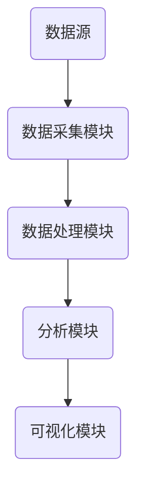
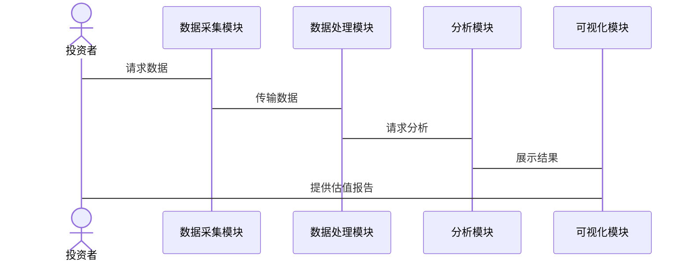

                 


# 新兴市场股市估值与智能物流机器人技术的互动

> **关键词**：新兴市场、股市估值、智能物流机器人、技术互动、经济影响  
> **摘要**：本文探讨新兴市场股市估值与智能物流机器人技术之间的互动关系，分析智能物流技术如何影响企业的运营效率和成本，进而影响股市估值。通过算法和系统设计，揭示两者互动的机制和影响。

---

## 第1章: 背景介绍

### 1.1 新兴市场的特点与发展趋势
#### 1.1.1 新兴市场的定义与特征
新兴市场是指那些经济快速增长、工业化程度较低但潜力巨大的国家或地区的市场。这些市场通常具有较大的人口基数、较低的人均收入和较高的经济增长率。

#### 1.1.2 新兴市场在经济全球化中的地位
新兴市场在全球经济中扮演着重要角色，尤其是中国、印度、东南亚国家等，它们的经济增长对全球贸易和投资具有重要影响。

#### 1.1.3 新兴市场股市的发展现状与挑战
新兴市场股市近年来发展迅速，但也面临波动性大、监管不完善等挑战。

### 1.2 智能物流机器人技术的兴起
#### 1.2.1 智能物流机器人的定义与分类
智能物流机器人是指能够自动执行物流任务的机器人，包括仓储机器人、配送机器人等。

#### 1.2.2 智能物流机器人技术的核心优势
智能物流机器人能够提高效率、降低成本、减少人为错误，具有24/7工作的能力。

#### 1.2.3 智能物流机器人在物流行业的应用现状
智能物流机器人已在仓储、配送、分拣等领域得到广泛应用。

### 1.3 互动背景与问题描述
#### 1.3.1 新兴市场股市与智能物流机器人技术的关联性
新兴市场的经济增长和技术进步推动了智能物流技术的应用，而智能物流技术的进步又影响企业的盈利能力，进而影响股市估值。

#### 1.3.2 智能物流机器人技术对股市估值的影响
智能物流技术的引入可能降低企业的物流成本，提高利润率，从而提升企业估值。

#### 1.3.3 问题背景与研究意义
研究智能物流技术如何影响股市估值，有助于投资者更好地理解市场变化，为企业提供优化建议。

### 1.4 核心概念与边界
#### 1.4.1 核心概念的定义与属性
- 新兴市场股市估值：衡量企业价值的指标。
- 智能物流机器人技术：提高物流效率的技术手段。

#### 1.4.2 核心概念的边界与外延
- 新兴市场股市估值不包括成熟市场的数据。
- 智能物流机器人技术的应用范围主要在物流领域。

#### 1.4.3 核心概念的结构与组成要素
- 新兴市场：经济增长、人口、政策。
- 智能物流机器人：技术、设备、数据。

### 1.5 本章小结
本章介绍了新兴市场和智能物流机器人技术的基本概念和特点，为后续分析奠定了基础。

---

## 第2章: 核心概念与联系

### 2.1 核心概念的原理
#### 2.1.1 新兴市场股市估值的原理
股市估值通过市盈率、市净率等指标衡量企业的内在价值。

#### 2.1.2 智能物流机器人技术的原理
智能物流机器人通过自动化技术优化物流流程。

#### 2.1.3 两者互动的机制
智能物流技术降低企业成本，提升盈利能力，进而影响股市估值。

### 2.2 核心概念的属性特征对比
| 属性       | 新兴市场股市估值 | 智能物流机器人技术 |
|------------|------------------|--------------------|
| 核心指标   | 市盈率、市净率    | 自动化效率、成本    |
| 影响因素   | 经济增长、政策    | 技术创新、成本     |
| 目标       | 评估企业价值     | 提高物流效率        |

### 2.3 ER实体关系图

```mermaid
er
  actor(投资者)
  entity(企业)
  entity(物流数据)
  relation(投资)
  relation(应用)
  actor-|投资|- entity(企业)
  entity(企业)-|应用|- entity(物流数据)
```

---

## 第3章: 算法原理讲解

### 3.1 算法原理
#### 3.1.1 算法的基本原理
通过收集物流数据，分析其对股市估值的影响。

#### 3.1.2 算法的数学模型
$$\text{预测估值} = \beta \times \text{物流成本} + \alpha$$

#### 3.1.3 算法的实现步骤
1. 数据收集：收集物流成本和企业估值数据。
2. 特征提取：提取物流成本作为关键特征。
3. 模型训练：使用线性回归模型训练。
4. 预测与分析：预测企业估值并分析影响。

### 3.2 算法的数学模型与公式
$$
\text{预测估值} = \beta \times \text{物流成本} + \alpha
$$
其中，$\beta$是回归系数，$\alpha$是截距。

### 3.3 算法的实现与代码
```python
import pandas as pd
import numpy as np
from sklearn.linear_model import LinearRegression

# 数据收集与预处理
data = pd.DataFrame({
    '物流成本': [100, 200, 300, 400],
    '企业估值': [500, 600, 700, 800]
})

# 特征提取
X = data[['物流成本']]
y = data['企业估值']

# 模型训练
model = LinearRegression()
model.fit(X, y)

# 预测与分析
predicted = model.predict(X)
print('预测值:', predicted)
print('回归系数:', model.coef_)
print('截距:', model.intercept_)
```

### 3.4 算法的实例
通过实际数据，展示物流成本对预测估值的影响。

---

## 第4章: 系统分析与架构设计

### 4.1 问题场景介绍
智能物流机器人技术的应用如何影响企业的物流成本，进而影响股市估值。

### 4.2 系统功能设计
- 数据采集模块：收集物流数据和股市数据。
- 数据处理模块：清洗和预处理数据。
- 分析模块：使用算法分析数据。
- 可视化模块：展示分析结果。

### 4.3 系统架构设计



### 4.4 系统接口设计
- 数据接口：连接物流系统和股市数据库。
- 分析接口：调用算法模块进行预测。

### 4.5 系统交互设计



---

## 第5章: 项目实战

### 5.1 环境安装
安装Python、Pandas、Scikit-learn等工具。

### 5.2 核心实现代码
```python
import pandas as pd
from sklearn.linear_model import LinearRegression

# 数据加载
data = pd.read_csv('物流与估值数据.csv')

# 特征选择
X = data[['物流成本']]
y = data['企业估值']

# 模型训练
model = LinearRegression()
model.fit(X, y)

# 预测与保存结果
predictions = model.predict(X)
data['预测估值'] = predictions
data.to_csv('结果.csv', index=False)
```

### 5.3 代码应用解读
- 数据加载：读取CSV文件。
- 特征选择：提取物流成本。
- 模型训练：使用线性回归。
- 预测结果：保存预测估值。

### 5.4 实际案例分析
分析一个新兴市场企业的物流成本变化，预测其估值变化。

### 5.5 项目小结
通过实战，验证了算法的有效性，展示了智能物流技术对股市估值的影响。

---

## 第6章: 总结与展望

### 6.1 核心结论
智能物流机器人技术显著降低了物流成本，提升了企业估值。

### 6.2 问题分析
当前算法仅考虑了物流成本，未来可以引入更多变量，如技术进步和政策影响。

### 6.3 展望
随着技术进步，智能物流机器人将对股市估值产生更大的影响，值得进一步研究。

---

**作者：AI天才研究院 & 禅与计算机程序设计艺术**

---

以上是《新兴市场股市估值与智能物流机器人技术的互动》的完整目录和内容概述。通过逐步分析和详细讲解，本文探讨了智能物流技术对股市估值的影响，为投资者和企业提供有价值的见解。

