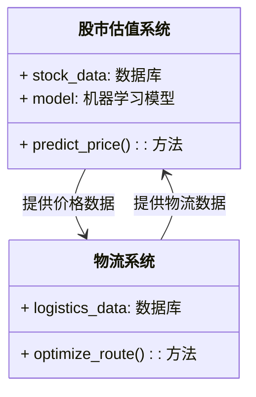
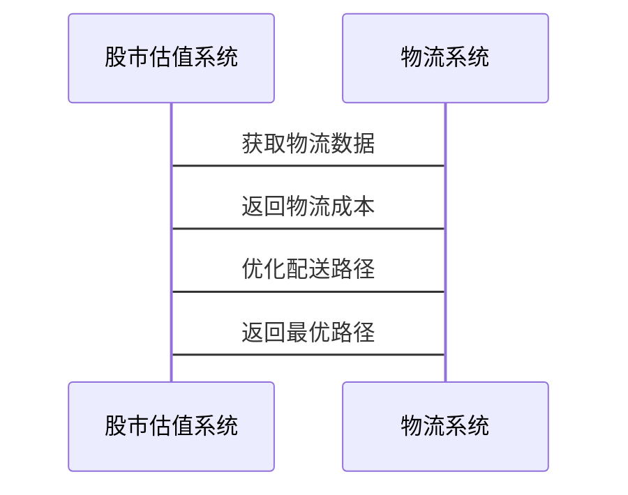

                 


# 新兴市场股市估值与智能物流跨境配送的互动

> 关键词：新兴市场、股市估值、智能物流、跨境配送、互动关系、算法模型、系统架构

> 摘要：本文探讨新兴市场股市估值与智能物流跨境配送之间的互动关系，分析股市估值的核心概念与技术，智能物流的核心技术与实现，以及两者互动的机制与数学模型。通过实际案例分析与项目实战，结合系统架构设计与算法实现，全面阐述互动关系的影响与应用。

---

# 第一部分: 背景介绍

## 第1章: 新兴市场股市估值的现状

### 1.1 新兴市场的定义与特点
新兴市场是指经济快速发展、工业化程度较高、但尚未完全发达国家的股市。其特点包括高增长、高波动性和多样化。

### 1.2 股市估值的核心概念与问题背景
股市估值是通过对公司财务数据和市场因素的分析，确定股票的合理价格。新兴市场的特殊性使得传统估值方法面临挑战。

### 1.3 新兴市场股市的独特性与挑战
新兴市场的股市波动性高、政策风险大、信息透明度低，这些都对估值提出了更高的要求。

## 第2章: 智能物流与跨境配送的现状

### 2.1 智能物流的定义与技术基础
智能物流利用物联网、大数据和人工智能等技术，实现物流过程的智能化和自动化。

### 2.2 跨境配送的主要问题与痛点
跨境配送涉及复杂的物流网络、多样化的政策法规和高昂的成本，这些是主要挑战。

### 2.3 智能物流在跨境配送中的应用
通过智能算法优化路径、降低成本，智能物流在跨境配送中发挥重要作用。

## 第3章: 股市估值与智能物流的互动关系

### 3.1 互动的核心概念与问题描述
股市估值的变化可能影响企业的物流成本，而物流效率也可能反过来影响股市表现。

### 3.2 互动的主要驱动因素与边界
经济政策、市场波动和技术进步是主要驱动因素，而边界在于物流成本和股市波动的相互作用。

### 3.3 互动的潜在影响与价值
通过互动，可以实现资源优化配置和成本降低，对企业和市场发展具有重要意义。

---

# 第二部分: 股市估值的核心概念与方法

## 第4章: 股市估值的基本原理

### 4.1 市盈率与市净率的定义与计算
市盈率 = 股价 / 每股收益；市净率 = 股价 / 每股净资产。

### 4.2 股息率与股息支付率的分析
股息率 = 每股股息 / 股价；股息支付率 = 股息支付总额 / 净利润。

### 4.3 资产评估与企业价值的计算公式
企业价值 = 股东权益价值 + 长期债务价值。

## 第5章: 现代股市估值技术

### 5.1 人工智能在股市预测中的应用
通过神经网络和深度学习模型预测股票价格。

### 5.2 数据挖掘与机器学习在估值中的作用
利用聚类分析和回归分析优化估值模型。

### 5.3 时间序列分析与股票价格预测
使用ARIMA模型进行时间序列预测。

## 第6章: 新兴市场的特殊估值方法

### 6.1 新兴市场波动性分析
分析新兴市场的波动性对估值的影响。

### 6.2 新兴市场公司治理与财务透明度的影响
公司治理和财务透明度对估值的重要性。

### 6.3 区域经济与政策对估值的影响
区域经济政策和国际关系对股市估值的影响。

---

# 第三部分: 智能物流与跨境配送的核心技术

## 第7章: 智能物流的定义与技术基础

### 7.1 智能物流系统的构成
包括物联网设备、数据处理系统和智能决策系统。

### 7.2 大数据分析在物流中的应用
通过大数据分析优化配送路径。

### 7.3 物联网技术与智能配送
利用物联网实现物流过程的实时监控和优化。

## 第8章: 跨境配送的主要挑战

### 8.1 跨境物流的复杂性与风险
包括物流成本高、政策法规多样和国际物流网络复杂。

### 8.2 不同国家的物流政策与法规
各国物流政策的差异对跨境配送的影响。

### 8.3 跨境配送的成本与效率问题
高成本和低效率是跨境配送的主要挑战。

## 第9章: 智能物流的核心算法与实现

### 9.1 路径优化算法的原理与实现
使用遗传算法优化配送路径。

### 9.2 机器学习在物流预测中的应用
通过机器学习预测物流需求和优化库存管理。

### 9.3 自然语言处理在物流信息处理中的应用
利用自然语言处理技术分析物流相关信息。

---

# 第四部分: 股市估值与智能物流互动的机制

## 第10章: 互动的核心机制

### 10.1 数据流的双向影响
股市数据影响物流成本，物流数据影响股市波动。

### 10.2 价格波动与物流成本的关联
价格波动通过物流成本影响企业的运营效率。

### 10.3 市场情绪与物流效率的相互作用
市场情绪变化影响物流需求，物流效率反过来影响市场情绪。

## 第11章: 互动的数学模型

### 11.1 价格波动模型的建立
$$P(t) = P(t-1) + \alpha \cdot \text{物流成本变化} + \beta \cdot \text{市场情绪变化}$$

### 11.2 物流成本与收益的平衡模型
$$\text{总成本} = \lambda \cdot \text{配送路径长度} + \mu \cdot \text{配送时间}$$

### 11.3 市场情绪与物流效率的关联模型
$$\text{物流效率} = \gamma \cdot \text{市场情绪} + \delta \cdot \text{物流技术投入}$$

## 第12章: 互动的实体关系图

### 12.1 ER图的构建与分析
```mermaid
erDiagram
  customer[客户] {
    id : integer
    name : string
    address : string
  }
  stock[股票] {
    id : integer
    name : string
    price : float
  }
  logistics[物流] {
    id : integer
    cost : float
    time : integer
  }
  customer -> stock : 持有
  stock -> logistics : 受影响
```

### 12.2 数据流的方向与强度


---

# 第五部分: 项目实战与系统架构

## 第13章: 环境安装与系统核心实现源代码

### 13.1 环境安装
- 安装Python和相关库（如numpy、pandas、scikit-learn）。
- 配置数据库和物联网设备。

### 13.2 核心实现源代码
```python
import numpy as np
from sklearn.linear_model import LinearRegression

# 示例代码：基于机器学习的物流成本预测
def predict_logistics_cost(data):
    model = LinearRegression()
    model.fit(data[['distance', 'weight']], data['cost'])
    return model.predict([[distance, weight]])

# 示例代码：基于神经网络的股市预测
from keras.models import Sequential
from keras.layers import Dense

model = Sequential()
model.add(Dense(64, activation='relu', input_dim=4))
model.add(Dense(1, activation='sigmoid'))
model.compile(optimizer='adam', loss='binary_crossentropy')
model.fit(X_train, y_train, epochs=10, batch_size=32)
```

## 第14章: 项目实战与实际案例分析

### 14.1 实际案例分析
分析新兴市场中某公司的物流成本变化对股价的影响。

### 14.2 详细讲解剖析
通过具体案例，展示互动关系的实际应用和效果。

## 第15章: 系统架构设计与接口设计

### 15.1 系统功能设计


### 15.2 系统接口设计


---

# 第六部分: 结论与展望

## 第16章: 结论

### 16.1 核心观点总结
股市估值与智能物流的互动关系是双向的，互相影响，互相优化。

### 16.2 项目价值总结
通过技术手段优化两者互动关系，实现资源优化配置和成本降低。

## 第17章: 展望与注意事项

### 17.1 未来发展趋势
人工智能和大数据技术将进一步推动互动关系的优化。

### 17.2 注意事项与最佳实践
建议企业在实施过程中注重数据安全和系统稳定性。

---

# 作者：AI天才研究院 & 禅与计算机程序设计艺术

---

通过以上目录结构，我们可以看到文章从背景介绍、核心概念、算法实现、系统架构到项目实战，层层递进，逐步深入，全面分析了新兴市场股市估值与智能物流跨境配送的互动关系。

