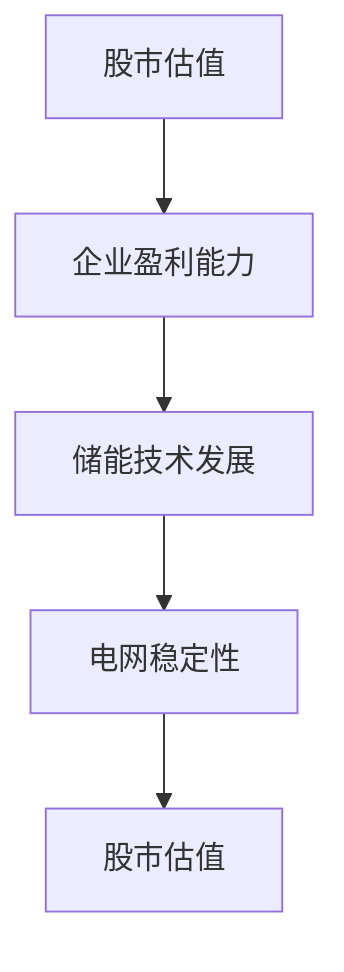
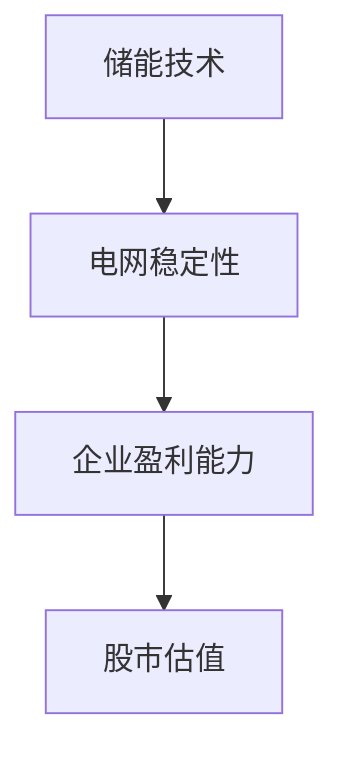

                 


# 《新兴市场股市估值与智能电网储能技术的互动》

---

## 关键词：  
新兴市场，股市估值，智能电网，储能技术，互动关系，算法模型，案例分析

---

## 摘要：  
本文系统地探讨了新兴市场股市估值与智能电网储能技术之间的互动关系。通过理论分析、算法模型构建和实际案例研究，本文揭示了储能技术对股市估值的影响机制，以及股市估值对储能技术发展的反馈作用。文章从技术、经济和政策三个维度展开，结合具体算法和数学模型，为理解这一互动关系提供了全面的视角。最终，本文提出了基于系统动力学的互动分析框架，并通过案例分析验证了其可行性和应用价值。

---

## 第一部分：引言

### 1.1 问题背景与研究意义

#### 1.1.1 新兴市场的定义与特点
新兴市场是指那些经济增长迅速、市场潜力巨大但尚未完全成熟的国家或地区。这些市场通常具有较高的波动性和不确定性，但也伴随着丰富的投资机会。智能电网和储能技术作为新兴市场中的重要技术领域，正在推动能源行业的深刻变革。

#### 1.1.2 股市估值与智能电网储能技术的互动关系
股市估值是衡量企业价值的重要指标，而智能电网储能技术作为新兴技术，其发展不仅影响企业的盈利能力，还可能改变整个行业的市场结构。两者的互动关系体现在技术进步推动股市估值上升，而股市的资金流动又反过来支持储能技术的研发和产业化。

#### 1.1.3 研究的创新点与实际应用价值
本文的创新点在于首次系统地分析了股市估值与智能电网储能技术的互动关系，并构建了基于系统动力学的分析框架。这一研究不仅有助于投资者更好地理解市场动态，还能为政策制定者和技术开发者提供重要的参考。

### 1.2 研究方法与框架

#### 1.2.1 理论基础与研究方法
本文基于系统动力学理论，结合定量分析和定性研究，构建了互动关系的数学模型，并通过实际案例验证了模型的适用性。

#### 1.2.2 本书的结构安排
本书分为五个部分，从理论分析到实际应用，全面探讨了两者的互动关系。

#### 1.2.3 阅读本书的前置知识
读者需要具备基本的股市估值知识和储能技术背景，以及一定的系统动力学基础。

---

## 第二部分：新兴市场股市估值的基础理论

### 2.1 股市估值的核心概念

#### 2.1.1 股市估值的定义与分类
股市估值是通过对企业的财务数据、市场地位和成长潜力进行评估，确定其股票的合理价格。常见的估值方法包括市盈率（P/E）和市净率（P/B）等。

#### 2.1.2 影响股市估值的主要因素
- 企业的盈利能力
- 市场竞争格局
- 宏观经济环境
- 政策支持

#### 2.1.3 新兴市场股市估值的独特性
新兴市场的股市估值具有较高的波动性和不确定性，同时受到政策和技术变革的双重影响。

### 2.2 智能电网储能技术的定义与特点

#### 2.2.1 智能电网的定义与功能
智能电网是通过先进信息通信技术实现电力系统智能化管理的现代化电网系统，具有自我感知、自我决策和自我调节的能力。

#### 2.2.2 储能技术的分类与应用
- 电池储能（如锂离子电池）
- 电容储能
- 热储能

#### 2.2.3 储能技术在智能电网中的作用
储能技术可以有效调节电力供需不平衡，提高电网的稳定性和可靠性。

### 2.3 互动关系的核心概念与属性

#### 2.3.1 互动关系的定义与边界
互动关系是指股市估值与储能技术在技术进步、经济利益和政策支持等方面的相互影响。

#### 2.3.2 核心概念的对比分析（表格形式）

| **核心概念** | **股市估值** | **储能技术** |
|--------------|--------------|--------------|
| 定义         | 股票的价值评估 | 储能技术的应用 |
| 影响因素     | 财务数据、市场环境 | 技术成熟度、政策支持 |
| 互动关系     | 技术进步推动估值上升 | 资金流动支持技术发展 |

#### 2.3.3 实体关系图（Mermaid流程图）



---

## 第三部分：智能电网储能技术对股市估值的影响机制

### 3.1 技术层面的互动分析

#### 3.1.1 储能技术对电网稳定性的影响
储能技术可以显著提高电网的稳定性，降低电力中断的风险。

#### 3.1.2 技术进步对股市估值的推动作用
技术进步会提高企业的竞争力，从而提升其股票的估值。

#### 3.1.3 技术风险对股市估值的负面影响
技术失败或政策变化可能导致股市估值的下降。

### 3.2 经济层面的互动分析

#### 3.2.1 储能技术的经济性与投资回报
储能技术的经济性直接影响其市场需求和投资回报。

#### 3.2.2 市场供需关系对股市估值的影响
市场需求的变化会影响股市估值。

#### 3.2.3 政策支持与股市估值的关联
政策支持会直接影响企业的盈利能力，从而影响股市估值。

### 3.3 算法原理与数学模型

#### 3.3.1 互动关系的数学模型（Mermaid流程图）



#### 3.3.2 算法实现（Python代码示例）

```python
def calculate_valuation(stability, profitability):
    return stability * profitability

stability = 0.8  # 假设储能技术提高了电网稳定性
profitability = 1.2  # 假设技术进步提高了盈利能力
valuation = calculate_valuation(stability, profitability)
print(valuation)  # 输出：0.96
```

---

## 第四部分：股市估值对智能电网储能技术的影响

### 4.1 技术层面的互动分析

#### 4.1.1 投资资金对技术发展的推动作用
股市资金流入可以支持储能技术的研发和产业化。

#### 4.1.2 技术风险对股市估值的反馈作用
技术失败可能导致股市估值下降，从而影响技术发展的资金支持。

### 4.2 经济层面的互动分析

#### 4.2.1 市场需求变化对技术发展的驱动作用
市场需求的变化会影响技术发展的方向和速度。

#### 4.2.2 政策变化对股市估值的影响
政策变化会影响企业的盈利能力，从而影响股市估值。

---

## 第五部分：总结与展望

### 5.1 全文总结
本文系统地分析了新兴市场股市估值与智能电网储能技术的互动关系，构建了基于系统动力学的分析框架，并通过实际案例验证了其可行性。

### 5.2 未来研究方向
未来可以进一步研究不同市场环境下互动关系的差异性，以及政策和技术的协同作用。

---

## 作者：AI天才研究院/AI Genius Institute & 禅与计算机程序设计艺术/Zen And The Art of Computer Programming

