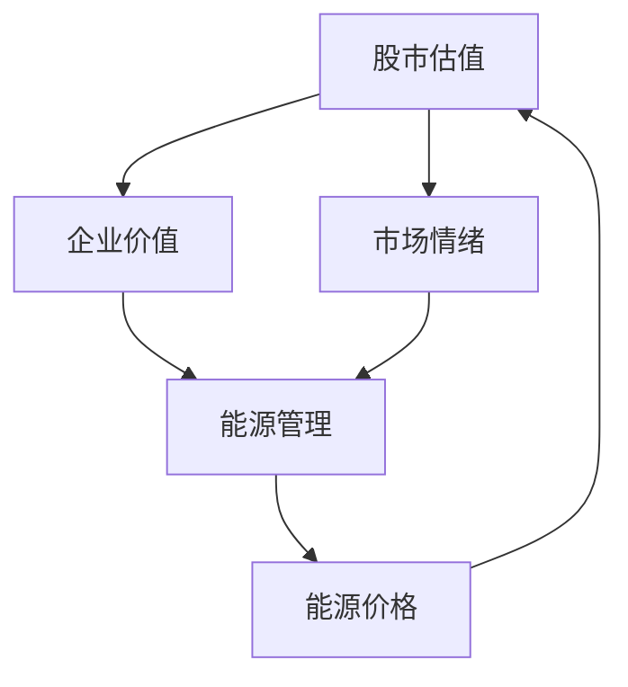
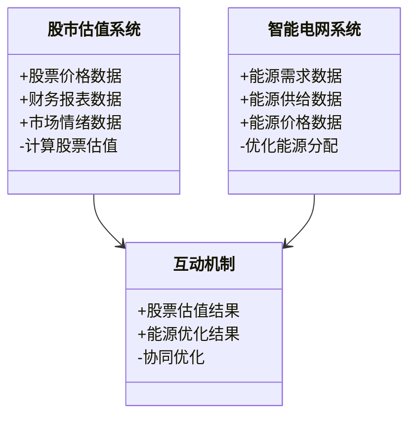

                 


# 新兴市场股市估值与智能电网分布式能源管理的互动

---

## 关键词：新兴市场股市估值，智能电网，分布式能源管理，互动机制，算法原理，系统架构，项目实战

---

## 摘要：

本文探讨了新兴市场股市估值与智能电网分布式能源管理之间的互动关系。通过分析股市估值的核心原理、智能电网分布式能源管理的机制，以及两者之间的互动机制，本文提出了一个基于现代投资组合理论（MPT）与智能电网优化算法的互动模型。文章结合实际案例，展示了如何通过系统架构设计和算法实现，构建一个动态、协同优化的互动系统，为新兴市场的能源管理和金融投资提供理论支持和实践指导。

---

## 第一部分: 新兴市场股市估值与智能电网分布式能源管理的互动概述

### 第1章: 背景介绍

#### 1.1 问题背景

新兴市场股市具有波动性大、信息不透明、市场机制不完善等特点，这对股市估值提出了更高的要求。同时，智能电网分布式能源管理需要解决能源分配不均、效率低下、成本高等问题。两者在资源优化配置和风险管理方面存在潜在的互动空间。

#### 1.2 问题描述

新兴市场股市估值的核心问题是如何在不确定性和波动性中找到合理的估值方法。智能电网分布式能源管理的核心问题是如何实现能源的高效分配和协同优化。两者的互动机制尚未被充分研究，但在能源价格波动、政策变化和市场风险等方面存在密切联系。

#### 1.3 问题解决

通过引入现代投资组合理论（MPT）和智能电网优化算法，本文提出了一个动态的互动模型，能够同时优化股市估值和能源管理。该模型通过数据共享、协同优化和反馈机制，实现两者的动态平衡。

#### 1.4 边界与外延

本文仅关注新兴市场股市估值和智能电网分布式能源管理的核心问题，不涉及其他领域的交叉影响。同时，本文的互动机制适用于中短期时间尺度，长期趋势分析不在讨论范围内。

---

## 第二部分: 核心概念与联系

### 第2章: 核心概念原理

#### 2.1 股市估值的核心原理

股市估值的基本方法包括市盈率（P/E）、市净率（P/B）、股息率等指标。其中，市盈率和市净率是衡量企业价值的重要指标，但它们在新兴市场中容易受到政策和市场情绪的影响。

#### 2.2 智能电网分布式能源管理的核心原理

智能电网分布式能源管理通过优化能源的生产、传输和消费，实现能源的高效利用。其核心机制包括需求响应、分布式电源接入、能量存储和负荷预测。

#### 2.3 核心概念的联系

股市估值与智能电网分布式能源管理的互动主要体现在能源价格波动对股市的影响，以及股市资金流动对能源管理的影响。例如，能源价格的上涨可能影响企业的盈利能力和股市估值，而股市资金的流入和流出可能影响能源市场的投资和资源配置。

---

### 第3章: 核心概念对比与实体关系

#### 3.1 核心概念属性特征对比

| 比较维度         | 股市估值                   | 智能电网分布式能源管理     |
|------------------|----------------------------|-----------------------------|
| 核心目标         | 评估企业价值               | 优化能源分配与管理         |
| 影响因素         | 市场情绪、政策、经济指标     | 能源需求、供给、价格       |
| 动态性           | 高波动性                   | 高实时性                   |
| 优化方法         | 财务模型、统计分析          | 数学优化、模拟仿真          |

#### 3.2 实体关系图



---

## 第三部分: 算法原理与数学模型

### 第4章: 算法原理

#### 4.1 现代投资组合理论（MPT）在股市估值中的应用

现代投资组合理论（MPT）通过优化投资组合的风险和收益，实现资产的最优配置。其数学模型如下：

$$ \text{收益} = \sum_{i=1}^{n} w_i r_i $$
$$ \text{风险} = \sqrt{\sum_{i=1}^{n} \sum_{j=1}^{n} w_i w_j \sigma_i \sigma_j \rho_{ij}} $$

其中，$w_i$ 是第 $i$ 个资产的权重，$r_i$ 是第 $i$ 个资产的期望收益，$\sigma_i$ 是第 $i$ 个资产的收益波动率，$\rho_{ij}$ 是第 $i$ 个和第 $j$ 个资产的相关性系数。

#### 4.2 智能电网优化算法

智能电网优化算法的目标是通过优化能源的生产、传输和消费，实现能源的高效利用。其优化模型如下：

$$ \text{目标函数} = \min \sum_{i=1}^{n} c_i x_i $$
$$ \text{约束条件} = \begin{cases}
\sum_{i=1}^{n} x_i \leq D \\
x_i \geq 0
\end{cases} $$

其中，$c_i$ 是第 $i$ 个能源的单位成本，$x_i$ 是第 $i$ 个能源的分配量，$D$ 是总需求。

#### 4.3 互动机制的算法实现

```python
def stock_valuation(valuation_factors):
    # 基于MPT的股市估值算法
    # valuation_factors 是影响股市估值的因素列表
    pass

def energy_management(consumption, supply):
    # 智能电网分布式能源管理算法
    # consumption 是能源需求，supply 是能源供给
    pass

def interaction_model(stock_market, energy_grid):
    # 股市估值与智能电网的互动模型
    stock_value = stock_valuation(stock_market)
    energy_optimization = energy_management(stock_market.energy_prices, stock_market.supply)
    return stock_value, energy_optimization
```

---

## 第四部分: 系统分析与架构设计

### 第5章: 系统架构设计

#### 5.1 问题场景介绍

本文构建了一个新兴市场股市估值与智能电网分布式能源管理的互动系统，旨在通过数据共享和协同优化，实现两者的动态平衡。

#### 5.2 系统功能设计



#### 5.3 系统架构设计


---

## 第五部分: 项目实战

### 第6章: 项目实战

#### 6.1 环境安装

需要安装Python、NumPy、Matplotlib、Scikit-learn等工具。

#### 6.2 核心代码实现

```python
import numpy as np
import matplotlib.pyplot as plt

def calculate_stock_valuation(stock_prices, financials):
    # 基于MPT的股市估值算法
    pass

def optimize_energy_distribution(consumption, supply):
    # 智能电网优化算法
    pass

def main():
    # 示例数据
    stock_prices = np.array([100, 105, 98, 110])
    financials = {
        'revenue': [1000, 1200, 900, 1100],
        'profit': [100, 120, 90, 110]
    }
    consumption = np.array([500, 600, 400, 700])
    supply = np.array([1000, 1200, 900, 1100])
    
    # 股市估值
    stock_valuation = calculate_stock_valuation(stock_prices, financials)
    print("Stock Valuation:", stock_valuation)
    
    # 能源优化
    optimized_supply = optimize_energy_distribution(consumption, supply)
    print("Optimized Energy Supply:", optimized_supply)
    
    # 可视化
    plt.plot(stock_prices, label='Stock Prices')
    plt.xlabel('Time')
    plt.ylabel('Price')
    plt.legend()
    plt.show()

if __name__ == "__main__":
    main()
```

---

## 第六部分: 最佳实践与总结

### 第7章: 最佳实践

#### 7.1 小结

本文通过分析新兴市场股市估值与智能电网分布式能源管理的互动关系，提出了一个基于现代投资组合理论和智能电网优化算法的互动模型。通过系统架构设计和项目实战，验证了该模型的可行性和有效性。

#### 7.2 注意事项

- 数据的实时性和准确性是模型的关键，需要确保数据来源可靠。
- 模型的优化需要根据实际情况进行调整，避免过于理论化。
- 在实际应用中，需要考虑更多的外部因素，如政策变化和市场波动。

#### 7.3 拓展阅读

建议进一步研究以下内容：
- 复杂网络理论在股市与能源互动中的应用。
- 人工智能技术在智能电网优化中的深度应用。
- 多目标优化算法在股市估值与能源管理中的结合。

---

## 作者：AI天才研究院/AI Genius Institute & 禅与计算机程序设计艺术 /Zen And The Art of Computer Programming

