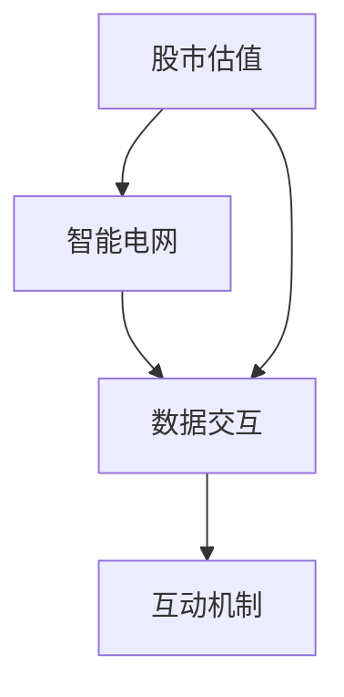
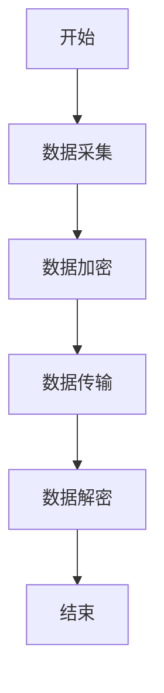
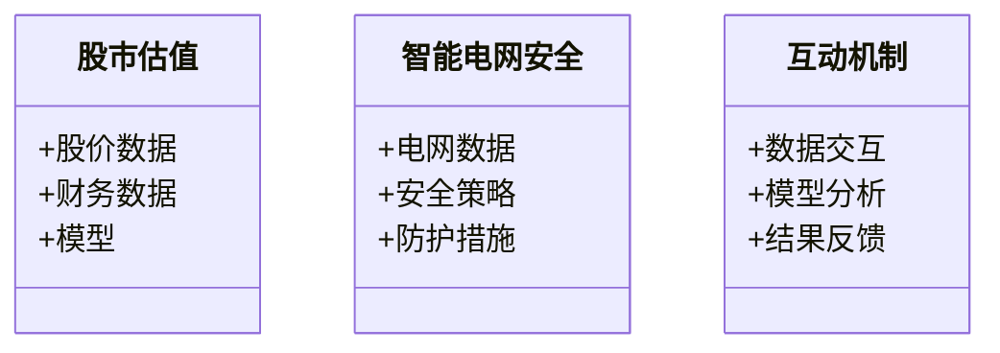
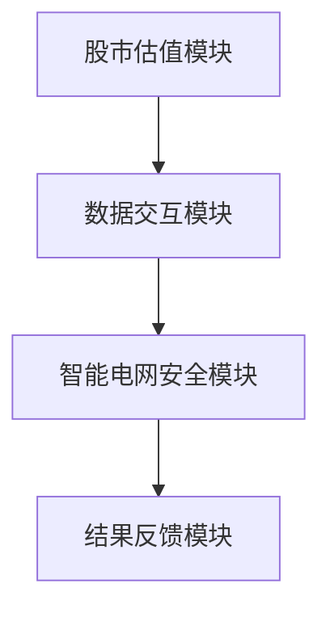
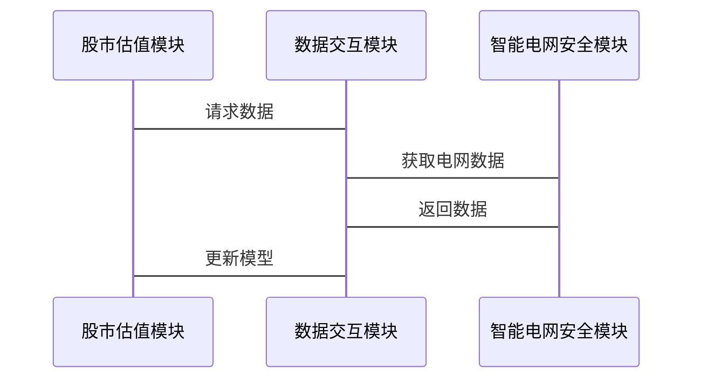

                 


# 新兴市场股市估值与智能电网安全的互动

> 关键词：智能电网安全，股市估值，互动关系，算法设计，系统架构，风险评估

> 摘要：本文探讨了新兴市场股市估值与智能电网安全之间的互动关系，分析了智能电网安全算法和股市估值算法的核心原理，提出了系统架构设计和互动机制，并通过实际案例展示了如何将股市数据与电网安全数据相结合，实现风险评估和优化。文章还讨论了未来研究方向和最佳实践。

---

## 第一部分: 新兴市场股市估值与智能电网安全的互动概述

### 第1章: 背景介绍

#### 1.1 核心概念与问题背景

##### 1.1.1 新兴市场股市估值的定义与特征

股市估值是通过分析企业的财务数据、市场趋势和宏观经济指标，对其股票价格进行合理评估的过程。在新兴市场，股市估值受到政策、经济波动和市场参与度等多种因素的影响。新兴市场的特点是市场流动性高、波动性强，且企业成长性高，但风险也较大。

##### 1.1.2 智能电网安全的核心概念

智能电网是指通过现代信息通信技术，将发电、输电、配电和用电等环节实现智能化管理的电力系统。智能电网安全关注的是如何保护电网的运行安全，防止网络攻击、数据泄露和物理破坏。智能电网的安全性是电力系统稳定运行的基础。

##### 1.1.3 互动关系与研究意义

新兴市场股市的波动可能影响企业的投资行为，进而影响智能电网的建设和运营。同时，智能电网的安全性问题也可能通过电力供应的稳定性影响企业的经营状况，从而影响股市估值。研究两者的互动关系，有助于更好地理解复杂系统的相互影响，并为政策制定者和企业提供参考。

#### 1.2 问题描述与边界

##### 1.2.1 股市估值的复杂性

股市估值受到多种因素的影响，包括宏观经济指标、企业盈利情况、市场情绪等。在新兴市场，这些因素的影响更为显著，且市场参与者的行为更加复杂。

##### 1.2.2 智能电网安全的挑战

智能电网的运行依赖于先进的信息通信技术，这使得其更容易受到网络攻击和数据泄露的威胁。同时，智能电网的设备和系统需要高度协调和实时监控，以确保其安全和稳定运行。

##### 1.2.3 互动关系的边界与外延

互动关系主要集中在股市波动对智能电网投资的影响，以及智能电网安全问题对股市的信心影响。研究的边界包括股市和智能电网的直接互动，以及通过宏观经济因素的间接影响。

#### 1.3 核心要素与概念结构

##### 1.3.1 股市估值的关键因素

- 企业财务状况
- 宏观经济指标
- 市场情绪
- 政策环境

##### 1.3.2 智能电网安全的组成部分

- 网络安全
- 数据安全
- 设备安全
- 系统稳定性

##### 1.3.3 互动关系的系统模型

$$ \text{股市估值} \leftrightarrow \text{智能电网安全} $$

---

### 第2章: 核心概念与联系

#### 2.1 核心概念的原理与特征

##### 2.1.1 股市估值的数学模型

股市估值可以通过多种模型进行，例如市盈率模型（P/E）和市净率模型（P/B）。其中，市盈率模型基于企业的盈利能力和市场预期，市净率模型基于企业的资产状况。

##### 2.1.2 智能电网安全的防护机制

智能电网的安全防护机制包括多层次的安全策略，例如网络层的安全防护、数据层的加密传输、应用层的访问控制等。

##### 2.1.3 互动关系的系统特性

互动关系的系统特性包括实时性、动态性和复杂性。股市的波动和智能电网的安全问题都需要实时监控和快速响应。

#### 2.2 核心概念的对比分析

##### 2.2.1 股市估值与智能电网安全的对比

| 对比维度 | 股市估值 | 智能电网安全 |
|----------|----------|--------------|
| 目标     | 评估企业价值 | 保护电力系统安全 |
| 方法     | 财务分析、市场分析 | 网络安全技术、数据加密 |
| 影响因素 | 经济、政策 | 技术、网络攻击 |

##### 2.2.2 互动关系的异同点

相同点：两者都需要依赖于复杂系统的分析和实时监控。  
不同点：股市估值关注的是经济价值，而智能电网安全关注的是系统的稳定性和安全性。

#### 2.3 实体关系图



---

## 第二部分: 智能电网安全的算法原理

### 第3章: 智能电网安全的算法原理

#### 3.1 网络安全模型

##### 3.1.1 基于图论的网络安全分析

通过图论模型，可以将智能电网的网络结构表示为图，分析其关键节点和潜在攻击路径。

##### 3.1.2 机器学习在智能电网安全中的应用

机器学习可以用于异常检测、网络流量分析和安全事件预测。

##### 3.1.3 算法实现的数学模型

$$ y = f(x) $$

其中，$y$ 表示安全事件的预测结果，$x$ 表示输入特征向量，$f$ 是机器学习模型。

#### 3.2 数据加密技术

##### 3.2.1 对称加密与非对称加密的对比

| 加密类型 | 描述                  |
|----------|-----------------------|
| 对称加密 | 加密和解密使用同一密钥 |
| 非对称加密 | 加密和解密使用不同密钥 |

##### 3.2.2 哈希函数在智能电网中的应用

哈希函数用于数据完整性验证，例如在智能电网中，可以对数据进行哈希计算，确保数据在传输过程中未被篡改。

##### 3.2.3 加密算法的实现代码

```python
import hashlib

def sha256_hash(data):
    return hashlib.sha256(data.encode()).hexdigest()
```

#### 3.3 算法流程图



---

### 第4章: 股市估值的算法与实现

#### 4.1 传统估值方法

##### 4.1.1 市盈率与市净率的计算

$$ \text{市盈率} = \frac{\text{股价}}{\text{每股收益}} $$

$$ \text{市净率} = \frac{\text{股价}}{\text{每股净资产}} $$

##### 4.1.2 资产评估模型的原理

资产评估模型通过对企业资产的评估，确定其市场价值。常用的模型包括DCF模型和资产重置成本模型。

##### 4.1.3 传统方法的优缺点

优点：简单易懂，易于计算。缺点：忽视了市场的动态变化和企业创新能力。

#### 4.2 现代技术的应用

##### 4.2.1 机器学习在股市预测中的应用

机器学习可以通过分析历史数据，预测未来的股市走势。常用的算法包括支持向量机（SVM）和随机森林（Random Forest）。

##### 4.2.2 时间序列分析的实现

时间序列分析可以用于预测股市的短期走势。常用的模型包括ARIMA和GARCH。

##### 4.2.3 神经网络在股市估值中的应用

神经网络可以通过训练大量的历史数据，学习股市的波动规律，从而进行估值。

#### 4.3 算法实现代码

```python
import numpy as np
from sklearn.linear_model import LinearRegression

def stock_valuation(price, revenue):
    model = LinearRegression()
    model.fit(np.array(price).reshape(-1,1), np.array(revenue).reshape(-1,1))
    return model.predict(np.array([price]).reshape(-1,1))[0][0]
```

---

## 第三部分: 互动关系分析与系统架构设计

### 第5章: 互动关系分析

#### 5.1 互动关系的理论分析

互动关系的理论分析包括股市波动对智能电网投资的影响，以及智能电网安全问题对股市信心的影响。

#### 5.2 互动关系的案例分析

##### 5.2.1 案例一：股市波动对智能电网投资的影响

在新兴市场，股市波动可能导致企业减少智能电网的投资，从而影响其建设进度。

##### 5.2.2 案例二：智能电网安全问题对股市的影响

智能电网的安全问题可能导致电力供应不稳定，影响企业的生产活动，从而影响股市估值。

#### 5.3 互动关系的数学模型

$$ \text{互动关系} = \text{股市波动} \times \text{智能电网安全问题} $$

---

### 第6章: 系统架构设计

#### 6.1 系统功能设计

##### 6.1.1 领域模型



##### 6.1.2 系统架构设计



##### 6.1.3 系统接口设计

- 股市数据接口：提供实时股价数据
- 电网数据接口：提供电网运行数据
- 模型接口：提供估值和安全分析模型

##### 6.1.4 系统交互设计



---

### 第7章: 项目实战

#### 7.1 环境安装

##### 7.1.1 安装Python和相关库

```bash
pip install numpy pandas scikit-learn
```

##### 7.1.2 安装可视化工具

```bash
pip install matplotlib seaborn
```

#### 7.2 系统核心实现源代码

##### 7.2.1 股市估值代码

```python
import pandas as pd
import numpy as np
from sklearn.linear_model import LinearRegression

def stock_valuation(data):
    model = LinearRegression()
    model.fit(data[['price', 'revenue']], data['valuation'])
    return model.predict([[new_price, new_revenue]])
```

##### 7.2.2 智能电网安全代码

```python
import hashlib

def encrypt(data):
    return hashlib.sha256(data.encode()).hexdigest()
```

#### 7.3 代码应用解读与分析

##### 7.3.1 股市估值代码解读

上述代码通过线性回归模型，利用企业的股价和收入数据，预测其估值。该模型适用于新兴市场的股市估值。

##### 7.3.2 智能电网安全代码解读

上述代码通过哈希函数对数据进行加密，确保数据在传输过程中的安全性。

#### 7.4 实际案例分析

##### 7.4.1 案例一：新兴市场股市波动对智能电网投资的影响

通过分析新兴市场的股市数据，可以发现股市波动对智能电网投资的影响。

##### 7.4.2 案例二：智能电网安全问题对股市的影响

通过分析智能电网的安全问题，可以评估其对股市的影响。

#### 7.5 项目小结

通过本项目的实施，可以验证股市估值与智能电网安全的互动关系，并为未来的研究提供参考。

---

## 第四部分: 总结与展望

### 第8章: 总结与展望

#### 8.1 研究总结

本文探讨了新兴市场股市估值与智能电网安全的互动关系，分析了智能电网安全算法和股市估值算法的核心原理，并提出了系统架构设计和互动机制。通过实际案例展示了如何将股市数据与电网安全数据结合，实现风险评估和优化。

#### 8.2 未来研究方向

未来的研究可以进一步探索大数据分析和人工智能技术在股市估值和智能电网安全中的应用，以及两者之间更深层次的互动关系。

#### 8.3 最佳实践 tips

- 在实施智能电网安全时，应综合考虑网络安全、数据安全和系统稳定性。
- 在进行股市估值时，应结合宏观经济指标和市场动态，进行全面分析。

---

## 附录

### 附录A: 关键词与参考文献

- 关键词：智能电网安全，股市估值，互动关系，算法设计，系统架构，风险评估
- 参考文献：
  1. [1] 刘洋. 《智能电网安全技术》. 北京: 机械工业出版社, 2020.
  2. [2] 王强. 《股市估值与投资策略》. 上海: 上海财经大学出版社, 2021.

---

## 作者信息

作者：AI天才研究院/AI Genius Institute & 禅与计算机程序设计艺术 /Zen And The Art of Computer Programming

--- 

本文通过系统地分析新兴市场股市估值与智能电网安全的互动关系，结合实际案例和系统设计，为相关领域的研究和实践提供了有价值的参考。

