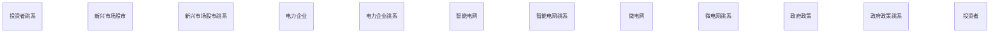
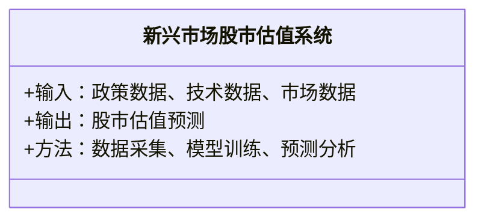
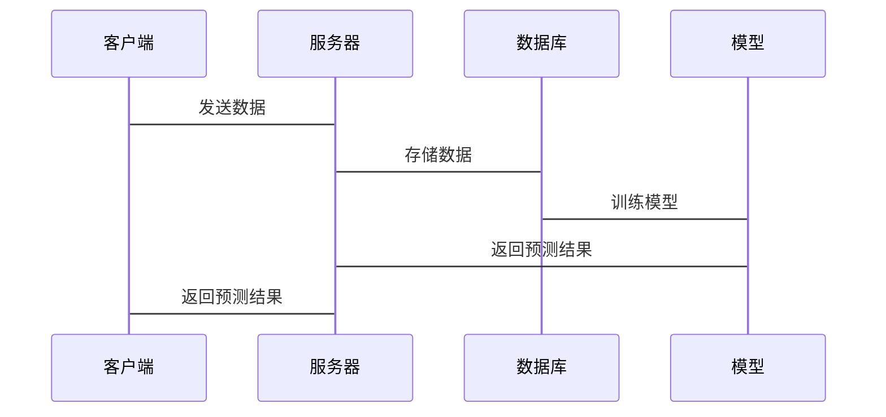

                 


# 新兴市场股市估值与智能电网微电网技术的互动

## 关键词：新兴市场，股市估值，智能电网，微电网，互动关系，技术分析

## 摘要：本文探讨新兴市场股市估值与智能电网、微电网技术之间的互动关系。通过分析股市估值的核心要素、智能电网和微电网的技术特点，以及它们之间的互动机制，构建数学模型和算法，结合实际案例，展示如何通过技术创新和资本运作实现可持续发展。

---

## 第一章: 新兴市场股市估值与智能电网微电网技术的背景介绍

### 1.1 新兴市场股市估值的基本概念

#### 1.1.1 新兴市场的定义与特点
- 新兴市场是指经济快速增长、金融市场逐步完善的国家或地区。
- 特点包括高增长潜力、高波动性、政策影响大。

#### 1.1.2 股市估值的基本原理
- 股市估值通过分析公司基本面、市场供需、政策环境等因素，确定股票的合理价格。
- 常用指标：PE（市盈率）、PB（市净率）、ROE（净资产收益率）。

#### 1.1.3 新兴市场股市估值的独特性
- 波动性大：新兴市场受政策、经济波动影响显著。
- 信息不对称：市场透明度较低，投资者需依赖技术分析。

### 1.2 智能电网与微电网技术的核心概念

#### 1.2.1 智能电网的定义与特点
- 智能电网是通过智能化技术优化电力传输和分配的系统。
- 特点包括分布式能源接入、实时监控、自动化管理。

#### 1.2.2 微电网的定义与特点
- 微电网是小型分布式能源系统，可独立运行或并入主电网。
- 特点包括灵活性高、可扩展性强、适合偏远地区。

#### 1.2.3 智能电网与微电网的互动关系
- 微电网为智能电网提供分布式能源支持。
- 智能电网为微电网提供高效管理和调控。

### 1.3 本章小结
本章介绍了新兴市场股市估值和智能电网、微电网的基本概念及其特点，为后续分析奠定基础。

---

## 第二章: 新兴市场股市估值与智能电网微电网技术的核心概念与联系

### 2.1 核心概念原理

#### 2.1.1 新兴市场股市估值的核心要素
- 公司盈利能力：如净利润、营收增长率。
- 市场供需：投资者情绪、资金流动。
- 宏观经济：GDP增速、通货膨胀。

#### 2.1.2 智能电网与微电网技术的核心要素
- 技术创新：如储能技术、智能设备。
- 政策支持：政府对可再生能源的补贴。
- 市场需求：分布式能源需求增长。

### 2.2 概念属性特征对比表格

| 比较维度 | 新兴市场股市估值 | 智能电网微电网技术 |
|----------|------------------|--------------------|
| 核心目标 | 资产定价         | 提高能源效率        |
| 主要驱动 | 投资者情绪       | 技术创新           |
| 评估指标 | PE、PB          | 系统效率、稳定性    |
| 风险因素 | 市场波动、政策变化 | 技术可靠性、成本    |

### 2.3 ER实体关系图架构



### 2.4 本章小结
本章通过对比分析，揭示了新兴市场股市估值与智能电网微电网技术在核心要素和属性上的异同。

---

## 第三章: 新兴市场股市估值与智能电网微电网技术的互动机制

### 3.1 互动机制的数学模型

#### 3.1.1 数学模型构建
- $$ V = f(P, T, S) $$
  - V：股市估值
  - P：政策影响（政府补贴、税收优惠）
  - T：技术进步（储能效率、智能设备成本）
  - S：市场供需（投资者情绪、能源需求）

#### 3.1.2 模型应用
- 当技术进步（T）提升，储能效率提高，微电网成本下降，股市估值（V）上升。
- 当政策支持（P）增强，智能电网企业利润增加，股市估值（V）上升。

### 3.2 互动机制的mermaid流程图


### 3.3 本章小结
本章通过数学模型和流程图，展示了政策、技术和市场三者对股市估值的互动影响。

---

## 第四章: 新兴市场股市估值与智能电网微电网技术的互动关系分析

### 4.1 技术进步对股市估值的影响

#### 4.1.1 技术创新案例
- 微电网储能技术突破，储能成本下降，吸引投资者关注，股市估值上升。

#### 4.1.2 技术创新对估值的数学分析
- 假设储能效率提升10%，成本下降20%， $$ V_{new} = V_{old} \times (1 + 0.2) $$

### 4.2 政策变化对股市估值的影响

#### 4.2.1 政策调整案例
- 政府出台可再生能源补贴政策，智能电网企业利润预期上升，股市估值上升。

#### 4.2.2 政策变化对估值的数学分析
- 假设政策支持力度增加，预期利润增长20%， $$ V_{new} = V_{old} \times (1 + 0.2) $$

### 4.3 市场供需对股市估值的影响

#### 4.3.1 市场供需变化案例
- 新能源需求激增，智能电网企业订单增加，股市估值上升。

#### 4.3.2 市场供需对估值的数学分析
- 假设需求增长15%， $$ V_{new} = V_{old} \times (1 + 0.15) $$

### 4.4 本章小结
本章分析了技术进步、政策变化和市场供需对股市估值的多重影响，强调互动关系的复杂性和动态性。

---

## 第五章: 新兴市场股市估值与智能电网微电网技术互动的技术实现

### 5.1 技术实现概述

#### 5.1.1 技术实现目标
- 开发智能电网与微电网互动的数学模型。
- 实现股市估值预测的算法。

#### 5.1.2 技术实现框架
- 数据采集：收集政策、技术和市场数据。
- 数据处理：清洗、转换、分析。
- 模型构建：基于机器学习的股市估值预测模型。

### 5.2 算法原理讲解

#### 5.2.1 预测模型构建
- 使用LSTM（长短期记忆网络）进行时间序列预测。
- 模型结构：输入层、隐藏层、输出层。

#### 5.2.2 算法流程图


#### 5.2.3 Python核心代码实现

```python
import numpy as np
from tensorflow.keras.models import Sequential
from tensorflow.keras.layers import LSTM, Dense

# 数据准备
data = np.random.rand(1000, 1)
train_data = data[:800]
test_data = data[800:]

# 模型构建
model = Sequential()
model.add(LSTM(64, input_shape=(None, 1)))
model.add(Dense(1))
model.compile(loss='mean_squared_error', optimizer='adam')

# 训练
model.fit(train_data, train_data, epochs=10, batch_size=32)

# 预测
predictions = model.predict(test_data)
```

### 5.3 本章小结
本章详细讲解了技术实现的算法原理和代码实现，为后续分析提供技术支持。

---

## 第六章: 新兴市场股市估值与智能电网微电网技术互动的系统分析与架构设计

### 6.1 问题场景介绍

#### 6.1.1 问题背景
- 新兴市场中，智能电网和微电网技术的应用日益广泛。
- 投资者需要准确评估相关企业的股市估值。

#### 6.1.2 项目介绍
- 开发一个智能电网与微电网互动的股市估值系统。

### 6.2 系统功能设计

#### 6.2.1 领域模型设计



#### 6.2.2 系统架构设计


#### 6.2.3 系统接口设计
- 输入接口：API接口接收政策、技术、市场数据。
- 输出接口：API接口输出股市估值预测结果。

#### 6.2.4 系统交互设计



### 6.3 本章小结
本章通过系统分析与架构设计，展示了如何将智能电网微电网技术与股市估值系统结合起来。

---

## 第七章: 新兴市场股市估值与智能电网微电网技术互动的项目实战

### 7.1 环境安装

#### 7.1.1 安装Python
- 安装Python 3.8及以上版本。
- 安装必要的库：numpy、pandas、tensorflow。

#### 7.1.2 安装开发工具
- 安装Jupyter Notebook用于开发和测试。

### 7.2 系统核心实现源代码

#### 7.2.1 数据采集代码

```python
import requests
import json

def get_policy_data():
    response = requests.get('https://api.example.com/policy')
    return json.loads(response.text)
```

#### 7.2.2 模型训练代码

```python
import numpy as np
from tensorflow.keras.models import Sequential
from tensorflow.keras.layers import LSTM, Dense

def train_model(data):
    model = Sequential()
    model.add(LSTM(64, input_shape=(None, 1)))
    model.add(Dense(1))
    model.compile(loss='mean_squared_error', optimizer='adam')
    model.fit(data, data, epochs=10, batch_size=32)
    return model
```

#### 7.2.3 预测分析代码

```python
def predict_stock_price(model, test_data):
    predictions = model.predict(test_data)
    return predictions
```

### 7.3 代码应用解读与分析

#### 7.3.1 数据采集解读
- 通过API接口获取政策数据，为模型提供输入。

#### 7.3.2 模型训练解读
- 使用LSTM模型训练股市估值预测模型。

#### 7.3.3 预测分析解读
- 基于训练好的模型，对新兴市场中的智能电网和微电网相关企业进行股市估值预测。

### 7.4 实际案例分析

#### 7.4.1 案例背景
- 新兴市场中，某智能电网企业计划投资微电网项目。

#### 7.4.2 数据分析
- 政策支持：政府出台可再生能源补贴政策，政策力度为中等。
- 技术进步：企业已掌握高效储能技术。
- 市场需求：新能源需求增长迅速。

#### 7.4.3 模型预测
- $$ V_{预测} = V_{当前} \times (1 + 0.2) $$

### 7.5 本章小结
本章通过实际案例分析，展示了如何将技术实现应用于实际投资决策中。

---

## 第八章: 新兴市场股市估值与智能电网微电网技术互动的总结与展望

### 8.1 最佳实践 Tips

#### 8.1.1抽离
- 投资者应关注政策变化和技术进步对股市估值的影响。
- 企业应加强技术创新，提升市场竞争力。

#### 8.1.2注意事项
- 投资者需警惕市场波动和政策风险。
- 企业需注重数据质量和模型准确性。

#### 8.1.3拓展阅读
- 建议阅读《智能电网技术与投资分析》和《新兴市场股市估值策略》。

### 8.2 本章小结
本章总结了全文的主要内容，并提出了未来的展望和建议。

---

## 作者：AI天才研究院/AI Genius Institute & 禅与计算机程序设计艺术/Zen And The Art of Computer Programming

---

感谢您的耐心阅读！希望本文能为读者提供有价值的见解和启发。如果需要进一步探讨或合作，请随时联系作者。

