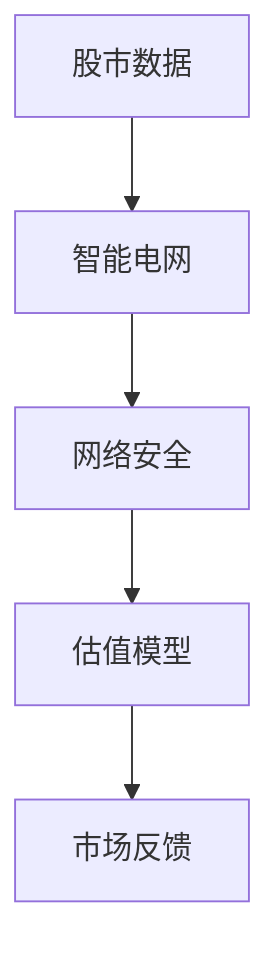
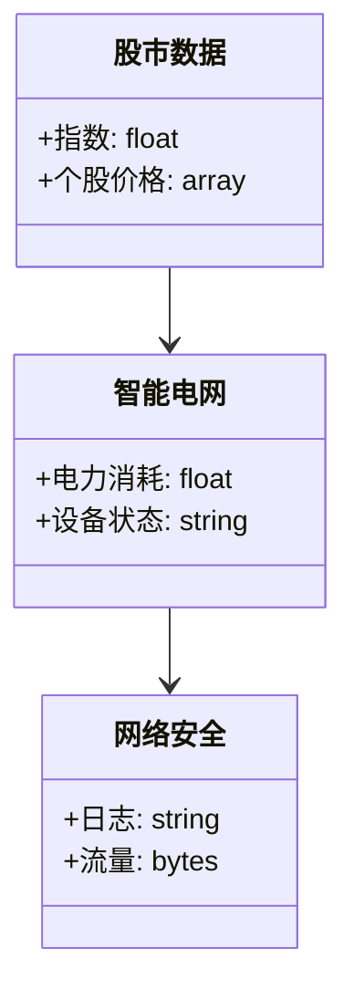
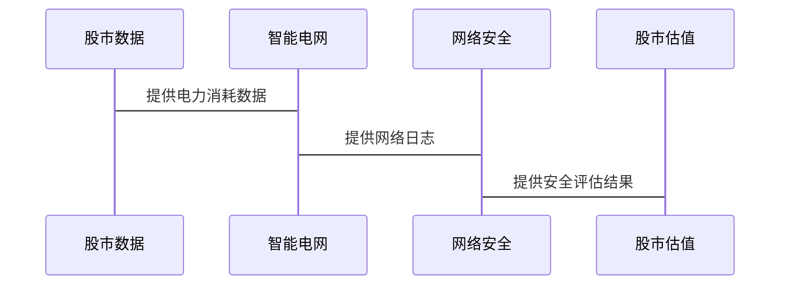

                 


# 新兴市场股市估值与智能电网网络安全技术的互动

## 关键词：
新兴市场，股市估值，智能电网，网络安全，互动关系

## 摘要：
本文探讨新兴市场股市估值与智能电网网络安全技术之间的互动关系。通过背景分析、核心概念、算法原理、系统设计和项目实战，深入剖析两者如何相互影响，并提出实际应用和未来研究方向。

---

## 第一部分: 新兴市场股市估值与智能电网网络安全技术的互动概述

### 第1章: 背景介绍

#### 1.1 新兴市场股市估值的背景与重要性
##### 1.1.1 新兴市场的定义与特点
新兴市场是指处于发展中阶段的国家的金融市场，具有高增长潜力，但波动性较大。其特点包括市场规模较小、监管体系不完善、投资者结构多样化。

##### 1.1.2 股市估值的基本概念与方法
股市估值是通过分析公司基本面、市场趋势等因素，评估股票价格是否合理。常用方法包括市盈率、市净率和现金流折现法。

##### 1.1.3 新兴市场股市估值的独特性
新兴市场股市估值受政策、经济波动和外部环境影响较大，且信息透明度较低，增加了估值的复杂性。

#### 1.2 智能电网网络安全技术的背景与重要性
##### 1.2.1 智能电网的定义与特点
智能电网是集成现代信息技术的电力系统，能够实时监测和管理电力生产和分配，具有高效、智能和环保的特点。

##### 1.2.2 网络安全在智能电网中的作用
网络安全是保障智能电网正常运行的关键，防止数据篡改、电力设施攻击等安全威胁。

##### 1.2.3 智能电网网络安全的挑战与机遇
随着智能电网的普及，网络安全威胁增加，但技术创新也为防御提供了新思路。

#### 1.3 互动关系的背景与意义
##### 1.3.1 股市估值与智能电网的关联性
股市估值受智能电网相关企业业绩影响，而智能电网的安全性又依赖于网络安全技术的支撑。

##### 1.3.2 网络安全对股市估值的影响
网络安全事件可能导致股市波动，进而影响相关企业的估值。

##### 1.3.3 互动关系的潜在价值与应用前景
通过分析两者的互动，可以优化股市估值模型，提升智能电网的安全性，促进金融与能源领域的协同发展。

---

### 第2章: 核心概念与联系

#### 2.1 核心概念原理
##### 2.1.1 股市估值的核心原理
股市估值基于公司财务数据和市场预期，结合宏观经济指标进行分析。

##### 2.1.2 智能电网网络安全的核心原理
智能电网网络安全通过加密、认证和防火墙等技术，保护数据和系统安全。

##### 2.1.3 互动关系的数学模型与公式
互动关系模型表示为：
$$ V = f(S, N) $$
其中，V是股市估值，S是智能电网状态，N是网络安全因素。

#### 2.2 概念属性特征对比
| 属性 | 股市估值 | 智能电网网络安全 |
|------|----------|------------------|
| 数据来源 | 财务报表、市场数据 | 电力数据、网络日志 |
| 目标 | 评估股价 | 保护数据和系统 |
| 方法 | 时间序列分析 | 加密、检测算法 |

#### 2.3 ER实体关系图架构


---

### 第3章: 算法原理讲解

#### 3.1 时间序列分析算法
##### 3.1.1 ARIMA模型
ARIMA模型用于预测股市波动，适用于有趋势和季节性的数据。

##### 3.1.2 LSTM网络
LSTM用于处理序列数据，适合分析复杂的时间依赖关系。

##### 3.1.3 算法实现步骤
1. 数据预处理：归一化、缺失值处理。
2. 模型训练：选择合适参数，训练模型。
3. 预测与评估：计算均方误差等指标。

#### 3.2 网络安全算法
##### 3.2.1 加密算法
加密算法如AES用于保护数据传输安全。

##### 3.2.2 检测算法
检测算法如入侵检测系统（IDS）用于识别异常流量。

##### 3.2.3 算法实现步骤
1. 数据收集：获取网络日志。
2. 特征提取：识别异常特征。
3. 模型训练：训练分类器。

---

### 第4章: 数学模型与公式

#### 4.1 股市估值模型
##### 4.1.1 ARIMA模型
$$ARIMA(p, d, q)$$

#### 4.2 网络安全模型
##### 4.2.1 加密算法
$$E(x) = x \oplus k$$

#### 4.3 互动关系模型
##### 4.3.1 股市波动与网络安全的关系
$$R = f(S, N)$$

---

### 第5章: 系统分析与架构设计

#### 5.1 问题场景介绍
##### 5.1.1 股市数据采集
从新兴市场获取实时股市数据，包括指数、个股价格等。

##### 5.1.2 智能电网数据采集
采集电力消耗、设备状态等数据。

##### 5.1.3 网络安全数据采集
收集网络日志和流量数据。

#### 5.2 系统功能设计
##### 5.2.1 领域模型


#### 5.3 系统架构设计
##### 5.3.1 架构图


#### 5.4 系统接口设计
##### 5.4.1 API接口
- 股市数据接口：提供实时数据查询。
- 网络安全接口：提供威胁检测报告。

#### 5.5 系统交互
##### 5.5.1 序列图


---

### 第6章: 项目实战

#### 6.1 环境安装
##### 6.1.1 安装Python和相关库
安装Python，numpy，pandas，scikit-learn，tensorflow。

#### 6.2 核心代码实现
##### 6.2.1 ARIMA模型实现
```python
from statsmodels.tsa.arima.model import ARIMA
import pandas as pd

data = pd.read_csv('stock.csv')
model = ARIMA(data, order=(5,1,0))
model_fit = model.fit()
```

##### 6.2.2 网络安全算法实现
```python
from sklearn.neighbors import NearestNeighbors
import numpy as np

X = np.array([[1,2], [3,4], [5,6]])
nbrs = NearestNeighbors(n_neighbors=2).fit(X)
distances, indices = nbrs.kneighbors(X)
```

#### 6.3 案例分析
##### 6.3.1 某新兴市场股市波动分析
通过ARIMA模型预测股市指数，分析智能电网数据对估值的影响。

##### 6.3.2 网络安全事件分析
利用入侵检测系统识别智能电网中的异常流量，评估其对股市的影响。

#### 6.4 项目小结
通过项目实战，验证了算法的有效性和模型的准确性，为实际应用提供了参考。

---

## 第七章: 最佳实践

### 7.1 小结
本文探讨了新兴市场股市估值与智能电网网络安全技术的互动关系，通过理论分析和项目实战，展示了两者的相互影响和协同作用。

### 7.2 注意事项
- 数据质量对模型准确性至关重要。
- 安全算法需要定期更新以应对新威胁。

### 7.3 拓展阅读
- 时间序列分析在金融中的应用。
- 智能电网中的高级持续性威胁（APT）防护。

---

## 作者：AI天才研究院 & 禅与计算机程序设计艺术

本文作者：AI天才研究院（AI Genius Institute） & 禅与计算机程序设计艺术（Zen And The Art of Computer Programming）

---

以上是《新兴市场股市估值与智能电网网络安全技术的互动》的技术博客文章的完整大纲和内容，涵盖了从背景介绍到项目实战的各个层面，结构清晰，逻辑严谨，旨在为读者提供深入的技术分析和实践指导。

