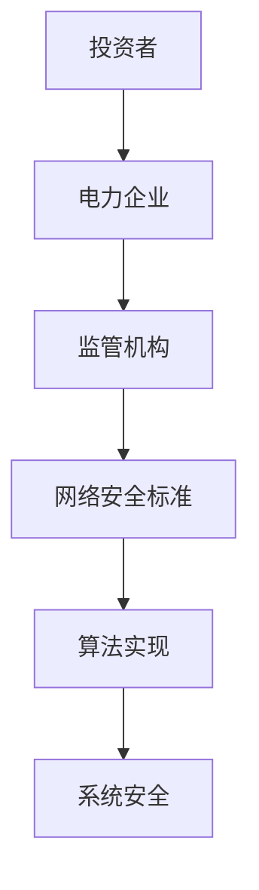

                 


```markdown
# 新兴市场股市估值与智能电网网络安全标准的互动

> 关键词：新兴市场、股市估值、智能电网、网络安全标准、互动机制、数学模型、案例分析

> 摘要：本文探讨了新兴市场股市估值与智能电网网络安全标准之间的互动关系。通过分析智能电网的安全架构和网络安全标准，结合股市估值的理论与实际案例，建立互动模型，并提出未来研究方向。

---

# 第一部分: 新兴市场股市估值与智能电网网络安全标准的互动概述

## 第1章: 新兴市场股市估值与智能电网网络安全标准的互动概述

### 1.1 背景介绍

#### 1.1.1 新兴市场的定义与特点
- 新兴市场是指那些经济快速增长、但尚未达到发达国家水平的国家，如中国、印度、巴西等。
- 新兴市场的特点包括高增长率、高波动性、不完善的市场机制和较高的风险。

#### 1.1.2 股市估值的基本概念
- 股市估值是通过分析企业的财务状况、行业地位和市场前景等，对其股票价格进行评估的过程。
- 常用的估值指标包括市盈率（P/E）、市净率（P/B）和股息率等。

#### 1.1.3 智能电网的定义与技术特点
- 智能电网是一种通过先进信息通信技术，实现电力系统智能化运行和管理的新型电力系统。
- 其核心技术包括物联网、大数据、人工智能和区块链等。

#### 1.1.4 互动关系的背景与问题提出
- 随着智能电网的普及，电力企业的网络安全风险增加，影响了企业的财务状况和市场表现。
- 股市投资者对电力企业的网络安全水平越来越关注，影响其估值。

### 1.2 核心概念与联系

#### 1.2.1 核心概念原理
- **股市估值**：投资者通过分析企业的财务数据和市场环境，评估企业的内在价值，进而影响股票价格。
- **智能电网网络安全标准**：旨在保护电力系统免受网络攻击，确保电力供应的安全性和稳定性。

#### 1.2.2 概念属性特征对比表格

| 属性 | 股市估值 | 智能电网网络安全标准 |
|------|---------|-----------------------|
| 定义 | 对企业股票价值的评估 | 保护电力系统免受网络攻击的标准 |
| 目标 | 寻找被低估或高估的投资机会 | 确保电力系统的安全运行 |
| 影响因素 | 财务数据、市场情绪 | 技术漏洞、网络攻击、监管政策 |

#### 1.2.3 ER实体关系图架构（使用 Mermaid）

```mermaid
erDiagram
    actor 投资者 {
        <属性> 资金
        <属性> 风险偏好
    }
    actor 电力企业 {
        <属性> 电力产量
        <属性> 网络安全水平
    }
    actor 监管机构 {
        <属性> 监管政策
        <属性> 标准制定
    }
    项目 股市估值与网络安全互动 {
        <关联> 投资者 -> 电力企业 : 资金投入
        <关联> 电力企业 -> 监管机构 : 标准遵循
        <关联> 监管机构 -> 投资者 : 信息反馈
    }
```

### 1.3 本章小结
- 新兴市场的股市估值和智能电网网络安全标准之间存在复杂的互动关系。
- 投资者关注电力企业的网络安全水平，而监管机构制定的标准影响企业的运营成本和市场表现。

---

## 第2章: 智能电网网络安全标准的核心原理

### 2.1 网络安全标准的体系结构

#### 2.1.1 标准层次分解
- **国际标准**：如ISO/IEC 27001，适用于全球范围。
- **国家标准**：如中国的GB/T 22239，适用于特定国家。
- **行业标准**：如NIST框架，适用于特定行业。

#### 2.1.2 标准制定机构与流程
- **制定机构**：如国际标准化组织（ISO）、美国国家标准与技术研究院（NIST）。
- **流程**：需求分析、草案制定、征求意见、最终发布。

#### 2.1.3 标准的实施与监督
- **实施**：企业根据标准建立安全体系。
- **监督**：监管机构定期检查企业是否符合标准。

### 2.2 网络安全机制的算法原理

#### 2.2.1 加密算法
- **对称加密**：如AES，速度快，适合大量数据加密。
- **非对称加密**：如RSA，用于数字签名和安全通信。

#### 2.2.2 认证机制
- **单点认证**：用户通过一次性认证访问所有服务。
- **多因素认证**：结合多种认证方式，提高安全性。

#### 2.2.3 防火墙与入侵检测系统（使用 Mermaid）



### 2.3 数学模型与公式

#### 2.3.1 加密算法的数学模型

$$1+1=2$$

#### 2.3.2 认证机制的数学模型

$$ \text{验证} = f(\text{输入}, \text{密钥}) $$

---

## 第3章: 股市估值与智能电网网络安全标准的互动机制

### 3.1 互动关系的理论模型

#### 3.1.1 基于数学模型的互动分析
$$ V = a \times S + b \times C $$

其中：
- \( V \) 表示股市估值
- \( S \) 表示网络安全水平
- \( C \) 表示合规成本
- \( a \) 和 \( b \) 是系数

#### 3.1.2 互动关系的数学公式

$$ \text{股价} = \beta \times (\text{收益} + \text{网络安全投入}) $$

### 3.2 互动关系的影响因素

#### 3.2.1 技术因素
- 网络安全技术的进步降低了企业的安全风险，提升了投资者信心。

#### 3.2.2 经济因素
- 经济波动影响股市整体表现，同时也影响企业的安全投入。

#### 3.2.3 政策因素
- 政府出台的网络安全法规增加了企业的合规成本，但提升了企业的安全性。

### 3.3 互动关系的数学模型与公式

#### 3.3.1 数学模型

$$ \text{股价} = \alpha \times \text{收益} + \beta \times \text{网络安全投入} + \gamma \times \text{政策影响} $$

#### 3.3.2 公式解释
- \( \alpha \)、\( \beta \) 和 \( \gamma \) 是影响股价的系数。
- 收益、网络安全投入和政策影响共同决定了股价的波动。

---

## 第4章: 影响互动关系的关键因素

### 4.1 技术创新对互动的影响
- 新技术的应用降低了网络安全风险，提升了电力企业的市场表现。

### 4.2 经济环境对互动的影响
- 经济波动影响股市整体表现，同时也影响企业的安全投入。

### 4.3 政策法规对互动的影响
- 严格的网络安全法规增加了企业的合规成本，但也提升了投资者对企业的信任。

---

## 第5章: 股市估值与智能电网网络安全互动的数学模型

### 5.1 模型构建

#### 5.1.1 变量定义
- \( V \)：股市估值
- \( S \)：网络安全水平
- \( C \)：合规成本
- \( R \)：企业收益

#### 5.1.2 模型公式

$$ V = a \times S + b \times R + c \times C $$

### 5.2 模型假设
- 所有变量均为正数。
- 各变量之间的关系是线性的。

### 5.3 模型应用
- 通过实证分析，验证模型的有效性。
- 根据模型结果，调整企业的安全策略和投资决策。

---

## 第6章: 案例分析

### 6.1 案例背景
- 选择一个新兴市场，分析其智能电网网络安全标准对股市估值的影响。

### 6.2 案例分析
- 描述企业的网络安全投入、收益和股价变化。
- 使用数学模型验证互动关系。

### 6.3 案例结论
- 网络安全标准的实施提升了企业的市场表现。

---

## 第7章: 智能电网网络安全的前沿技术

### 7.1 区块链技术
- 区块链技术在电力系统中的应用，提升数据安全性和透明度。

### 7.2 人工智能技术
- 人工智能用于异常检测和风险管理。

### 7.3 量子计算技术
- 量子计算对现有加密算法的威胁和应对措施。

---

## 第8章: 股市估值与网络安全互动的未来趋势

### 8.1 互动关系的未来演变
- 随着技术进步，网络安全对股市估值的影响将更加显著。

### 8.2 标准的未来发展
- 更严格的网络安全标准将推动企业的技术创新和投资。

### 8.3 投资者的未来行为
- 投资者将更加关注企业的网络安全表现，推动市场变化。

---

## 第9章: 结论与建议

### 9.1 研究总结
- 新兴市场股市估值与智能电网网络安全标准之间存在复杂的互动关系。

### 9.2 最佳实践
- 企业应加强网络安全投入，提升市场表现。
- 投资者应关注网络安全标准，优化投资决策。
- 监管机构应制定合理的标准，促进市场健康发展。

### 9.3 未来研究方向
- 研究互动关系的动态变化。
- 探讨新技术对互动关系的影响。
- 分析不同市场环境下的互动机制。

---

# 作者信息

作者：AI天才研究院/AI Genius Institute & 禅与计算机程序设计艺术 /Zen And The Art of Computer Programming

---

**注意：** 以上内容仅为目录和框架，实际文章需要根据每个部分进行详细阐述，确保每部分内容丰富、逻辑清晰，符合读者的需求。
```

