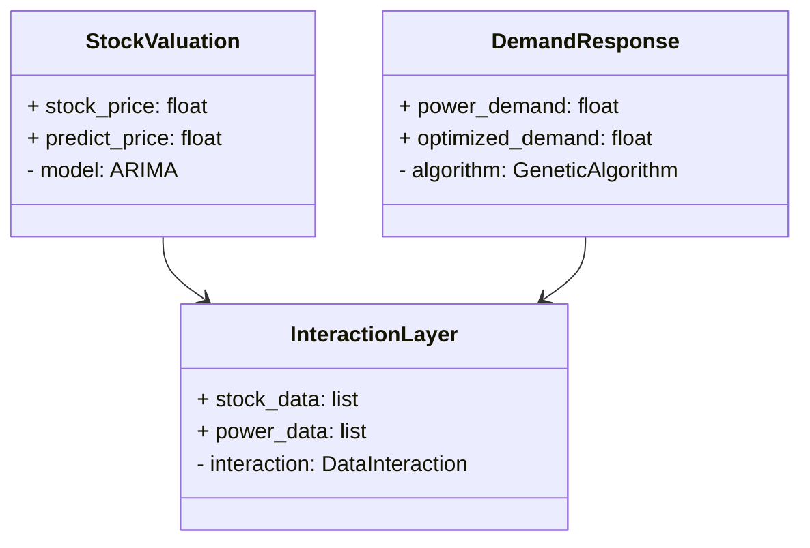
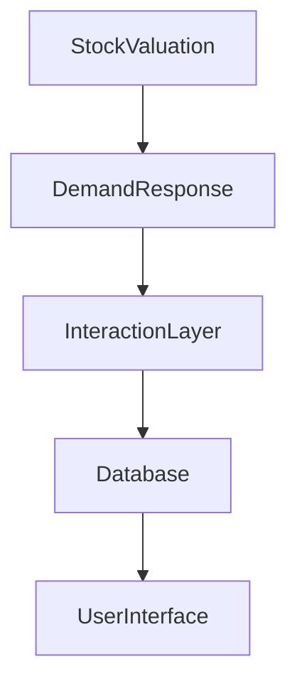
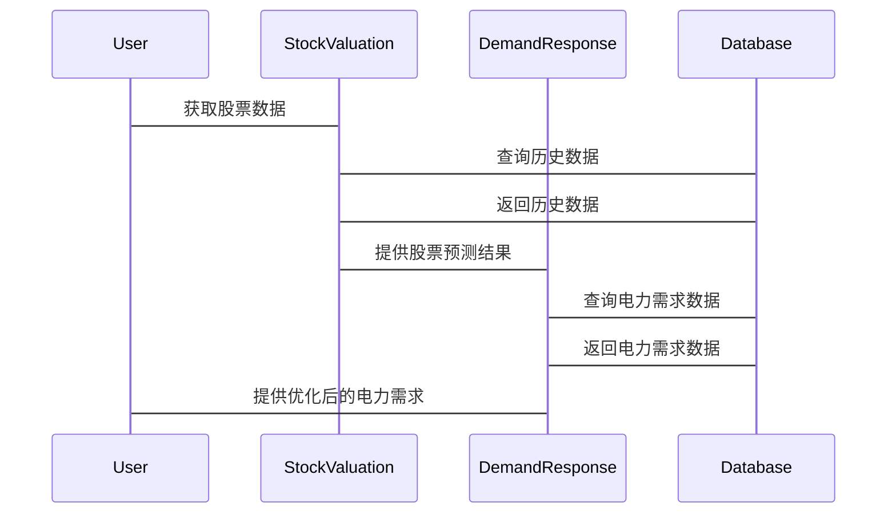

                 


# 新兴市场股市估值与智能电网需求响应技术的互动

## 关键词：新兴市场，股市估值，智能电网，需求响应，技术互动

## 摘要：本文探讨新兴市场股市估值与智能电网需求响应技术之间的互动关系。通过分析股市估值的核心概念、智能电网需求响应技术的原理，以及两者在数据驱动和算法优化方面的协同作用，揭示两者在技术和实践中的互动机制。结合数学模型、算法实现和系统架构设计，本文旨在为新兴市场的金融和技术领域提供理论支持和实践指导。

---

## 第一章: 新兴市场股市估值与智能电网需求响应技术的背景介绍

### 1.1 问题背景与问题描述
#### 1.1.1 新兴市场的定义与特点
- 新兴市场的经济特征：快速经济增长、产业结构转型、金融市场发展不成熟。
- 新兴市场的股市特点：波动性大、信息不对称、投资者行为复杂。

#### 1.1.2 股市估值的核心概念
- 股市估值的定义：对股票内在价值的估计，基于基本面分析和技术分析。
- 传统估值方法：市盈率、市净率、股息率等。
- 新兴市场的特殊性：高波动性、信息不透明、政策影响大。

#### 1.1.3 智能电网需求响应技术的核心概念
- 智能电网的定义：通过信息技术和自动化技术优化电力系统运行。
- 需求响应技术：通过用户侧的互动调节电力需求，平衡电力供需。
- 智能电网的特点：实时监测、动态调节、高效能。

### 1.2 互动关系的边界与外延
#### 1.2.1 股市估值与智能电网的互动机制
- 股市波动对电力需求的影响：股市上涨可能增加企业用电需求，股市下跌可能减少用电需求。
- 电力价格对股市的影响：电价波动可能影响企业的生产成本和盈利预期。

#### 1.2.2 互动关系的边界与限制
- 数据获取的难度：新兴市场数据不完整、信息不对称。
- 技术实现的难度：需求响应技术的实时性和准确性要求高。

#### 1.2.3 互动关系的外延与扩展
- 从局部市场到整体市场的扩展：从单个新兴市场到多个新兴市场的互动。
- 从短期预测到长期预测的扩展：从每日电力需求预测到季度或年度预测。

### 1.3 核心概念与核心要素
#### 1.3.1 股市估值的核心要素
- 财务指标：收入、利润、负债。
- 市场情绪：投资者情绪、市场信心。

#### 1.3.2 智能电网需求响应的核心要素
- 电力需求数据：实时电力需求、用户用电行为。
- 电价机制：分时电价、峰谷电价。
- 用户响应策略：价格敏感性、用户反馈。

#### 1.3.3 互动关系的核心要素
- 数据共享：股市数据与电力需求数据的关联。
- 技术协同：需求响应算法与股市预测模型的协同优化。

## 第二章: 核心概念与联系

### 2.1 股市估值的核心概念与原理
#### 2.1.1 时间序列分析模型
- ARIMA模型：自回归积分滑动平均模型。
- GARCH模型：广义自回归条件异方差模型。

#### 2.1.2 机器学习算法在股市估值中的应用
- 支持向量回归（SVR）：非线性回归模型。
- 随机森林：基于树的集成模型。

#### 2.1.3 基于深度学习的股市预测模型
- LSTM网络：长短期记忆网络。
- Transformer模型：基于注意力机制的序列模型。

### 2.2 需求响应优化的算法原理
#### 2.2.1 基于遗传算法的需求响应优化
- 编码：将电力需求转化为编码。
- 适应度函数：衡量电力需求优化的效果。
- 选择、交叉和变异操作。

#### 2.2.2 基于强化学习的需求响应策略
- 状态空间：电力需求、电价。
- 动作空间：调整用电量。
- 奖励函数：优化用电成本。

#### 2.2.3 基于动态规划的需求响应优化
- 状态转移方程：电力需求随时间的变化。
- 最优策略：最小化电力成本。

### 2.3 核心概念的联系与对比
#### 2.3.1 股市估值与需求响应技术的联系
- 数据共享：股市数据与电力需求数据的关联。
- 技术协同：需求响应算法与股市预测模型的协同优化。

#### 2.3.2 核心概念的对比分析
| 核心概念 | 股市估值 | 需求响应技术 |
|----------|----------|---------------|
| 数据来源 | 财务报表、市场情绪 | 电力需求、电价 |
| 技术方法 | 时间序列分析、机器学习 | 遗传算法、强化学习 |
| 应用目标 | 估计股票价值 | 优化电力需求 |

#### 2.3.3 股市估值与需求响应技术的协同优化
- 数据驱动：利用股市数据优化电力需求预测。
- 技术协同：结合需求响应算法优化电力成本。

## 第三章: 算法原理与数学模型

### 3.1 股市估值的算法原理
#### 3.1.1 时间序列分析模型
$$ ARIMA(p, d, q) = 0 $$

#### 3.1.2 机器学习算法
- 支持向量回归（SVR）：非线性回归模型。
- 随机森林：基于树的集成模型。

#### 3.1.3 基于深度学习的股市预测模型
- LSTM网络：长短期记忆网络。
- Transformer模型：基于注意力机制的序列模型。

### 3.2 需求响应优化的算法原理
#### 3.2.1 基于遗传算法的需求响应优化
$$ \min \sum_{t=1}^{T} (D_t - R_t)^2 $$

#### 3.2.2 基于强化学习的需求响应策略
- 状态空间：电力需求、电价。
- 动作空间：调整用电量。
- 奖励函数：优化用电成本。

#### 3.2.3 基于动态规划的需求响应优化
- 状态转移方程：电力需求随时间的变化。
- 最优策略：最小化电力成本。

### 3.3 数学模型与公式
#### 3.3.1 时间序列模型的数学表达
$$ ARIMA(p, d, q) = 0 $$

#### 3.3.2 需求响应优化的数学模型
$$ \min \sum_{t=1}^{T} (D_t - R_t)^2 $$

## 第四章: 系统分析与架构设计

### 4.1 问题场景介绍
- 新兴市场股市波动对电力需求的影响。
- 智能电网需求响应技术的应用场景。

### 4.2 系统功能设计
#### 4.2.1 领域模型类图


#### 4.2.2 系统架构设计


#### 4.2.3 系统接口设计
- 数据接口：股票数据接口、电力需求接口。
- 控制接口：需求响应控制接口、股市预测接口。

#### 4.2.4 系统交互设计


## 第五章: 项目实战与最佳实践

### 5.1 环境安装
- Python环境：安装Jupyter Notebook、NumPy、Pandas、Scikit-learn、TensorFlow、Keras。
- 数据库：安装MySQL或MongoDB。
- 开发工具：安装PyCharm或VS Code。

### 5.2 核心代码实现
#### 5.2.1 股市估值代码实现
```python
import numpy as np
from sklearn.metrics import mean_squared_error
from statsmodels.tsa.arima_model import ARIMA

def stock_valuation_model(data, order=(5,1,0)):
    model = ARIMA(data, order=order)
    model_fit = model.fit()
    forecast = model_fit.forecast(steps=5)
    return forecast
```

#### 5.2.2 需求响应优化代码实现
```python
import numpy as np
from sklearn.model_selection import train_test_split
from sklearn.ensemble import RandomForestRegressor

def demand_response_optimization(data, test_size=0.2):
    X_train, X_test, y_train, y_test = train_test_split(data[['time', 'price']], data['demand'])
    model = RandomForestRegressor(n_estimators=100, random_state=42)
    model.fit(X_train, y_train)
    y_pred = model.predict(X_test)
    return y_pred
```

### 5.3 案例分析与详细解读
#### 5.3.1 股市估值案例
- 数据来源：新兴市场股市数据。
- 模型训练：使用ARIMA模型训练。
- 结果分析：预测结果与实际数据对比。

#### 5.3.2 需求响应优化案例
- 数据来源：电力需求数据。
- 模型训练：使用随机森林回归模型训练。
- 结果分析：预测结果与实际数据对比。

### 5.4 最佳实践 tips
- 数据质量：确保数据准确性和完整性。
- 模型选择：根据数据特点选择合适的模型。
- 系统优化：定期更新模型参数和数据。

## 第六章: 小结与展望

### 6.1 小结
- 本文探讨了新兴市场股市估值与智能电网需求响应技术的互动关系。
- 提出了基于数据驱动和算法优化的协同方法。

### 6.2 展望
- 未来研究方向：新兴市场股市波动对电力需求的长期影响。
- 技术发展趋势：深度学习在股市估值和需求响应技术中的应用。

---

## 作者：AI天才研究院/AI Genius Institute & 禅与计算机程序设计艺术 /Zen And The Art of Computer Programming

---

**注：以上目录结构和内容仅为示例，具体内容需根据实际研究和需求进行调整和补充。**

