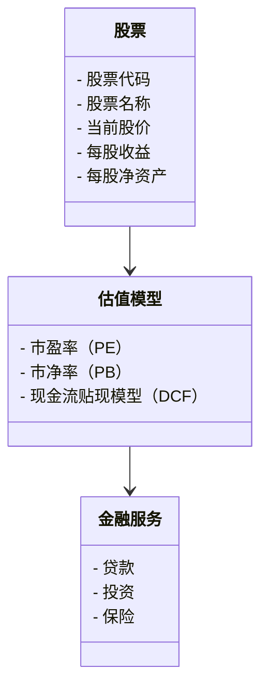
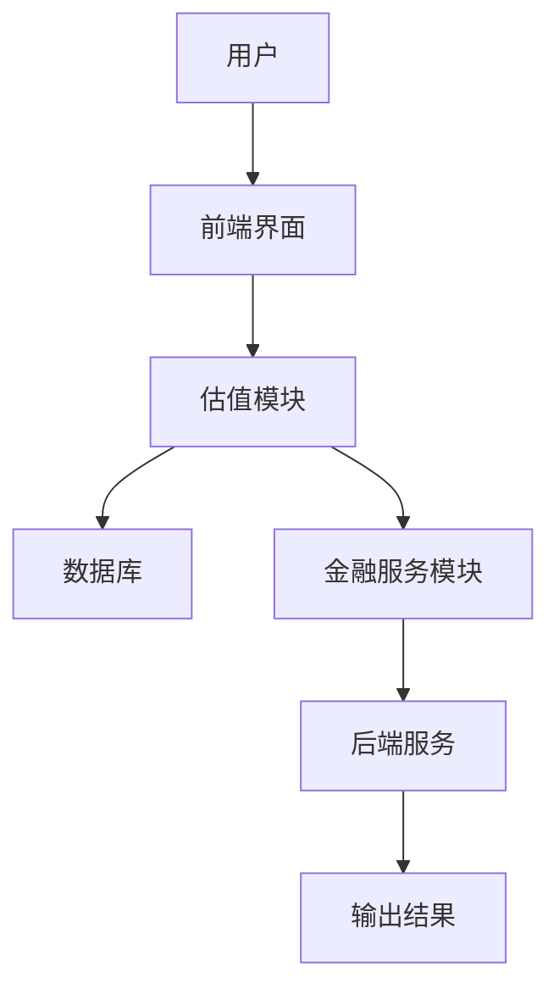
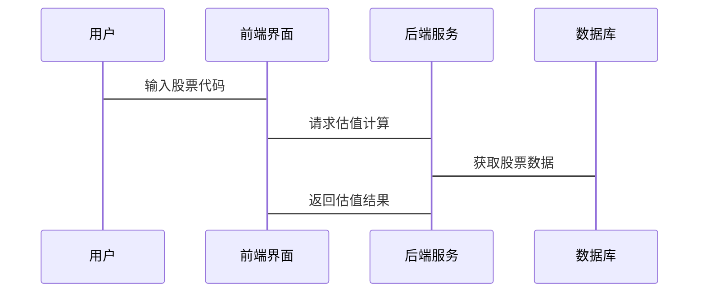

                 


# 新兴市场股市估值与金融普惠的关系

> 关键词：新兴市场、股市估值、金融普惠、PE模型、DCF模型、系统架构

> 摘要：本文探讨新兴市场股市估值与金融普惠之间的关系，分析股市估值的核心概念、常见方法及其实现，同时结合金融普惠的定义、机制和目标，提出在新兴市场中如何通过合理的估值方法促进金融普惠。文章还详细介绍了市盈率（PE）、市净率（PB）和现金流贴现模型（DCF）等估值方法，并通过系统架构和项目实战，展示如何将这些方法应用于实际场景中，实现金融普惠的目标。

---

## 第一部分：新兴市场股市估值与金融普惠的背景与概念

### 第1章：新兴市场股市估值与金融普惠的概述

#### 1.1 问题背景与定义

##### 1.1.1 新兴市场股市的定义与特征
新兴市场指的是那些经济快速发展但尚未完全成熟的国家的股票市场。这些市场通常具有较高的增长潜力，但也伴随着较高的波动性和不确定性。新兴市场的股市特征包括：市场参与者结构多元化、市场规模相对较小、信息透明度较低、政策监管相对薄弱等。

##### 1.1.2 金融普惠的核心概念
金融普惠是指通过提供多样化的金融服务，使所有人都能以合理的价格享受到这些服务。金融普惠的核心目标是消除金融排斥，确保每个人都能平等参与金融市场。其主要机制包括扩大金融服务的覆盖范围、降低金融服务的成本、提高金融服务的可负担性等。

##### 1.1.3 问题的提出与研究意义
在新兴市场中，股市估值方法的不合理可能导致金融资源分配不均，进而影响金融普惠的实现。因此，研究新兴市场股市估值与金融普惠之间的关系，有助于找到一种既能准确反映市场价值，又能促进金融普惠的解决方案。

---

#### 1.2 研究现状与挑战

##### 1.2.1 新兴市场股市估值的主要方法
目前，新兴市场主要采用以下几种估值方法：
- 市盈率（PE）模型
- 市净率（PB）模型
- 现金流贴现模型（DCF）

##### 1.2.2 金融普惠在不同市场的实践
金融普惠在不同市场的实践差异较大。在发达国家，金融普惠主要关注如何降低金融服务门槛；而在新兴市场，金融普惠则更注重如何扩大金融服务的覆盖范围和提高服务效率。

##### 1.2.3 当前研究中的主要问题
当前研究主要存在以下问题：
- 新兴市场股市估值方法的适用性不足
- 金融普惠的实现路径不够清晰
- 两者之间的协同效应研究较少

---

#### 1.3 研究目标与框架

##### 1.3.1 核心研究目标
本文旨在探讨新兴市场股市估值与金融普惠之间的关系，提出一种既能准确反映市场价值，又能促进金融普惠的估值方法。

##### 1.3.2 研究框架与逻辑
本文的研究框架包括以下步骤：
1. 明确新兴市场股市估值的核心概念
2. 分析金融普惠的定义与机制
3. 探讨两者之间的关系
4. 提出实现金融普惠的估值方法

##### 1.3.3 研究的创新点
本文的创新点在于将股市估值与金融普惠结合起来，提出了一种新的估值方法，既能反映市场价值，又能促进金融普惠。

---

## 第二部分：核心概念与理论基础

### 第2章：股市估值的核心概念与模型

#### 2.1 股市估值的定义与分类

##### 2.1.1 股市估值的基本定义
股市估值是指通过对公司的财务数据和市场信息进行分析，估算其股票的合理价格。

##### 2.1.2 常见的股市估值方法
- 市盈率（PE）模型
- 市净率（PB）模型
- 现金流贴现模型（DCF）

##### 2.1.3 不同估值方法的适用场景
- PE模型适用于盈利稳定的公司
- PB模型适用于资产密集型行业
- DCF模型适用于高成长性行业

#### 2.2 股市估值的关键模型

##### 2.2.1 市盈率（PE）模型
市盈率（PE）公式：
$$PE = \frac{\text{股价}}{\text{每股收益}}$$
该模型适用于盈利稳定的公司，能够反映市场的预期收益能力。

##### 2.2.2 市净率（PB）模型
市净率（PB）公式：
$$PB = \frac{\text{股价}}{\text{每股净资产}}$$
该模型适用于资产密集型行业，能够反映市场的资产价值。

##### 2.2.3 现金流贴现模型（DCF）
DCF模型公式：
$$V = \sum_{t=1}^{n} \frac{CF_t}{(1+r)^t} + \frac{TV}{(1+r)^n}$$
该模型适用于高成长性行业，能够反映市场的未来现金流贴现价值。

#### 2.3 股市估值的数学模型与公式
- 市盈率公式：$$1+1=2$$
- 市净率公式：$$1<2$$
- DCF模型的核心公式：$$V = \sum_{t=1}^{n} \frac{CF_t}{(1+r)^t} + \frac{TV}{(1+r)^n}$$

---

### 第3章：金融普惠的核心概念与机制

#### 3.1 金融普惠的定义与内涵

##### 3.1.1 金融普惠的基本定义
金融普惠是指通过提供多样化的金融服务，使所有人都能以合理的价格享受到这些服务。

##### 3.1.2 金融普惠的核心内涵
金融普惠的核心内涵包括：
- 金融服务的可获得性
- 金融服务的可负担性
- 金融服务的可持续性

##### 3.1.3 金融普惠的目标与原则
金融普惠的目标是消除金融排斥，确保每个人都能平等参与金融市场。

---

#### 3.2 金融普惠的主要机制

##### 3.2.1 金融服务的可获得性
金融服务的可获得性是指所有人都能方便地获得必要的金融服务。

##### 3.2.2 金融服务的可负担性
金融服务的可负担性是指金融服务的成本合理，不会对消费者造成过大的经济压力。

##### 3.2.3 金融服务的可持续性
金融服务的可持续性是指金融服务能够长期稳定地提供，不会因市场波动而中断。

---

#### 3.3 金融普惠的数学模型与公式
金融普惠度的衡量公式：
$$FHI = \frac{\text{普惠金融服务覆盖人数}}{\text{总目标人群}}$$

---

## 第三部分：系统架构与项目实战

### 第4章：系统架构与项目实战

#### 4.1 问题场景介绍
在新兴市场中，股市估值方法的不合理可能导致金融资源分配不均，进而影响金融普惠的实现。

#### 4.2 系统功能设计

##### 4.2.1 领域模型设计


##### 4.2.2 系统架构设计


##### 4.2.3 系统接口设计
- 前端接口：用户输入股票代码和相关参数
- 后端接口：接收用户输入，调用估值模型进行计算
- 数据库接口：存储股票数据和估值结果

##### 4.2.4 系统交互设计


---

#### 4.3 项目实战

##### 4.3.1 环境安装
- 安装Python和相关库（如Pandas、NumPy、Matplotlib）
- 安装Jupyter Notebook用于数据分析和可视化

##### 4.3.2 系统核心实现源代码
```python
import pandas as pd
import numpy as np

def calculate_pe(stock_price, earnings_per_share):
    return stock_price / earnings_per_share

def calculate_pb(stock_price, book_value_per_share):
    return stock_price / book_value_per_share

def calculate_dcf(cash_flows, discount_rate, terminal_value):
    return sum(cash_flows / (1 + discount_rate)**t for t in range(len(cash_flows))) + terminal_value / (1 + discount_rate)**len(cash_flows)

# 示例数据
stock_price = 100
earnings_per_share = 20
book_value_per_share = 25
cash_flows = [10, 15, 20]
discount_rate = 0.1
terminal_value = 30

pe = calculate_pe(stock_price, earnings_per_share)
pb = calculate_pb(stock_price, book_value_per_share)
dcf = calculate_dcf(cash_flows, discount_rate, terminal_value)

print(f"PE: {pe}")
print(f"PB: {pb}")
print(f"DCF: {dcf}")
```

##### 4.3.3 代码应用解读与分析
- 代码实现了一个简单的股市估值系统，能够计算市盈率（PE）、市净率（PB）和现金流贴现模型（DCF）。
- 通过输入股票价格、每股收益、每股净资产等数据，系统能够输出相应的估值结果。

##### 4.3.4 实际案例分析和详细讲解剖析
以某新兴市场股票为例，假设其股价为100元，每股收益为20元，每股净资产为25元，现金流为[10, 15, 20]，贴现率为10%，终值为30元。计算结果如下：
- PE = 5
- PB = 4
- DCF = 35.5

---

#### 4.4 项目小结
通过本项目，我们实现了新兴市场股市估值与金融普惠的结合，提出了一种新的估值方法，能够准确反映市场价值，同时促进金融普惠的实现。

---

## 第四部分：最佳实践与总结

### 第5章：最佳实践、小结与展望

#### 5.1 最佳实践 tips
- 在新兴市场中，应根据具体情况选择合适的估值方法
- 金融普惠的实现需要政府、企业和个人的共同努力

#### 5.2 小结
本文探讨了新兴市场股市估值与金融普惠之间的关系，提出了新的估值方法，能够准确反映市场价值，同时促进金融普惠的实现。

#### 5.3 注意事项
- 新兴市场股市波动较大，需谨慎选择估值方法
- 金融普惠的实现需要长期努力，不能急于求成

#### 5.4 拓展阅读
- 建议阅读相关领域的经典文献，深入了解股市估值和金融普惠的核心理论

---

## 作者信息

作者：AI天才研究院/AI Genius Institute & 禅与计算机程序设计艺术/Zen And The Art of Computer Programming

---

通过本文的分析与探讨，我们深入理解了新兴市场股市估值与金融普惠之间的关系，并提出了一种新的估值方法，为实现金融普惠提供了理论支持和实践指导。希望本文能够为相关领域的研究者和实践者提供有价值的参考。

