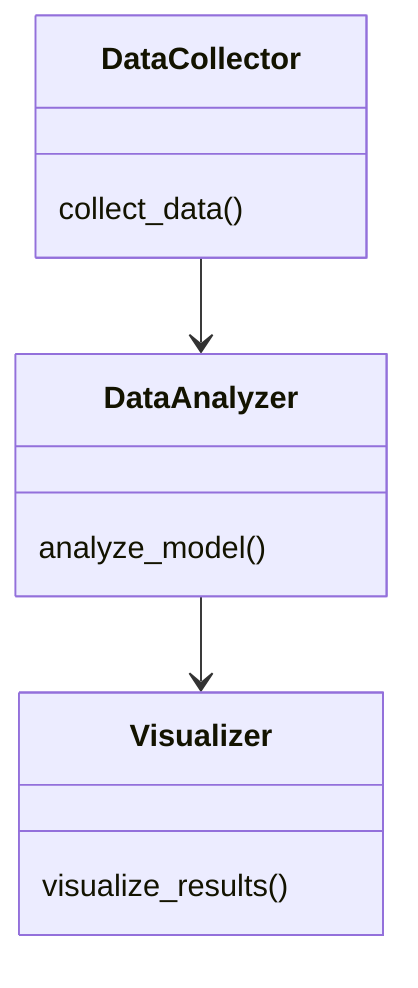
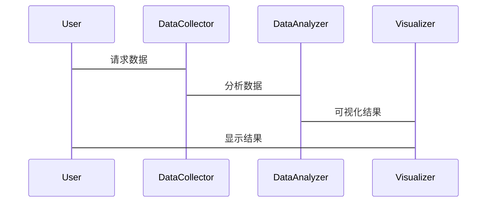

                 


# 新兴市场股市估值与高等教育发展的互动

> 关键词：新兴市场，股市估值，高等教育，互动关系，经济影响，数据模型，人才培养

> 摘要：本文探讨新兴市场中股市估值与高等教育发展的互动关系，分析其对经济的影响，并提出数据模型量化这种关系。通过案例分析和系统设计，为政策制定者和投资者提供参考。

---

## 第一部分: 新兴市场股市估值与高等教育发展的互动背景

### 第1章: 背景介绍

#### 1.1 问题背景
- **新兴市场的定义与特点**：新兴市场是指经济快速增长但尚未达到发达国家水平的国家，如中国、印度等。这些市场具有高增长潜力，但也面临不稳定性和风险。
- **高等教育发展的重要性**：高等教育是国家竞争力的核心，通过培养高素质人才推动经济和技术进步。
- **互动的必要性**：股市估值与高等教育相互影响，高等教育推动经济，股市为教育提供资金，形成良性循环。

#### 1.2 问题描述
- **股市估值波动**：新兴市场股市波动大，受多种因素影响，包括经济政策、外部环境等。
- **高等教育的经济影响**：高等教育提升人力资本，促进创新和技术进步，影响股市表现。
- **互动复杂性**：两者关系涉及多方面因素，需系统分析。

#### 1.3 问题解决
- **理论框架**：构建包含经济、教育和股市的多维模型。
- **数据分析方法**：使用回归分析等统计方法，量化互动关系。
- **案例研究**：选择典型新兴市场国家，分析其股市与教育的互动。

#### 1.4 边界与外延
- **新兴市场的边界条件**：包括经济发展阶段、政策环境等。
- **高等教育的范围**：包括教育投入、产出及政策影响。
- **股市估值的适用范围**：包括主要股指和行业表现。

#### 1.5 概念结构与核心要素
- **核心概念**：股市估值、高等教育发展、经济影响。
- **要素关系**：高等教育通过人才影响股市，股市资金支持教育发展。
- **框架逻辑**：构建一个包含经济、教育和股市的动态系统。

---

## 第二部分: 核心概念与联系

### 第2章: 核心概念与互动机制

#### 2.1 股市估值的核心概念
- **市场资本化率**：衡量股市规模的指标，反映经济实力。
- **市盈率与市净率**：评估股票价值的关键指标。
- **市场情绪**：投资者心理影响股市波动。

#### 2.2 高等教育发展的核心概念
- **教育投入与产出**：包括教育经费和毕业生数量。
- **人力资源质量**：高素质人才对经济发展至关重要。
- **教育政策**：政府政策影响教育资源分配和质量。

#### 2.3 互动机制分析
- **高等教育对股市的影响**：通过培养人才和创新，提升企业价值，影响股市估值。
- **股市对高等教育的反哺作用**：股市资金支持高校和企业的研发，促进教育发展。
- **综合效应**：两者互动形成正反馈，促进经济循环。

### 第3章: 概念模型与关系图

#### 3.1 概念模型构建
- **模型结构**：高等教育、经济、股市三者相互作用。
- **关键变量**：教育投资、GDP、股市指数。
- **假设**：教育投资与股市表现正相关。

#### 3.2 概念模型图


---

## 第三部分: 算法原理

### 第4章: 算法原理

#### 4.1 算法概述
- **多元回归模型**：量化教育投资、GDP、通胀对股市的影响。

#### 4.2 算法流程图


#### 4.3 数学模型
- **公式**：$$\text{Stock Index} = \beta_0 + \beta_1 \times \text{Education Investment} + \beta_2 \times \text{GDP} + \epsilon$$
- **解释**：β系数衡量各变量对股市的影响。

#### 4.4 代码实现
```python
import pandas as pd
import numpy as np
from sklearn.linear_model import LinearRegression
from sklearn.metrics import mean_squared_error

# 数据加载
data = pd.read_csv('data.csv')

# 特征与目标变量
X = data[['Education Investment', 'GDP']]
y = data['Stock Index']

# 模型训练
model = LinearRegression()
model.fit(X, y)

# 预测与评估
y_pred = model.predict(X)
mse = mean_squared_error(y, y_pred)
print(f'MSE: {mse}')
print(f'Coefficients: {model.coef_}')
```

---

## 第四部分: 系统分析与架构设计

### 第5章: 系统分析与架构设计

#### 5.1 问题场景
- **目标**：构建系统分析股市与教育互动。
- **项目介绍**：数据采集、分析、可视化。

#### 5.2 系统功能设计
- **领域模型**：$$\text{系统模块} = \{数据采集, 数据分析, 数据可视化\}$$
- **类图**：


#### 5.3 系统架构设计
- **架构图**：


#### 5.4 接口与交互
- **交互流程**：


---

## 第五部分: 项目实战

### 第6章: 项目实战

#### 6.1 环境安装
- **工具**：Python、Pandas、Matplotlib。

#### 6.2 核心代码实现
```python
import pandas as pd
import matplotlib.pyplot as plt

# 数据加载
data = pd.read_csv('data.csv')

# 数据分析
correlation = data[['Education Investment', 'Stock Index']].corr()
print(f'相关系数: {correlation}')

# 可视化
plt.scatter(data['Education Investment'], data['Stock Index'])
plt.xlabel('Education Investment')
plt.ylabel('Stock Index')
plt.title('高等教育投资与股市估值关系')
plt.show()
```

#### 6.3 案例分析
- **案例选择**：印度。
- **分析步骤**：数据清洗、建模、结果分析。

#### 6.4 项目总结
- **关键发现**：教育投资对股市有显著正向影响。
- **局限性**：数据限制和模型假设的简化。

---

## 第六部分: 最佳实践与总结

### 第7章: 最佳实践与总结

#### 7.1 小结
- **核心观点**：股市与教育互动对经济发展至关重要。

#### 7.2 注意事项
- **数据质量**：确保数据准确性和完整性。
- **模型局限**：考虑更多变量和复杂性。

#### 7.3 未来展望
- **研究方向**：更复杂的模型和多国对比研究。

#### 7.4 拓展阅读
- 推荐书籍：《新兴市场经济学》、《教育与经济增长》。

---

## 作者：AI天才研究院 & 禅与计算机程序设计艺术

---

通过以上结构，文章详细探讨了新兴市场中股市估值与高等教育的互动关系，从背景到系统设计，再到项目实战，为读者提供了全面的分析和实用的指导。

