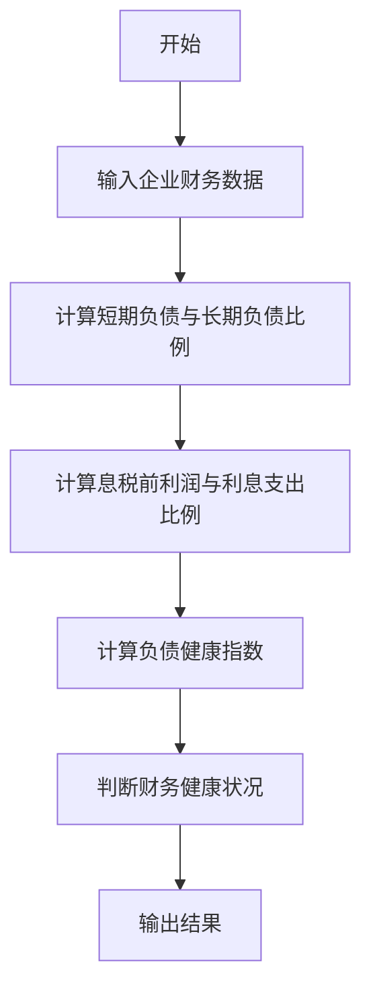
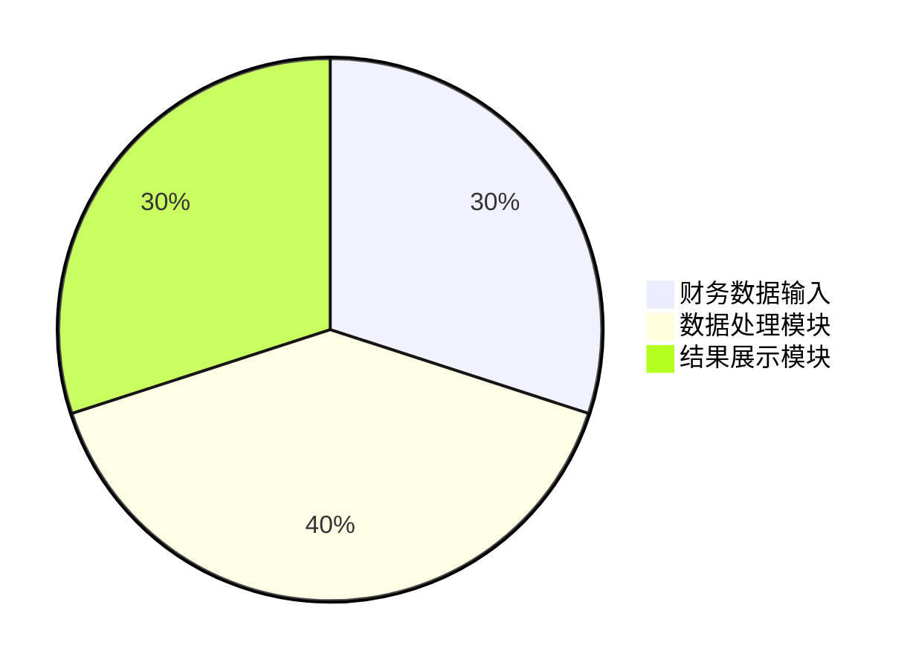
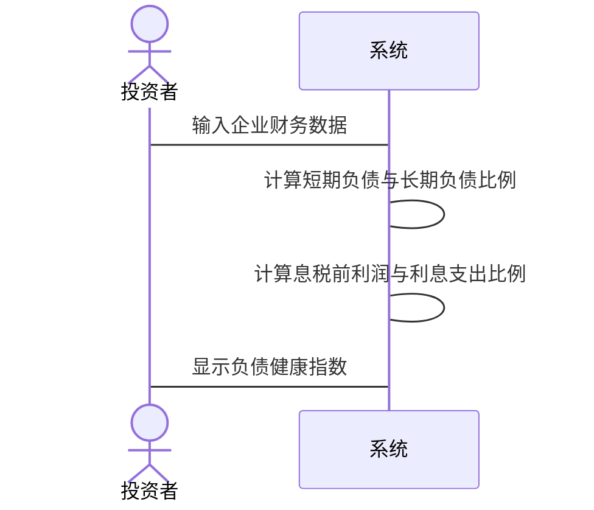

                 


# 无重大长期债务：巴菲特投资标准之一

**关键词：** 巴菲特投资标准，无重大长期债务，财务健康，风险管理，企业评估，投资策略

**摘要：**  
本文深入探讨了巴菲特投资理念中的核心标准之一——“无重大长期债务”。通过分析财务健康的核心指标、数学模型与算法原理，结合系统架构设计和实际案例分析，本文详细阐述了如何通过“无重大长期债务”这一标准来评估企业的财务健康状况，从而为投资者提供科学的决策依据。文章内容涵盖背景介绍、核心概念、算法模型、系统架构、项目实战等多个方面，为读者提供全面而深入的分析。

---

## 第一部分: 巴菲特投资标准之“无重大长期债务”的背景与核心概念

### 第1章: 巴菲特投资标准之“无重大长期债务”概述

#### 1.1 巴菲特投资理念的背景
##### 1.1.1 巴菲特投资理念的核心思想
沃伦·巴菲特是全球最著名的职业投资者之一，他的投资理念以价值投资为核心，强调长期稳健的投资策略。巴菲特认为，成功的投资不仅仅是对市场的理解，更是对企业、行业和经济的理解。他的投资理念强调企业财务健康、盈利能力、管理层素质以及长期竞争优势。

##### 1.1.2 巴菲特投资理念的形成与发展
巴菲特的投资理念起源于他对格雷厄姆价值投资理论的学习与实践。格雷厄姆的价值投资理论强调以低于内在价值的价格购买优质股票，而巴菲特在此基础上，加入了对企业长期竞争优势和管理层素质的考量，形成了自己的独特投资体系。

##### 1.1.3 巴菲特投资理念的现代意义
在现代金融市场中，巴菲特的投资理念依然具有重要的指导意义。尤其是在当前全球经济不确定性增加、市场波动加剧的情况下，巴菲特的价值投资理念为企业和投资者提供了稳健的指导原则。

#### 1.2 “无重大长期债务”的定义与特点
##### 1.2.1 什么是“无重大长期债务”
“无重大长期债务”是指企业在经营过程中保持较低的长期负债水平，避免因高额的长期债务负担而导致财务风险。长期债务是指企业在较长时间内需要偿还的债务，如长期贷款、债券等。

##### 1.2.2 “无重大长期债务”的核心要素
- **债务规模**：企业的长期债务规模相对于资产规模是否合理。
- **债务结构**：长期债务与短期债务的比例是否合理。
- **偿债能力**：企业是否有足够的现金流和资产来偿还长期债务。

##### 1.2.3 “无重大长期债务”与其他投资标准的关系
“无重大长期债务”是巴菲特投资理念的重要组成部分，但它并不是孤立的标准。它与企业的盈利能力、管理层素质、竞争优势等其他标准共同构成了完整的投资评估体系。

#### 1.3 巴菲特投资理念的逻辑框架
##### 1.3.1 巴菲特投资理念的逻辑起点
巴菲特的投资理念以企业的内在价值为核心，他认为企业只有在财务健康、盈利能力稳定、管理层优秀的情况下，才能为股东创造长期价值。

##### 1.3.2 巴菲特投资理念的分析框架
巴菲特的分析框架包括对企业财务状况、行业地位、竞争优势和管理层等方面的综合评估。

##### 1.3.3 巴菲特投资理念的实践路径
- **第一步：筛选企业**：选择财务健康、盈利能力强的企业。
- **第二步：评估管理层**：选择管理层优秀、注重股东利益的企业。
- **第三步：长期持有**：投资于优质企业，长期持有，获得复利效应。

---

### 第2章: “无重大长期债务”的核心概念与分析框架

#### 2.1 企业财务健康的核心指标
##### 2.1.1 负债率的定义与计算
负债率是衡量企业财务杠杆的重要指标，计算公式为：
$$负债率 = \frac{总负债}{总资产}$$

##### 2.1.2 负债结构的分析
企业负债结构包括短期负债和长期负债的比例。合理的负债结构能够降低企业的财务风险。

##### 2.1.3 负债与资产的动态平衡
企业的负债与资产需要保持动态平衡，避免因负债过高导致企业财务危机。

#### 2.2 财务健康评估的数学模型
##### 2.2.1 负债健康指数的计算公式
负债健康指数是衡量企业负债健康状况的重要指标，计算公式为：
$$负债健康指数 = \frac{短期负债}{长期负债} \times \frac{息税前利润}{利息支出}$$

##### 2.2.2 负债健康指数的评价标准
- 负债健康指数 < 1：财务健康状况较差
- 1 ≤ 负债健康指数 < 2：财务健康状况一般
- 负债健康指数 ≥ 2：财务健康状况良好

#### 2.3 负债风险的多维度分析
##### 2.3.1 短期负债与长期负债的区分
短期负债是指企业在一年内需要偿还的债务，长期负债是指企业在一年以上需要偿还的债务。

##### 2.3.2 负债期限结构对财务健康的影响
合理的负债期限结构能够降低企业的流动性风险和偿债压力。

##### 2.3.3 负债成本的优化策略
企业可以通过优化负债成本，如降低贷款利率、发行低息债券等方式，降低财务负担。

---

## 第二部分: 巴菲特投资标准之“无重大长期债务”的数学模型与算法原理

### 第3章: 巴菲特投资标准之“无重大长期债务”的数学模型与算法原理

#### 3.1 财务健康评估的数学模型
##### 3.1.1 负债健康指数的计算公式
$$负债健康指数 = \frac{短期负债}{长期负债} \times \frac{息税前利润}{利息支出}$$

##### 3.1.2 负债健康指数的评价标准
- 负债健康指数 < 1：财务健康状况较差
- 1 ≤ 负债健康指数 < 2：财务健康状况一般
- 负债健康指数 ≥ 2：财务健康状况良好

#### 3.2 算法原理的详细讲解
##### 3.2.1 算法输入
- 企业财务报表数据
- 负债结构数据
- 利息支出数据

##### 3.2.2 算法步骤
1. 计算短期负债与长期负债的比例
2. 计算息税前利润与利息支出的比例
3. 综合计算负债健康指数
4. 根据负债健康指数判断企业财务健康状况

##### 3.2.3 算法流程图


#### 3.3 数学模型的实现
##### 3.3.1 Python代码实现
```python
def calculate_debt_health_index(short_term_debt, long_term_debt, ebit, interest_expense):
    debt_ratio = short_term_debt / long_term_debt
    profit_margin = ebit / interest_expense
    debt_health_index = debt_ratio * profit_margin
    return debt_health_index

# 示例数据
short_term_debt = 50
long_term_debt = 150
ebit = 100
interest_expense = 20

# 计算负债健康指数
debt_health_index = calculate_debt_health_index(short_term_debt, long_term_debt, ebit, interest_expense)
print(f"负债健康指数为：{debt_health_index:.2f}")
```

##### 3.3.2 数学模型的解释
负债健康指数反映了企业短期负债与长期负债的比例，以及息税前利润与利息支出的比例。指数越高，说明企业的负债结构越合理，财务健康状况越好。

---

## 第三部分: 巴菲特投资标准之“无重大长期债务”的系统分析与架构设计

### 第4章: 巴菲特投资标准之“无重大长期债务”的系统分析与架构设计

#### 4.1 问题场景介绍
在实际投资中，评估企业的财务健康状况是投资者的重要任务之一。通过构建一个基于“无重大长期债务”标准的财务健康评估系统，可以帮助投资者快速、准确地评估企业的财务状况。

#### 4.2 系统功能设计
##### 4.2.1 系统功能模块
- 数据输入模块：输入企业财务数据
- 数据处理模块：计算负债健康指数
- 结果展示模块：显示评估结果

##### 4.2.2 系统功能流程


#### 4.3 系统架构设计
##### 4.3.1 系统架构图


##### 4.3.2 系统接口设计
- 数据输入接口：接收企业的财务数据
- 数据处理接口：计算负债健康指数
- 结果展示接口：显示评估结果

#### 4.4 系统交互设计
##### 4.4.1 系统交互流程


---

## 第四部分: 巴菲特投资标准之“无重大长期债务”的项目实战

### 第5章: 巴菲特投资标准之“无重大长期债务”的项目实战

#### 5.1 环境安装与配置
- 安装Python编程环境
- 安装相关库（如pandas、numpy等）

#### 5.2 核心实现代码
##### 5.2.1 数据处理代码
```python
import pandas as pd

# 读取财务数据
data = pd.read_csv('financial_data.csv')

# 计算短期负债与长期负债比例
debt_ratio = data['短期负债'] / data['长期负债']

# 计算息税前利润与利息支出比例
profit_margin = data['EBIT'] / data['利息支出']

# 计算负债健康指数
debt_health_index = debt_ratio * profit_margin

# 显示结果
print(debt_health_index)
```

##### 5.2.2 算法实现代码
```python
def calculate_debt_health_index(short_term_debt, long_term_debt, ebit, interest_expense):
    debt_ratio = short_term_debt / long_term_debt
    profit_margin = ebit / interest_expense
    debt_health_index = debt_ratio * profit_margin
    return debt_health_index

# 示例数据
short_term_debt = 50
long_term_debt = 150
ebit = 100
interest_expense = 20

# 计算负债健康指数
debt_health_index = calculate_debt_health_index(short_term_debt, long_term_debt, ebit, interest_expense)
print(f"负债健康指数为：{debt_health_index:.2f}")
```

#### 5.3 代码应用解读与分析
##### 5.3.1 代码功能解读
- 数据处理代码：读取企业的财务数据，计算短期负债与长期负债的比例，计算息税前利润与利息支出的比例，最终计算负债健康指数。
- 算法实现代码：实现负债健康指数的计算逻辑，输入短期负债、长期负债、息税前利润和利息支出，输出负债健康指数。

##### 5.3.2 应用案例分析
以苹果公司为例，假设其短期负债为50亿美元，长期负债为150亿美元，息税前利润为100亿美元，利息支出为20亿美元。计算负债健康指数：
$$负债健康指数 = \frac{50}{150} \times \frac{100}{20} = \frac{1}{3} \times 5 = 1.6667$$

由于负债健康指数为1.6667，介于1和2之间，说明苹果公司的财务健康状况一般，但存在一定的财务风险。

---

## 第五部分: 巴菲特投资标准之“无重大长期债务”的最佳实践、小结与注意事项

### 第6章: 巴菲特投资标准之“无重大长期债务”的最佳实践、小结与注意事项

#### 6.1 最佳实践
- **定期评估**：投资者应定期评估企业的财务健康状况，及时发现潜在的财务风险。
- **多元化投资**：通过多元化投资降低投资风险，避免过度依赖单一企业或行业。
- **关注管理层**：管理层的素质和决策能力对企业的财务健康状况有重要影响，投资者应予以关注。

#### 6.2 小结
通过本文的分析，我们可以看到，“无重大长期债务”是巴菲特投资理念中的重要标准，它不仅帮助企业规避财务风险，还为投资者提供了稳健的投资决策依据。通过数学模型和系统架构的设计，我们可以更科学、更准确地评估企业的财务健康状况。

#### 6.3 注意事项
- **数据准确性**：财务数据的准确性对评估结果有直接影响，投资者应确保数据来源可靠。
- **模型局限性**：数学模型仅是辅助工具，不能完全替代人工分析，投资者应结合实际情况进行综合判断。
- **市场波动**：市场波动可能影响企业的财务状况，投资者应保持警惕，及时调整投资策略。

---

**作者：AI天才研究院/AI Genius Institute & 禅与计算机程序设计艺术/Zen And The Art of Computer Programming**

