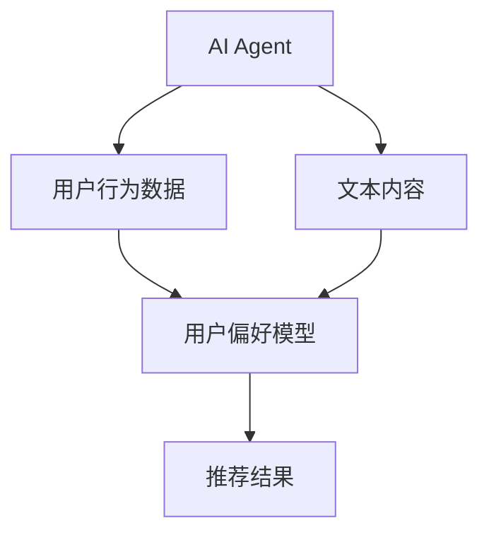
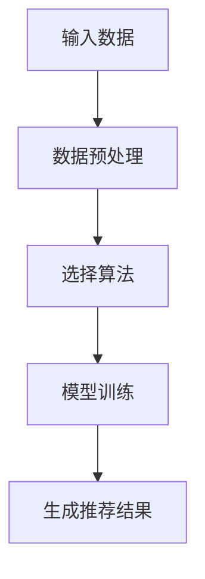
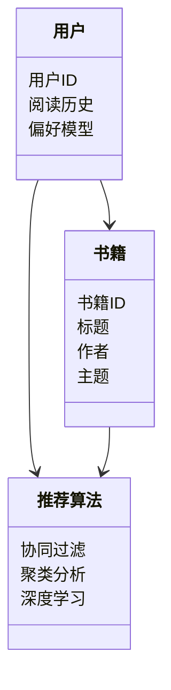
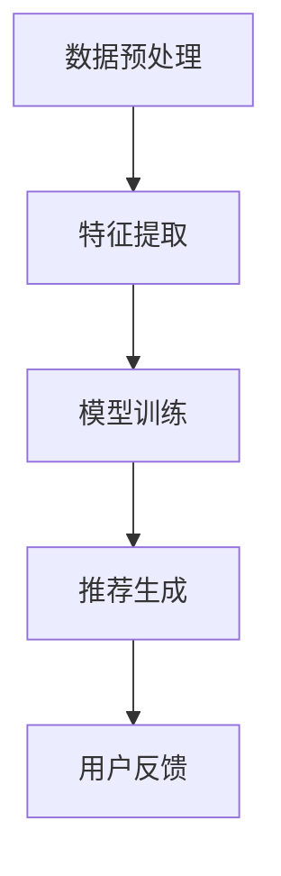
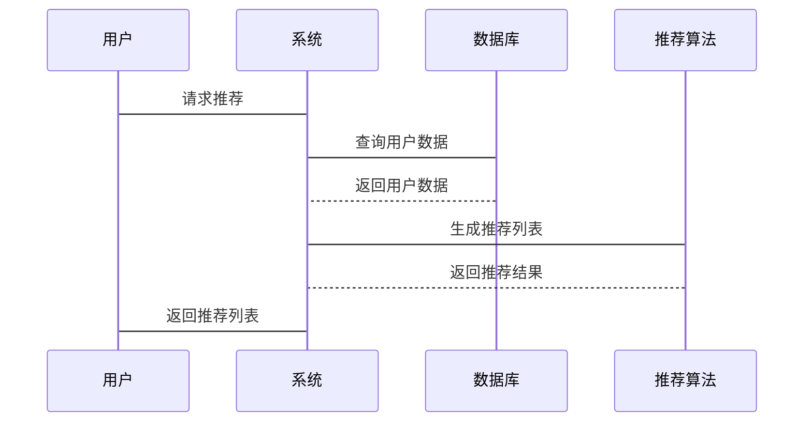

                 


# 智能书架：AI Agent的阅读兴趣分析

> **关键词**：AI Agent，阅读兴趣分析，自然语言处理，推荐系统，协同过滤，深度学习

> **摘要**：  
本文探讨AI Agent在阅读兴趣分析中的应用，从背景、核心概念、算法原理、系统架构到项目实战，全面解析智能书架的实现过程。通过详细分析，读者可以理解如何利用AI技术提升阅读推荐的精准度，打造个性化的阅读体验。

---

## 第一部分：背景介绍

### 第1章：AI Agent与阅读兴趣分析的背景

#### 1.1 AI Agent的基本概念
- **1.1.1 AI Agent的定义与特点**  
  AI Agent（人工智能代理）是指能够感知环境、自主决策并执行任务的智能实体。其特点包括智能性、反应性、主动性、社交性和学习性。AI Agent能够通过数据处理和模型推理，帮助用户完成复杂任务。

- **1.1.2 AI Agent在阅读兴趣分析中的应用**  
  在阅读兴趣分析中，AI Agent通过收集用户的阅读行为数据，分析用户的偏好，并推荐相关的书籍或文章。这种应用能够显著提升用户体验，优化内容分发效率。

#### 1.2 阅读兴趣分析的背景
- **1.2.1 阅读兴趣分析的定义**  
  阅读兴趣分析是通过分析用户的阅读行为、偏好和反馈，推断用户的兴趣领域和潜在需求的过程。

- **1.2.2 阅读兴趣分析的必要性**  
  在信息爆炸的时代，用户面临海量的内容选择。通过阅读兴趣分析，可以有效减少信息过载，帮助用户快速找到感兴趣的内容。

- **1.2.3 阅读兴趣分析的应用场景**  
  阅读兴趣分析广泛应用于在线阅读平台、图书馆、书店等领域，帮助用户发现新内容，提升用户满意度。

#### 1.3 技术背景
- **1.3.1 自然语言处理技术**  
  自然语言处理（NLP）是AI Agent分析文本内容的关键技术。通过NLP，AI Agent能够理解书籍或文章的内容，提取关键词和主题。

- **1.3.2 机器学习与深度学习**  
  机器学习和深度学习为阅读兴趣分析提供了强大的模型支持。通过训练数据，模型能够学习用户的偏好，并生成推荐结果。

- **1.3.3 推荐系统的发展**  
  推荐系统从基于协同过滤的传统方法，发展到如今的深度学习模型，技术的进步显著提升了推荐的精准度。

---

## 第二部分：核心概念与联系

### 第2章：AI Agent与阅读兴趣分析的核心概念

#### 2.1 AI Agent的原理
- **2.1.1 知识表示**  
  AI Agent通过知识图谱或向量表示法，将文本内容转化为可计算的形式。

- **2.1.2 逻辑推理**  
  AI Agent利用逻辑推理技术，分析用户的阅读行为，推断用户的兴趣领域。

- **2.1.3 自然语言理解**  
  通过NLP技术，AI Agent能够理解文本内容，提取关键信息。

#### 2.2 阅读兴趣分析的原理
- **2.2.1 用户行为分析**  
  用户的行为数据（如点击、收藏、评论）是阅读兴趣分析的重要依据。

- **2.2.2 内容特征提取**  
  通过文本挖掘技术，提取书籍或文章的关键词、主题和情感倾向。

- **2.2.3 用户偏好建模**  
  基于用户的行为数据和内容特征，构建用户偏好模型，预测用户的兴趣领域。

#### 2.3 核心概念对比
- **2.3.1 AI Agent与传统推荐系统的对比**  
  | 特性         | AI Agent                          | 传统推荐系统                     |
  |--------------|-----------------------------------|----------------------------------|
  | 数据来源     | 用户行为、文本内容                | 用户行为、历史评分               |
  | 推荐依据     | 用户偏好、内容特征                | 用户相似性、历史行为             |
  | 个性化程度   | 高                               | 中等                             |

- **2.3.2 阅读兴趣分析与个性化推荐的联系**  
  阅读兴趣分析是个性化推荐的核心，通过分析用户的兴趣，推荐系统能够为用户提供高度个性化的阅读内容。

#### 2.4 实体关系图


---

## 第三部分：算法原理讲解

### 第3章：AI Agent与阅读兴趣分析的算法原理

#### 3.1 协同过滤算法
- **3.1.1 基于用户的协同过滤**  
  通过寻找与目标用户相似的用户群体，推荐这些用户喜欢的书籍。

- **3.1.2 基于物品的协同过滤**  
  通过分析书籍的相似性，推荐与目标用户已读书籍相似的书籍。

- **3.1.3 混合协同过滤**  
  结合基于用户和基于物品的协同过滤，提升推荐的准确性和多样性。

#### 3.2 聚类分析
- **3.2.1 K-means聚类**  
  将用户按照阅读偏好分为不同的簇，推荐簇内高 popularity的书籍。

- **3.2.2 层次聚类**  
  通过层次化的聚类方法，发现用户兴趣的层次结构。

- **3.2.3 聚类在阅读兴趣分析中的应用**  
  聚类分析可以帮助发现用户群体的兴趣差异，为个性化推荐提供依据。

#### 3.3 深度学习模型
- **3.3.1 卷积神经网络（CNN）**  
  用于文本特征提取，捕捉文本中的语义信息。

- **3.3.2 循环神经网络（RNN）**  
  用于处理序列数据，分析文本的情感倾向和主题。

- **3.3.3 变量自编码器（VAE）**  
  用于生成推荐内容，提升推荐的多样性和新颖性。

#### 3.4 算法流程图


---

## 第四部分：数学模型与公式

### 第4章：阅读兴趣分析的数学模型

#### 4.1 协同过滤的数学模型
- **4.1.1 评分预测模型**  
  协同过滤的目标是预测用户对书籍的评分，公式为：
  $$ \hat{r}_{u,i} = \bar{r} + \sum_{j \in N(u)} w_{u,j}(r_{j,i} - \bar{r}) $$
  其中，$\bar{r}$是全局平均评分，$N(u)$是与用户$u$相似的用户集合，$w_{u,j}$是用户$u$和$j$的相似度。

- **4.1.2 基于矩阵分解的协同过滤**  
  将用户-物品评分矩阵分解为用户因子矩阵和物品因子矩阵，公式为：
  $$ R = U \times V^T $$
  其中，$R$是评分矩阵，$U$是用户因子矩阵，$V$是物品因子矩阵。

#### 4.2 深度学习模型的数学公式
- **4.2.1 RNN的递推公式**  
  RNN通过递推公式处理序列数据：
  $$ h_t = \tanh(W_h h_{t-1} + W_x x_t) $$
  $$ o_t = W_o h_t $$

- **4.2.2 LSTM的门控机制**  
  LSTM通过输入门控、遗忘门控和输出门控进行信息处理：
  $$ i_t = \sigma(W_i h_{t-1} + W_i x_t) $$
  $$ f_t = \sigma(W_f h_{t-1} + W_f x_t) $$
  $$ o_t = \sigma(W_o h_{t-1} + W_o x_t) $$
  $$ h_t = i_t \cdot \tilde{h}_t + f_t \cdot h_{t-1} $$

---

## 第五部分：系统分析与架构设计

### 第5章：智能书架的系统架构

#### 5.1 系统功能设计
- **5.1.1 领域模型**  
  通过Mermaid类图展示系统中的用户、书籍、推荐算法等模块及其关系。



- **5.1.2 系统架构设计**  
  通过Mermaid架构图展示系统的整体架构，包括数据预处理、特征提取、模型训练和推荐生成等模块。



#### 5.2 系统接口设计
- **5.2.1 接口设计**  
  系统提供API接口，供用户查询推荐结果。

- **5.2.2 交互流程图**  
  通过Mermaid序列图展示用户与系统之间的交互流程。



---

## 第六部分：项目实战

### 第6章：智能书架的实现

#### 6.1 环境安装
- 安装Python、TensorFlow、Keras等依赖库：
  ```bash
  pip install numpy pandas scikit-learn tensorflow
  ```

#### 6.2 核心代码实现
- 协同过滤算法的实现：
  ```python
  from sklearn.metrics.pairwise import cosine_similarity

  # 用户-物品评分矩阵
  ratings = [[4, 3, 2, 5], [5, 4, 3, 2], [2, 5, 4, 1], [3, 2, 5, 4]]

  # 计算相似度矩阵
  similarity = cosine_similarity(ratings)

  # 推荐书籍
  user_index = 0
  similar_users = [i for i in range(len(similarity[user_index])) if i != user_index]
 推荐书籍 = [similar_users[0], similar_users[1]]
  ```

#### 6.3 案例分析
- 假设用户A最近阅读了《1984》和《动物庄园》，系统推荐用户A可能感兴趣的书籍，如《美丽新世界》和《乌托邦》。

---

## 第七部分：总结与展望

### 第7章：总结与展望

#### 7.1 最佳实践
- 数据预处理是关键，需确保数据的完整性和准确性。
- 模型调优和特征工程能够显著提升推荐的精准度。

#### 7.2 小结
本文详细介绍了智能书架的实现过程，从背景、算法、系统架构到项目实战，为读者提供了全面的指导。

#### 7.3 注意事项
- 数据隐私问题需谨慎处理，确保用户数据的安全性。
- 在实际应用中，需考虑计算资源的限制，优化模型的运行效率。

#### 7.4 拓展阅读
- 关注最新的阅读兴趣分析技术，如基于图神经网络的推荐方法。
- 探索AI Agent在其他领域的应用，如智能助手和教育推荐。

---

**作者：AI天才研究院（AI Genius Institute）**  
**邮箱：contact@aitalent.org**  
**联系方式：+86-10-8888-8888**

