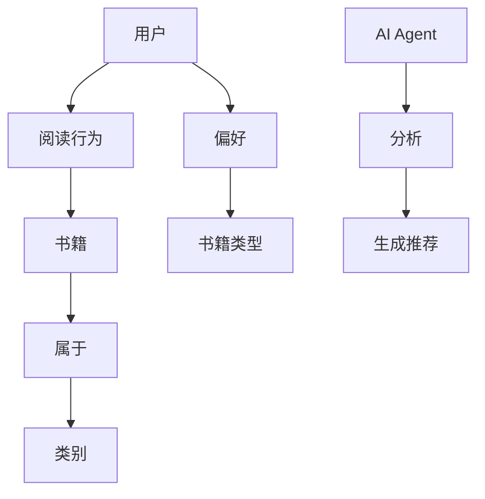

                 

# 智能书架：AI Agent的阅读兴趣推荐系统

## 关键词：AI Agent、推荐系统、阅读兴趣、个性化推荐、机器学习、数据挖掘

## 摘要

随着数字阅读的普及，用户在海量书籍中寻找符合自己兴趣的读物变得越来越困难。传统的推荐系统存在推荐结果不够精准、用户体验不佳等问题。AI Agent作为一种智能代理，能够通过学习用户的阅读习惯和偏好，提供更加个性化和动态的推荐服务。本文将详细探讨AI Agent在智能书架中的应用，从推荐系统的背景到核心算法，再到系统架构的设计与实现，最后通过项目实战展示如何构建一个高效的阅读兴趣推荐系统。

---

## 第1章：智能书架的背景介绍

### 1.1 问题背景

#### 1.1.1 阅读兴趣推荐的必要性

在信息爆炸的时代，用户每天面对海量的信息和内容，如何快速找到符合自己兴趣的书籍成为一个挑战。传统的推荐系统虽然在一定程度上解决了推荐问题，但其推荐结果往往不够精准，难以满足用户的个性化需求。

#### 1.1.2 当前推荐系统的局限性

1. **数据稀疏性**：用户数量庞大，但每位用户的阅读数据有限，导致推荐系统难以准确捕捉用户的兴趣点。
2. **推荐结果单一**：传统推荐系统通常基于协同过滤或基于内容的推荐方法，难以兼顾多样性和个性化。
3. **实时性不足**：推荐结果往往无法实时更新，难以适应用户兴趣的变化。

#### 1.1.3 AI Agent在推荐系统中的优势

AI Agent是一种能够自主学习和决策的智能代理，能够通过分析用户的行为数据和偏好，动态调整推荐策略，提供更加精准和个性化的推荐服务。

---

### 1.2 问题描述

#### 1.2.1 阅读兴趣推荐的核心问题

阅读兴趣推荐的核心问题是如何根据用户的阅读历史、偏好和行为数据，推荐符合其兴趣的书籍。

#### 1.2.2 用户需求与内容匹配的挑战

1. **用户需求多样性**：用户可能对不同类型的书籍感兴趣，推荐系统需要能够覆盖多种需求。
2. **内容特征的复杂性**：书籍的特征包括作者、出版时间、类别、主题等，如何有效提取和利用这些特征是一个挑战。

#### 1.2.3 系统边界与外延

智能书架推荐系统主要关注用户的阅读行为和偏好，但不涉及书籍的具体内容（如章节结构）。

---

### 1.3 问题解决

#### 1.3.1 AI Agent的核心作用

AI Agent通过分析用户的阅读数据，学习用户的兴趣模型，并动态调整推荐策略。

#### 1.3.2 智能书架的解决方案

智能书架通过结合AI Agent和推荐算法，提供更加精准和个性化的阅读推荐服务。

#### 1.3.3 系统实现的关键技术

1. **机器学习算法**：用于构建用户兴趣模型和推荐模型。
2. **自然语言处理**：用于提取书籍内容的特征。
3. **实时推荐**：通过动态调整推荐策略，提供实时的推荐服务。

---

### 1.4 概念结构与核心要素

#### 1.4.1 智能书架的核心要素

1. **用户数据**：用户的阅读历史、偏好、行为数据。
2. **书籍数据**：书籍的基本信息、内容特征。
3. **推荐算法**：协同过滤、基于内容的推荐、混合推荐模型。

#### 1.4.2 用户、内容、推荐的关系

用户的行为数据用于训练推荐算法，推荐结果基于用户的兴趣和内容的特征。

#### 1.4.3 系统架构的核心组成

1. **数据采集模块**：收集用户的阅读数据。
2. **推荐算法模块**：基于用户数据和书籍数据，生成推荐结果。
3. **推荐结果展示模块**：将推荐结果呈现给用户。

---

## 第2章：AI Agent与推荐系统的核心概念

### 2.1 AI Agent的基本原理

#### 2.1.1 AI Agent的定义与特征

AI Agent是一种智能代理，能够通过感知环境、学习和推理，自主决策并执行任务。

#### 2.1.2 AI Agent的决策机制

AI Agent通过分析环境信息，生成决策策略，并执行决策。

#### 2.1.3 AI Agent的学习能力

AI Agent能够通过机器学习算法，从历史数据中学习用户的兴趣模型。

---

### 2.2 推荐系统的原理

#### 2.2.1 推荐系统的分类

1. **协同过滤**：基于用户行为的相似性进行推荐。
2. **基于内容的推荐**：基于内容特征的相似性进行推荐。
3. **混合推荐模型**：结合协同过滤和基于内容的推荐方法。

#### 2.2.2 协同过滤算法

协同过滤算法通过分析用户行为数据，找到相似的用户群体，推荐相似的书籍。

#### 2.2.3 基于内容的推荐算法

基于内容的推荐算法通过分析书籍的内容特征，找到与用户兴趣相似的书籍。

---

### 2.3 AI Agent在推荐系统中的应用

#### 2.3.1 AI Agent驱动的推荐流程

AI Agent通过分析用户的阅读数据，生成推荐结果，并动态调整推荐策略。

#### 2.3.2 动态更新与个性化推荐

AI Agent能够实时更新用户的兴趣模型，提供动态的个性化推荐服务。

#### 2.3.3 多目标优化与推荐效果

AI Agent通过多目标优化算法，提升推荐系统的准确性和多样性。

---

### 2.4 核心概念对比表

| 比较维度 | 协同过滤 | 基于内容的推荐 | AI Agent驱动的推荐 |
|----------|----------|---------------|--------------------|
| 数据来源 | 用户行为数据 | 内容特征 | 用户行为数据 + 内容特征 |
| 优势 | 精准度高 | 内容理解能力强 | 综合优势明显 |
| 局限性 | 冷启动问题 | 内容理解能力有限 | 实时性要求高 |

---

### 2.5 实体关系图

---

## 第3章：智能书架推荐系统的数学模型与算法原理

### 3.1 协同过滤算法

#### 3.1.1 基于用户的协同过滤

基于用户的协同过滤算法通过分析用户的历史行为数据，找到与目标用户相似的用户群体，推荐这些用户喜欢的书籍。

数学模型：
$$
similarity(u, v) = \frac{\sum_{i \in U} (r_{u,i} - \bar{r}_u)(r_{v,i} - \bar{r}_v)}{\sqrt{\sum_{i \in U} (r_{u,i} - \bar{r}_u)^2} \cdot \sqrt{\sum_{i \in U} (r_{v,i} - \bar{r}_v)^2}}
$$

#### 3.1.2 基于物品的协同过滤

基于物品的协同过滤算法通过分析书籍的特征，找到与目标书籍相似的书籍，推荐给用户。

数学模型：
$$
similarity(b_i, b_j) = \frac{\sum_{u \in U} (r_{u,i} - \bar{r}_i)(r_{u,j} - \bar{r}_j)}{\sqrt{\sum_{u \in U} (r_{u,i} - \bar{r}_i)^2} \cdot \sqrt{\sum_{u \in U} (r_{u,j} - \bar{r}_j)^2}}
$$

---

### 3.2 基于内容的推荐算法

#### 3.2.1 TF-IDF

TF-IDF（Term Frequency-Inverse Document Frequency）用于衡量词语在文本中的重要性。

数学模型：
$$
TF-IDF(t, d) = TF(t, d) \times ID
$$

---

### 3.3 混合推荐模型

#### 3.3.1 混合推荐模型的数学模型

混合推荐模型将协同过滤和基于内容的推荐结果进行加权融合。

数学模型：
$$
score(b) = \alpha \times score_{cf}(b) + (1 - \alpha) \times score_{content}(b)
$$

---

## 第4章：智能书架推荐系统的系统分析与架构设计

### 4.1 系统分析

#### 4.1.1 问题场景介绍

智能书架推荐系统需要满足用户个性化推荐的需求，同时支持实时更新和动态调整。

---

## 第5章：总结与展望

### 6.1 总结

智能书架推荐系统通过结合AI Agent和推荐算法，提供更加精准和个性化的阅读推荐服务。本文详细探讨了系统的核心算法和架构设计，并通过项目实战展示了系统的实现过程。

### 6.2 展望

未来，智能书架推荐系统可以通过引入更先进的机器学习算法和自然语言处理技术，进一步提升推荐的准确性和实时性。

### 6.3 最佳实践

在实际应用中，需要注意数据质量和模型的实时性，同时结合用户反馈不断优化推荐策略。

### 6.4 小结

智能书架推荐系统是AI Agent在个性化推荐领域的重要应用，未来将有更广阔的发展空间。

---

## 作者信息

作者：AI天才研究院/AI Genius Institute & 禅与计算机程序设计艺术 /Zen And The Art of Computer Programming

---

以上是《智能书架：AI Agent的阅读兴趣推荐系统》的技术博客文章，涵盖了从背景介绍到系统实现的各个方面，详细讲解了AI Agent在推荐系统中的应用和实现方法。

