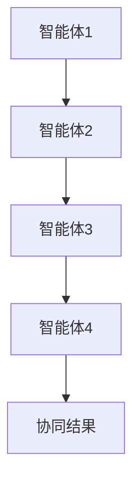
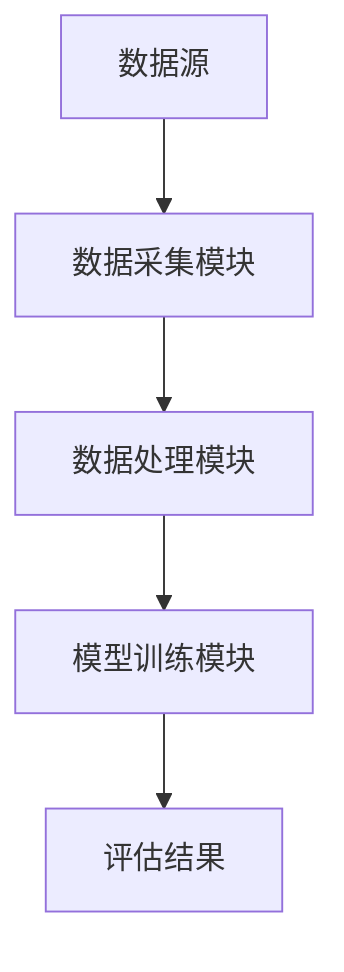
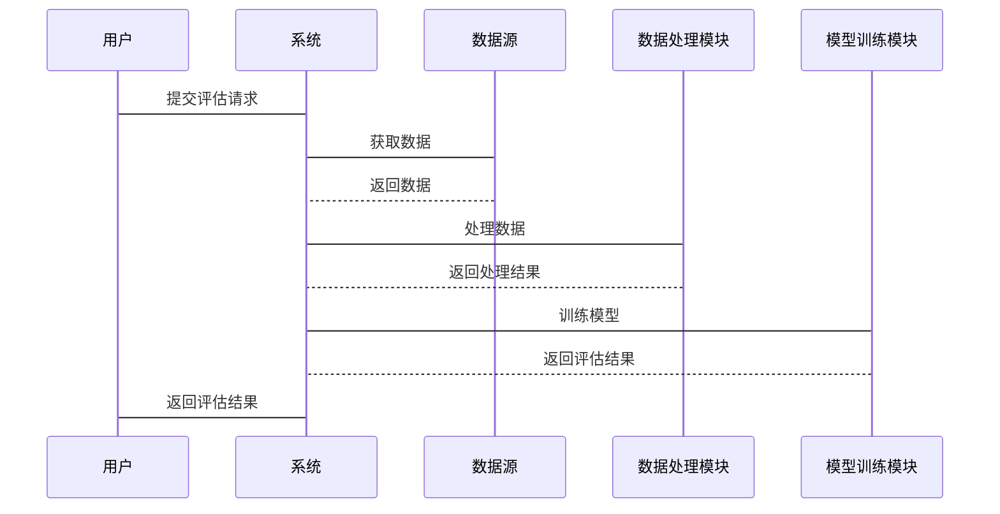

                 


# 智能价值投资：多智能体AI系统的管理层评估

> 关键词：智能价值投资、多智能体AI系统、管理层评估、协同学习、金融数据分析

> 摘要：本文探讨了智能价值投资在多智能体AI系统中的应用，重点分析了如何利用多智能体系统进行企业管理层评估，从而优化投资决策。文章从背景、原理、算法实现、系统架构、项目实战等多个维度展开，结合实际案例和代码示例，深入剖析了多智能体AI系统在金融投资中的潜力和应用价值。

---

## 第一部分：智能价值投资与多智能体AI系统概述

### 第1章：智能价值投资的背景与意义

#### 1.1 价值投资的演变
##### 1.1.1 传统价值投资的核心理念
传统价值投资强调企业基本面分析，关注企业的盈利能力、成长性和估值水平。投资者通过分析财务报表、行业地位和市场环境等因素，寻找被市场低估的投资标的。然而，这种方法依赖于分析师的主观判断，存在信息不对称和人为误差的问题。

##### 1.1.2 现代投资分析的挑战
随着金融市场复杂化，传统的价值投资方法逐渐暴露出效率低下、覆盖面有限等问题。现代企业面临的环境更加复杂，管理层决策对企业价值的影响更加显著。投资者需要更高效、更精准的工具来评估管理层的能力和企业的发展潜力。

##### 1.1.3 智能价值投资的创新与优势
智能价值投资通过引入AI技术，利用多智能体系统协同分析企业数据，实现了对管理层的全方位评估。这种方法能够快速处理海量数据，发现潜在的价值信号，帮助投资者做出更明智的决策。

#### 1.2 多智能体AI系统的定义与特点
##### 1.2.1 多智能体系统的定义
多智能体系统是由多个相互协作的智能体组成的分布式系统，每个智能体负责特定的任务或数据处理。这些智能体通过通信协议协同工作，共同完成复杂的问题求解。

##### 1.2.2 多智能体系统的组成部分
- **智能体**：负责数据采集、分析和决策。
- **通信模块**：实现智能体之间的数据交互。
- **协同机制**：确保智能体协同工作，避免冲突。
- **决策模块**：基于协同结果做出最终决策。

##### 1.2.3 多智能体系统与单智能体系统的区别
- **数据处理能力**：多智能体系统能够处理更大规模的数据，提高分析效率。
- **任务分配**：通过任务分配优化资源利用，提升整体性能。
- **决策多样性**：多个智能体的协同决策能够覆盖更多可能性，提高决策的准确性。

#### 1.3 管理层评估在智能价值投资中的作用
##### 1.3.1 管理层评估的核心意义
管理层的能力直接影响企业的经营绩效和股票价值。通过AI系统评估管理层的能力，投资者可以更准确地判断企业的长期发展潜力。

##### 1.3.2 管理层评估的挑战与机遇
- **挑战**：数据获取难度大、信息不透明、模型构建复杂。
- **机遇**：AI技术的引入能够显著提高评估效率和准确性，为企业价值评估提供新的工具。

##### 1.3.3 管理层评估的未来发展方向
随着AI技术的不断进步，管理层评估将更加智能化、自动化。多智能体系统将在这一过程中发挥越来越重要的作用。

---

## 第2章：多智能体AI系统的原理与架构

### 2.1 多智能体系统的核心原理
#### 2.1.1 多智能体系统的协同机制
多智能体系统通过通信协议和协同算法实现智能体之间的协作。每个智能体负责特定的任务，协同完成复杂的问题求解。

#### 2.1.2 多智能体系统的通信协议
智能体之间的通信需要遵循特定的协议，确保数据的有效传输和处理。通信协议的设计直接影响系统的性能和效率。

#### 2.1.3 多智能体系统的决策模型
基于协同数据，系统通过决策模型做出最终的判断。决策模型需要综合考虑各智能体的反馈，确保决策的准确性和合理性。

### 2.2 多智能体系统的架构设计
#### 2.2.1 分层架构的优缺点
- **优点**：层次清晰，便于管理和维护。
- **缺点**：层次之间的耦合性较高，可能影响系统的灵活性。

#### 2.2.2 分布式架构的实现方式
分布式架构通过将任务分配到不同的节点，实现并行处理。这种架构能够显著提高系统的处理能力，但需要解决节点之间的通信和协调问题。

#### 2.2.3 混合架构的应用场景
混合架构结合了分层和分布式架构的优势，适用于复杂度高、任务多样化的应用场景。通过合理分配任务，能够充分发挥各智能体的优势。

### 2.3 多智能体系统的关键技术
#### 2.3.1 联邦学习
联邦学习是一种分布式机器学习技术，能够在不共享数据的前提下，通过模型参数的交换实现协同学习。这种方法在保护数据隐私的同时，提高了模型的泛化能力。

#### 2.3.2 联合学习
联合学习通过多个学习模型的协作，提高模型的准确性和鲁棒性。与联邦学习不同，联合学习允许模型之间共享数据，适用于数据量较大的场景。

#### 2.3.3 强化学习
强化学习通过智能体与环境的交互，逐步优化决策策略。这种方法适用于动态变化的环境，能够实现自适应的决策过程。

---

## 第3章：管理层评估指标体系

### 3.1 管理层评估的核心维度
#### 3.1.1 战略能力评估
战略能力评估关注管理层的战略规划能力和市场洞察力。通过分析企业的战略目标和执行情况，判断管理层的战略能力。

#### 3.1.2 运营能力评估
运营能力评估关注管理层的日常运营能力和效率。通过分析企业的运营数据和管理流程，评估管理层的运营能力。

#### 3.1.3 财务能力评估
财务能力评估关注管理层的财务管理和风险控制能力。通过分析企业的财务报表和财务指标，评估管理层的财务能力。

#### 3.1.4 风险控制能力评估
风险控制能力评估关注管理层的风险识别和应对能力。通过分析企业的风险管理策略和执行效果，评估管理层的风险控制能力。

### 3.2 评估指标的权重分配
#### 3.2.1 指标权重的计算方法
权重分配需要根据各指标的重要性进行调整。常用的方法包括层次分析法（AHP）和熵值法。

#### 3.2.2 指标权重的动态调整
根据市场环境和企业实际情况的变化，及时调整各指标的权重，确保评估结果的准确性和时效性。

#### 3.2.3 指标权重的实际应用
通过实际案例分析，说明如何根据企业特点调整指标权重，提高评估结果的适用性。

### 3.3 评估指标的数学模型
#### 3.3.1 综合评分模型
综合评分模型将各指标的得分按照权重进行加权求和，得到最终的综合评分。

$$ \text{综合评分} = \sum_{i=1}^{n} w_i \times s_i $$

其中，\( w_i \) 为第 \( i \) 个指标的权重，\( s_i \) 为第 \( i \) 个指标的评分。

#### 3.3.2 加权平均模型
加权平均模型通过加权平均的方式，综合考虑各指标的影响。

$$ \text{加权平均} = \frac{\sum_{i=1}^{n} w_i \times s_i}{\sum_{i=1}^{n} w_i} $$

#### 3.3.3 层次分析法（AHP）
层次分析法通过构建层次结构，利用专家意见确定各指标的权重，适用于复杂问题的决策分析。

---

## 第4章：多智能体AI系统的算法实现

### 4.1 算法原理概述
#### 4.1.1 多智能体协同学习的原理
多智能体协同学习通过智能体之间的协作，提高模型的准确性和鲁棒性。每个智能体负责特定的任务，协同完成复杂的问题求解。

#### 4.1.2 多智能体系统的通信机制
智能体之间的通信需要遵循特定的协议，确保数据的有效传输和处理。通信机制的设计直接影响系统的性能和效率。

#### 4.1.3 多智能体系统的决策过程
基于协同数据，系统通过决策模型做出最终的判断。决策过程需要综合考虑各智能体的反馈，确保决策的准确性和合理性。

### 4.2 算法实现细节
#### 4.2.1 算法流程图
以下是一个多智能体协同学习的算法流程图：



#### 4.2.2 算法实现代码
以下是一个简单的多智能体协同学习的Python代码示例：

```python
class Agent:
    def __init__(self, id):
        self.id = id
        self.data = None

    def receive_data(self, data):
        self.data = data

    def process_data(self):
        # 处理数据并返回结果
        return self.data * 2

# 初始化智能体
agents = [Agent(i) for i in range(4)]

# 任务分配
for i in range(len(agents)):
    if i < len(agents) - 1:
        agents[i].receive_data(i + 1)
    else:
        agents[i].receive_data(0)

# 协同处理
for agent in agents:
    result = agent.process_data()
    print(f"Agent {agent.id} result: {result}")
```

---

## 第5章：系统架构设计与实现

### 5.1 问题场景介绍
本文设计了一个基于多智能体AI系统的管理层评估系统，旨在通过协同分析企业的财务数据和管理信息，评估管理层的能力和企业的发展潜力。

### 5.2 系统功能设计
#### 5.2.1 数据采集模块
数据采集模块负责从企业公开数据源获取财务报表、管理团队信息等数据。

#### 5.2.2 数据处理模块
数据处理模块对采集的数据进行清洗、转换和预处理，确保数据的准确性和一致性。

#### 5.2.3 模型训练模块
模型训练模块利用机器学习算法，训练多智能体协同学习模型，实现对管理层能力的评估。

### 5.3 系统架构设计
以下是一个多智能体AI系统的架构图：



### 5.4 系统接口设计
系统接口设计包括数据接口和模型接口。数据接口负责与外部数据源的交互，模型接口负责与前端应用的交互。

### 5.5 系统交互设计
以下是一个系统交互的序列图：



---

## 第6章：项目实战与案例分析

### 6.1 项目环境配置
项目需要以下环境和工具：
- **Python**：3.8及以上版本
- **机器学习库**：TensorFlow、Scikit-learn
- **数据处理工具**：Pandas、NumPy

### 6.2 核心代码实现
以下是一个多智能体协同学习的Python实现示例：

```python
import numpy as np
from sklearn.model_selection import train_test_split
from sklearn.ensemble import RandomForestClassifier

class MultiAgentSystem:
    def __init__(self, agents):
        self.agents = agents

    def train(self, X, y):
        for agent in self.agents:
            agent.model.fit(X, y)

    def predict(self, X):
        results = []
        for agent in self.agents:
            results.append(agent.model.predict(X))
        return np.mean(results, axis=0)

# 初始化智能体
agent1 = RandomForestClassifier()
agent2 = RandomForest

