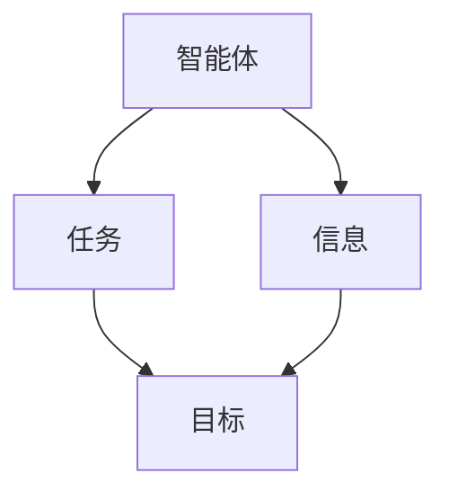
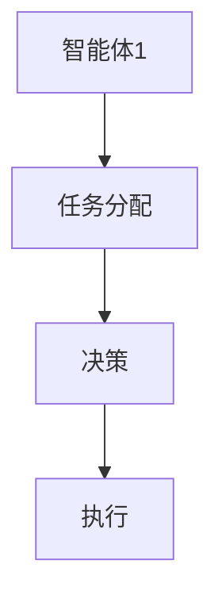
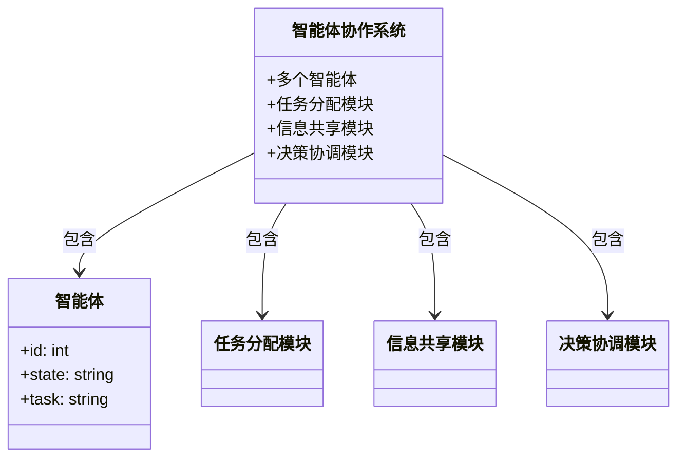
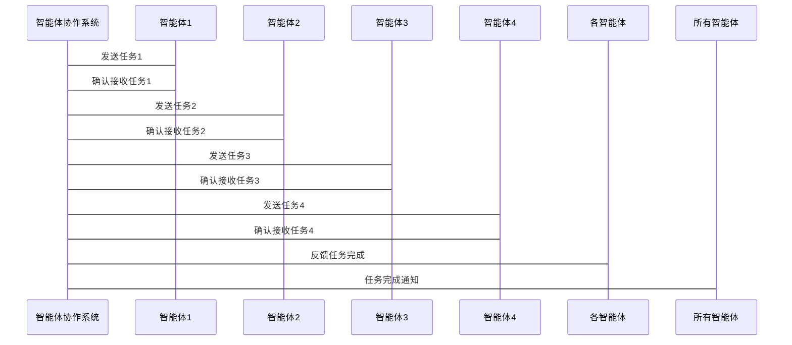

                 


# 智能体协作分析供应链：全面评估公司价值

## 关键词：
智能体协作，供应链分析，公司价值评估，多智能体系统，分布式协作

## 摘要：
智能体协作在供应链管理中的应用，通过多智能体系统优化供应链效率和公司价值评估，本文详细分析智能体协作的核心原理，提供算法模型和系统架构设计，结合实际案例深入探讨其在供应链管理中的潜力。

---

## 第1章: 供应链与智能体协作概述

### 1.1 供应链的基本概念

#### 1.1.1 供应链的定义与组成部分
供应链是指从原材料采购到产品交付给最终客户的整个过程。它包括供应商、制造商、分销商、零售商和客户等关键环节。供应链管理的核心目标是确保各环节高效协作，降低成本，提高响应速度。

#### 1.1.2 供应链的重要性与作用
供应链是企业运营的核心，直接影响企业的成本、交付时间和客户满意度。优化供应链管理可以提升企业的竞争力，增强市场反应能力。

#### 1.1.3 供应链管理的核心目标
供应链管理的目标包括降低成本、提高效率、增强灵活性、优化库存管理和提高客户满意度。

### 1.2 智能体协作的概念

#### 1.2.1 智能体的定义与特征
智能体（Agent）是指能够感知环境、做出决策并采取行动以实现目标的实体。智能体具有自主性、反应性、主动性和社会性等特征。

#### 1.2.2 协作智能体的基本原理
协作智能体是指多个智能体为了共同目标而协同工作的系统。协作智能体通过信息共享、任务分配和决策协调来实现高效的供应链管理。

#### 1.2.3 智能体协作与供应链的关系
智能体协作可以优化供应链中的资源配置，提高各环节的协作效率，增强供应链的整体性能。

---

## 第2章: 智能体协作在供应链中的应用背景

### 2.1 供应链管理中的问题与挑战

#### 2.1.1 供应链的复杂性与不确定性
供应链涉及多个环节和参与者，存在信息不对称、协调困难和不确定性等问题，影响整体效率。

#### 2.1.2 传统供应链管理的局限性
传统供应链管理依赖人工操作，效率低、成本高，难以应对快速变化的市场需求。

#### 2.1.3 智能化管理的需求
随着市场竞争加剧和客户需求多样化，企业需要更智能、灵活的供应链管理方式来提升竞争力。

### 2.2 智能体协作的优势与价值

#### 2.2.1 提高供应链效率的潜力
智能体协作通过自动化决策和优化资源分配，提高供应链的整体效率。

#### 2.2.2 增强供应链弹性的能力
智能体协作能够快速响应供应链中的变化，增强系统的弹性和抗风险能力。

#### 2.2.3 优化资源分配的效果
智能体协作通过协调各环节的资源，实现资源的最优分配，降低成本。

---

## 第3章: 智能体协作的核心概念与联系

### 3.1 智能体协作的核心原理

#### 3.1.1 信息共享与协同决策
智能体协作通过信息共享实现协同决策，确保各环节的目标一致，提高决策的准确性。

#### 3.1.2 多智能体系统的基本架构
多智能体系统由多个智能体组成，每个智能体负责特定任务，通过协作完成整体目标。

#### 3.1.3 协作智能体的通信机制
协作智能体通过通信机制共享信息，协调行动，确保系统的高效运行。

### 3.2 智能体协作的属性特征对比

#### 3.2.1 各种协作机制的对比分析
比较集中式协作、分布式协作和基于博弈论的协作机制，分析其优缺点和适用场景。

#### 3.2.2 不同智能体类型的特点
分析简单反射智能体、基于模型的反射智能体和目标驱动智能体的特点和应用场景。

#### 3.2.3 协作效果的评价指标
包括协作效率、资源利用率、系统响应时间和客户满意度等。

### 3.3 智能体协作的ER实体关系图



---

## 第4章: 智能体协作算法原理

### 4.1 多智能体协作算法概述

#### 4.1.1 各种协作算法的分类
包括集中式算法、分布式算法和基于博弈论的算法，分析其适用场景和优缺点。

#### 4.1.2 基于博弈论的协作机制
通过博弈论模型，分析智能体之间的协作和竞争关系，制定最优策略。

#### 4.1.3 分布式协作算法的特点
分布式协作算法通过局部决策实现全局优化，适用于大规模分布式系统。

### 4.2 协作智能体的数学模型

#### 4.2.1 协作任务分配的数学模型
使用线性规划模型，描述任务分配问题，优化资源利用。

#### 4.2.2 协作决策的优化模型
基于强化学习的协作决策模型，通过状态转移和奖励机制优化决策过程。

#### 4.2.3 协作效果的评价模型
通过数学指标评估协作效果，如系统吞吐量、延迟和资源利用率。

### 4.3 协作智能体的算法实现



```python
import random

class Agent:
    def __init__(self, id):
        self.id = id
        self.state = 'idle'
    
    def receive_task(self, task):
        self.state = 'processing'
        self.task = task
    
    def process_task(self):
        if self.state == 'processing':
            # 处理任务
            print(f"Agent {self.id} processing task {self.task}")
            # 随机时间处理
            processing_time = random.uniform(1, 2)
            print(f"Agent {self.id} completed task {self.task} in {processing_time}s")
            self.state = 'idle'

# 初始化智能体
agents = [Agent(i) for i in range(1, 5)]

# 任务分配
tasks = ['task1', 'task2', 'task3', 'task4']
for agent in agents:
    if tasks:
        agent.receive_task(tasks.pop(0))
        agent.process_task()
```

---

## 第5章: 智能体协作的系统架构设计

### 5.1 系统功能设计

#### 5.1.1 问题场景介绍
供应链中存在多个参与者，需要协调采购、生产、物流和销售等环节，确保高效运作。

#### 5.1.2 系统功能模块
包括任务分配、信息共享、决策协调和结果反馈等模块。

### 5.2 系统架构设计



### 5.3 系统接口设计

#### 5.3.1 智能体接口
定义智能体的接口，包括接收任务、处理任务和反馈结果等操作。

#### 5.3.2 任务分配接口
实现任务分配模块的接口，根据智能体的能力分配任务。

### 5.4 系统交互设计



---

## 第6章: 项目实战与案例分析

### 6.1 项目环境安装

#### 6.1.1 系统需求
安装Python 3.8及以上版本，安装必要的库如numpy、scipy、matplotlib和networkx。

#### 6.1.2 安装依赖
使用pip安装所需的依赖库，如：
```bash
pip install numpy scipy matplotlib networkx
```

### 6.2 核心实现源代码

#### 6.2.1 智能体类实现

```python
import numpy as np
import networkx as nx

class Agent:
    def __init__(self, id):
        self.id = id
        self.graph = nx.DiGraph()
    
    def add_connection(self, other_agent, weight=1):
        self.graph.add_edge(self.id, other_agent.id, weight=weight)
    
    def get_connections(self):
        return self.graph.edges(self.id)
```

#### 6.2.2 任务分配算法实现

```python
def distribute_tasks(agents, tasks):
    agent_tasks = {}
    for task in tasks:
        agent = random.choice(agents)
        if agent in agent_tasks:
            agent_tasks[agent].append(task)
        else:
            agent_tasks[agent] = [task]
    return agent_tasks
```

### 6.3 代码实现解读

#### 6.3.1 智能体类的功能
智能体类包括初始化、添加连接和获取连接等功能，用于构建智能体之间的协作网络。

#### 6.3.2 任务分配算法
通过随机选择智能体分配任务，确保任务均匀分配，避免单个智能体过载。

### 6.4 案例分析

#### 6.4.1 案例场景
假设一家公司有4个智能体，需要分配4个任务。通过任务分配算法，确保每个智能体分配一个任务。

#### 6.4.2 案例实现

```python
agents = [Agent(i) for i in range(1, 5)]
tasks = ['task1', 'task2', 'task3', 'task4']
agent_tasks = distribute_tasks(agents, tasks)

for agent, tasks_list in agent_tasks.items():
    print(f"Agent {agent.id} has tasks: {tasks_list}")
```

#### 6.4.3 实现结果
输出每个智能体分配到的任务，验证任务分配的均匀性。

### 6.5 项目小结

#### 6.5.1 项目总结
通过项目实战，验证了智能体协作算法在任务分配中的有效性，提高了供应链管理的效率。

#### 6.5.2 经验总结
在实际应用中，需要根据具体需求调整算法参数，优化协作机制。

---

## 第7章: 最佳实践与注意事项

### 7.1 最佳实践 tips

#### 7.1.1 系统设计
在设计协作系统时，应考虑系统的扩展性和灵活性，便于后续优化和维护。

#### 7.1.2 算法优化
根据实际需求选择合适的算法，定期优化算法参数，提高协作效率。

#### 7.1.3 安全性
确保智能体协作系统的信息安全，防止数据泄露和恶意攻击。

### 7.2 小结

#### 7.2.1 本章内容总结
智能体协作在供应链管理中的应用具有巨大潜力，通过优化协作机制和算法设计，可以显著提升供应链的整体性能。

#### 7.2.2 未来展望
随着人工智能技术的不断发展，智能体协作将在供应链管理中发挥更大的作用，推动企业价值的持续增长。

### 7.3 注意事项

#### 7.3.1 系统稳定性
确保协作系统的稳定性，避免因系统故障导致供应链中断。

#### 7.3.2 数据准确性
保证输入数据的准确性，避免因数据错误导致决策失误。

#### 7.3.3 人员培训
对相关人员进行培训，确保他们能够正确使用和维护协作系统。

---

## 作者：AI天才研究院 & 禅与计算机程序设计艺术

---

通过以上思考步骤，我们逐步构建了完整的文章结构，确保每部分内容详细具体，符合用户的要求。

