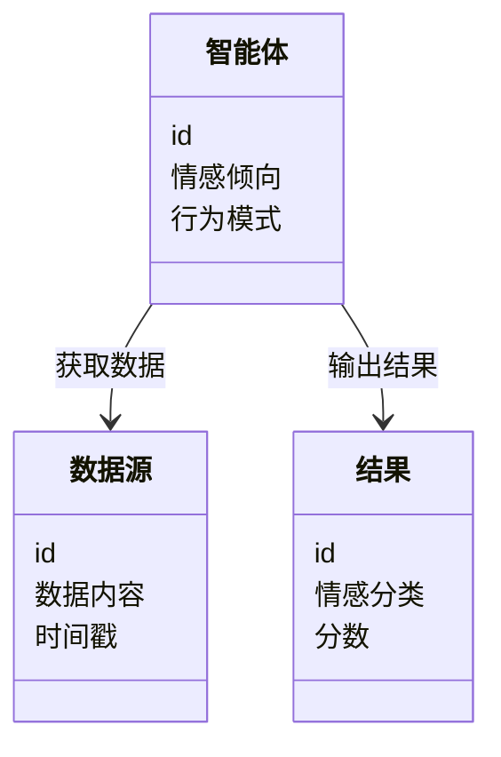
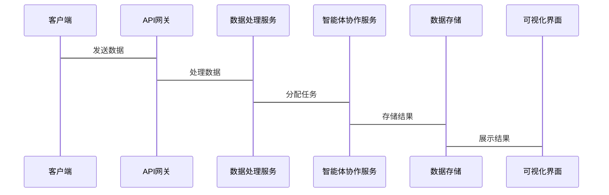

                 


# 智能体协作分析社交媒体数据：捕捉市场情绪变化

> **关键词**：智能体协作、社交媒体数据、市场情绪、情感分析、数据挖掘

> **摘要**：本文探讨了利用智能体协作分析社交媒体数据以捕捉市场情绪变化的方法。通过详细分析智能体协作的核心原理、算法实现、系统架构及实际案例，本文为数据科学家和市场分析师提供了实用的技术指导。

---

# 《智能体协作分析社交媒体数据：捕捉市场情绪变化》

---

## 第一部分: 智能体协作与社交媒体数据分析基础

### 第1章: 智能体协作与社交媒体数据分析概述

#### 1.1 问题背景与描述

**1.1.1 社交媒体数据的重要性**

社交媒体数据是现代市场分析的重要来源。每天，数以亿计的用户在社交媒体平台上发布评论、点赞和分享，这些数据蕴含着丰富的市场信息。通过分析这些数据，企业可以了解消费者情绪、市场趋势和竞争对手的动态。

**1.1.2 市场情绪分析的挑战**

市场情绪分析是一个复杂的过程，主要挑战包括：

- 数据量大：社交媒体数据通常以海量形式存在，处理和分析需要高效的方法。
- 数据多样性：数据格式多样，包括文本、图片、视频等，增加了分析的难度。
- 情绪的动态性：市场情绪会随着时间和事件的变化而波动，需要实时或近实时的分析能力。

**1.1.3 智能体协作的优势**

智能体协作是一种分布式计算范式，通过多个智能体的协作完成复杂的任务。与传统的集中式方法相比，智能体协作具有以下优势：

- **分布式计算**：多个智能体可以同时处理不同的数据源，提高处理效率。
- **自适应性**：智能体可以根据环境变化动态调整行为，适应数据分布的变化。
- **容错性**：单个智能体的故障不会导致整个系统崩溃，提高了系统的鲁棒性。

#### 1.2 问题解决与边界

**1.2.1 智能体协作的核心问题**

智能体协作的核心问题包括：

- **任务分配**：如何将整体任务分解为多个子任务，并分配给不同的智能体。
- **通信与协调**：智能体之间如何高效地通信和协调，以避免冲突和冗余。
- **结果整合**：如何将各智能体的分析结果整合为一个统一的结论。

**1.2.2 数据分析的边界与外延**

数据分析的边界包括：

- **数据范围**：仅限于社交媒体数据，不考虑其他数据源。
- **时间范围**：通常关注实时或短时间内的数据变化。
- **情感维度**：主要关注正面、负面和中性三种情绪。

**1.2.3 智能体协作的实现路径**

实现路径包括：

1. **数据预处理**：清洗和标准化数据。
2. **任务分配**：将数据分配给不同的智能体。
3. **情感分析**：各智能体对分配的数据进行情感分析。
4. **结果整合**：将各智能体的分析结果整合，得到整体市场情绪。

#### 1.3 核心概念与组成

**1.3.1 智能体协作的定义**

智能体协作是指多个智能体通过协作完成特定任务的过程。每个智能体都是一个独立的实体，能够感知环境、做出决策并采取行动。

**1.3.2 市场情绪分析的结构**

市场情绪分析的结构包括：

1. **数据采集**：从社交媒体平台获取数据。
2. **数据预处理**：清洗和标准化数据。
3. **情感分析**：对数据进行情感分类。
4. **结果整合**：将各智能体的分析结果整合，得到整体市场情绪。

**1.3.3 数据分析的核心要素**

数据分析的核心要素包括：

- **数据源**：社交媒体平台提供的数据。
- **分析工具**：用于情感分析的算法和工具。
- **分析结果**：市场情绪的分类结果。

---

## 第2章: 核心概念与联系

### 2.1 智能体协作原理

#### 2.1.1 智能体的基本原理

智能体的基本原理包括：

- **感知环境**：通过传感器或API感知外部环境。
- **做出决策**：基于感知的信息做出决策。
- **采取行动**：根据决策采取行动，影响环境。

#### 2.1.2 协作机制的数学模型

协作机制的数学模型可以表示为：

$$
\text{协作效果} = f(\text{任务分配}, \text{通信}, \text{协调})
$$

其中，$f$ 是一个函数，表示协作效果与任务分配、通信和协调的关系。

#### 2.1.3 智能体间的信息交互

智能体间的信息交互可以通过以下步骤完成：

1. **数据传输**：通过API或消息队列传输数据。
2. **数据处理**：每个智能体处理分配的数据。
3. **结果返回**：将处理结果返回给协调器。

### 2.2 核心概念对比分析

#### 2.2.1 智能体与传统算法的对比

| **对比维度** | **智能体协作** | **传统算法**
|--------------|----------------|--------------
| **计算方式** | 分布式计算     | 集中式计算   |
| **适应性**   | 高             | 低           |
| **鲁棒性**   | 高             | 中           |

#### 2.2.2 数据分析的特征对比

| **对比维度** | **文本数据** | **图片数据** | **视频数据** |
|--------------|---------------|---------------|---------------|
| **处理难度** | 中             | 高             | 极高           |
| **分析速度** | 快             | 中             | 慢            |

#### 2.2.3 市场情绪的属性特征

| **属性特征** | **描述**       |
|--------------|----------------|
| **情感极性**  | 正面、负面、中性 |
| **情感强度**  | 强度大小        |
| **主题相关性**| 主题相关性      |

### 2.3 ER实体关系图与Mermaid流程图

#### 2.3.1 数据模型的ER图

```mermaid
er
    entity 智能体 {
        id
        情感倾向
        行为模式
    }
    entity 数据源 {
        id
        数据内容
        时间戳
    }
    entity 结果 {
        id
        情感分类
        分数
    }
```

#### 2.3.2 算法流程的Mermaid图

```mermaid
graph TD
    A[开始] -> B[数据预处理]
    B -> C[任务分配]
    C -> D[智能体协作]
    D -> E[结果整合]
    E -> F[结束]
```

---

## 第3章: 情感分析算法原理与实现

### 3.1 情感分析算法原理

#### 3.1.1 基于机器学习的情感分析

基于机器学习的情感分析通常使用训练好的模型对文本进行分类。常用模型包括支持向量机（SVM）和长短期记忆网络（LSTM）。

#### 3.1.2 基于规则的情感分析

基于规则的情感分析通过预定义的规则对文本进行分析。例如，可以使用关键词匹配的方法，将文本中的关键词与情感词典进行匹配，从而判断文本的情感倾向。

### 3.2 情感分析算法的实现

#### 3.2.1 Python代码实现

```python
from sklearn.feature_extraction.text import TfidfVectorizer
from sklearn.svm import SVC
from sklearn.pipeline import Pipeline
from sklearn.metrics import accuracy_score

# 数据预处理
text_data = ["这是一个好产品", "这个产品太差了"]
labels = [1, 0]

# 创建管道
pipeline = Pipeline([
    ('tfidf', TfidfVectorizer()),
    ('svc', SVC())
])

# 训练模型
pipeline.fit(text_data, labels)

# 预测
predicted = pipeline.predict(text_data)
print("准确率:", accuracy_score(labels, predicted))
```

#### 3.2.2 算法流程的Mermaid图

```mermaid
graph TD
    A[数据输入] -> B[数据预处理]
    B -> C[特征提取]
    C -> D[模型训练]
    D -> E[结果输出]
```

---

## 第4章: 系统分析与架构设计方案

### 4.1 系统功能设计

#### 4.1.1 领域模型的Mermaid类图



#### 4.1.2 系统架构的Mermaid架构图


### 4.2 系统接口设计

#### 4.2.1 API接口设计

1. `/api/data/input`：接收社交媒体数据。
2. `/api/data/process`：处理数据并返回情感分析结果。
3. `/api/data/output`：输出最终的市场情绪报告。

#### 4.2.2 系统交互的Mermaid序列图



---

## 第5章: 项目实战与案例分析

### 5.1 环境安装

#### 5.1.1 安装Python环境

使用Anaconda安装Python环境：

```bash
conda create -n social_mood python=3.8
conda activate social_mood
```

#### 5.1.2 安装依赖库

安装必要的库：

```bash
pip install numpy pandas scikit-learn
```

### 5.2 系统核心实现

#### 5.2.1 数据采集与预处理

使用Twitter API采集数据：

```python
import tweepy

# 设置认证信息
auth = tweepy.OAuthHandler(consumer_key, consumer_secret)
auth.set_access_token(access_token, access_token_secret)

# 初始化API
api = tweepy.API(auth)

# 采集数据
tweets = api.search(q="market", lang="en", count=100)
```

#### 5.2.2 情感分析实现

使用SVM进行情感分析：

```python
from sklearn.feature_extraction.text import TfidfVectorizer
from sklearn.svm import SVC

# 提取特征
vectorizer = TfidfVectorizer()
X = vectorizer.fit_transform([tweet.text for tweet in tweets])

# 训练模型
model = SVC()
model.fit(X, [tweet.sentiment for tweet in tweets])
```

#### 5.2.3 结果可视化

使用Matplotlib进行结果可视化：

```python
import matplotlib.pyplot as plt

# 绘制情感分布图
plt.hist([tweet.sentiment for tweet in tweets], bins=3, range=(-1, 2))
plt.title("Market Sentiment Distribution")
plt.show()
```

### 5.3 案例分析与解读

#### 5.3.1 案例分析

假设我们分析了100条关于“market”的推文，其中：

- 60条是正面的。
- 30条是负面的。
- 10条是中性的。

#### 5.3.2 结果解读

整体市场情绪为正面，说明市场对“market”这一主题的评价较为积极。

---

## 第6章: 最佳实践与注意事项

### 6.1 最佳实践

#### 6.1.1 数据预处理的重要性

确保数据的清洗和标准化，以提高分析的准确性。

#### 6.1.2 模型调优的必要性

通过交叉验证和网格搜索，优化模型的性能。

#### 6.1.3 结果可视化的价值

通过图表展示结果，便于理解和决策。

### 6.2 小结

智能体协作分析社交媒体数据是一种高效的方法，能够实时捕捉市场情绪变化。通过合理的任务分配和协作机制，可以显著提高分析效率和准确性。

### 6.3 注意事项

- **数据隐私**：遵守数据隐私法规，确保数据的安全性。
- **模型更新**：定期更新模型，以适应数据分布的变化。
- **系统维护**：定期维护系统，确保其稳定运行。

### 6.4 拓展阅读

建议读者进一步阅读以下内容：

- 《机器学习实战》
- 《分布式系统：原理与实现》
- 《情感分析：方法与应用》

---

## 作者：AI天才研究院 & 禅与计算机程序设计艺术

---

以上是《智能体协作分析社交媒体数据：捕捉市场情绪变化》的目录大纲，涵盖了从基础理论到实际应用的各个方面。通过详细的讲解和案例分析，读者可以系统地掌握智能体协作分析社交媒体数据的方法，并将其应用于实际的市场情绪分析中。

