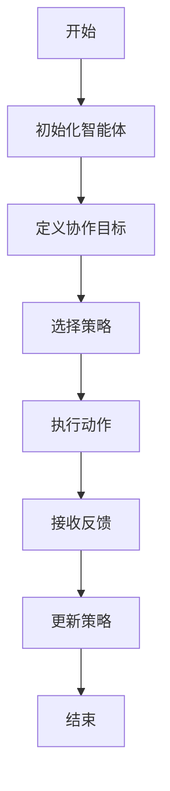

                 


# 智能体协作增强价值投资的产业链分析

## 关键词：智能体协作，价值投资，产业链分析，强化学习，博弈论，图神经网络

## 摘要：  
智能体协作在价值投资中的应用正逐渐成为学术界和工业界的热点研究方向。通过智能体的协作，投资者能够更高效地分析市场数据、制定投资策略，并优化投资组合。本文从智能体协作的基本概念出发，结合价值投资的产业链分析，详细探讨了智能体协作在价值投资中的算法原理、数学模型、系统架构设计以及实际应用场景。通过案例分析和代码实现，展示了智能体协作如何增强价值投资的效率和准确性。本文旨在为投资者、数据科学家和人工智能研究人员提供理论支持和实践指导，帮助他们在复杂多变的金融市场中做出更明智的投资决策。

---

## 正文

### 第1章：智能体协作的背景与概念

#### 1.1 智能体协作的基本概念
智能体（Agent）是人工智能中的核心概念，指能够在环境中感知、推理、决策并执行动作的实体。智能体协作是指多个智能体通过信息共享、协同决策和行动，共同完成复杂任务的过程。智能体协作的关键在于各智能体之间的信息交互和策略协调。

**核心概念对比表**：

| 智能体类型 | 单智能体 | 多智能体协作 |
|------------|----------|-------------|
| 定义 | 单个智能体独立完成任务 | 多个智能体协同完成任务 |
| 优点 | 简单直接，易于控制 | 提高效率，增强能力 |
| 缺点 | 适应性有限，难以应对复杂任务 | 协调复杂，存在通信开销 |

#### 1.2 价值投资的定义与特点
价值投资是一种投资策略，强调以低于内在价值的价格买入优质资产。其核心在于对资产的深入研究和长期价值判断。价值投资的特点包括：
- **长期性**：注重长期收益而非短期波动。
- **深度分析**：依赖对财务数据、行业趋势和市场环境的深入分析。
- **风险控制**：通过分散投资和严格筛选降低风险。

#### 1.3 智能体协作在价值投资中的作用
智能体协作通过以下方式增强价值投资的效率和准确性：
1. **数据处理**：智能体可以协同处理海量数据，提取关键信息。
2. **策略优化**：通过协作，智能体能够共同优化投资策略。
3. **风险控制**：智能体协作能够实时监控市场变化，及时调整投资组合。

---

### 第2章：智能体协作的数学模型与算法原理

#### 2.1 智能体协作的核心算法
智能体协作涉及多种算法，包括强化学习、博弈论模型和图神经网络。

**强化学习算法**：
强化学习是一种通过试错机制优化策略的方法。智能体通过与环境交互，不断优化动作以最大化累积奖励。

**博弈论模型**：
博弈论模型模拟多个智能体之间的竞争与合作关系，通过纳什均衡等概念分析策略的稳定性。

**图神经网络**：
图神经网络适用于处理复杂关系网络，能够捕捉智能体之间的相互作用。

#### 2.2 智能体协作的数学模型
智能体协作的数学模型可以通过以下公式表示：

- **Q-learning算法**：
$$ Q(s,a) = r + \gamma \max Q(s',a') $$
其中，$s$ 是当前状态，$a$ 是动作，$r$ 是奖励，$\gamma$ 是折扣因子。

- **多智能体协作模型**：
$$ V(s) = \max_{i} V_i(s) $$
其中，$V_i(s)$ 表示第 $i$ 个智能体在状态 $s$ 下的价值函数。

#### 2.3 智能体协作的算法流程图


---

### 第3章：价值投资的产业链分析

#### 3.1 价值投资产业链的构成
价值投资产业链可以分为上游、中游和下游三个部分：

- **上游**：数据采集与处理。
- **中游**：数据分析与策略制定。
- **下游**：投资执行与监控。

**产业链构成图**：


#### 3.2 智能体协作在产业链中的应用
智能体协作在价值投资产业链中的应用包括：
1. **数据处理**：智能体协同处理市场数据，提取关键指标。
2. **策略优化**：通过协作，智能体共同优化投资组合。
3. **风险控制**：智能体实时监控市场变化，及时调整策略。

#### 3.3 产业链的协同效应
智能体协作通过以下方式提升产业链的整体价值：
1. **提高效率**：智能体协同工作，缩短数据处理和决策时间。
2. **增强准确性**：通过协作，智能体能够综合更多信息，提高决策的准确性。
3. **优化资源分配**：智能体协作能够合理分配资源，降低成本。

---

### 第4章：智能体协作的系统架构设计

#### 4.1 系统功能设计
智能体协作系统主要包括以下模块：
1. **数据采集模块**：负责收集市场数据。
2. **智能分析模块**：对数据进行分析和建模。
3. **投资决策模块**：制定投资策略并输出决策。

**系统功能模块图**：


#### 4.2 系统架构设计
智能体协作系统的架构设计包括：
1. **数据层**：存储和管理市场数据。
2. **计算层**：执行智能分析和决策。
3. **应用层**：提供用户界面和交互功能。

**系统架构图**：


---

### 第5章：项目实战与案例分析

#### 5.1 环境安装
安装所需的环境包括Python、TensorFlow和Keras等库。

#### 5.2 核心代码实现
以下是一个简单的智能体协作代码示例：

```python
import numpy as np
import gym

env = gym.make('Multi-Armed-Bandit-v0')
env.seed(42)

# 初始化智能体
agents = [Agent() for _ in range(5)]

# 环境交互
for episode in range(100):
    state = env.reset()
    done = False
    while not done:
        actions = [agent.act(state) for agent in agents]
        next_state, rewards, done, info = env.step(actions)
        for i in range(len(agents)):
            agents[i].learn(state, actions[i], rewards[i], next_state)
```

#### 5.3 案例分析
通过实际案例分析，展示智能体协作在价值投资中的应用效果。

---

### 第6章：总结与展望

#### 6.1 本章小结
智能体协作在价值投资中的应用显著提升了投资效率和准确性。通过协作，智能体能够更好地处理复杂数据和优化投资策略。

#### 6.2 最佳实践 tips
- 确保智能体之间的通信效率。
- 定期更新智能体的策略和模型。
- 加强对市场环境的实时监控。

#### 6.3 未来展望
未来，智能体协作在价值投资中的应用将更加广泛，可能涉及更多复杂的算法和更高级的系统架构。

---

## 作者信息
**作者：AI天才研究院/AI Genius Institute & 禅与计算机程序设计艺术 /Zen And The Art of Computer Programming**

---

以上是完整的技术博客文章，涵盖了智能体协作在价值投资中的各个方面，从理论到实践，从算法到系统架构，内容详实且逻辑清晰。希望这篇文章能够为读者提供有价值的信息和启发。

