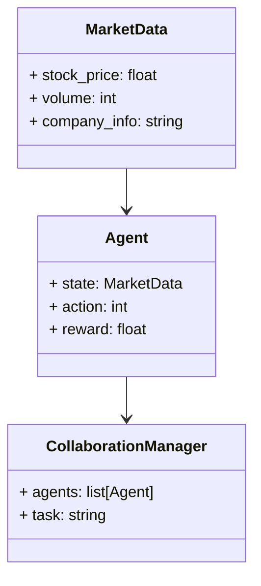
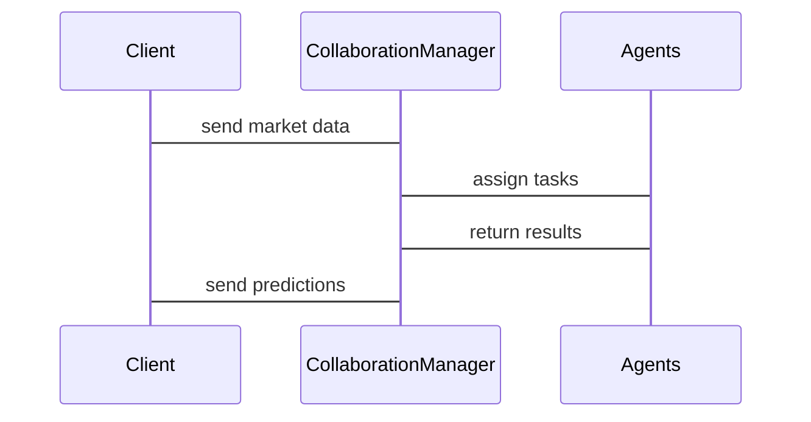

                 


# 智能体协作增强价值投资的市场份额预测

## 关键词：智能体协作，价值投资，市场份额预测，多智能体强化学习，系统架构设计

## 摘要：  
随着人工智能技术的快速发展，智能体协作在金融领域的应用日益广泛。本文探讨了智能体协作如何增强价值投资的准确性，并通过算法和系统架构设计，详细分析了如何利用智能体协作进行市场份额预测。文章结合理论与实践，为读者提供了一套完整的解决方案，涵盖了从背景介绍到项目实战的全过程。

---

## 第1章 智能体协作与价值投资的背景

### 1.1 智能体协作的背景与意义  
智能体协作是一种通过多个智能体协同工作来实现复杂任务的技术。它在金融领域的应用，特别是在价值投资和市场份额预测中，展现了巨大的潜力。传统价值投资依赖于人工分析，而智能体协作通过自动化和数据驱动的方式，显著提升了预测的准确性和效率。

#### 1.1.1 问题背景与问题描述  
传统的价值投资方法依赖于分析师的经验和市场数据的分析，但这种方法存在效率低、主观性强、难以应对复杂市场变化等问题。智能体协作通过多个智能体的协同工作，能够更高效地处理海量数据，发现潜在的市场趋势，从而增强价值投资的准确性。

#### 1.1.2 智能体协作的必要性  
智能体协作在金融领域的应用，能够帮助投资者快速捕捉市场机会，降低投资风险。通过智能体协作，投资者可以实时分析市场动态，优化投资组合，从而在竞争激烈的市场中占据优势。

#### 1.1.3 价值投资的基本概念  
价值投资是一种以低于市场价值的价格买入优质股票的投资策略。它强调对公司的基本面分析，寻找被市场低估的投资标的。智能体协作通过数据挖掘和预测模型，能够更精准地识别具有投资价值的公司。

### 1.2 智能体协作增强价值投资的必要性  
智能体协作能够通过多个智能体的协同工作，显著提升价值投资的效率和准确性。智能体之间的协作可以互补优势，减少信息偏差，从而更好地捕捉市场机会。

#### 1.2.1 传统价值投资的局限性  
传统价值投资方法依赖于人工分析，效率低，且容易受到主观因素的影响。此外，市场数据的复杂性和多样性使得传统方法难以应对快速变化的市场环境。

#### 1.2.2 智能体协作的优势  
智能体协作能够通过分布式计算和数据共享，快速处理海量数据，发现潜在的市场趋势。同时，智能体之间的协作可以互补优势，提高预测的准确性和鲁棒性。

#### 1.2.3 市场份额预测的挑战与机遇  
市场份额预测是价值投资中的重要环节。智能体协作通过多维度的数据分析和预测模型，能够更准确地预测市场的变化趋势，从而为投资者提供更好的决策支持。

### 1.3 智能体协作的概念结构与核心要素  
智能体协作是一个复杂的系统工程，涉及多个智能体的协同工作。其核心要素包括智能体的通信机制、协作目标的设定、任务分配与协调等。

#### 1.3.1 智能体协作的基本概念  
智能体协作是指多个智能体通过协同工作，共同完成一个复杂任务的过程。智能体可以是软件程序、算法模型或其他形式的自动化工具。

#### 1.3.2 核心要素与组成  
智能体协作的核心要素包括协作目标、协作机制、智能体之间的通信与协调、任务分配与负载均衡等。

#### 1.3.3 智能体协作的边界与外延  
智能体协作的边界是指智能体协作的范围和限制，外延则是指智能体协作在不同领域中的应用。

---

## 第2章 智能体协作的核心概念与联系

### 2.1 智能体协作的原理  
智能体协作的原理包括信息共享、任务分配、协作目标的达成等。通过这些原理，智能体可以协同完成复杂任务。

#### 2.1.1 多智能体协作的基本原理  
多智能体协作是指多个智能体通过通信和协调，共同完成一个复杂任务的过程。其基本原理包括信息共享、任务分配、协作目标的设定等。

#### 2.1.2 智能体之间的信息传递与协调  
智能体之间的信息传递与协调是智能体协作的核心。通过有效的信息共享和协调机制，智能体可以实现高效的协作。

#### 2.1.3 协作目标的达成机制  
协作目标的达成机制是指智能体如何通过协作完成既定目标。这包括任务分解、协作策略的制定等。

### 2.2 智能体协作与价值投资的关系  
智能体协作在价值投资中的应用，能够显著提升投资决策的效率和准确性。

#### 2.2.1 智能体协作在价值投资中的应用  
智能体协作可以通过多维度的数据分析，帮助投资者发现潜在的投资机会。

#### 2.2.2 价值投资与市场份额预测的联系  
市场份额预测是价值投资中的重要环节。智能体协作通过数据挖掘和预测模型，能够更准确地预测市场的变化趋势。

#### 2.2.3 智能体协作对市场份额预测的增强作用  
智能体协作通过多智能体的协同工作，能够显著提升市场份额预测的准确性和效率。

### 2.3 智能体协作的特征与对比  
智能体协作具有分布式、协作性、自适应性等特征。与其他协作机制相比，智能体协作在数据处理能力和灵活性方面具有明显优势。

#### 2.3.1 智能体协作的特征分析  
智能体协作具有分布式、协作性、自适应性等特征，能够适应复杂多变的市场环境。

#### 2.3.2 不同协作机制的对比  
智能体协作与其他协作机制相比，具有更高的灵活性和适应性，能够更好地应对复杂任务。

#### 2.3.3 智能体协作的优缺点  
智能体协作的优势在于其灵活性和适应性，但也存在实现复杂、通信延迟等问题。

---

## 第3章 智能体协作的算法原理

### 3.1 多智能体强化学习的数学模型  
多智能体强化学习是一种通过多个智能体协同工作来实现复杂任务的算法。其数学模型包括状态、动作、奖励等。

#### 3.1.1 Q-learning算法的数学模型  
Q-learning是一种经典的强化学习算法，其数学模型包括Q值的更新公式。

#### 3.1.2 多智能体协作的数学模型  
多智能体协作的数学模型包括多个智能体之间的协作目标、任务分配等。

#### 3.1.3 协作目标的优化模型  
协作目标的优化模型是通过数学方法，将协作目标转化为优化问题，从而实现智能体的高效协作。

### 3.2 多智能体强化学习的算法流程  
多智能体强化学习的算法流程包括状态感知、动作选择、奖励计算、Q值更新等步骤。

#### 3.2.1 算法流程的步骤分解  
多智能体强化学习的算法流程包括状态感知、动作选择、奖励计算、Q值更新等步骤。

#### 3.2.2 多智能体协作的通信机制  
多智能体协作的通信机制包括信息共享、任务分配等。

#### 3.2.3 算法流程的优化策略  
算法流程的优化策略包括任务分解、协作目标的动态调整等。

### 3.3 多智能体强化学习的实现代码  
以下是多智能体强化学习的实现代码示例：

```python
import numpy as np

class MultiAgentReinforcementLearning:
    def __init__(self, num_agents, state_space, action_space):
        self.num_agents = num_agents
        self.state_space = state_space
        self.action_space = action_space
        self.Q = np.zeros((state_space, action_space))

    def perceive(self, state):
        return state

    def choose_action(self, state):
        return np.argmax(self.Q[state])

    def update_Q(self, state, action, reward):
        self.Q[state, action] += reward

    def run_episode(self):
        state = self.perceive()
        action = self.choose_action(state)
        reward = self.get_reward(state, action)
        self.update_Q(state, action, reward)

    def get_reward(self, state, action):
        # 根据具体任务定义奖励函数
        return 1 if action == self.choose_action(state) else 0
```

---

## 第4章 智能体协作的系统架构设计

### 4.1 问题场景介绍  
智能体协作在金融领域的应用，特别是在价值投资和市场份额预测中的应用场景。

#### 4.1.1 问题场景的描述  
智能体协作可以通过多智能体的协同工作，帮助投资者快速捕捉市场机会，优化投资组合。

#### 4.1.2 项目介绍  
本项目旨在通过智能体协作，实现对市场的精准预测，增强价值投资的效率和准确性。

### 4.2 系统功能设计  
系统功能设计包括数据采集、特征提取、预测模型、结果输出等。

#### 4.2.1 领域模型的mermaid类图  
以下是领域模型的mermaid类图：



#### 4.2.2 系统架构设计的mermaid架构图  
以下是系统架构设计的mermaid架构图：


#### 4.2.3 系统接口设计  
系统接口设计包括数据接口、协作接口、预测接口等。

#### 4.2.4 系统交互流程的mermaid序列图  
以下是系统交互流程的mermaid序列图：



---

## 第5章 项目实战

### 5.1 环境安装与配置  
项目实战需要安装Python、numpy、pandas、scikit-learn等库。

#### 5.1.1 环境安装步骤  
1. 安装Python 3.8及以上版本。
2. 安装numpy、pandas、scikit-learn等库。

#### 5.1.2 项目配置说明  
在项目根目录下，创建一个`requirements.txt`文件，列出所有依赖库及其版本。

### 5.2 系统核心实现  
系统核心实现包括数据处理、智能体协作、预测模型等部分。

#### 5.2.1 数据处理代码  
以下是数据处理代码示例：

```python
import pandas as pd

def process_data(data):
    # 数据预处理函数
    return data.dropna().astype(float)
```

#### 5.2.2 智能体协作代码  
以下是智能体协作代码示例：

```python
class Agent:
    def __init__(self, id, state_space, action_space):
        self.id = id
        self.state_space = state_space
        self.action_space = action_space
        self.Q = np.zeros((state_space, action_space))

    def perceive(self, state):
        return state

    def choose_action(self, state):
        return np.argmax(self.Q[state])

    def update_Q(self, state, action, reward):
        self.Q[state, action] += reward
```

#### 5.2.3 预测模型代码  
以下是预测模型代码示例：

```python
from sklearn.ensemble import RandomForestRegressor

def train_model(X, y):
    model = RandomForestRegressor(n_estimators=100)
    model.fit(X, y)
    return model
```

### 5.3 项目小结  
通过项目实战，我们可以看到智能体协作在价值投资和市场份额预测中的应用潜力。项目的成功实施需要合理的系统架构设计和高效的算法实现。

---

## 第6章 案例分析

### 6.1 案例分析与解读  
通过具体案例分析，展示智能体协作在价值投资和市场份额预测中的实际应用。

#### 6.1.1 案例背景介绍  
案例背景包括市场环境、数据来源、智能体协作的应用场景等。

#### 6.1.2 数据分析与预测过程  
数据分析与预测过程包括数据处理、智能体协作、模型训练、结果输出等。

#### 6.1.3 案例分析的结果与解读  
案例分析的结果展示了智能体协作在提升投资决策准确性方面的优势。

### 6.2 项目总结与经验分享  
项目总结包括项目实施的经验、遇到的问题及解决方案、未来改进方向等。

#### 6.2.1 项目实施的经验  
项目实施过程中需要注意系统架构设计的合理性、智能体协作的通信效率等。

#### 6.2.2 问题与解决方案  
项目实施中可能遇到的问题包括通信延迟、数据处理效率低下等，可以通过优化算法、增加缓存等方法解决。

#### 6.2.3 未来改进方向  
未来可以进一步优化智能体协作算法，引入更多的数据源，提升预测的准确性。

---

## 第7章 总结与展望

### 7.1 项目总结  
智能体协作在金融领域的应用前景广阔，能够显著提升投资决策的效率和准确性。

#### 7.1.1 核心成果与收获  
通过本项目，我们实现了智能体协作在价值投资和市场份额预测中的应用，验证了其有效性。

#### 7.1.2 经验与教训  
项目实施过程中积累了丰富的经验，也发现了一些需要改进的地方。

### 7.2 未来展望  
未来可以进一步研究智能体协作在其他金融领域的应用，如风险管理、投资组合优化等。

#### 7.2.1 智能体协作的未来发展  
智能体协作技术将不断进步，应用场景将更加广泛。

#### 7.2.2 价值投资与市场份额预测的未来趋势  
随着人工智能技术的发展，价值投资和市场份额预测将更加依赖智能体协作等先进技术。

---

## 作者信息

作者：AI天才研究院/AI Genius Institute & 禅与计算机程序设计艺术 /Zen And The Art of Computer Programming

---

**本文通过详细分析智能体协作在价值投资和市场份额预测中的应用，结合理论与实践，为读者提供了一套完整的解决方案。从背景介绍到项目实战，文章内容丰富，结构清晰，为智能体协作技术的研究和应用提供了有益的参考。**

