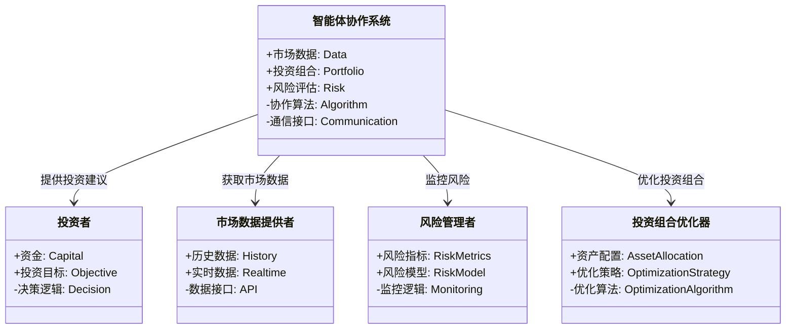

                 


# 智能体协作增强价值投资的市场异常识别

> 关键词：智能体协作，价值投资，市场异常识别，多智能体系统，异常检测

> 摘要：本文探讨了智能体协作在价值投资中的应用，特别是如何通过智能体协作来增强市场异常识别能力。文章从智能体协作的基本概念出发，分析了其在金融领域的应用，详细讲解了市场异常识别的算法原理和系统架构设计，最后通过项目实战展示了智能体协作在价值投资中的实际应用。

---

## 第1章: 智能体协作与价值投资的背景

### 1.1 智能体协作的基本概念

#### 1.1.1 智能体的定义与特征

智能体（Agent）是指在计算机科学中，能够感知环境并采取行动以实现目标的实体。智能体可以是软件程序、机器人或其他任何具备自主决策能力的系统。智能体具备以下特征：
- **自主性**：能够在没有外部干预的情况下自主决策。
- **反应性**：能够根据环境的变化调整行为。
- **主动性**：主动采取行动以实现目标。
- **社会性**：能够与其他智能体或人类进行交互和协作。

#### 1.1.2 智能体协作的定义与分类

智能体协作是指多个智能体为了共同目标而协同工作的过程。协作可以通过以下方式实现：
- **直接协作**：智能体之间共享信息和资源，共同完成任务。
- **间接协作**：智能体通过环境中的中介进行间接协作，例如通过修改环境状态来影响其他智能体的行为。
- **分布式协作**：智能体在不同地理位置或计算资源上协作，通常用于大规模分布式系统。

智能体协作可以分为以下几类：
- **任务协作**：智能体协作完成特定任务。
- **信息协作**：智能体通过共享信息来提高整体决策能力。
- **资源协作**：智能体共享计算资源以提高效率。

#### 1.1.3 智能体协作在金融领域的应用

在金融领域，智能体协作可以应用于多个方面，包括：
- **交易决策**：多个智能体协作进行交易决策，优化投资组合。
- **风险控制**：智能体协作识别市场风险，制定风险管理策略。
- **市场分析**：智能体协作分析市场数据，识别市场趋势和异常。

### 1.2 价值投资的核心理念

#### 1.2.1 价值投资的基本原理

价值投资是一种投资策略，强调以低于内在价值的价格购买优质资产。其核心理念是：
- **寻找低估资产**：通过分析公司的基本面，寻找市场价格低于其内在价值的股票。
- **长期投资**：价值投资者倾向于长期持有资产，等待市场回归其内在价值。

#### 1.2.2 价值投资与市场异常的关系

市场异常（Market Anomaly）是指市场价格与内在价值的偏离。价值投资的核心理念是通过识别这些偏离来获利。智能体协作可以增强市场异常识别能力，帮助投资者更有效地发现市场机会。

#### 1.2.3 智能体协作在价值投资中的优势

智能体协作在价值投资中的优势包括：
- **信息共享**：多个智能体可以共享市场数据和分析结果，提高决策的准确性。
- **分布式计算**：通过分布式协作，可以快速处理大量数据，提高计算效率。
- **风险分担**：多个智能体协作可以分担风险，避免单点故障。

### 1.3 市场异常识别的挑战与机遇

#### 1.3.1 市场异常的定义与分类

市场异常可以分为以下几类：
- **短期异常**：短时间内价格的剧烈波动。
- **长期异常**：价格长期偏离内在价值。
- **结构性异常**：市场结构变化导致的价格异常。

#### 1.3.2 智能体协作在市场异常识别中的作用

智能体协作可以通过以下方式增强市场异常识别能力：
- **数据共享**：智能体之间共享市场数据，提高分析的全面性。
- **分布式计算**：通过分布式计算，快速处理大量数据，提高异常识别的效率。
- **协同分析**：多个智能体协同分析市场数据，识别潜在的异常。

#### 1.3.3 价值投资与市场异常识别的结合

价值投资与市场异常识别的结合可以通过以下方式实现：
- **智能体协作分析市场数据**：通过智能体协作分析市场数据，识别潜在的投资机会。
- **动态调整投资策略**：根据市场异常的变化，动态调整投资策略，提高投资收益。

---

## 第2章: 智能体协作的核心概念与联系

### 2.1 智能体协作的核心原理

#### 2.1.1 智能体协作的数学模型

智能体协作的数学模型可以表示为：
$$
\text{协作效果} = f(\text{智能体数量}, \text{协作方式}, \text{任务复杂度})
$$

其中，$f$ 是一个函数，表示智能体协作的效果与智能体数量、协作方式和任务复杂度之间的关系。

#### 2.1.2 智能体协作的算法框架

智能体协作的算法框架通常包括以下步骤：
1. **初始化**：设置智能体的初始状态。
2. **感知环境**：智能体感知环境并获取相关信息。
3. **决策与行动**：智能体根据感知的信息做出决策并采取行动。
4. **协作与通信**：智能体之间进行协作和通信，共享信息和资源。
5. **评估与优化**：评估协作效果并进行优化。

#### 2.1.3 智能体协作的优化策略

智能体协作的优化策略包括：
- **局部优化**：优化单个智能体的行为。
- **全局优化**：优化整个协作系统的行为。
- **动态优化**：根据环境的变化动态调整协作策略。

### 2.2 实体关系图与类图分析

#### 2.2.1 智能体协作的实体关系图（ER图）

```mermaid
erDiagram
    actor 投资者
    actor 市场数据提供者
    actor 风险管理者
    actor 智能体协作系统
    actor 投资组合优化器
    投资者 --> 智能体协作系统 : 委托投资
    市场数据提供者 --> 智能体协作系统 : 提供市场数据
    风险管理者 --> 智能体协作系统 : 监控风险
    投资组合优化器 --> 智能体协作系统 : 优化投资组合
```

#### 2.2.2 价值投资的类图分析



#### 2.2.3 市场异常识别的系统架构图


---

## 第3章: 智能体协作的算法原理

### 3.1 基于智能体的协作算法

#### 3.1.1 多智能体协作算法概述

多智能体协作算法通常包括以下步骤：
1. **初始化**：设置智能体的初始状态。
2. **感知环境**：智能体感知环境并获取相关信息。
3. **决策与行动**：智能体根据感知的信息做出决策并采取行动。
4. **协作与通信**：智能体之间进行协作和通信，共享信息和资源。
5. **评估与优化**：评估协作效果并进行优化。

#### 3.1.2 智能体协作的数学模型

智能体协作的数学模型可以表示为：
$$
\text{协作效果} = f(\text{智能体数量}, \text{协作方式}, \text{任务复杂度})
$$

其中，$f$ 是一个函数，表示智能体协作的效果与智能体数量、协作方式和任务复杂度之间的关系。

#### 3.1.3 智能体协作的实现步骤

智能体协作的实现步骤如下：
1. **初始化**：设置智能体的初始状态。
2. **感知环境**：智能体感知环境并获取相关信息。
3. **决策与行动**：智能体根据感知的信息做出决策并采取行动。
4. **协作与通信**：智能体之间进行协作和通信，共享信息和资源。
5. **评估与优化**：评估协作效果并进行优化。

---

## 第4章: 智能体协作的系统架构与设计

### 4.1 系统功能设计

#### 4.1.1 智能体协作的功能模块划分

智能体协作系统可以划分为以下功能模块：
- **数据采集模块**：负责采集市场数据。
- **数据分析模块**：负责分析市场数据，识别异常。
- **投资决策模块**：根据分析结果制定投资策略。
- **风险监控模块**：监控投资风险，调整投资策略。

#### 4.1.2 价值投资的系统功能设计

价值投资系统的功能设计包括：
- **市场数据分析**：分析市场数据，识别低估资产。
- **投资组合优化**：优化投资组合，分散风险。
- **风险监控**：监控投资组合的风险，及时调整投资策略。

#### 4.1.3 市场异常识别的系统功能

市场异常识别系统的功能设计包括：
- **数据采集**：采集市场数据。
- **异常检测**：识别市场异常。
- **异常分类**：对异常进行分类，确定异常的类型。
- **异常报告**：生成异常报告，提供给投资者参考。

### 4.2 系统架构设计

#### 4.2.1 分层架构设计

智能体协作系统的分层架构设计包括：
- **数据层**：负责数据的存储和管理。
- **业务逻辑层**：负责业务逻辑的实现。
- **用户界面层**：负责与用户的交互。

#### 4.2.2 智能体协作的分布式架构

智能体协作的分布式架构设计包括：
- **分布式数据采集**：多个智能体分别采集数据。
- **分布式数据分析**：多个智能体分别分析数据。
- **分布式投资决策**：多个智能体分别制定投资策略。

#### 4.2.3 系统的可扩展性设计

系统的可扩展性设计包括：
- **模块化设计**：系统模块化设计，便于扩展。
- **接口设计**：设计良好的接口，便于与其他系统集成。
- **动态扩展**：系统可以动态扩展，适应业务需求的变化。

---

## 第5章: 智能体协作的项目实战

### 5.1 环境配置与数据准备

#### 5.1.1 开发环境的安装与配置

开发环境的安装与配置包括：
- **操作系统**：建议使用Linux或Windows。
- **编程语言**：建议使用Python。
- **开发工具**：安装Jupyter Notebook或PyCharm。

#### 5.1.2 数据集的获取与预处理

数据集的获取与预处理包括：
- **数据来源**：可以从金融数据供应商获取市场数据。
- **数据清洗**：清洗数据，去除缺失值和异常值。
- **数据转换**：将数据转换为适合分析的形式，例如标准化或归一化。

#### 5.1.3 数据特征的提取与分析

数据特征的提取与分析包括：
- **特征选择**：选择重要的特征，例如市盈率、市净率等。
- **特征工程**：对特征进行工程处理，例如标准化、归一化等。
- **特征分析**：分析特征与目标变量之间的关系。

### 5.2 系统核心代码实现

#### 5.2.1 智能体协作算法的实现

智能体协作算法的实现代码如下：

```python
class Agent:
    def __init__(self, id):
        self.id = id
        self.state = None
        self.goal = None

    def perceive(self, environment):
        self.state = environment.get_state(self.id)

    def decide(self):
        pass

    def act(self):
        pass

class CollaborativeAgentSystem:
    def __init__(self, agents):
        self.agents = agents
        self.environment = None

    def set_environment(self, environment):
        self.environment = environment

    def run(self):
        for agent in self.agents:
            agent.perceive(self.environment)
            agent.decide()
            agent.act()
```

#### 5.2.2 市场异常识别的代码实现

市场异常识别的代码实现如下：

```python
import numpy as np
import pandas as pd

def detect_anomaly(data, threshold=3):
    mean = np.mean(data)
    std = np.std(data)
    anomalies = []
    for value in data:
        if np.abs(value - mean) > threshold * std:
            anomalies.append(value)
    return anomalies

data = pd.read_csv('market_data.csv')
anomalies = detect_anomaly(data['price'])
print(anomalies)
```

#### 5.2.3 投资组合优化的代码实现

投资组合优化的代码实现如下：

```python
import numpy as np
import pandas as pd
from sklearn.decomposition import PCA

def optimize_portfolio(returns, n_assets=10):
    cov_matrix = np.cov(returns)
    eigen_values, eigen_vectors = np.linalg.eigh(cov_matrix)
    portfolio = eigen_vectors[:, 0]
    return portfolio

data = pd.read_csv('returns.csv')
portfolio = optimize_portfolio(data.returns)
print(portfolio)
```

### 5.3 实际案例分析

#### 5.3.1 案例背景与数据准备

假设我们有一个包含股票价格数据的CSV文件，我们需要识别其中的市场异常。

#### 5.3.2 数据预处理与特征提取

数据预处理包括清洗数据和转换数据。特征提取包括选择重要的特征，例如市盈率、市净率等。

#### 5.3.3 模型训练与评估

模型训练包括训练智能体协作算法和市场异常识别算法。评估包括评估模型的准确率和召回率。

#### 5.3.4 系统实现与结果分析

系统实现包括实现智能体协作算法和市场异常识别算法。结果分析包括分析识别的异常和优化的投资组合。

---

## 第6章: 智能体协作的优化与展望

### 6.1 算法优化策略

#### 6.1.1 智能体协作的算法优化

智能体协作的算法优化包括：
- **局部优化**：优化单个智能体的行为。
- **全局优化**：优化整个协作系统的行为。
- **动态优化**：根据环境的变化动态调整协作策略。

#### 6.1.2 市场异常识别的算法优化

市场异常识别的算法优化包括：
- **特征选择优化**：选择更重要的特征。
- **模型优化**：优化模型的参数和结构。
- **数据预处理优化**：优化数据预处理的方法。

### 6.2 系统性能提升

#### 6.2.1 算法性能优化

算法性能优化包括：
- **计算效率优化**：优化算法的计算效率。
- **内存优化**：优化算法的内存使用。
- **并行计算优化**：利用并行计算提高算法的效率。

#### 6.2.2 系统性能优化

系统性能优化包括：
- **分布式计算**：利用分布式计算提高系统的计算能力。
- **负载均衡**：实现负载均衡，提高系统的吞吐量。
- **容错设计**：实现容错设计，提高系统的可靠性。

### 6.3 未来研究方向

#### 6.3.1 多模态数据融合

多模态数据融合包括：
- **文本数据融合**：利用新闻和社交媒体数据进行市场分析。
- **图像数据融合**：利用图像数据进行市场分析。
- **语音数据融合**：利用语音数据进行市场分析。

#### 6.3.2 智能体协作的边缘计算

智能体协作的边缘计算包括：
- **边缘智能体**：在边缘设备上部署智能体。
- **边缘计算与协作**：利用边缘计算技术进行智能体协作。

#### 6.3.3 分布式智能

分布式智能包括：
- **分布式协作**：实现智能体的分布式协作。
- **分布式学习**：实现智能体的分布式学习。
- **分布式决策**：实现智能体的分布式决策。

---

## 第7章: 结论与展望

### 7.1 最佳实践 Tips

- **数据质量**：确保数据质量，清洗和预处理数据。
- **模型选择**：选择适合的模型，避免过拟合和欠拟合。
- **系统优化**：优化系统性能，提高计算效率。
- **持续学习**：持续学习和优化，跟上技术的发展。

### 7.2 小结

智能体协作在价值投资中的应用前景广阔，特别是在市场异常识别方面。通过智能体协作，可以提高投资决策的准确性和效率，降低投资风险。

### 7.3 注意事项

- **数据隐私**：注意数据隐私，遵守相关法律法规。
- **系统安全**：确保系统的安全性，防止数据泄露和攻击。
- **模型解释性**：确保模型的解释性，便于理解和优化。

### 7.4 拓展阅读

- **智能体协作**：推荐阅读相关书籍和论文，深入理解智能体协作的原理和应用。
- **价值投资**：推荐阅读价值投资的经典书籍，如《聪明的投资者》。
- **市场异常识别**：推荐阅读相关研究论文，了解最新的研究成果。

---

## 作者：AI天才研究院/AI Genius Institute & 禅与计算机程序设计艺术/Zen And The Art of Computer Programming

