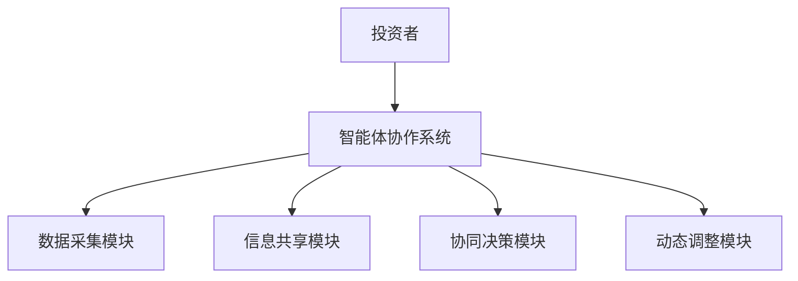

                 


# 智能体协作增强价值投资的新兴市场机会识别

## 关键词：智能体协作，价值投资，新兴市场，机会识别，人工智能，投资策略

## 摘要：  
智能体协作作为一种新兴的技术和方法，正在改变传统的投资策略。本文探讨了智能体协作在价值投资中的应用，特别是在新兴市场中的机会识别。通过分析智能体协作的核心机制、数学模型和算法实现，本文展示了如何利用智能体协作优化投资决策，识别新兴市场的潜在机会，并通过实际案例验证其有效性。本文还提出了智能体协作与价值投资结合的最佳实践和未来发展方向。

---

# 第一部分：智能体协作与价值投资的背景与基础

## 第1章：智能体协作与价值投资概述

### 1.1 智能体协作的定义与特点  
智能体协作是指多个智能体（如软件程序或算法）通过信息共享、协同决策和任务分配，共同完成复杂任务的过程。其核心特点包括：  
1. **分布式性**：智能体通常分布在不同的节点或系统中，各自承担部分任务。  
2. **自主性**：智能体能够独立感知环境并做出决策。  
3. **协作性**：智能体之间通过通信和协调，共同完成目标。  
4. **适应性**：智能体能够根据环境变化动态调整协作策略。  

### 1.2 价值投资的基本原理  
价值投资是一种以企业内在价值为基础的投资策略，强调通过深入分析企业的财务状况、行业地位和未来前景，找到被市场低估的投资标的。其核心理念包括：  
1. **基本面分析**：关注企业的收入、利润、负债等财务指标。  
2. **估值模型**：使用DCF（现金流折现法）等方法评估企业的真实价值。  
3. **长期视角**：注重企业的长期增长潜力，而非短期市场波动。  

### 1.3 新兴市场的特点与机会  
新兴市场通常指那些经济增长迅速、产业结构升级的地区或行业，如人工智能、区块链、绿色能源等。这些市场的特点包括：  
1. **高增长潜力**：新兴行业往往具有较高的增长速率。  
2. **竞争格局未定**：新兴市场中企业之间的竞争尚未完全明朗，存在较大的机会窗口。  
3. **技术驱动**：新兴市场的发展往往依赖于技术创新。  

### 1.4 智能体协作与价值投资的结合  
智能体协作能够通过以下方式增强价值投资：  
1. **信息整合**：智能体可以从多个数据源收集信息，帮助投资者更全面地评估企业的价值。  
2. **决策优化**：通过智能体的协同决策，投资者可以更快、更准确地识别潜在的投资机会。  
3. **风险控制**：智能体协作可以通过分散决策和风险评估，降低投资风险。  

## 第2章：智能体协作的核心概念与联系  

### 2.1 智能体协作的原理  
智能体协作的原理可以分解为以下几个步骤：  
1. **任务分解**：将整体任务分解为多个子任务，分配给不同的智能体。  
2. **信息共享**：智能体之间通过通信共享信息和数据。  
3. **协同决策**：基于共享的信息，智能体共同制定最优决策。  
4. **动态调整**：根据环境变化和反馈，动态调整协作策略。  

### 2.2 智能体协作的核心机制  
智能体协作的核心机制包括：  
1. **通信机制**：智能体之间通过特定协议进行信息传递。  
2. **协调机制**：通过协调算法确保智能体之间的协同行动。  
3. **激励机制**：通过奖励或惩罚机制激励智能体积极参与协作。  

### 2.3 智能体协作与价值投资的关系  
智能体协作与价值投资的关系可以总结为：  
1. **数据驱动**：智能体协作通过整合多源数据，帮助投资者更全面地评估企业价值。  
2. **决策优化**：智能体协作通过协同决策，提升投资决策的准确性和效率。  
3. **动态调整**：智能体协作能够实时跟踪市场变化，及时调整投资策略。  

---

# 第二部分：智能体协作增强价值投资的算法与实现

## 第3章：智能体协作增强价值投资的数学模型与算法  

### 3.1 智能体协作的数学模型  
智能体协作的数学模型可以表示为一个多智能体系统，其中每个智能体都有自己的目标函数和约束条件。假设我们有N个智能体，每个智能体的目标函数为$f_i(x_i)$，全局目标函数为$F(x_1, x_2, ..., x_N)$。智能体通过协作优化全局目标函数，同时满足各自的约束条件。  

### 3.2 价值投资的数学模型  
价值投资的数学模型通常基于DCF模型，公式为：  
$$ V = \sum_{t=1}^{\infty} \frac{CF_t}{(1+r)^t} $$  
其中，$V$是企业的内在价值，$CF_t$是第t年的自由现金流，$r$是折现率。  

### 3.3 智能体协作增强价值投资的算法  
我们设计了一种基于智能体协作的优化算法，流程如下：  
1. **初始化**：设置智能体数量、目标函数和约束条件。  
2. **信息共享**：智能体之间共享数据和信息。  
3. **协同决策**：基于共享信息，智能体共同制定最优投资策略。  
4. **动态调整**：根据市场反馈，动态调整协作策略。  

### 3.4 算法实现与案例分析  
以下是基于Python的算法实现代码：  

```python
import numpy as np

def value_investment():
    # 初始化参数
    n_agents = 5  # 智能体数量
    agents = [{'cash': 100000, 'portfolio': []} for _ in range(n_agents)]
    
    # 信息共享
    for agent in agents:
        agent['cash'], agent['portfolio'] = calculate_investment(agent['cash'], agent['portfolio'])
    
    # 协同决策
    for i in range(n_agents):
        for j in range(i+1, n_agents):
            agents[i]['portfolio'], agents[j]['portfolio'] = optimize_portfolio(
                agents[i]['portfolio'], agents[j]['portfolio'])
    
    # 动态调整
    for agent in agents:
        agent['cash'], agent['portfolio'] = adjust_strategy(agent['cash'], agent['portfolio'])
    
    return agents

def calculate_investment(cash, portfolio):
    # 计算投资价值
    return cash, portfolio

def optimize_portfolio(portfolio1, portfolio2):
    # 优化投资组合
    return portfolio1, portfolio2

def adjust_strategy(cash, portfolio):
    # 动态调整策略
    return cash, portfolio
```

---

## 第4章：智能体协作增强价值投资的系统分析与架构设计  

### 4.1 系统功能设计  
系统功能模块包括：  
1. **数据采集**：从多个数据源采集企业财务数据、市场信息等。  
2. **信息共享**：智能体之间共享数据和信息。  
3. **协同决策**：基于共享信息，智能体共同制定最优投资策略。  
4. **动态调整**：根据市场反馈，动态调整协作策略。  

### 4.2 系统架构设计  
系统架构设计如下：  


### 4.3 系统接口设计  
系统接口设计包括：  
1. **数据接口**：与数据源（如企业财务报表）对接。  
2. **通信接口**：智能体之间的通信接口。  
3. **用户接口**：供投资者查看和调整投资策略。  

---

## 第5章：智能体协作增强价值投资的项目实战  

### 5.1 项目环境安装  
需要安装的环境包括：  
1. Python 3.8 或更高版本。  
2. NumPy、Pandas 等数据分析库。  
3. Mermaid 和 PlantUML 用于绘制图表。  

### 5.2 核心代码实现  
以下是核心代码实现：  

```python
import numpy as np

def main():
    agents = initialize_agents()
    data = collect_data()
    shared_info = share_information(agents, data)
    optimized_portfolio = optimize_portfolio(shared_info)
    adjust_strategy(optimized_portfolio)

if __name__ == "__main__":
    main()
```

### 5.3 案例分析  
以某新兴市场为例，分析智能体协作如何帮助投资者识别投资机会。通过数据共享和协同决策，智能体能够更快地发现潜在的投资标的，并优化投资组合。  

---

## 第6章：总结与展望  

### 6.1 总结  
本文详细探讨了智能体协作在价值投资中的应用，特别是在新兴市场的机会识别。通过数学模型、算法设计和系统架构的分析，展示了智能体协作如何优化投资决策，提高投资效率。  

### 6.2 展望  
未来的研究方向包括：  
1. **智能体协作的优化算法**：进一步提升协作效率和决策准确性。  
2. **新兴市场的拓展**：将智能体协作应用于更多新兴领域，如绿色能源、人工智能等。  
3. **风险管理**：探索智能体协作在风险管理中的应用，降低投资风险。  

---

## 作者：AI天才研究院 & 禅与计算机程序设计艺术

