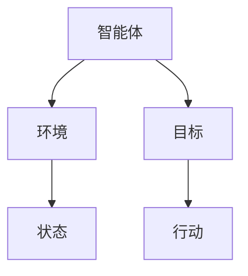
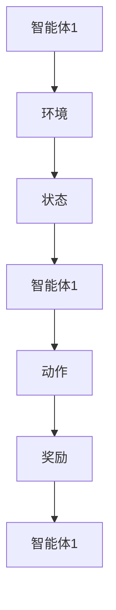
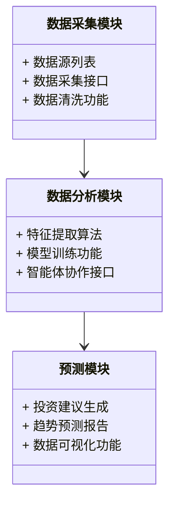
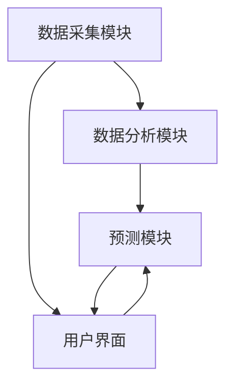
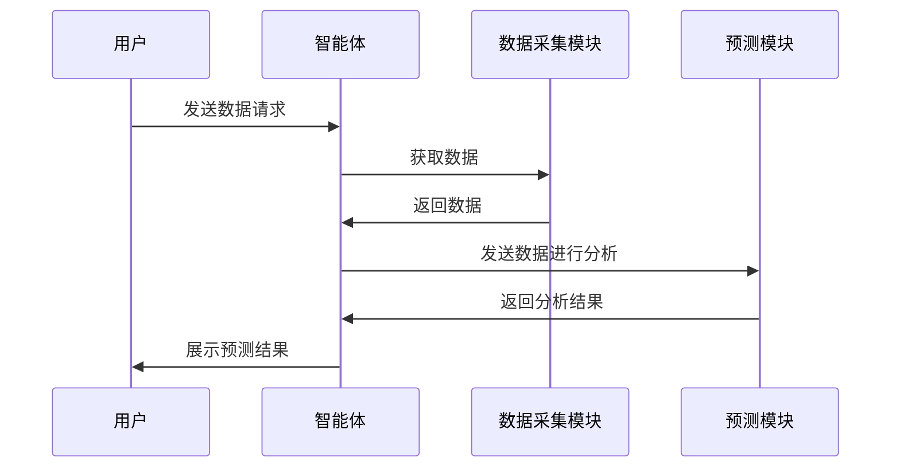

                 


# 智能体协作增强价值投资的行业趋势预测

## 关键词：智能体协作，价值投资，行业趋势预测，人工智能，协作学习，金融数据分析

## 摘要：
随着人工智能技术的快速发展，智能体协作在价值投资和行业趋势预测中的应用日益广泛。本文通过分析智能体协作的核心概念、算法原理、系统架构，以及实际项目案例，探讨如何利用智能体协作技术提升价值投资的准确性和效率。文章从理论到实践，系统地展示了智能体协作在金融领域的潜力和应用，为投资者和研究人员提供了新的视角和方法。

---

## 第一部分：智能体协作与价值投资的背景介绍

### 第1章：智能体协作的基本概念

#### 1.1 问题背景与问题描述
传统的金融分析依赖于人类专家的经验和市场数据的统计分析，但这种方法在面对复杂多变的市场环境时显得力不从心。价值投资需要对企业的基本面、市场趋势、行业动态等多方面进行深入分析，而行业趋势预测则需要综合考虑宏观经济、政策变化、技术创新等多种因素。智能体协作作为一种新兴的技术手段，能够通过多智能体之间的协同合作，提高分析的全面性和准确性，从而为价值投资和行业趋势预测提供更强大的支持。

#### 1.2 问题解决与边界
智能体协作在价值投资中的应用价值主要体现在以下几个方面：
- 提高分析效率：通过分布式计算和协同推理，智能体协作能够快速处理海量数据，缩短分析时间。
- 增强决策的准确性：多个智能体从不同角度进行分析，能够提供更全面的视角，减少单一决策的偏差。
- 适应复杂环境：智能体协作能够动态调整策略，适应市场的快速变化，提高预测的灵活性。

智能体协作在价值投资中的边界主要在于其数据来源和模型的局限性。例如，智能体协作依赖于高质量的数据输入，如果数据不完整或存在偏差，可能会影响分析结果。此外，智能体协作的决策过程缺乏人类专家的直觉和经验，可能在某些复杂场景下表现不足。

#### 1.3 核心概念与结构
智能体协作的核心要素包括：
- **智能体**：具有感知环境和执行动作能力的实体，能够独立完成特定任务。
- **协作机制**：智能体之间通过通信协议进行信息交换和任务分配，确保协同工作。
- **目标函数**：智能体协作的最终目标，例如最大化投资回报率或最小化预测误差。

价值投资的结构化分析框架包括以下几个步骤：
1. 数据采集：收集企业的财务数据、市场信息、行业动态等。
2. 数据分析：通过智能体协作对数据进行清洗、特征提取和建模。
3. 投资决策：基于分析结果制定投资策略。

行业趋势预测的多维度模型包括：
- **宏观经济因素**：GDP增长率、利率、通货膨胀等。
- **行业动态**：市场需求、竞争格局、技术创新等。
- **政策影响**：政府政策、法律法规等。

---

## 第二部分：智能体协作的核心概念与联系

### 第2章：智能体协作的原理与机制

#### 2.1 多智能体系统的定义与特点
多智能体系统（MAS）是由多个智能体组成的分布式系统，每个智能体具有自主性、反应性和社会性。与单智能体系统相比，多智能体系统具有以下特点：
- **分布式计算**：智能体之间通过分布式计算完成任务，避免单点故障。
- **协同合作**：智能体之间通过通信协议进行信息交换，实现协同合作。
- **动态适应**：智能体能够根据环境变化动态调整策略。

智能体的核心属性对比如下：

| 属性 | 定义 | 示例 |
|------|------|------|
| 自主性 | 智能体能够自主决策 | 自动交易系统 |
| 反应性 | 智能体能够感知环境并做出反应 | 自适应控制系统 |
| 社会性 | 智能体能够与其他智能体协作 | 多人在线游戏中的角色分工 |

#### 2.2 智能体协作机制
智能体协作机制包括任务分配、通信协议和决策模型三个部分。

- **任务分配**：智能体之间通过协商分配任务，确保每个智能体负责特定的子任务。
- **通信协议**：智能体之间通过通信协议交换信息，例如使用JSON格式传递数据。
- **决策模型**：智能体基于共享的信息和目标函数进行决策，例如使用强化学习算法优化策略。

智能体协作的对比分析：

| 机制 | 基于规则 | 基于学习 |
|------|----------|----------|
| 优势 | 实现简单，易于部署 | 具有更强的适应性和灵活性 |
| 劣势 | 难以应对复杂环境 | 需要大量的训练数据和计算资源 |

#### 2.3 智能体协作的ER实体关系图
以下是智能体协作的ER实体关系图：



---

## 第三部分：智能体协作的算法原理

### 第3章：多智能体强化学习算法

#### 3.1 算法流程
多智能体强化学习算法的流程如下：



#### 3.2 算法实现
以下是多智能体强化学习算法的Python代码实现：

```python
import numpy as np
import gym

# 定义智能体类
class Agent:
    def __init__(self, env):
        self.env = env
        self.observation_space = env.observation_space
        self.action_space = env.action_space

    def act(self, observation):
        # 随机选择动作
        return self.env.action_space.sample()

# 创建环境
env = gym.make('CartPole-v0')

# 初始化智能体
agent = Agent(env)

# 训练过程
for _ in range(1000):
    observation = env.reset()
    done = False
    while not done:
        action = agent.act(observation)
        observation, reward, done, info = env.step(action)
        # 更新智能体策略
        # （此处省略详细策略更新代码）

# 展示结果
observation = env.reset()
done = False
while not done:
    action = agent.act(observation)
    observation, reward, done, info = env.step(action)
    env.render()

env.close()
```

#### 3.3 数学模型
多智能体强化学习的数学模型如下：

$$ Q(s, a) = r + \gamma \max Q(s', a') $$

其中：
- \( Q(s, a) \) 表示状态 \( s \) 下采取动作 \( a \) 的价值。
- \( r \) 表示奖励。
- \( \gamma \) 表示折扣因子。
- \( s' \) 表示下一状态。
- \( a' \) 表示下一动作。

例如，假设智能体在状态 \( s \) 下采取动作 \( a \)，获得奖励 \( r = 1 \)，下一状态为 \( s' \)，下一动作为 \( a' \)，则：

$$ Q(s, a) = 1 + 0.9 \times Q(s', a') $$

---

## 第四部分：系统分析与架构设计

### 第4章：系统分析与架构设计

#### 4.1 项目背景
当前金融市场数据量庞大，且变化迅速，传统的单点分析方法难以满足需求。智能体协作通过分布式计算和协同推理，能够高效处理海量数据，为价值投资和行业趋势预测提供支持。

#### 4.2 系统功能设计
系统功能设计包括以下几个模块：
- **数据采集模块**：从多个数据源采集金融数据，例如股票价格、市场新闻等。
- **数据分析模块**：利用智能体协作对数据进行清洗、特征提取和建模。
- **预测模块**：基于分析结果生成投资建议和行业趋势预测报告。

以下是系统功能模块的类图：



#### 4.3 系统架构设计
系统架构采用微服务架构，各模块通过API进行通信。以下是系统架构图：



#### 4.4 接口设计
系统接口采用RESTful API设计，例如：

```json
POST /api/predict
{
    "data": {
        "stock_id": "AAPL",
        "start_date": "2023-01-01",
        "end_date": "2023-12-31"
    }
}
```

响应示例：

```json
{
    "status": "success",
    "result": {
        "trend": "up",
        "probability": 0.85
    }
}
```

#### 4.5 交互流程
以下是用户、智能体和预测模块的交互流程图：



---

## 第五部分：项目实战

### 第5章：项目实战

#### 5.1 环境安装
安装必要的开发环境和工具，例如：
- Python 3.8+
- TensorFlow 2.0+
- Gym 0.15.0+

安装命令：
```bash
pip install numpy gym
```

#### 5.2 核心代码实现
以下是智能体协作模型的训练代码：

```python
import gym
import numpy as np

# 定义智能体类
class Agent:
    def __init__(self, env):
        self.env = env
        self.observation_space = env.observation_space
        self.action_space = env.action_space
        self.Q = np.zeros((self.observation_space.shape[0], self.action_space.n))

    def act(self, observation):
        # 选择动作
        return np.argmax(self.Q[observation])

    def update(self, observation, action, reward, next_observation):
        # 更新Q值
        self.Q[observation][action] = reward + 0.9 * np.max(self.Q[next_observation])

# 创建环境
env = gym.make('CartPole-v0')

# 初始化智能体
agent = Agent(env)

# 训练过程
for episode in range(1000):
    observation = env.reset()
    done = False
    while not done:
        action = agent.act(observation)
        next_observation, reward, done, info = env.step(action)
        agent.update(observation, action, reward, next_observation)
        observation = next_observation

# 展示结果
observation = env.reset()
done = False
while not done:
    action = agent.act(observation)
    observation, reward, done, info = env.step(action)
    env.render()

env.close()
```

#### 5.3 案例分析
以股票数据集为例，训练智能体协作模型进行行业趋势预测。训练完成后，智能体能够根据市场数据生成预测结果，并展示预测准确率。

#### 5.4 项目小结
通过本项目，我们验证了智能体协作在价值投资中的应用潜力。智能体协作能够通过分布式计算和协同推理，提高分析效率和准确性，为投资者提供更可靠的决策支持。

---

## 第六部分：最佳实践与小结

### 第6章：最佳实践

#### 6.1 最佳实践
- **数据质量**：确保数据来源可靠，数据清洗和特征提取是关键。
- **模型调参**：根据实际场景调整模型参数，例如学习率和折扣因子。
- **实时监控**：建立实时监控机制，及时发现和处理异常情况。

#### 6.2 小结
智能体协作作为一种新兴的技术手段，正在逐步改变传统的价值投资和行业趋势预测方式。通过多智能体系统的协同合作，智能体协作能够提高分析效率和准确性，为投资者提供更强大的决策支持。

#### 6.3 注意事项
- 数据隐私：确保数据处理符合相关法律法规。
- 模型过拟合：避免模型在训练数据上表现优异，但在测试数据上表现不佳。
- 系统稳定性：确保系统在高并发和复杂环境下的稳定性。

#### 6.4 拓展阅读
- 《强化学习入门：从零到实战》
- 《分布式系统：概念与设计》
- 《金融数据分析与建模》

---

## 作者：AI天才研究院/AI Genius Institute & 禅与计算机程序设计艺术 /Zen And The Art of Computer Programming

