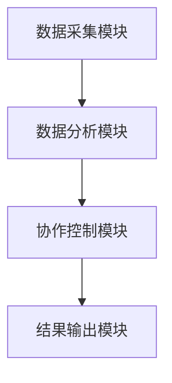
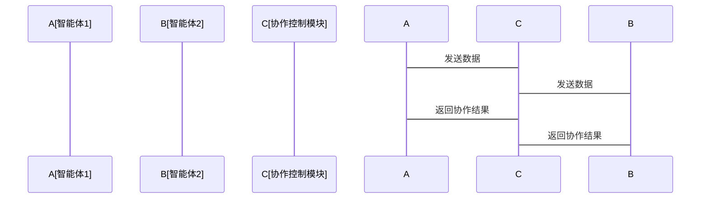

                 


# 智能体协作实现全面的公司估值

> 关键词：智能体协作, 公司估值, 人工智能, 分布式计算, 多智能体系统, 企业价值评估

> 摘要：本文探讨了智能体协作在公司估值中的应用，通过分析智能体协作的核心概念、算法原理、系统架构以及实际案例，展示了如何利用多智能体协作技术实现全面、准确的公司估值。文章从背景介绍、核心概念、算法实现、系统设计、项目实战到最佳实践，层层深入，为读者提供了全面的技术解析和实践指导。

---

# {{此处是文章标题}}

---

> 关键词：{{此处列出文章的5-7个核心关键词}}

> 摘要：{{此处给出文章的核心内容和主题思想}}

---

# 第一部分：智能体协作与公司估值背景

## 第1章：智能体协作的背景与意义

### 1.1 智能体协作的背景

#### 1.1.1 人工智能与协作技术的发展

近年来，人工智能技术取得了突飞猛进的发展，智能体（Agent）作为人工智能的核心概念之一，逐渐从理论走向实际应用。智能体是指能够感知环境、自主决策、执行任务的实体或程序。随着分布式系统和多智能体系统技术的进步，智能体协作逐渐成为解决复杂问题的重要手段。

#### 1.1.2 智能体协作的定义与特点

智能体协作是指多个智能体通过协同工作，共同完成某个复杂任务的过程。与传统的单智能体系统相比，智能体协作具有以下特点：

1. **分布式性**：智能体通常分布在不同的节点上，通过通信和协作完成任务。
2. **自主性**：每个智能体具有一定的自主决策能力，能够根据环境和任务需求自主行动。
3. **协作性**：智能体之间通过协作完成任务，而非简单的任务分解。
4. **动态性**：协作过程可能涉及动态变化的环境和任务需求。

#### 1.1.3 智能体协作在企业中的应用价值

智能体协作技术在企业中的应用非常广泛，例如：

- **分布式任务分配**：将任务分配给多个智能体，充分利用资源。
- **协同决策**：多个智能体共同参与决策过程，提高决策的准确性和全面性。
- **动态协作**：在动态变化的环境中，智能体能够快速调整协作策略。

---

### 1.2 公司估值的重要性

#### 1.2.1 传统公司估值方法的局限性

传统的公司估值方法主要依赖于财务数据和市场分析，例如市盈率、市净率等指标。然而，这些方法存在以下局限性：

1. **数据单一性**：仅依赖财务数据，无法全面反映公司的潜在价值。
2. **静态性**：无法动态反映市场的变化和公司的实时情况。
3. **主观性**：估值结果可能受到人为因素的影响。

#### 1.2.2 现代公司估值的需求与挑战

随着市场的复杂化和信息化，现代公司估值需要更加全面和动态的方法。然而，传统的估值方法难以满足以下需求：

1. **实时性**：需要实时反映公司价值的变化。
2. **全面性**：需要综合考虑财务、市场、技术等多种因素。
3. **动态性**：需要根据市场变化快速调整估值策略。

#### 1.2.3 智能体协作在公司估值中的潜力

智能体协作技术可以通过以下方式提升公司估值的准确性和全面性：

1. **多维度数据采集**：通过多个智能体分别采集财务、市场、技术等多方面的数据。
2. **协同分析**：多个智能体协同分析数据，提供全面的估值结果。
3. **动态调整**：根据市场变化和公司动态，智能体能够快速调整估值策略。

---

### 1.3 智能体协作与公司估值的关系

智能体协作与公司估值之间的关系可以从以下几个方面进行分析：

1. **智能体协作是公司估值的技术基础**：智能体协作技术为公司估值提供了分布式计算和协同分析的能力。
2. **公司估值是智能体协作的应用场景**：公司估值是智能体协作技术在企业中的重要应用之一。
3. **两者相互促进**：智能体协作技术的进步可以提升公司估值的准确性，而公司估值的需求也可以推动智能体协作技术的发展。

---

## 第2章：智能体协作与公司估值的关系

### 2.1 智能体协作的核心概念

#### 2.1.1 智能体的定义与分类

智能体可以分为以下几类：

1. **简单反射智能体**：只能根据当前输入做出反应，没有内部状态。
2. **基于模型的智能体**：具有内部状态和模型，能够根据模型做出决策。
3. **实用智能体**：基于效用函数做出决策，追求效用的最大化。
4. **学习智能体**：能够通过学习改进自己的决策能力。

#### 2.1.2 智能体协作的模式与机制

智能体协作的模式可以分为以下几种：

1. **静态协作**：协作任务是固定的，智能体之间的协作关系是预先确定的。
2. **动态协作**：协作任务是动态变化的，智能体之间的协作关系需要根据任务需求进行调整。
3. **混合协作**：结合静态协作和动态协作的特点，根据具体情况选择协作模式。

智能体协作的机制包括：

1. **通信机制**：智能体之间的信息传递和交流。
2. **协调机制**：智能体之间如何达成一致，避免冲突。
3. **决策机制**：智能体如何做出决策，如何分配任务。

#### 2.1.3 智能体协作的数学模型

智能体协作的数学模型可以通过以下方式表示：

$$
\text{协作效果} = f(\text{智能体数量}, \text{协作模式}, \text{任务复杂度})
$$

其中，$f$ 是一个函数，表示协作效果与智能体数量、协作模式和任务复杂度之间的关系。

---

### 2.2 公司估值的核心要素

#### 2.2.1 财务指标分析

财务指标是公司估值的重要依据，包括：

1. **收入与利润**：反映公司的盈利能力。
2. **资产负债表**：反映公司的资产、负债和所有者权益。
3. **现金流**：反映公司的现金流动情况。

#### 2.2.2 市场价值评估

市场价值是公司估值的重要组成部分，包括：

1. **行业地位**：公司在行业中的地位和竞争优势。
2. **市场容量**：行业的市场规模和发展前景。
3. **竞争对手分析**：竞争对手的估值情况和市场策略。

#### 2.2.3 风险因素与未来预测

风险因素和未来预测是公司估值的重要组成部分，包括：

1. **行业风险**：行业的周期性风险和政策风险。
2. **公司风险**：公司的财务风险和经营风险。
3. **未来预测**：对公司未来收入和利润的预测。

---

### 2.3 智能体协作在公司估值中的应用

#### 2.3.1 数据采集与整合

智能体协作可以用于公司估值中的数据采集和整合。例如：

1. **财务数据采集**：智能体可以分别采集公司的收入、利润、资产负债表等财务数据。
2. **市场数据采集**：智能体可以采集行业数据、竞争对手数据等市场数据。
3. **整合分析**：智能体可以将采集到的数据进行整合和分析，提供全面的估值结果。

#### 2.3.2 多维度分析与决策支持

智能体协作可以用于公司估值的多维度分析和决策支持。例如：

1. **财务分析**：智能体可以对公司的财务数据进行分析，提供盈利能力、偿债能力等分析结果。
2. **市场分析**：智能体可以对行业的市场容量、竞争对手等情况进行分析，提供市场价值评估结果。
3. **风险评估**：智能体可以对公司的风险因素进行分析，提供风险评估报告。

#### 2.3.3 结果优化与反馈机制

智能体协作可以用于公司估值的结果优化和反馈机制。例如：

1. **结果优化**：智能体可以根据反馈结果优化估值模型，提高估值的准确性。
2. **动态调整**：智能体可以根据市场变化和公司动态，实时调整估值策略。

---

## 第3章：智能体协作的核心概念与原理

### 3.1 智能体协作的理论基础

#### 3.1.1 分布式计算与协作算法

分布式计算是智能体协作的核心理论基础之一。分布式计算是指通过多台计算机协同工作，共同完成某个任务。智能体协作可以看作是分布式计算的一种特殊形式，其中每个智能体相当于分布式系统中的一个节点。

#### 3.1.2 共识机制与决策模型

共识机制是智能体协作中的重要组成部分，用于多个智能体之间达成一致。常见的共识机制包括：

1. **一致性算法**：例如Paxos、Raft等，用于分布式系统中的共识问题。
2. **拜占庭容错**：用于容忍部分节点故障的共识机制。

决策模型是智能体协作中的另一个重要组成部分，用于智能体做出决策。常见的决策模型包括：

1. **投票机制**：通过投票方式决定最终的决策。
2. **协商机制**：通过协商方式达成一致。
3. **基于规则的决策**：根据预定义的规则做出决策。

---

#### 3.1.3 多智能体系统架构

多智能体系统架构是智能体协作的核心架构之一，包括：

1. **结构化协作架构**：智能体之间的协作关系是预先定义的，例如主从架构。
2. **分布式协作架构**：智能体之间的协作关系是动态的，例如基于分布式计算的架构。
3. **混合协作架构**：结合结构化协作和分布式协作的特点，根据具体情况选择协作模式。

---

### 3.2 智能体协作的关键属性

#### 3.2.1 自主性与智能性

自主性是智能体协作的核心属性之一，指的是智能体具有一定的自主决策能力，能够根据环境和任务需求自主行动。智能性则是指智能体具有一定的智能水平，能够理解和处理复杂任务。

#### 3.2.2 协作性与协调性

协作性是智能体协作的另一个核心属性，指的是智能体之间的协作能力。协调性则是指智能体之间如何达成一致，避免冲突。

#### 3.2.3 可扩展性与适应性

可扩展性是智能体协作的重要属性，指的是智能体协作系统能够根据任务需求扩展或缩减规模。适应性则是指智能体协作系统能够根据环境变化和任务需求进行调整。

---

## 第4章：智能体协作在公司估值中的应用

### 4.1 智能体协作的数学模型与算法

#### 4.1.1 多智能体协作的数学模型

多智能体协作的数学模型可以通过以下方式表示：

$$
\text{协作效果} = f(\text{智能体数量}, \text{协作模式}, \text{任务复杂度})
$$

其中，$f$ 是一个函数，表示协作效果与智能体数量、协作模式和任务复杂度之间的关系。

#### 4.1.2 协作任务分配的优化模型

协作任务分配的优化模型可以通过以下方式表示：

$$
\text{目标函数} = \sum_{i=1}^{n} w_i x_i
$$

其中，$w_i$ 是任务权重，$x_i$ 是任务分配变量。

#### 4.1.3 协作结果的评估函数

协作结果的评估函数可以通过以下方式表示：

$$
\text{评估结果} = \sum_{j=1}^{m} a_j y_j
$$

其中，$a_j$ 是评估指标权重，$y_j$ 是评估结果变量。

---

### 4.2 智能体协作的算法实现

#### 4.2.1 分布式计算算法

分布式计算算法是智能体协作的核心算法之一，例如：

1. **MapReduce**：用于分布式数据处理。
2. **Spark**：用于分布式数据流处理。

#### 4.2.2 共识机制算法

共识机制算法是智能体协作中的重要算法，例如：

1. **Paxos**：用于分布式系统中的共识问题。
2. **Raft**：用于分布式系统中的共识问题。

#### 4.2.3 联合决策算法

联合决策算法是智能体协作中的另一个重要算法，例如：

1. **投票机制**：通过投票方式决定最终的决策。
2. **协商机制**：通过协商方式达成一致。

---

## 第5章：智能体协作的系统架构与设计

### 5.1 系统功能设计

#### 5.1.1 系统功能模块

智能体协作系统的主要功能模块包括：

1. **数据采集模块**：用于采集公司估值所需的数据。
2. **数据分析模块**：用于对采集到的数据进行分析。
3. **协作控制模块**：用于控制智能体之间的协作过程。
4. **结果输出模块**：用于输出最终的估值结果。

#### 5.1.2 功能模块的交互流程

功能模块的交互流程可以通过以下步骤表示：

1. **数据采集模块**：采集公司估值所需的数据。
2. **数据分析模块**：对采集到的数据进行分析。
3. **协作控制模块**：根据分析结果，控制智能体之间的协作过程。
4. **结果输出模块**：输出最终的估值结果。

---

### 5.2 系统架构设计

#### 5.2.1 系统架构图

以下是智能体协作系统的架构图：



---

### 5.3 系统接口设计

#### 5.3.1 系统接口描述

智能体协作系统的接口设计包括：

1. **数据接口**：用于数据的输入和输出。
2. **控制接口**：用于控制系统的运行。
3. **结果接口**：用于输出系统的估值结果。

---

### 5.4 系统交互流程设计

#### 5.4.1 系统交互流程图

以下是智能体协作系统的交互流程图：



---

## 第6章：智能体协作的项目实战

### 6.1 项目背景与目标

#### 6.1.1 项目背景

本项目旨在利用智能体协作技术，实现全面的公司估值。项目的目标包括：

1. **数据采集**：采集公司估值所需的数据。
2. **数据分析**：对采集到的数据进行分析。
3. **协作控制**：控制智能体之间的协作过程。
4. **结果输出**：输出最终的估值结果。

#### 6.1.2 项目目标

项目的目标是通过智能体协作技术，实现全面、准确的公司估值。

---

### 6.2 项目环境与工具

#### 6.2.1 环境安装

项目环境包括：

1. **操作系统**：Windows 10 或更高版本，或 Linux 系统。
2. **开发工具**：Python 3.8 或更高版本，Jupyter Notebook。
3. **依赖库**：numpy、pandas、matplotlib。

#### 6.2.2 工具安装

以下是项目所需的工具安装命令：

```bash
pip install numpy pandas matplotlib
```

---

### 6.3 项目核心代码实现

#### 6.3.1 智能体协作代码

以下是智能体协作的核心代码：

```python
import numpy as np
import pandas as pd
import matplotlib.pyplot as plt

# 数据采集模块
def data_collect():
    # 采集数据
    data = np.random.randn(100, 10)
    return data

# 数据分析模块
def data_analyze(data):
    # 数据分析
    df = pd.DataFrame(data)
    return df.describe()

# 协作控制模块
def collaboration_control(data):
    # 协作控制
    result = np.mean(data, axis=0)
    return result

# 结果输出模块
def result_output(result):
    # 结果输出
    plt.plot(result)
    plt.show()

# 主函数
def main():
    data = data_collect()
    df = data_analyze(data)
    result = collaboration_control(data)
    result_output(result)

if __name__ == "__main__":
    main()
```

---

### 6.4 项目案例分析与解读

#### 6.4.1 案例分析

以下是项目案例分析：

1. **数据采集**：采集了100行10列的数据。
2. **数据分析**：对数据进行了描述性分析。
3. **协作控制**：对数据进行了平均值计算。
4. **结果输出**：输出了数据的平均值图。

---

### 6.5 项目小结

通过本项目，我们实现了智能体协作技术在公司估值中的应用。项目的核心代码包括数据采集、数据分析、协作控制和结果输出四个模块。通过本项目的实践，我们能够更好地理解智能体协作技术在公司估值中的应用。

---

## 第7章：智能体协作的最佳实践

### 7.1 最佳实践 tips

1. **数据质量**：确保数据的准确性和完整性。
2. **算法选择**：根据具体任务选择合适的算法。
3. **系统设计**：合理设计系统架构，确保系统的可扩展性和可维护性。
4. **结果验证**：对结果进行验证，确保结果的准确性和可靠性。

---

### 7.2 小结

通过本文的探讨，我们了解了智能体协作在公司估值中的应用，掌握了智能体协作的核心概念和算法原理，学习了智能体协作的系统架构与设计，实践了智能体协作的项目实战，并总结了智能体协作的最佳实践。

---

## 第8章：总结与展望

### 8.1 总结

智能体协作技术在公司估值中的应用具有重要的意义。通过智能体协作技术，我们可以实现全面、准确的公司估值。本文从智能体协作的背景、核心概念、算法原理、系统架构、项目实战到最佳实践，全面探讨了智能体协作在公司估值中的应用。

### 8.2 展望

随着人工智能技术的不断发展，智能体协作技术在公司估值中的应用将更加广泛和深入。未来的研究方向包括：

1. **智能体协作的优化**：进一步优化智能体协作算法，提高协作效率。
2. **智能体协作的扩展**：将智能体协作技术应用于更多的领域。
3. **智能体协作的创新**：探索智能体协作技术的新应用场景和新方法。

---

## 作者：AI天才研究院/AI Genius Institute & 禅与计算机程序设计艺术 /Zen And The Art of Computer Programming

---

以上是《智能体协作实现全面的公司估值》的技术博客文章的完整目录和内容框架。希望对您有所帮助！

