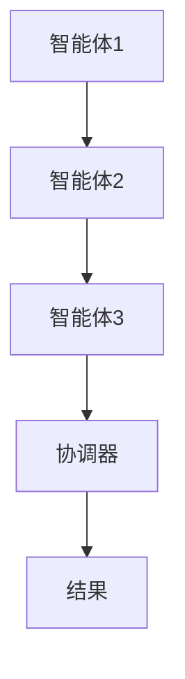

                 


# 智能体协作实现全面的公司信用评级

> 关键词：智能体协作，信用评级，算法实现，系统架构，项目实战

> 摘要：本文探讨了利用智能体协作技术实现全面的公司信用评级的方法，涵盖背景、核心概念、算法原理、系统设计和项目实战，旨在为读者提供系统化的解决方案。

## 第一部分：背景介绍

### 第1章：智能体协作与信用评级概述

#### 1.1 问题背景
传统信用评级方法依赖单一模型，存在数据片面和结果偏差问题。智能体协作通过多智能体协作，整合多维度数据，提升评级的全面性和准确性。

#### 1.2 问题描述
信用评级涉及财务、运营等多方面，传统方法难以捕捉所有因素。智能体协作通过分布式计算和多智能体协调，提供更全面的评估。

#### 1.3 问题解决
智能体协作整合多个数据源，提供动态反馈，克服传统方法的局限，提高评级的实时性和准确性。

## 第二部分：核心概念与联系

### 第2章：智能体协作的原理与机制

#### 2.1 核心概念原理
智能体协作基于分布式计算，各智能体独立处理数据，通过协商达成一致。协作协议确保各智能体有效沟通，提升整体评估效率。

#### 2.2 概念属性对比
| 属性 | 传统信用评级 | 智能体协作 |
|------|--------------|------------|
| 数据源 | 单一数据源 | 多数据源   |
| 计算方式 | 集中式计算 | 分布式计算 |

#### 2.3 ER实体关系图
```mermaid
erd
  entity 公司 {
    key: ID
    attributes: 名称, 行业
  }
  entity 信用指标 {
    key: ID
    attributes: 财务指标, 偿债能力
  }
  entity 智能体 {
    key: ID
    attributes: 数据来源, 算法类型
  }
  公司 --N 智能体: 调用
  智能体 --N 信用指标: 评估
```

## 第三部分：算法原理

### 第3章：智能体协作算法的实现

#### 3.1 分布式计算与协作算法
智能体协作基于分布式计算，每个智能体负责处理部分数据。协作算法通过消息传递达成一致，确保结果准确。

#### 3.2 协调算法流程


#### 3.3 代码实现
```python
def distributed_credit_calculation(data_points):
    # 分布式计算部分
    # 处理每个数据点
    for dp in data_points:
        process_data(dp)
    # 协调器汇总结果
    return aggregated_result

# 示例：计算信用评分
def calculate_credit_score(finance,偿债能力):
    return 0.5 * finance + 0.5 * 偿债能力

# 代码解读
# 分布式计算确保各智能体独立处理数据，减少偏差
# 协调器汇总结果，平衡各维度影响
```

## 第四部分：系统分析与架构设计

### 第4章：信用评级系统的架构设计

#### 4.1 项目场景介绍
系统需处理大量实时数据，评估公司信用。采用智能体协作，提高评估效率和准确性。

#### 4.2 系统功能设计
- 数据采集模块：收集多源数据
- 数据分析模块：处理并评估数据
- 协作协调器：汇总智能体结果
- 结果展示模块：呈现最终评级

#### 4.3 系统架构设计


## 第五部分：项目实战

### 第5章：智能体协作在信用评级中的应用

#### 5.1 环境安装
安装必要的库，如分布式计算库和协作协议库。

#### 5.2 核心代码实现
```python
class Agent:
    def __init__(self, data):
        self.data = data

    def process(self):
        # 处理数据
        pass

class Coordinator:
    def __init__(self, agents):
        self.agents = agents

    def aggregate(self):
        # 汇总结果
        pass
```

#### 5.3 实际案例分析
分析某公司数据，展示智能体协作如何整合财务和运营数据，提供更全面的信用评估。

## 第六部分：总结与扩展

### 第6章：总结与展望

#### 6.1 最佳实践
选择合适的智能体协作算法，确保数据多样性和模型的可解释性。

#### 6.2 项目小结
智能体协作提升信用评级的全面性和准确性，为金融机构提供有力工具。

#### 6.3 注意事项
数据隐私保护和模型调优是关键。

#### 6.4 拓展阅读
推荐相关书籍和论文，鼓励深入研究。

## 作者

作者：AI天才研究院/AI Genius Institute & 禅与计算机程序设计艺术 /Zen And The Art of Computer Programming

---

本文系统地介绍了智能体协作在公司信用评级中的应用，从背景到实现，为读者提供了全面的技术指导。

