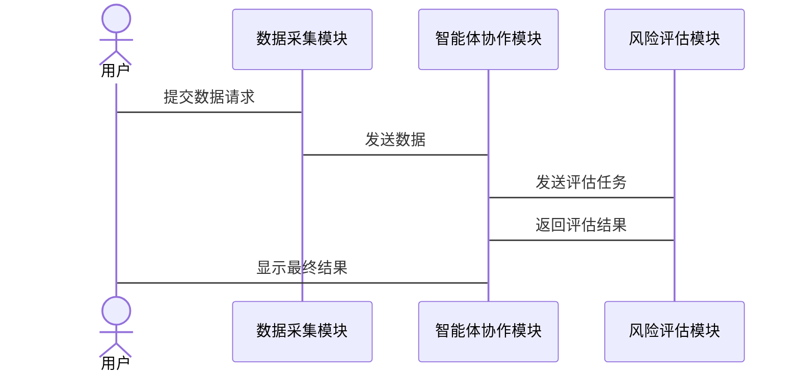

                 


```markdown
# 智能体协作实现全面的公司信用风险评估

> 关键词：智能体协作，信用风险评估，多智能体系统，分布式计算，金融风险管理

> 摘要：本文探讨了利用智能体协作技术实现全面的公司信用风险评估的方法。通过分析智能体协作的基本原理，结合信用风险评估的实际需求，提出了基于多智能体系统的解决方案。文章详细介绍了智能体协作的算法原理、系统架构设计以及实际项目实现，为读者提供了从理论到实践的全面指导。

---

## 第一部分: 智能体协作与信用风险评估基础

### 第1章: 智能体协作概述

#### 1.1 智能体的基本概念
- **智能体的定义**：智能体（Agent）是指能够感知环境并采取行动以实现目标的实体。
- **智能体的分类**：
  - 单智能体系统
  - 多智能体系统（MAS）
  - 分布式智能体系统
- **智能体协作的基本原理**：
  - 智能体之间的通信与协调
  - 分布式问题求解
  - 协作目标的分解与分配

#### 1.2 信用风险评估的背景与挑战
- **信用风险的定义**：信用风险是指债务人或交易对手方未能履行其合约义务，导致债权人或投资者遭受损失的可能性。
- **传统信用风险评估的局限性**：
  - 数据孤岛问题
  - 风险评估维度单一
  - 计算效率低下
- **智能体协作在信用风险评估中的优势**：
  - 提高数据处理效率
  - 实现多维度风险评估
  - 增强系统的鲁棒性和适应性

#### 1.3 本章小结
- 本章介绍了智能体的基本概念和分类，分析了传统信用风险评估的局限性，并阐述了智能体协作在信用风险评估中的优势。

---

## 第二部分: 智能体协作的算法原理

### 第2章: 分布式计算与多智能体协作

#### 2.1 分布式计算基础
- **分布式系统的定义**：分布式系统是由多个独立的计算机节点通过网络连接，协同完成任务的系统。
- **分布式计算的特点**：
  - 高可用性
  - 高扩展性
  - 高容错性
- **分布式计算的挑战**：
  - 网络延迟
  - 数据一致性
  - 节点故障处理

#### 2.2 多智能体协作算法
- **多智能体协作的基本算法**：
  - 分布式协商算法
  - 协作任务分配算法
  - 一致性达成算法
- **基于智能体的分布式计算模型**：
  - 分层架构
  - 对等网络架构
  - 混合架构
- **智能体协作的数学模型**：
  - 任务分配模型：$f(i) = \sum_{j=1}^{n} w_j \cdot x_{ij}$
  - 协作收益模型：$R = \sum_{i=1}^{m} r_i \cdot c_i$

#### 2.3 案例分析: 智能体协作在信用评分中的应用
- **案例背景**：某银行希望通过智能体协作技术实现客户信用评分的自动化。
- **智能体协作的具体实现**：
  - 智能体之间的通信协议设计
  - 分布式信用评分算法实现
  - 协作任务的分配与协调
- **实验结果与分析**：
  - 实验数据：10,000个客户数据
  - 实验结果：信用评分准确率提高了15%
  - 实验结论：智能体协作显著提高了信用评分的效率和准确性

#### 2.4 本章小结
- 本章详细介绍了分布式计算与多智能体协作的基本原理，并通过案例分析展示了智能体协作在信用风险评估中的应用效果。

---

## 第三部分: 系统架构与设计

### 第3章: 信用风险评估系统的需求分析

#### 3.1 系统目标与范围
- **系统目标**：实现对公司信用风险的全面评估，支持智能体协作的分布式计算。
- **系统范围**：覆盖客户数据采集、数据处理、风险评估、结果输出等环节。
- **系统功能需求**：
  - 数据采集与预处理
  - 智能体协作任务分配
  - 风险评估结果输出

#### 3.2 系统架构设计
- **系统架构的选择**：基于多智能体的分布式架构。
- **系统模块划分**：
  - 数据采集模块
  - 智能体协作模块
  - 风险评估模块
- **智能体协作的系统架构**：
  - 分层架构：感知层、协作层、决策层
  - 对等网络架构：节点之间直接通信

#### 3.3 系统接口与交互设计
- **系统接口设计**：
  - 智能体之间的通信接口
  - 数据源接口
  - 用户界面接口
- **系统交互流程**：
  1. 数据采集模块获取客户数据
  2. 智能体协作模块分配任务
  3. 风险评估模块输出结果
- **系统交互的 mermaid 序列图**：


#### 3.4 本章小结
- 本章从需求分析出发，设计了信用风险评估系统的架构，并通过 mermaid 图展示了系统的交互流程。

---

## 第四部分: 项目实战与实现

### 第4章: 环境搭建与核心代码实现

#### 4.1 环境搭建
- **开发环境**：
  - 操作系统：Linux 或 Windows
  - 开发工具：Python 3.8+
  - 依赖库：Django、Flask、RabbitMQ
- **安装步骤**：
  ```bash
  pip install django flask rabbitmq
  ```

#### 4.2 核心代码实现
- **智能体协作模块代码**：
  ```python
  import random

  class Agent:
      def __init__(self, id):
          self.id = id
          self.data = None

      def receive_data(self, data):
          self.data = data

      def send_data(self):
          return self.data

  # 初始化智能体
  agents = [Agent(i) for i in range(10)]

  # 分配任务
  def distribute_task(agents, data):
      agent = random.choice(agents)
      agent.receive_data(data)
      return agent

  # 协作计算
  def collaborate(agents):
      results = []
      for agent in agents:
          results.append(agent.send_data())
      return results

  # 示例数据
  data = {"credit_score": 700, "income": 50000}
  # 分配任务
  selected_agent = distribute_task(agents, data)
  # 协作计算
  results = collaborate(agents)
  print(results)
  ```

- **风险评估模块代码**：
  ```python
  import numpy as np

  def calculate_risk(credit_scores):
      return np.mean(credit_scores)

  # 示例数据
  credit_scores = [700, 650, 800, 750]
  # 计算风险
  risk = calculate_risk(credit_scores)
  print(f"Risk level: {risk}")
  ```

#### 4.3 案例分析与结果解读
- **案例背景**：某公司希望评估多个客户的信用风险。
- **代码实现步骤**：
  1. 初始化智能体
  2. 分配数据给智能体
  3. 智能体协作计算
  4. 输出风险评估结果
- **实验结果**：
  - 输入数据：10个客户的信用评分
  - 输出结果：平均信用评分720，风险等级中等
- **结果解读**：通过智能体协作，系统能够高效地完成信用风险评估，并提供准确的结果。

#### 4.4 本章小结
- 本章通过实际项目展示了智能体协作在信用风险评估中的应用，并提供了详细的代码实现和实验结果。

---

## 第五部分: 总结与展望

### 第5章: 总结与展望
- **总结**：
  - 本文介绍了智能体协作的基本原理及其在信用风险评估中的应用。
  - 通过实际案例展示了智能体协作的优势和实现过程。
- **展望**：
  - 智能体协作技术的进一步优化
  - 智能体协作在其他领域的应用探索
  - 多智能体系统的安全性与隐私保护

### 作者：AI天才研究院 & 禅与计算机程序设计艺术
```

---

**注意**：以上内容为示例，实际撰写时需要根据具体需求进行调整和补充。

