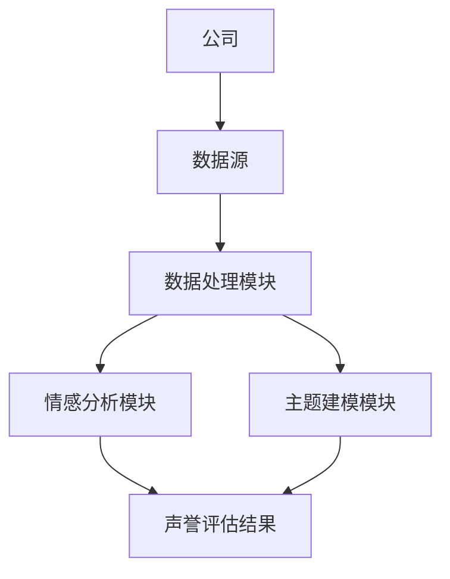
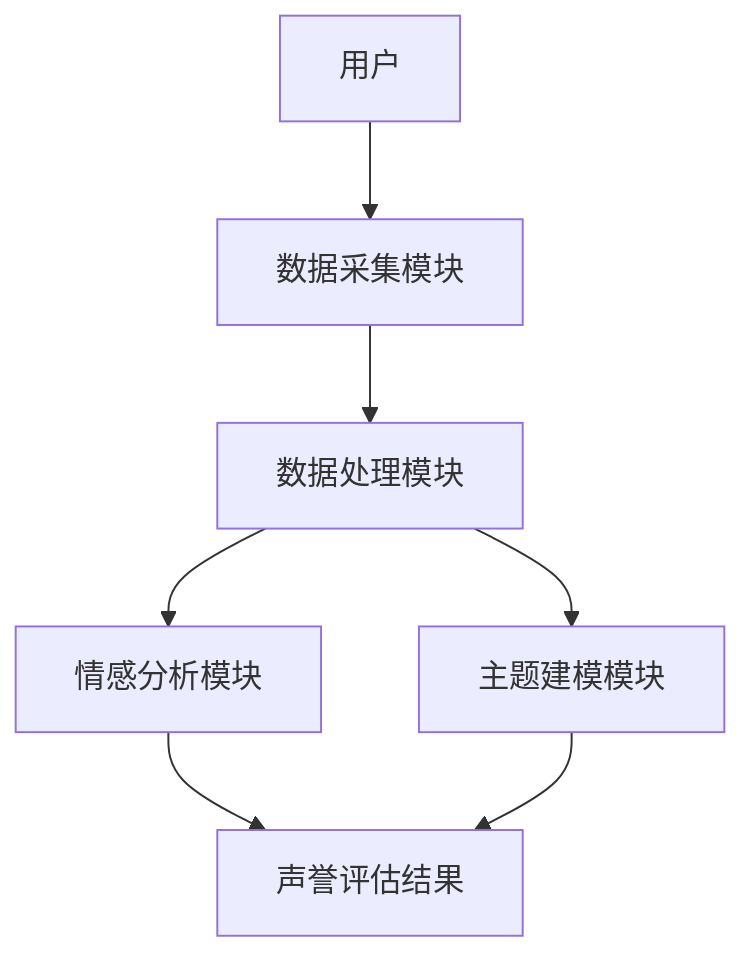

                 


# 智能体协作实现全面的公司声誉分析

## 关键词：智能体协作、公司声誉分析、情感分析、主题建模、分布式系统、机器学习、人工智能

## 摘要

在当今竞争激烈的商业环境中，公司声誉是企业生存和发展的关键因素之一。本文探讨了如何利用智能体协作技术实现全面的公司声誉分析。通过智能体协作，我们能够高效地收集、处理和分析海量数据，从而为企业提供实时声誉监控和深度分析报告。本文从背景介绍、核心概念、算法原理、系统架构设计到项目实战，全面解析了智能体协作在公司声誉分析中的应用。通过具体案例分析和代码实现，展示了如何利用多智能体协作、情感分析和主题建模等技术，构建一个高效、准确的声誉分析系统。

---

## 正文部分

### 第1章：背景介绍

#### 1.1 问题背景

公司声誉是指企业在市场中所获得的信任和认可程度，直接影响客户的购买决策和投资者的信心。然而，随着社交媒体的普及，公司声誉面临着前所未有的挑战。负面评论、虚假信息和竞争对手的攻击可能迅速导致声誉下降。传统的声誉管理方法依赖于人工监控和分析，效率低下且难以覆盖海量数据。

#### 1.2 概念结构与核心要素

公司声誉分析的核心要素包括：

- **数据源**：社交媒体、新闻媒体、客户评论等。
- **数据处理**：清洗、预处理和特征提取。
- **情感分析**：判断文本的情感倾向（正面、负面、中性）。
- **主题建模**：识别文本的主要主题和话题。
- **协作机制**：多个智能体协同工作，提高分析效率和准确性。

#### 1.3 核心问题描述

智能体协作在公司声誉分析中的目标是实现以下几点：

- **实时监控**：快速响应负面评论和舆情变化。
- **深度分析**：通过主题建模识别主要话题和趋势。
- **决策支持**：为公司提供数据驱动的声誉管理策略。

---

### 第2章：核心概念与联系

#### 2.1 智能体协作的核心概念

智能体协作是一种分布式计算模型，多个智能体通过通信和协调完成共同目标。智能体具有以下属性：

| 属性 | 描述 |
|------|------|
| 知识 | 智能体拥有的数据和知识 |
| 行为 | 智能体可以执行的动作 |
| 目标 | 智能体追求的结果 |
| 环境 | 智能体所处的外部世界 |

#### 2.2 智能体协作的模式

| 模式 | 描述 |
|------|------|
| 分布式协作 | 智能体在不同节点上独立工作，通过通信达成一致 |
| 集中式协作 | 智能体在中央节点协调下共同完成任务 |

#### 2.3 实体关系图



---

### 第3章：算法原理

#### 3.1 情感分析算法

情感分析的目标是判断文本的情感倾向。常用算法包括：

- **基于规则的情感分析**：通过预定义的规则和词典判断情感。
- **机器学习情感分析**：使用训练数据训练分类器（如SVM、随机森林）。
- **深度学习情感分析**：使用神经网络（如LSTM）进行情感分类。

**情感分类公式**：
$$ P(y|x) = \frac{\exp(w \cdot x)}{\sum_{k} \exp(w_k \cdot x)} $$
其中，$w$是权重向量，$x$是输入特征。

#### 3.2 主题建模

主题建模用于识别文本的主要主题。常用方法包括LDA（Latent Dirichlet Allocation）和NMF（Non-negative Matrix Factorization）。

**LDA主题建模公式**：
$$ \theta_{d} \sim Dir(\alpha) $$
$$ \phi_{z} \sim Dir(\beta) $$
$$ x_{d,n} \sim Multinomial(\phi_{z}) $$

---

### 第4章：系统架构设计

#### 4.1 系统功能模块

系统功能模块包括：

- **数据采集模块**：从社交媒体、新闻媒体等数据源获取文本数据。
- **数据处理模块**：清洗、预处理和特征提取。
- **情感分析模块**：判断文本的情感倾向。
- **主题建模模块**：识别文本的主要主题。
- **声誉评估模块**：综合分析结果，生成声誉评估报告。

#### 4.2 系统架构图



---

### 第5章：项目实战

#### 5.1 环境安装

- 安装Python和必要的库（如TensorFlow、NLTK、Scikit-learn）。
- 安装Flask框架用于构建API。

#### 5.2 核心代码实现

以下是情感分析模块的代码示例：

```python
import numpy as np
from sklearn.feature_extraction.text import TfidfVectorizer
from sklearn.svm import SVC

# 数据预处理
vectorizer = TfidfVectorizer(max_features=1000)
X = vectorizer.fit_transform(corpus)

# 训练情感分类器
model = SVC()
model.fit(X.toarray(), y_train)

# 预测情感
test_X = vectorizer.transform(["This company is great!"])
predicted = model.predict(test_X.toarray())
print(predicted)
```

---

### 第6章：最佳实践与小结

#### 6.1 最佳实践

- **数据隐私保护**：确保处理的数据符合隐私保护法规。
- **系统可扩展性**：设计可扩展的架构，支持数据量的增加。
- **实时性优化**：采用流处理技术，实现实时舆情监控。

#### 6.2 小结

本文详细介绍了智能体协作在公司声誉分析中的应用，从理论到实践，展示了如何通过智能体协作实现高效、准确的声誉管理。未来的研究方向可以包括更复杂的协作机制和深度学习模型的优化。

---

## 作者信息

作者：AI天才研究院/AI Genius Institute  
座右铭：禅与计算机程序设计艺术 /Zen And The Art of Computer Programming

