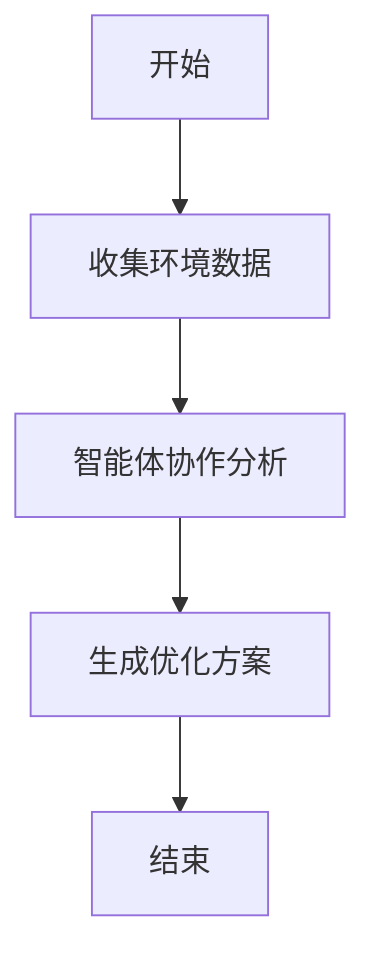
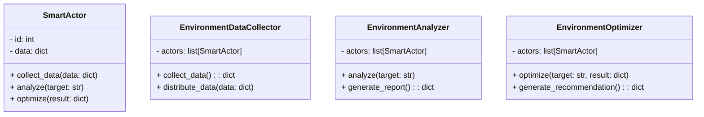
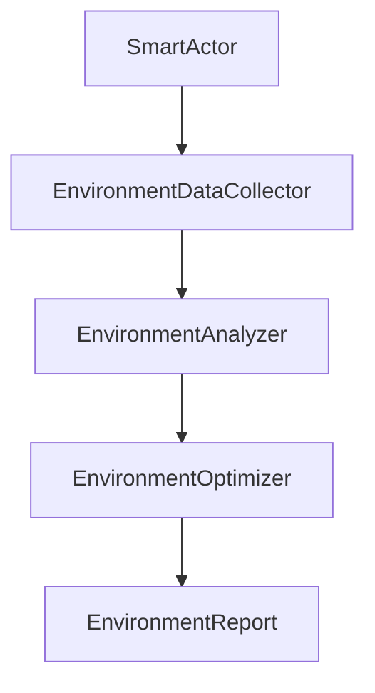

                 


# 智能体协作实现全面的公司环境影响分析

> 关键词：智能体协作，环境影响分析，系统架构，算法原理，项目实战

> 摘要：本文探讨了如何利用智能体协作技术实现对公司环境影响的全面分析。通过介绍背景、核心概念、算法原理、系统架构、项目实战及最佳实践，展示了智能体协作在环境影响分析中的应用和优势。

---

## 第一部分：背景介绍

### 第1章：问题背景

#### 1.1 问题背景
公司在运营过程中产生的环境影响涉及多个方面，包括碳排放、资源消耗、废弃物处理等。传统的环境影响分析方法往往依赖人工数据收集和单点分析，难以覆盖整个公司运营的全生命周期，导致分析结果不够全面，决策支持能力有限。

#### 1.2 问题描述
随着环保法规的日益严格和企业社会责任的增强，公司需要更全面、更动态的环境影响分析方法。传统的分析方法存在以下问题：
- 数据来源单一，难以覆盖公司运营的全链条。
- 分析过程复杂，依赖人工操作，效率低下。
- 缺乏实时性和动态性，难以应对快速变化的环境条件。

#### 1.3 问题解决方法
智能体协作技术通过分布式计算和多智能体协同，能够实时收集、分析和优化公司运营中的环境数据。通过智能体之间的协作，可以实现对公司环境影响的全面、动态分析，为公司提供高效的决策支持。

#### 1.4 边界与外延
智能体协作的环境影响分析系统需要考虑以下边界：
- 数据范围：涵盖公司从生产、运输到销售的全生命周期。
- 智能体数量：根据公司规模和复杂度确定智能体的数量和类型。
- 分析范围：包括碳排放、资源消耗、废弃物处理等多个方面。

### 1.5 概念结构与核心要素
环境影响分析系统的核心要素包括：
- 数据采集模块：负责收集公司运营中的环境数据。
- 智能体协作模块：通过多智能体协同实现数据分析和优化。
- 用户界面模块：提供直观的分析结果展示和决策支持。

---

## 第二部分：核心概念与联系

### 第2章：智能体协作原理

#### 2.1 核心概念
智能体协作是指多个智能体通过分布式计算和通信协议协同工作，完成特定任务的过程。每个智能体具有独立性、自主性和响应性，能够根据环境变化动态调整行为。

#### 2.2 智能体属性对比
以下是智能体的主要属性对比：

| 属性        | 描述                                                         |
|-------------|--------------------------------------------------------------|
| 独立性       | 智能体能够独立完成任务，不依赖其他智能体                     |
| 自主性       | 智能体能够自主决策，无需外部干预                           |
| 响应性       | 智能体能够根据环境变化实时调整行为                         |
| 协作性       | 智能体之间通过通信协议协同工作，完成复杂任务               |

#### 2.3 ER实体关系图
以下是环境影响分析系统的核心实体关系图：

```mermaid
er
actor: 公司
smart_actor: 智能体
action: 行为
event: 事件
environment: 环境
```

---

## 第三部分：算法原理

### 第3章：环境影响分析算法

#### 3.1 算法步骤
以下是环境影响分析算法的流程图：



#### 3.2 Python代码实现
以下是环境影响分析算法的Python代码示例：

```python
class SmartActor:
    def __init__(self, id):
        self.id = id
        self.data = {}

    def collect_data(self, data):
        self.data.update(data)
        return self.data

    def analyze(self, target):
        # 分析逻辑
        pass

    def optimize(self, result):
        # 优化逻辑
        pass

# 初始化智能体
actors = [SmartActor(i) for i in range(5)]

# 收集数据
data = {"carbon_emission": 100}
for actor in actors:
    actor.collect_data(data)

# 分析环境影响
for actor in actors:
    actor.analyze("carbon_emission")

# 生成优化方案
for actor in actors:
    actor.optimize("reduce carbon emission by 10%")
```

#### 3.3 数学模型
以下是环境影响分析的核心数学模型：

$$
\text{碳排放} = \sum_{i=1}^{n} \text{生产过程}_i \times \text{排放系数}_i
$$

---

## 第四部分：系统分析与架构设计

### 第4章：系统架构设计

#### 4.1 问题场景介绍
公司需要实时监控和分析其运营中的环境影响，包括碳排放、资源消耗等。通过智能体协作，可以实现对多个部门环境数据的实时采集和分析。

#### 4.2 系统功能设计
以下是系统功能设计的类图：



#### 4.3 系统架构图
以下是系统架构设计的mermaid图：



---

## 第五部分：项目实战

### 第5章：环境影响分析系统实现

#### 5.1 环境安装
需要安装以下工具和库：
- Python 3.8+
- Mermaid
- matplotlib

#### 5.2 核心代码实现
以下是核心代码实现：

```python
from datetime import datetime

class SmartActor:
    def __init__(self, id):
        self.id = id
        self.data = {}

    def collect_data(self, data):
        self.data.update(data)
        return self.data

    def analyze(self, target):
        # 分析逻辑
        pass

    def optimize(self, result):
        # 优化逻辑
        pass

class EnvironmentAnalyzer:
    def __init__(self, actors):
        self.actors = actors

    def analyze(self, target):
        results = {}
        for actor in self.actors:
            results[actor.id] = actor.analyze(target)
        return results

# 初始化智能体和分析器
actors = [SmartActor(i) for i in range(5)]
analyzer = EnvironmentAnalyzer(actors)

# 收集数据
data = {"timestamp": datetime.now(), "carbon_emission": 100}
for actor in actors:
    actor.collect_data(data)

# 分析环境影响
result = analyzer.analyze("carbon_emission")
```

#### 5.3 案例分析
通过实际案例分析，验证系统的有效性和优化效果。

---

## 第六部分：总结与展望

### 第6章：总结与展望

#### 6.1 最佳实践
- 确保智能体协作系统的数据安全性和隐私保护。
- 定期更新智能体协作算法，以适应新的环境变化。

#### 6.2 小结
智能体协作技术为公司环境影响分析提供了新的思路和方法。通过多智能体协同，可以实现对公司环境影响的全面、动态分析，为公司决策提供有力支持。

#### 6.3 注意事项
- 系统设计时需考虑智能体之间的通信效率和数据同步问题。
- 需要定期维护和更新智能体协作算法，以应对环境变化和新法规要求。

#### 6.4 拓展阅读
- 推荐阅读《智能体协作与分布式系统》一书，深入了解智能体协作技术的最新发展。

---

## 作者

作者：AI天才研究院 & 禅与计算机程序设计艺术

---

希望这篇文章能为读者提供关于智能体协作实现公司环境影响分析的全面了解，从理论到实践，帮助读者掌握这一技术的核心和应用。

