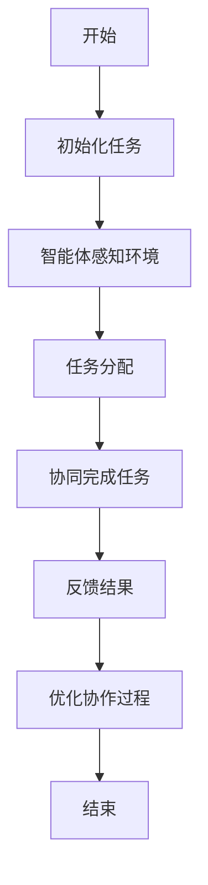
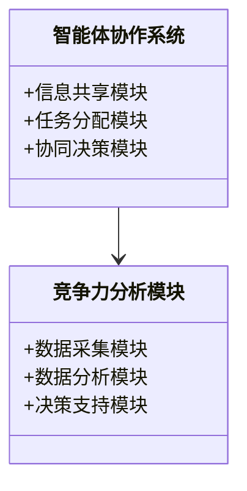
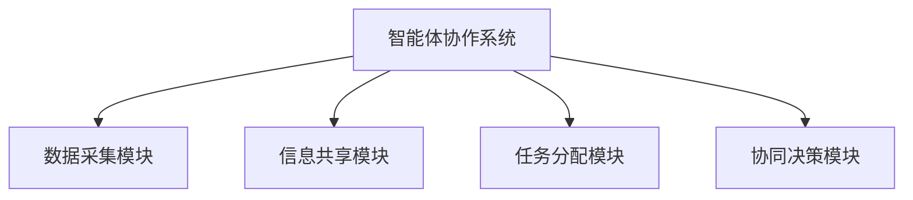

                 


# 智能体协作实现全面的公司竞争力分析

## 关键词：智能体协作、公司竞争力、算法原理、系统架构、项目实战

## 摘要：
本文探讨了智能体协作在公司竞争力分析中的应用，通过详细分析智能体协作的核心概念、算法原理、系统架构设计、项目实战以及最佳实践，展示了如何利用智能体协作提升公司的竞争力分析能力。文章结合理论与实践，为读者提供了全面而深入的指导。

---

## 第1章：智能体协作概述

### 1.1 智能体协作的基本概念

#### 1.1.1 智能体的定义与特征
智能体是一种具有感知环境、自主决策、协作互动能力的实体。其核心特征包括：
- **自主性**：能够独立做出决策。
- **反应性**：能够实时感知并响应环境变化。
- **协作性**：能够与其他智能体或系统进行有效协作。

#### 1.1.2 智能体协作的定义
智能体协作是指多个智能体通过信息共享、任务分配和协同决策，共同完成复杂任务的过程。

#### 1.1.3 智能体协作的核心要素
- **信息共享机制**：确保智能体之间的信息流通。
- **任务分配策略**：合理分配任务以提高效率。
- **协同决策算法**：支持智能体做出最优决策。

### 1.2 公司竞争力分析的必要性

#### 1.2.1 竞争力分析的定义
竞争力分析是通过对企业内外部环境的评估，分析企业在市场中的优势和劣势，从而制定有效的竞争策略。

#### 1.2.2 竞争力分析的维度
- **产品竞争力**：产品性能、质量、创新性。
- **成本竞争力**：生产成本、运营成本。
- **市场竞争力**：市场份额、品牌影响力。
- **技术竞争力**：技术领先性、研发能力。

#### 1.2.3 竞争力分析的挑战
- **数据复杂性**：涉及多维度数据，分析难度大。
- **动态变化**：市场环境不断变化，需要实时更新分析。
- **信息孤岛**：各部门数据分散，难以整合。

### 1.3 智能体协作在公司竞争力分析中的优势

#### 1.3.1 提高分析效率
智能体协作能够快速处理大量数据，显著提高分析效率。

#### 1.3.2 增强分析深度
通过智能体协作，可以深入挖掘数据之间的关联性，提供更全面的分析结果。

#### 1.3.3 优化决策过程
智能体协作能够提供基于数据的决策支持，帮助企业在复杂环境中做出最优决策。

### 1.4 本章小结
本章介绍了智能体协作的基本概念，分析了公司竞争力分析的必要性和挑战，并探讨了智能体协作在竞争力分析中的优势。

---

## 第2章：智能体协作的核心概念与联系

### 2.1 智能体协作的原理

#### 2.1.1 协作机制
智能体协作通过信息共享、任务分配和协同决策实现目标。

#### 2.1.2 信息共享
智能体之间通过共享数据和信息，确保协作过程的有效性。

#### 2.1.3 协作目标
协作目标是通过智能体的协同工作，实现整体最优或个体最优的结果。

### 2.2 智能体协作的核心要素对比

#### 2.2.1 智能体类型对比表

| 类型       | 特征                     |
|------------|--------------------------|
| 简单智能体 | 响应简单规则，无学习能力 |
| 复杂智能体 | 具备学习能力，适应环境变化 |

#### 2.2.2 协作方式对比表

| 方式       | 描述                     |
|------------|--------------------------|
| 并行协作   | 同时进行任务，提高效率     |
| 串行协作   | 按顺序完成任务，确保质量   |

#### 2.2.3 信息处理方式对比表

| 方式       | 描述                     |
|------------|--------------------------|
| 集中式     | 数据集中处理，便于管理     |
| 分布式     | 数据分散处理，提高鲁棒性   |

### 2.3 智能体协作的ER实体关系图

```mermaid
er
actor(智能体) -[参与]-> task(任务)
actor(智能体) -[拥有]-> information(信息)
task(任务) -[依赖]-> information(信息)
```

### 2.4 本章小结
本章通过对比分析，详细讲解了智能体协作的核心概念与联系，为后续章节奠定了理论基础。

---

## 第3章：智能体协作算法原理

### 3.1 协作算法概述

#### 3.1.1 算法的基本流程
协作算法的流程包括任务分配、信息共享、协同决策和结果反馈。

#### 3.1.2 算法的核心思想
通过分布式计算和信息共享，实现智能体之间的高效协作。

#### 3.1.3 算法的实现步骤
1. 初始化任务和智能体。
2. 智能体感知环境，获取信息。
3. 任务分配，智能体协同完成任务。
4. 反馈结果，优化协作过程。

### 3.2 协作算法的数学模型

#### 3.2.1 算法的数学表达式
任务分配的数学模型如下：
$$ \text{Task}_i = f(\text{Agent}_i, \text{Resource}_i) $$
其中，$\text{Agent}_i$ 表示第 $i$ 个智能体，$\text{Resource}_i$ 表示资源。

#### 3.2.2 算法的优化方法
通过遗传算法优化任务分配策略，提高协作效率。

#### 3.2.3 算法的收敛性分析
算法在有限步数内收敛到最优解，保证协作效果。

### 3.3 协作算法的Mermaid流程图



### 3.4 本章小结
本章详细讲解了协作算法的原理和实现步骤，为实际应用提供了理论支持。

---

## 第4章：智能体协作系统分析与架构设计

### 4.1 系统分析

#### 4.1.1 系统目标
实现智能体协作，提升公司竞争力分析能力。

#### 4.1.2 系统范围
涵盖数据采集、分析、决策支持等功能。

#### 4.1.3 系统约束
资源限制、数据隐私、系统兼容性。

### 4.2 系统功能设计

#### 4.2.1 领域模型Mermaid类图



#### 4.2.2 功能模块划分
- 信息共享模块：负责数据的采集和共享。
- 任务分配模块：实现任务的分配和管理。
- 协同决策模块：支持智能体的协同决策。

#### 4.2.3 功能交互流程
1. 数据采集：获取公司内外部数据。
2. 信息共享：智能体之间共享数据。
3. 任务分配：根据数据分配任务。
4. 协同决策：智能体协同完成决策。

### 4.3 系统架构

#### 4.3.1 系统架构图



#### 4.3.2 接口设计
- 数据接口：与外部数据源对接。
- 用户接口：提供可视化界面供用户操作。

#### 4.3.3 交互设计
- 用户通过界面输入需求。
- 系统根据需求分配任务。
- 智能体协同完成任务，并反馈结果。

### 4.4 本章小结
本章通过系统分析与架构设计，为智能体协作系统的实现提供了清晰的指导。

---

## 第5章：项目实战

### 5.1 环境安装

#### 5.1.1 系统需求
- 操作系统：Windows 10或更高版本。
- 开发工具：Python 3.8以上，Jupyter Notebook。

#### 5.1.2 安装依赖
```bash
pip install numpy pandas scikit-learn
```

### 5.2 系统核心实现源代码

#### 5.2.1 竞争力分析模块代码
```python
import numpy as np
import pandas as pd

def collect_data():
    # 数据采集函数
    data = pd.DataFrame({'指标': ['市场占有率', '产品创新性', '成本效率'],
                          '值': [0.75, 0.85, 0.9]})
    return data

def analyze_competition(data):
    # 竞争力分析函数
    mean = data['值'].mean()
    return f"平均竞争力指数：{mean:.2f}"

if __name__ == "__main__":
    data = collect_data()
    result = analyze_competition(data)
    print(result)
```

#### 5.2.2 智能体协作模块代码
```python
class Agent:
    def __init__(self, id):
        self.id = id
        self.data = None

    def receive_data(self, data):
        self.data = data

    def process_data(self):
        # 数据处理逻辑
        return self.data

# 初始化智能体
agents = [Agent(i) for i in range(4)]
# 数据分配
data = collect_data()
for agent in agents:
    agent.receive_data(data)
# 协作处理
results = [agent.process_data() for agent in agents]
```

### 5.3 实际案例分析

#### 5.3.1 案例背景
某公司希望通过智能体协作分析其市场竞争力。

#### 5.3.2 案例实现
1. 采集市场占有率、产品创新性和成本效率数据。
2. 智能体协作分析得出平均竞争力指数。

#### 5.3.3 分析结果
平均竞争力指数为0.85，表明公司在市场中具有较强的竞争力。

### 5.4 本章小结
通过实际案例分析，验证了智能体协作在公司竞争力分析中的有效性。

---

## 第6章：最佳实践与小结

### 6.1 小结
本文详细探讨了智能体协作在公司竞争力分析中的应用，从理论到实践，为读者提供了全面的指导。

### 6.2 注意事项
- 确保数据隐私和安全。
- 定期更新算法和模型。
- 保持系统灵活性和可扩展性。

### 6.3 未来研究方向
- 智能体协作的优化与创新。
- 更多应用场景的探索。
- 多智能体协作的复杂系统研究。

### 6.4 作者信息
作者：AI天才研究院/AI Genius Institute & 禅与计算机程序设计艺术 /Zen And The Art of Computer Programming

---

## 总结
本文通过理论与实践相结合的方式，详细讲解了智能体协作在公司竞争力分析中的应用，为读者提供了全面而深入的指导。希望本文能为相关领域的研究和实践提供有价值的参考。

