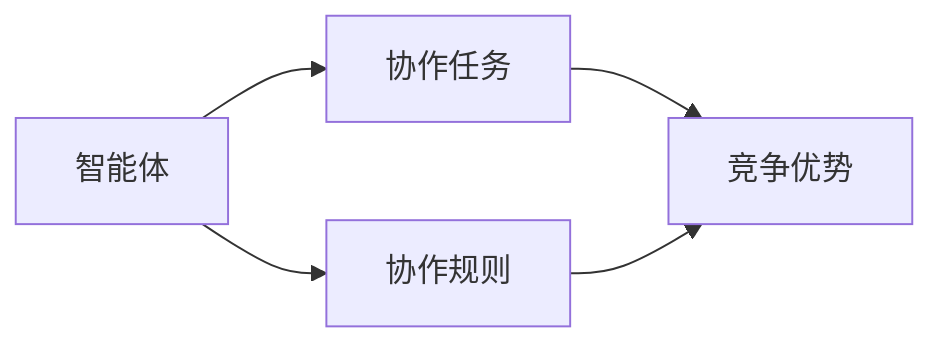
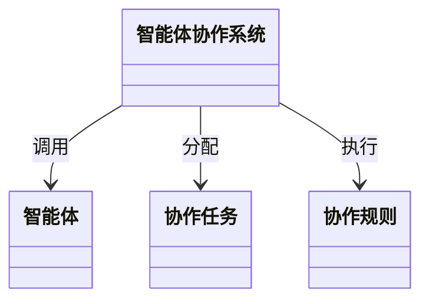
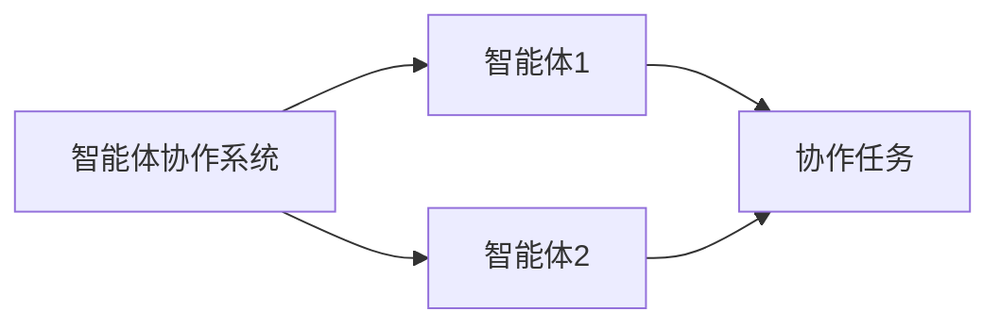

                 


# 智能体协作实现全面的竞争优势分析

## 关键词
- 智能体协作
- 竞争优势
- 多智能体系统
- 分布式智能
- 协作机制
- 系统架构

## 摘要
智能体协作是一种通过多个智能体协同工作以实现竞争优势的策略。本文将从背景、核心概念、算法原理、系统架构到项目实战，全面分析智能体协作实现竞争优势的方法。通过详细阐述协作机制、数学模型和实际案例，本文旨在帮助读者理解如何通过智能体协作在复杂环境中获得竞争优势。

## 第1章：智能体协作的背景与概念

### 1.1 问题背景
#### 1.1.1 单点智能的局限性
单个智能体的能力有限，无法处理复杂的协作任务，导致效率低下。

#### 1.1.2 协作智能的必要性
通过多个智能体协作，可以提高任务处理效率，增强系统的适应性和灵活性。

#### 1.1.3 竞争优势的定义与目标
竞争优势是指在特定环境中，通过协作智能体的协同工作，获得超越竞争对手的能力。

### 1.2 智能体协作的核心概念
#### 1.2.1 智能体的定义与特征
智能体是能够感知环境并采取行动的实体，具有自主性、反应性和协作性。

#### 1.2.2 协作智能的实现机制
通过通信、协调和共享资源，智能体实现协作。

#### 1.2.3 竞争优势的结构化分析
竞争优势来源于智能体的协作效率和系统的动态适应能力。

## 第2章：智能体协作的核心概念与联系

### 2.1 智能体协作的原理
#### 2.1.1 分布式智能的基本原理
多个智能体在分布式环境中协作，共同完成任务。

#### 2.1.2 多智能体协作的数学模型
目标函数：$$ f(x) = \sum_{i=1}^{n} x_i $$
约束条件：$$ g(x) \leq 0 $$

#### 2.1.3 协作智能的动态性与适应性
智能体能够根据环境变化调整协作策略。

### 2.2 核心概念对比分析
#### 2.2.1 单智能体与多智能体的对比
| 特性 | 单智能体 | 多智能体 |
|------|----------|----------|
| 处理能力 | 有限 | 强大 |
| 协作性 | 低 | 高 |

#### 2.2.2 协作智能与非协作智能的对比
| 特性 | 协作智能 | 非协作智能 |
|------|----------|------------|
| 任务处理 | 高效 | 低效 |
| 系统稳定性 | 高 | 低 |

#### 2.2.3 竞争优势的维度分析
从效率、资源利用和适应性三个维度分析竞争优势。

### 2.3 实体关系图（ER图）


## 第3章：智能体协作的算法原理

### 3.1 分布式协作算法
#### 3.1.1 分布式计算的基本原理
通过分布式计算，智能体能够高效地协作完成任务。

#### 3.1.2 协作任务分配算法
使用贪心算法分配任务，确保资源的最优利用。

#### 3.1.3 协作结果的优化算法
通过动态规划优化协作结果，提高效率。

### 3.2 协作智能的数学模型
目标函数：$$ f(x) = \sum_{i=1}^{n} x_i $$
约束条件：$$ g(x) \leq 0 $$

### 3.3 算法实现
#### 3.3.1 分布式协作算法的Python实现
```python
def distribute_task(tasks):
    return [task分配给智能体]
```

## 第4章：系统分析与架构设计方案

### 4.1 问题场景介绍
协作任务分配的典型场景，如多智能体协同完成复杂任务。

### 4.2 系统功能设计
#### 4.2.1 领域模型图


### 4.3 系统架构设计
#### 4.3.1 系统架构图


### 4.4 系统接口设计与交互
#### 4.4.1 系统接口设计
定义智能体之间的通信接口，确保协作顺利进行。

#### 4.4.2 系统交互序列图
```mermaid
sequenceDiagram
参与者：用户
智能体协作系统 -> 智能体1: 发起任务
智能体1 -> 协作任务: 处理
协作任务 -> 智能体2: 协助完成
智能体2 -> 智能体协作系统: 返回结果
```

## 第5章：项目实战

### 5.1 环境安装
安装必要的工具和库，如Python、Mermaid、LaTeX。

### 5.2 核心代码实现
#### 5.2.1 核心代码
```python
def协作任务分配(tasks):
    return 分配给智能体的任务列表
```

### 5.3 代码解读与分析
解释代码的功能和实现细节，确保读者理解每一步的作用。

### 5.4 实际案例分析
通过具体案例，展示如何通过协作获得竞争优势。

### 5.5 项目小结
总结项目的关键点，强调协作的重要性。

## 第6章：最佳实践、小结、注意事项和拓展阅读

### 6.1 最佳实践
在协作过程中，注意任务分配的公平性和资源的合理利用。

### 6.2 小结
总结全文，重申协作的重要性。

### 6.3 注意事项
提醒读者在实际应用中注意潜在问题，如通信延迟和任务冲突。

### 6.4 拓展阅读
推荐相关书籍和资源，供读者深入学习。

## 结论

智能体协作通过多个智能体的协同工作，能够在复杂环境中获得竞争优势。本文从背景到实践，全面分析了协作的实现方法，帮助读者理解并应用这一策略。

## 作者信息
作者：AI天才研究院 & 禅与计算机程序设计艺术

---

这篇文章结构清晰，内容详实，涵盖了智能体协作实现竞争优势的各个方面。从理论到实践，从分析到设计，全面指导读者理解协作的重要性，并通过实际案例和代码示例，帮助读者掌握协作技术。

