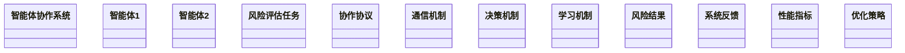
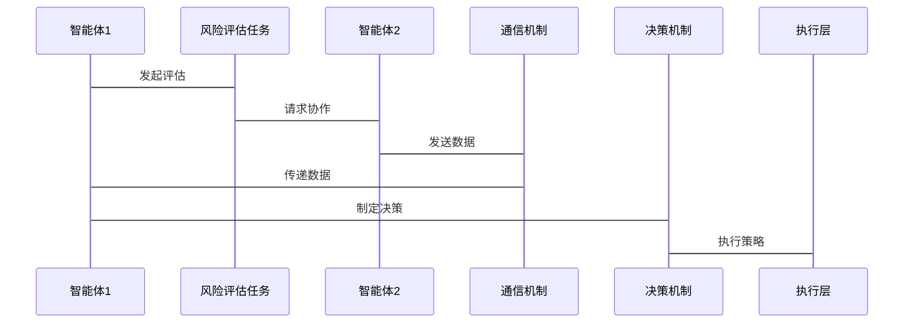

                 


# 智能体协作实现全面的风险评估与管理

## 关键词：智能体协作、风险管理、分布式计算、共识机制、机器学习、系统架构、案例分析

## 摘要：  
本文探讨了智能体协作在全面风险评估与管理中的应用，通过分析多智能体系统的优势，结合实际案例，详细讲解了协作机制、算法原理、系统架构及其实现过程，旨在为风险管理领域提供新的思路和解决方案。

---

# 第1章：智能体协作与风险评估概述

## 1.1 智能体协作的背景与意义

### 1.1.1 风险评估与管理的传统方法及其局限性
传统风险评估方法依赖于人工分析和经验判断，存在效率低、覆盖范围有限、难以实时更新等问题。在复杂多变的环境中，这种方法难以应对日益增长的风险因素。

### 1.1.2 智能体协作在现代风险管理中的作用
智能体协作通过分布式计算和机器学习，能够实时处理海量数据，发现潜在风险，并制定最优应对策略。这种方式提高了风险评估的效率和准确性，使风险管理更加智能化和动态化。

### 1.1.3 智能体协作的优势与应用场景
智能体协作的优势在于其分布式架构和协作学习能力。它广泛应用于金融、医疗、交通等领域，特别是在需要实时响应和多团队协作的场景中表现尤为突出。

## 1.2 智能体协作的基本概念

### 1.2.1 智能体的定义与特征
智能体是具有感知环境、自主决策和协作能力的实体。其特征包括自主性、反应性、社会性和学习性。

### 1.2.2 协作智能体的分类与特点
协作智能体可以分为任务协作型和学习协作型。任务协作型专注于完成特定任务，而学习协作型则通过不断学习优化协作策略。

### 1.2.3 智能体协作的实现机制
智能体协作的实现机制包括通信机制、决策机制和学习机制。通信机制确保智能体之间的信息共享，决策机制实现协作决策，学习机制优化协作策略。

## 1.3 风险评估与管理的智能体协作框架

### 1.3.1 框架的整体结构
智能体协作框架由感知层、决策层和执行层组成，各层协同工作以实现全面风险评估。

### 1.3.2 智能体协作在风险评估中的角色分配
感知层负责数据收集，决策层进行风险分析，执行层负责策略实施。

### 1.3.3 框架的灵活性与可扩展性
框架设计注重模块化，便于根据实际需求进行扩展和调整。

---

# 第2章：智能体协作的核心概念与联系

## 2.1 智能体协作的核心原理

### 2.1.1 协作智能体的通信机制
智能体通过消息传递进行通信，确保信息共享和协作。

### 2.1.2 协作智能体的决策机制
基于分布式计算和共识机制，智能体共同制定决策。

### 2.1.3 协作智能体的学习机制
通过机器学习优化协作策略，提高协作效率。

## 2.2 智能体协作的概念属性特征对比

| 特性     | 分布式协作 | 共识机制 | 协作学习 |
|----------|------------|----------|----------|
| 优点     | 高效性      | 可靠性    | 自适应性  |
| 缺点     | 复杂性      | 低效性    | 数据依赖性 |

## 2.3 智能体协作的ER实体关系图

```mermaid
er
  actor 智能体协作系统
  actor 智能体1
  actor 智能体2
  actor 风险评估任务
  actor 协作协议
  actor 通信机制
  actor 决策机制
  actor 学习机制
  actor 风险结果
  actor 系统反馈
  actor 性能指标
  actor 优化策略
```

---

# 第3章：智能体协作的算法原理

## 3.1 分布式协作算法

### 3.1.1 分布式协作的基本原理
分布式协作通过智能体之间的通信和协调完成任务，避免单点依赖。

### 3.1.2 分布式协作的实现步骤
1. 初始化：智能体分配任务。
2. 通信：共享数据。
3. 协作：共同决策。
4. 执行：实施策略。
5. 反馈：优化协作。

### 3.1.3 分布式协作的数学模型
$$ \text{一致性条件}：\sum_{i=1}^{n} x_i = S $$

## 3.2 共识机制算法

### 3.2.1 共识机制的定义与作用
共识机制确保智能体达成一致，避免冲突。

### 3.2.2 共识机制的实现流程
1. 提议：智能体提出决策。
2. 传播：所有智能体接收提议。
3. 确认：基于一致性算法确认决策。
4. 执行：所有智能体执行决策。

### 3.2.3 共识机制的数学模型
$$ \text{一致性条件}：\forall i, x_i = x $$

## 3.3 协作学习算法

### 3.3.1 协作学习的基本原理
协作学习通过共享数据和经验优化模型。

### 3.3.2 协作学习的实现步骤
1. 数据收集：智能体收集数据。
2. 数据共享：数据在智能体之间共享。
3. 模型训练：联合训练优化模型。
4. 模型更新：持续优化模型。

### 3.3.3 协作学习的数学模型
$$ \text{优化目标}：\min_{\theta} \frac{1}{n}\sum_{i=1}^{n} L_i(\theta) $$

---

# 第4章：智能体协作的系统分析与架构设计

## 4.1 系统分析

### 4.1.1 系统需求分析
系统需要实时处理数据，支持多智能体协作，具备可扩展性。

### 4.1.2 系统功能分析
系统功能包括数据采集、风险评估、决策制定和策略执行。

### 4.1.3 系统性能分析
系统性能指标包括响应时间、处理能力、准确率等。

## 4.2 系统架构设计

### 4.2.1 系统架构的模块划分
系统由感知层、决策层和执行层组成。

### 4.2.2 系统架构的类图


### 4.2.3 系统架构的交互流程


---

# 第5章：智能体协作的项目实战

## 5.1 项目介绍

### 5.1.1 项目背景
本项目旨在开发一个基于智能体协作的风险评估系统，应用于金融领域。

### 5.1.2 项目目标
实现智能体协作，提高风险评估的效率和准确性。

## 5.2 系统核心实现

### 5.2.1 环境安装
安装Python、TensorFlow和Django框架。

### 5.2.2 核心代码实现
```python
class CollaborativeAgent:
    def __init__(self, id):
        self.id = id
        self.data = []
    
    def collect_data(self):
        self.data.append(new_data)
    
    def send_data(self, agent):
        agent.receive_data(self.data)
    
    def receive_data(self, data):
        self.data.extend(data)
    
    def make_decision(self):
        # 联合训练模型
        model.train(self.data)
        return model.predict()
```

### 5.2.3 代码应用解读与分析
代码实现了智能体的数据收集、通信和决策功能，通过协作学习优化模型。

## 5.3 实际案例分析

### 5.3.1 案例背景
某金融机构需要评估市场风险，使用智能体协作系统进行实时评估。

### 5.3.2 案例分析
智能体协作系统通过分布式计算和协作学习，快速识别潜在风险并制定应对策略。

## 5.4 项目小结

### 5.4.1 成果展示
系统实现了高效的风险评估和管理。

### 5.4.2 经验总结
智能体协作能够显著提高风险管理的效率和准确性。

---

# 第6章：总结与展望

## 6.1 全文总结

智能体协作通过分布式计算和机器学习，为风险管理提供了高效解决方案。

## 6.2 未来展望

未来，智能体协作将与区块链和边缘计算结合，进一步提升风险管理能力。

## 6.3 最佳实践 tips

1. 确保智能体协作系统的安全性。
2. 定期更新协作算法和模型。

## 6.4 小结

智能体协作在风险管理中的应用前景广阔，值得深入研究和推广。

---

# 作者：AI天才研究院 & 禅与计算机程序设计艺术

---

**注：** 如果需要进一步扩展某部分内容，可以添加子章节或更多细节。

