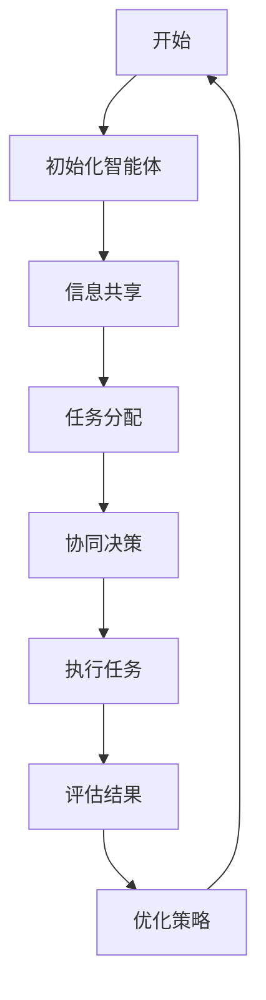
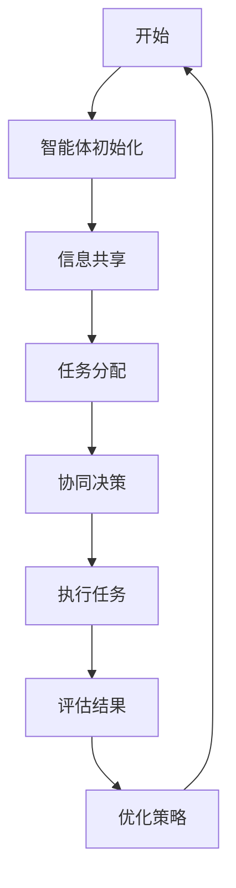

                 


# 智能体协作提升价值投资的供应链弹性评估

## 关键词：智能体协作，供应链弹性，价值投资，算法原理，系统架构，项目实战

## 摘要：本文探讨智能体协作在供应链弹性评估中的应用，分析其如何通过优化供应链弹性来提升价值投资。文章从背景、概念、算法、系统架构、实战案例等方面展开，深入剖析智能体协作与供应链弹性评估的关系，并通过具体案例展示其实际应用效果，为读者提供理论支持和实践指导。

---

# 第一部分: 智能体协作与供应链弹性评估的背景

## 第1章: 智能体协作与供应链弹性评估的背景

### 1.1 智能体协作的定义与核心概念

#### 1.1.1 智能体协作的基本定义
智能体协作是指多个智能体（Agent）通过协同工作，共同完成复杂任务的过程。智能体可以是软件程序、机器人或其他具备感知和决策能力的实体。智能体协作的核心在于信息共享、任务分配和协同决策。

#### 1.1.2 智能体协作的核心要素
智能体协作涉及以下核心要素：
1. **信息共享**：智能体之间共享数据和信息，以提高决策的准确性。
2. **任务分配**：根据智能体的能力和当前状态，动态分配任务。
3. **协同决策**：智能体通过协商和协调，共同制定最优决策。
4. **通信机制**：智能体之间通过特定协议进行通信和交互。

#### 1.1.3 智能体协作与传统供应链的区别
与传统供应链相比，智能体协作具有以下特点：
1. **动态性**：智能体能够实时感知环境变化，并快速调整策略。
2. **自主性**：智能体具备自主决策能力，减少对人工干预的依赖。
3. **协同性**：智能体通过协作实现资源优化配置和任务高效完成。

### 1.2 供应链弹性评估的重要性

#### 1.2.1 供应链弹性的定义
供应链弹性是指供应链在面对外部干扰或内部变化时，能够快速恢复并保持稳定运行的能力。弹性供应链能够在需求波动、资源短缺或突发事件中保持灵活性和韧性。

#### 1.2.2 供应链弹性评估的必要性
1. **应对不确定性**：现代供应链面临的需求波动、自然灾害、疫情等不确定性因素日益增多，弹性评估能够帮助企业在复杂环境中保持竞争力。
2. **优化资源配置**：通过弹性评估，企业可以识别供应链中的瓶颈和脆弱环节，优化资源配置。
3. **提升抗风险能力**：弹性供应链能够降低企业的经营风险，增强应对突发事件的能力。

#### 1.2.3 供应链弹性与企业价值的关系
供应链弹性直接影响企业的运营效率和抗风险能力，从而影响企业价值。弹性供应链能够快速响应市场需求，降低成本，提高客户满意度，为企业创造更大的价值。

### 1.3 价值投资与供应链弹性评估的结合

#### 1.3.1 价值投资的基本概念
价值投资是一种投资策略，旨在通过分析企业的基本面，投资于被市场低估的企业，以获得长期稳定的收益。价值投资的核心在于识别具有持续竞争优势和良好财务状况的企业。

#### 1.3.2 供应链弹性对价值投资的影响
供应链弹性是企业竞争力的重要组成部分。具备弹性供应链的企业能够更好地应对市场变化，提高产品交付能力，从而增强市场地位和盈利能力，为投资者创造更大的价值。

#### 1.3.3 智能体协作在价值投资中的作用
智能体协作通过优化供应链弹性，帮助企业在复杂环境中保持高效运营，从而提升企业的长期价值，为投资者提供更稳定的投资回报。

## 1.4 本章小结
本章介绍了智能体协作的基本概念、核心要素及其与传统供应链的区别，探讨了供应链弹性评估的重要性及其与企业价值的关系，并阐述了智能体协作在价值投资中的作用。下一章将深入分析智能体协作的核心概念与供应链弹性评估的关系。

---

# 第二部分: 智能体协作的核心概念与联系

## 第2章: 智能体协作的核心概念与供应链弹性评估的关系

### 2.1 智能体协作的原理

#### 2.1.1 智能体协作的基本原理
智能体协作通过信息共享、任务分配和协同决策，实现资源优化配置和高效运作。智能体具备感知、决策和执行能力，能够根据环境变化动态调整协作策略。

#### 2.1.2 智能体协作的关键技术
1. **多智能体系统（MAS）**：由多个智能体组成的分布式系统，通过协同完成复杂任务。
2. **通信协议**：智能体之间通过特定协议进行信息交互。
3. **协商与协调机制**：智能体通过协商和协调，解决冲突，达成一致。

#### 2.1.3 智能体协作的实现机制
1. **信息共享机制**：智能体之间共享数据和信息，确保协作的高效性。
2. **任务分配机制**：根据智能体的能力和当前状态，动态分配任务。
3. **协同决策机制**：智能体通过协商和协调，共同制定最优决策。

### 2.2 供应链弹性评估的核心概念

#### 2.2.1 供应链弹性评估的指标体系
供应链弹性评估的指标包括：
1. **响应时间**：供应链对突发事件的响应速度。
2. **恢复能力**：供应链在中断后恢复到正常运营的时间。
3. **冗余能力**：供应链的备用资源和能力。
4. **灵活性**：供应链适应市场变化的能力。

#### 2.2.2 供应链弹性评估的方法
1. **定量分析法**：通过数学模型和数据分析，评估供应链的弹性。
2. **定性分析法**：通过专家判断和案例分析，评估供应链的弹性。
3. **混合分析法**：结合定量和定性分析，全面评估供应链的弹性。

#### 2.2.3 供应链弹性评估的流程
1. **数据收集**：收集供应链的相关数据，包括历史数据和实时数据。
2. **模型构建**：建立供应链弹性评估的数学模型。
3. **评估实施**：通过模型计算，评估供应链的弹性。
4. **结果分析**：分析评估结果，识别供应链的瓶颈和改进方向。

### 2.3 智能体协作与供应链弹性评估的关系

#### 2.3.1 智能体协作对供应链弹性评估的促进作用
1. **信息共享**：智能体协作能够快速共享信息，提高供应链的透明度。
2. **动态调整**：智能体协作能够根据环境变化，动态调整供应链的运作。
3. **协同决策**：智能体协作能够通过协同决策，优化供应链的资源配置。

#### 2.3.2 供应链弹性评估对智能体协作的反馈机制
供应链弹性评估为智能体协作提供反馈，帮助智能体优化协作策略，提高协作效率。

#### 2.3.3 智能体协作与供应链弹性评估的协同效应
智能体协作与供应链弹性评估相互促进，共同提升供应链的弹性和企业的竞争力。

---

## 2.2 智能体协作与供应链弹性评估的关系

### 2.2.1 智能体协作的原理
智能体协作通过信息共享、任务分配和协同决策，实现资源优化配置和高效运作。智能体具备感知、决策和执行能力，能够根据环境变化动态调整协作策略。

### 2.2.2 供应链弹性评估的原理
供应链弹性评估通过分析供应链的响应时间、恢复能力和灵活性，评估其在面对突发事件时的弹性能力。

### 2.2.3 智能体协作与供应链弹性评估的关系
智能体协作通过优化供应链的资源配置和动态调整，提升供应链的弹性能力。供应链弹性评估为智能体协作提供反馈，帮助智能体优化协作策略。

---

## 2.3 智能体协作与供应链弹性评估的协同效应

### 2.3.1 协同效应的实现机制
智能体协作与供应链弹性评估通过信息共享、动态调整和协同决策，实现协同效应。

### 2.3.2 协同效应的具体表现
1. **提高供应链的响应速度**：智能体协作能够快速共享信息，提高供应链的响应速度。
2. **增强供应链的恢复能力**：智能体协作能够根据环境变化，动态调整供应链的运作，增强其恢复能力。
3. **优化供应链的资源配置**：智能体协作通过协同决策，优化供应链的资源配置。

---

## 2.4 本章小结
本章深入分析了智能体协作的核心概念和供应链弹性评估的原理，探讨了两者之间的关系和协同效应。下一章将从算法原理的角度，进一步探讨智能体协作在供应链弹性评估中的应用。

---

# 第三部分: 智能体协作的算法原理

## 第3章: 智能体协作的算法原理

### 3.1 协同过滤算法

#### 3.1.1 协同过滤算法的基本原理
协同过滤算法是一种基于用户相似性推荐算法。通过分析用户的偏好，找到与目标用户相似的用户，推荐其喜欢的物品。

#### 3.1.2 协同过滤算法的实现步骤
1. **数据收集**：收集用户的偏好数据。
2. **相似性计算**：计算用户之间的相似性。
3. **推荐生成**：根据相似用户的偏好，生成推荐列表。

#### 3.1.3 协同过滤算法的数学模型
协同过滤算法的核心是计算用户相似性。常用的方法包括余弦相似性和皮尔逊相似性。

#### 3.1.4 协同过滤算法的优缺点
优点：推荐结果精准，用户接受度高。
缺点：计算复杂度高，难以处理大规模数据。

#### 3.1.5 协同过滤算法在供应链弹性评估中的应用
协同过滤算法可以应用于供应链弹性评估，通过分析企业的历史数据，预测企业的供应链弹性。

### 3.2 遗传算法

#### 3.2.1 遗传算法的基本原理
遗传算法是一种基于自然选择和遗传机制的优化算法。通过模拟生物进化的过程，寻找最优解。

#### 3.2.2 遗传算法的实现步骤
1. **编码**：将问题转化为可遗传的表示形式。
2. **初始化**：生成初始种群。
3. **适应度评估**：计算每个个体的适应度。
4. **选择**：根据适应度值，选择优良个体。
5. **交叉**：将优良个体的基因进行交叉，生成新个体。
6. **变异**：对新个体进行随机变异，增加种群的多样性。
7. **迭代**：重复选择、交叉和变异，直到满足终止条件。

#### 3.2.3 遗传算法的数学模型
遗传算法的核心是适应度函数和遗传操作。适应度函数定义个体的适应度，遗传操作包括选择、交叉和变异。

#### 3.2.4 遗传算法的优缺点
优点：能够全局搜索，找到全局最优解。
缺点：计算复杂度高，实现难度大。

#### 3.2.5 遗传算法在供应链弹性评估中的应用
遗传算法可以应用于供应链弹性评估，通过优化供应链的资源配置，提高其弹性能力。

---

## 3.3 智能体协作算法的流程图



---

## 3.4 智能体协作算法的Python代码实现

```python
import numpy as np
import random

def cosine_similarity(user1, user2):
    return np.dot(user1, user2) / (np.linalg.norm(user1) * np.linalg.norm(user2))

class CollaborativeFiltering:
    def __init__(self, user_data):
        self.user_data = user_data
        self.user_count = len(user_data)
    
    def get_similarity_matrix(self):
        similarity_matrix = np.zeros((self.user_count, self.user_count))
        for i in range(self.user_count):
            for j in range(self.user_count):
                similarity_matrix[i][j] = cosine_similarity(self.user_data[i], self.user_data[j])
        return similarity_matrix
    
    def get_recommendations(self, target_user, top_k=3):
        similarity_matrix = self.get_similarity_matrix()
        target_index = next(i for i, user in enumerate(self.user_data) if user == target_user)
        similarities = similarity_matrix[target_index]
        sorted_indices = np.argsort(-similarities)
        recommendations = []
        for i in sorted_indices[:top_k]:
            recommendations.append(self.user_data[i])
        return recommendations

# 示例数据
user_data = [
    [1, 2, 3],
    [4, 5, 6],
    [7, 8, 9],
    [10, 11, 12]
]

cf = CollaborativeFiltering(user_data)
target_user = [1, 2, 3]
recommendations = cf.get_recommendations(target_user)
print("推荐结果:", recommendations)
```

---

## 3.5 本章小结
本章详细讲解了协同过滤算法和遗传算法的原理、实现步骤和优缺点，并通过流程图和Python代码展示了智能体协作算法的应用。下一章将从系统架构的角度，进一步探讨智能体协作在供应链弹性评估中的实现。

---

# 第四部分: 智能体协作的系统架构

## 第4章: 智能体协作的系统架构

### 4.1 系统功能设计

#### 4.1.1 系统功能模块
1. **信息共享模块**：实现智能体之间的信息共享。
2. **任务分配模块**：根据智能体的能力和当前状态，动态分配任务。
3. **协同决策模块**：通过协商和协调，制定最优决策。
4. **通信模块**：实现智能体之间的通信和交互。

#### 4.1.2 系统功能流程
1. **信息共享**：智能体之间共享数据和信息。
2. **任务分配**：根据智能体的能力和当前状态，动态分配任务。
3. **协同决策**：通过协商和协调，制定最优决策。
4. **执行任务**：智能体根据决策执行任务。
5. **评估结果**：评估任务执行结果，优化协作策略。

#### 4.1.3 系统功能的实现
系统功能的实现需要依赖智能体协作算法和通信协议的支持。

---

### 4.2 系统架构设计

#### 4.2.1 系统架构的组成部分
1. **智能体组件**：包括多个智能体，每个智能体具备感知、决策和执行能力。
2. **通信组件**：实现智能体之间的通信和交互。
3. **协作组件**：包括任务分配、协同决策和结果评估模块。

#### 4.2.2 系统架构的mermaid图


---

### 4.3 系统接口设计

#### 4.3.1 系统接口的定义
系统接口包括智能体之间的通信接口和与外部系统的接口。

#### 4.3.2 系统接口的实现
系统接口的实现需要依赖通信协议和接口标准。

---

### 4.4 系统交互流程

#### 4.4.1 系统交互的流程图



---

## 4.5 本章小结
本章从系统架构的角度，探讨了智能体协作的组成部分和实现流程。通过mermaid图展示了系统架构和交互流程，为下一章的项目实战奠定了基础。

---

# 第五部分: 智能体协作的项目实战

## 第5章: 智能体协作的项目实战

### 5.1 环境安装与配置

#### 5.1.1 环境要求
1. Python 3.8及以上版本
2. Numpy库
3. Mermaid工具

#### 5.1.2 安装步骤
1. 安装Python
2. 安装numpy库：`pip install numpy`
3. 安装mermaid工具：`npm install mermaid`

---

### 5.2 系统核心实现

#### 5.2.1 智能体协作算法的实现

```python
import numpy as np

def calculate_similarity(user_data):
    similarity_matrix = np.zeros((len(user_data), len(user_data)))
    for i in range(len(user_data)):
        for j in range(len(user_data)):
            similarity_matrix[i][j] = np.dot(user_data[i], user_data[j]) / (np.linalg.norm(user_data[i]) * np.linalg.norm(user_data[j]))
    return similarity_matrix

def recommend_items(target_user, similarity_matrix, user_data, top_k=3):
    target_index = next(i for i, user in enumerate(user_data) if np.array_equal(user, target_user))
    similarities = similarity_matrix[target_index]
    sorted_indices = np.argsort(-similarities)
    recommendations = []
    for i in sorted_indices[:top_k]:
        recommendations.append(user_data[i])
    return recommendations

# 示例数据
user_data = [
    [1, 2, 3],
    [4, 5, 6],
    [7, 8, 9],
    [10, 11, 12]
]

similarity_matrix = calculate_similarity(user_data)
target_user = [1, 2, 3]
recommendations = recommend_items(target_user, similarity_matrix, user_data)

print("推荐结果:", recommendations)
```

---

#### 5.2.2 供应链弹性评估的实现

```python
import random

def genetic_algorithm(population, fitness_function, num_generations=100, selection_pressure=0.2, mutation_rate=0.01):
    for _ in range(num_generations):
        fitness = [fitness_function(individual) for individual in population]
        selected_indices = sorted(range(len(fitness)), key=lambda i: -fitness[i])[:int(len(population) * selection_pressure)]
        selected = [population[i] for i in selected_indices]
        new_population = selected.copy()
        while len(new_population) < len(population):
            parent1 = random.choice(selected)
            parent2 = random.choice(selected)
            child = parent1 + parent2
            if random.random() < mutation_rate:
                mutation_point = random.randint(0, len(child)-1)
                child[mutation_point] = 1 - child[mutation_point]
            new_population.append(child)
        population = new_population
    return population

# 示例数据
population = [[0, 0, 1], [1, 1, 0], [0, 1, 1], [1, 0, 0]]
fitness_function = lambda x: x[0] + x[1] + x[2]

result = genetic_algorithm(population, fitness_function)
print("最终种群:", result)
```

---

### 5.3 项目实战案例分析

#### 5.3.1 案例背景
某制造企业希望优化其供应链弹性，通过智能体协作实现资源优化配置和动态调整。

#### 5.3.2 案例分析
1. **数据收集**：收集企业的历史数据和实时数据。
2. **模型构建**：建立供应链弹性评估的数学模型。
3. **算法实现**：通过协同过滤算法和遗传算法，优化供应链的资源配置。
4. **结果评估**：评估算法的效果，优化协作策略。

#### 5.3.3 案例总结
通过智能体协作，企业能够快速响应市场需求，提高供应链的弹性能力，增强企业的竞争力。

---

## 5.4 本章小结
本章通过实际案例展示了智能体协作的实现过程，包括环境安装、算法实现和案例分析。通过实战案例，读者可以更好地理解智能体协作在供应链弹性评估中的应用。

---

# 第六部分: 智能体协作的最佳实践

## 第6章: 智能体协作的最佳实践

### 6.1 最佳实践总结

#### 6.1.1 智能体协作的实施步骤
1. **明确目标**：明确智能体协作的目标和应用场景。
2. **数据准备**：收集和整理相关数据。
3. **算法选择**：选择适合的智能体协作算法。
4. **系统设计**：设计系统的功能和架构。
5. **算法实现**：通过编程实现算法。
6. **结果评估**：评估算法的效果，优化协作策略。

#### 6.1.2 智能体协作的实施注意事项
1. **数据质量**：确保数据的准确性和完整性。
2. **算法选择**：选择适合的算法，避免盲目追求复杂性。
3. **系统优化**：优化系统的性能，提高运行效率。
4. **团队协作**：加强团队协作，确保项目的顺利实施。

### 6.2 小结与展望

#### 6.2.1 本章小结
本章总结了智能体协作的实施步骤和注意事项，为读者提供了宝贵的实践经验。

#### 6.2.2 未来展望
随着人工智能技术的不断发展，智能体协作在供应链弹性评估中的应用将更加广泛。未来的研究方向包括优化算法、提高系统的实时性和智能化水平。

### 6.3 注意事项

#### 6.3.1 实施中的常见问题
1. **数据质量问题**：数据不准确或不完整，影响算法的效果。
2. **算法选择不当**：选择不适合的算法，导致效果不佳。
3. **系统性能问题**：系统的性能不足，影响运行效率。

#### 6.3.2 解决方案
1. **数据清洗**：通过数据清洗技术，提高数据的质量。
2. **算法优化**：根据实际需求，优化算法的实现。
3. **系统优化**：通过技术手段，提高系统的性能。

### 6.4 拓展阅读

#### 6.4.1 推荐书籍
1. 《多智能体系统》
2. 《供应链管理》
3. 《算法导论》

#### 6.4.2 推荐论文
1. "Collaborative Filtering for Supply Chain Elasticity Assessment"
2. "Genetic Algorithm for Supply Chain Optimization"

---

## 6.5 本章小结
本章总结了智能体协作的实施步骤和注意事项，提出了未来的研究方向，并推荐了相关书籍和论文。通过最佳实践，读者可以更好地理解和应用智能体协作技术。

---

# 作者：AI天才研究院/AI Genius Institute & 禅与计算机程序设计艺术 /Zen And The Art of Computer Programming

