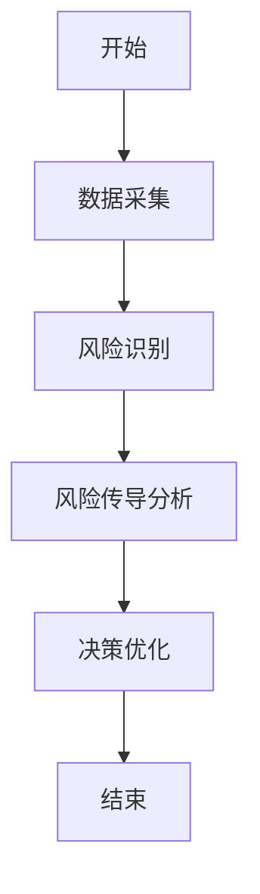

                 


# 智能体协作提升价值投资的地缘政治风险传导分析

> **关键词**：智能体协作、价值投资、地缘政治风险、风险传导、算法原理

> **摘要**：  
> 本文探讨智能体协作如何在价值投资中识别和管理地缘政治风险。通过分析风险传导机制，结合算法原理和系统架构设计，提出智能体协作在价值投资中的应用方法。本文旨在为投资者提供一种创新的工具，帮助他们在复杂多变的地缘政治环境中做出更明智的投资决策。

---

## 第1章：智能体协作与价值投资的背景介绍

### 1.1 智能体协作的定义与特点
智能体协作是指多个智能体（Agent）通过信息共享、任务分配和协同决策来实现共同目标的过程。其特点包括：
- **自主性**：每个智能体能够独立决策。
- **协作性**：智能体之间通过通信和协调完成任务。
- **适应性**：能够根据环境变化动态调整协作策略。

### 1.2 价值投资与地缘政治风险
价值投资是一种长期投资策略，注重分析资产的内在价值。地缘政治风险是指因政治事件（如贸易摩擦、政策变化）导致的市场波动。这类风险对价值投资的影响不容忽视，尤其是在全球化背景下。

### 1.3 智能体协作在价值投资中的应用背景
智能体协作能够通过分布式信息处理和协同决策，帮助投资者更好地识别和应对地缘政治风险。例如，在全球供应链中，智能体协作可以实时跟踪政策变化，评估其对投资的影响。

---

## 第2章：智能体协作与地缘政治风险的核心概念与联系

### 2.1 智能体协作的原理与机制
智能体协作的基本原理包括任务分配、信息共享和决策优化。例如，每个智能体负责分析特定领域的数据，并将结果共享给其他智能体，最终形成共识。

### 2.2 地缘政治风险的属性特征
地缘政治风险具有以下特征：
- **复杂性**：涉及多个国家和利益集团。
- **不确定性**：难以准确预测。
- **传染性**：风险可能迅速蔓延至全球市场。

### 2.3 智能体协作与地缘政治风险的联系
智能体协作可以帮助投资者实时监控地缘政治事件，评估其对投资组合的影响。例如，当某国出台限制出口政策时，智能体协作可以迅速调整投资策略。

---

## 第3章：智能体协作与地缘政治风险传导的算法原理

### 3.1 算法原理概述
智能体协作算法的核心目标是优化决策过程。以下是算法的主要步骤：
1. 数据采集：从多个来源收集地缘政治事件数据。
2. 风险识别：使用自然语言处理（NLP）技术分析事件的潜在影响。
3. 风险传导分析：通过网络模型预测风险的扩散路径。
4. 决策优化：调整投资组合以规避高风险区域。

### 3.2 算法实现步骤
以下是一个简化版的算法流程图：



### 3.3 数学模型
以下是优化模型的数学表达：

$$
\text{目标函数：} \quad \min \sum_{i=1}^{n} w_i \cdot r_i
$$

其中，$w_i$ 是权重，$r_i$ 是风险值。

### 3.4 实际应用案例
假设某投资组合涉及多个国家，智能体协作可以实时调整权重，降低高风险国家的权重。

---

## 第4章：系统分析与架构设计

### 4.1 项目场景介绍
假设我们开发一个智能投资平台，利用智能体协作管理地缘政治风险。

### 4.2 系统功能设计
以下是系统的主要功能：
- 数据采集模块：实时收集地缘政治事件数据。
- 风险评估模块：分析事件对投资的影响。
- 决策优化模块：调整投资组合。

### 4.3 系统架构设计
以下是系统架构图：


### 4.4 接口设计与交互
以下是用户与系统的交互流程：

```mermaid
sequenceDiagram
    participant 用户
    participant 系统
    用户->系统：提交投资需求
    系统->用户：返回优化后的投资组合
```

---

## 第5章：项目实战

### 5.1 环境安装
需要安装Python、TensorFlow和自然语言处理库（如spaCy）。

### 5.2 核心代码实现
以下是Python代码示例：

```python
import numpy as np
import tensorflow as tf

def risk_assessment(data):
    # 数据预处理
    model = tf.keras.Sequential([
        tf.keras.layers.Dense(64, activation='relu'),
        tf.keras.layers.Dense(1, activation='sigmoid')
    ])
    model.compile(optimizer='adam', loss='binary_crossentropy')
    model.fit(data, labels, epochs=10)
    return model.predict(new_data)
```

### 5.3 案例分析
假设某国家出台政策影响供应链，智能体协作可以迅速调整投资组合，降低风险。

---

## 第6章：结论与展望

### 6.1 研究小结
智能体协作能够有效识别和管理地缘政治风险，提升价值投资的效果。

### 6.2 注意事项
投资者需注意数据质量和算法的可解释性。

### 6.3 拓展阅读
建议阅读关于多智能体系统和风险管理的相关文献。

---

## 作者信息
**作者：AI天才研究院 & 禅与计算机程序设计艺术**

---

**致谢**：感谢读者的关注与支持！

