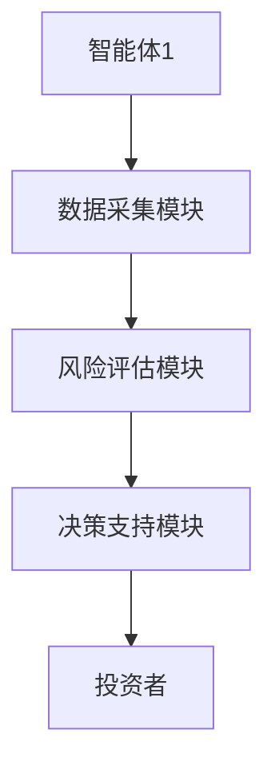
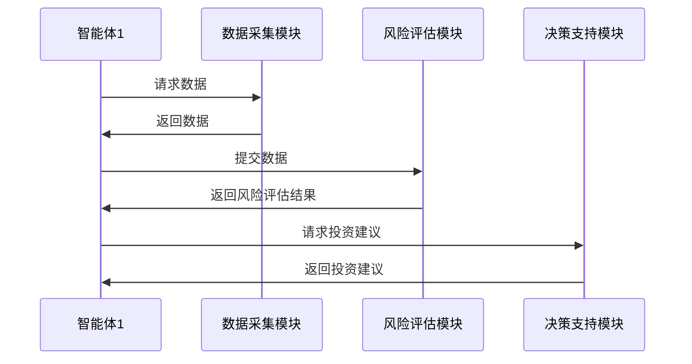

                 


# 智能体协作提升价值投资的地缘政治风险量化分析

---

## 关键词：智能体协作、价值投资、地缘政治风险、量化分析、多智能体系统、风险评估模型

---

## 摘要：  
本文探讨了智能体协作在价值投资中的应用，特别是如何通过智能体协作来量化地缘政治风险。文章从智能体协作的基本概念、地缘政治风险的定义与影响、量化分析的方法入手，详细分析了多智能体系统的协作机制、地缘政治风险的量化模型，以及如何将这些理论应用于实际投资决策中。通过结合具体案例和算法实现，本文展示了智能体协作在提升价值投资中的实际应用价值，并提出了相应的系统架构和实现方案。

---

# 第一部分: 智能体协作与价值投资的地缘政治风险背景

## 第1章: 智能体协作与价值投资概述

### 1.1 智能体协作的基本概念

#### 1.1.1 智能体协作的定义  
智能体协作（Collaborative Agents）是指多个智能体通过信息共享和协同决策，共同完成特定任务的过程。智能体可以是软件程序、算法或分布式系统中的节点，它们通过通信和协作实现目标。

#### 1.1.2 智能体协作的核心特征  
- **分布式性**：智能体分布在不同的节点或系统中，独立运行并共享信息。  
- **自主性**：每个智能体都有一定的自主决策能力，能够根据环境和任务需求调整行为。  
- **协作性**：通过通信和协调，智能体共同完成复杂任务。  

#### 1.1.3 智能体协作与传统协作方式的对比  
传统协作依赖于中心化控制或人工干预，而智能体协作是去中心化的、自动化的协作方式，适用于复杂、动态的环境。

### 1.2 价值投资的基本原理

#### 1.2.1 价值投资的定义  
价值投资是一种投资策略，强调通过分析资产的内在价值，寻找被市场低估的投资机会。

#### 1.2.2 价值投资的核心理念  
- **基本面分析**：关注公司的财务状况、行业地位和竞争优势。  
- **长期视角**：注重长期价值，而非短期市场波动。  
- **安全边际**：在价格低于内在价值时买入，以降低风险。  

#### 1.2.3 智能体协作与价值投资的结合  
智能体协作可以用于数据收集、分析和决策支持，帮助投资者更高效地进行价值评估和风险管理。

### 1.3 地缘政治风险的基本概念

#### 1.3.1 地缘政治风险的定义  
地缘政治风险是指由于政治、经济、军事等事件引起的地理区域不稳定，可能对市场、资产或交易活动造成负面影响。

#### 1.3.2 地缘政治风险的主要类型  
- **战争与冲突**：如国际战争、地区冲突等。  
- **政策变化**：如贸易政策、货币政策的突然调整。  
- **恐怖主义活动**：如恐怖袭击对经济和社会的影响。  

#### 1.3.3 地缘政治风险的影响因素  
- **地理位置**：风险通常与地理位置相关。  
- **国际关系**：如外交关系、贸易协定等。  
- **经济依赖性**：如依赖特定国家或地区的经济活动。  

## 第2章: 地缘政治风险与价值投资的关联

### 2.1 地缘政治风险对价值投资的影响

#### 2.1.1 地缘政治风险如何影响市场  
- **资产价格波动**：地缘政治事件可能导致资产价格的短期剧烈波动。  
- **市场流动性**：风险事件可能导致市场流动性下降，影响交易效率。  

#### 2.1.2 地缘政治事件对资产价格的冲击  
- **直接冲击**：如战争可能导致相关地区的资产价格大幅下跌。  
- **间接影响**：如政策变化可能影响全球经济，进而影响资产价格。  

#### 2.1.3 地缘政治风险的量化分析方法  
- **风险指标体系**：建立涵盖政治、经济、军事等多个维度的风险指标。  
- **统计模型**：如回归分析、时间序列分析等，用于量化风险对资产价格的影响。  

### 2.2 智能体协作在价值投资中的作用

#### 2.2.1 智能体协作如何提升投资决策效率  
- **分布式数据处理**：智能体可以同时处理多个数据源，提高数据收集和分析效率。  
- **实时协作**：通过实时通信，智能体可以快速响应市场变化，优化投资决策。  

#### 2.2.2 智能体协作在风险管理中的应用  
- **风险预警系统**：通过协作，智能体可以实时监控市场风险，提前发出预警。  
- **风险分散策略**：智能体可以根据市场情况，动态调整投资组合，降低风险。  

#### 2.2.3 智能体协作与地缘政治风险的结合  
- **实时监控**：智能体可以实时跟踪地缘政治事件，评估其对市场的影响。  
- **情景分析**：通过协作，智能体可以模拟不同地缘政治事件对资产价格的影响，制定应对策略。  

### 2.3 本章小结  
智能体协作能够显著提升价值投资的效率和效果，尤其是在地缘政治风险的量化分析方面，通过实时数据处理、情景模拟和动态调整，帮助投资者更好地应对复杂市场环境。

---

# 第二部分: 智能体协作与地缘政治风险量化分析的核心概念

## 第3章: 智能体协作的核心原理

### 3.1 智能体协作的理论基础

#### 3.1.1 多智能体系统（MAS）的概念  
多智能体系统是指由多个智能体组成的分布式系统，智能体之间通过通信和协作完成任务。

#### 3.1.2 智能体协作的通信机制  
- **消息传递**：智能体之间通过消息传递信息。  
- **协议设计**：设计合理的协议，确保智能体之间能够有效通信。  

#### 3.1.3 智能体协作的决策过程  
- **分布式决策**：每个智能体根据自身信息和全局信息做出决策。  
- **协调与同步**：通过协调机制，确保智能体之间决策的一致性。  

### 3.2 智能体协作的关键技术

#### 3.2.1 分布式计算与智能体协作  
分布式计算为智能体协作提供了技术基础，包括分布式数据存储、任务分配和负载均衡等。

#### 3.2.2 人工智能在智能体协作中的应用  
- **机器学习**：用于智能体的行为预测和决策优化。  
- **自然语言处理**：用于智能体之间的信息理解和协作。  

#### 3.2.3 区块链技术与智能体协作的结合  
区块链技术可以为智能体协作提供去中心化的信任机制，确保数据的安全性和可靠性。

## 第4章: 地缘政治风险量化分析的理论框架

### 4.1 地缘政治风险的量化方法

#### 4.1.1 地缘政治风险的指标体系  
- **政治稳定性**：如政府稳定性、政策连续性等。  
- **经济依赖性**：如出口依赖、债务水平等。  
- **军事冲突风险**：如边境冲突、恐怖主义活动等。  

#### 4.1.2 地缘政治风险的评估模型  
- **层次分析法（AHP）**：用于权重分配和综合评估。  
- **模糊综合评价法**：用于处理模糊和不确定因素。  

#### 4.1.3 地缘政治风险的动态评估  
- **实时更新**：根据最新事件动态调整风险评估结果。  
- **情景模拟**：模拟不同地缘政治事件对市场的影响，制定应对策略。  

### 4.2 智能体协作在地缘政治风险量化中的应用

#### 4.2.1 智能体协作的数据收集与处理  
- **分布式数据采集**：智能体从不同来源收集地缘政治相关数据。  
- **数据清洗与融合**：对数据进行清洗、转换和融合，提供高质量的数据支持。  

#### 4.2.2 智能体协作的风险评估与决策  
- **实时风险评估**：智能体根据最新数据动态评估地缘政治风险。  
- **协作决策**：智能体基于风险评估结果，制定投资策略和风险控制措施。  

#### 4.2.3 智能体协作的可视化与报告  
- **风险地图**：通过可视化工具，展示地缘政治风险的分布和影响程度。  
- **风险报告**：生成详细的地缘政治风险分析报告，支持投资决策。  

---

## 第三部分: 智能体协作与地缘政治风险量化分析的算法实现

## 第5章: 算法原理与实现

### 5.1 地缘政治风险量化分析的算法流程

#### 5.1.1 算法流程概述  
1. 数据收集：从多个数据源收集地缘政治相关数据。  
2. 数据预处理：清洗、转换和融合数据。  
3. 风险评估：基于统计模型或机器学习模型量化地缘政治风险。  
4. 协作决策：根据风险评估结果，制定投资策略和风险控制措施。  

#### 5.1.2 算法实现的步骤  
- **数据收集**：使用爬虫技术从新闻网站、政府公告等来源收集数据。  
- **数据预处理**：使用Python的pandas库进行数据清洗和特征提取。  
- **风险评估**：使用回归分析或随机森林模型进行风险量化。  
- **协作决策**：通过智能体之间的协作，动态调整投资策略。  

### 5.2 算法实现的代码示例

#### 5.2.1 数据收集与预处理  
```python
import pandas as pd
import requests
from bs4 import BeautifulSoup

def collect_data(url):
    response = requests.get(url)
    soup = BeautifulSoup(response.text, 'html.parser')
    # 提取数据并存储到列表中
    data = []
    for item in soup.find_all('div', class_='news-item'):
        title = item.find('h2').text
        content = item.find('p').text
        data.append({'title': title, 'content': content})
    return pd.DataFrame(data)

# 示例数据收集
df = collect_data('https://example.com/news')
```

#### 5.2.2 风险评估模型  
```python
from sklearn.ensemble import RandomForestRegressor
from sklearn.metrics import mean_squared_error

# 数据分割
X_train, X_test, y_train, y_test = train_test_split(X, y, test_size=0.2)

# 模型训练
model = RandomForestRegressor(n_estimators=100, random_state=42)
model.fit(X_train, y_train)

# 模型预测
y_pred = model.predict(X_test)
print('均方误差:', mean_squared_error(y_test, y_pred))
```

---

## 第四部分: 系统分析与架构设计方案

## 第6章: 系统架构设计

### 6.1 问题场景介绍  
系统旨在通过智能体协作量化地缘政治风险，帮助投资者制定更科学的投资策略。  

### 6.2 系统功能设计  
- **数据采集模块**：收集地缘政治相关数据。  
- **风险评估模块**：量化地缘政治风险。  
- **决策支持模块**：提供投资建议和风险控制策略。  

### 6.3 系统架构图  


### 6.4 系统接口设计  
- **API接口**：提供数据接口，供智能体调用。  
- **消息队列**：用于智能体之间的通信和协作。  

### 6.5 系统交互序列图  


---

## 第五部分: 项目实战

## 第7章: 项目实战与案例分析

### 7.1 环境安装与配置  
- **安装Python**：确保安装最新版本的Python。  
- **安装依赖库**：如pandas、requests、scikit-learn等。  

### 7.2 核心功能实现

#### 7.2.1 数据采集模块  
```python
import requests
from bs4 import BeautifulSoup

def collect_data(url):
    response = requests.get(url)
    soup = BeautifulSoup(response.text, 'html.parser')
    data = []
    for item in soup.find_all('div', class_='news-item'):
        title = item.find('h2').text
        content = item.find('p').text
        data.append({'title': title, 'content': content})
    return data

# 示例数据收集
data = collect_data('https://example.com/news')
print(data)
```

#### 7.2.2 风险评估模块  
```python
from sklearn.ensemble import RandomForestRegressor
from sklearn.metrics import mean_squared_error
from sklearn.model_selection import train_test_split

# 数据分割
X_train, X_test, y_train, y_test = train_test_split(X, y, test_size=0.2)

# 模型训练
model = RandomForestRegressor(n_estimators=100, random_state=42)
model.fit(X_train, y_train)

# 模型预测
y_pred = model.predict(X_test)
print('均方误差:', mean_squared_error(y_test, y_pred))
```

### 7.3 案例分析与结果解读  
通过具体案例，展示如何使用智能体协作量化地缘政治风险，并制定相应的投资策略。  

### 7.4 项目小结  
总结项目实现的关键点和经验教训，提出改进建议。

---

## 第六部分: 最佳实践与总结

## 第8章: 最佳实践与总结

### 8.1 小结  
智能体协作能够显著提升价值投资的效率和效果，特别是在地缘政治风险的量化分析方面，通过实时数据处理、情景模拟和动态调整，帮助投资者更好地应对复杂市场环境。

### 8.2 注意事项  
- **数据质量**：确保数据来源可靠，避免错误信息对决策的影响。  
- **模型优化**：定期更新模型，确保其适应市场变化。  
- **风险管理**：制定完善的风险控制策略，降低投资风险。  

### 8.3 拓展阅读  
- **推荐书籍**：《智能体协作与分布式系统》、《价值投资实战指南》  
- **推荐阅读论文**：《地缘政治风险的量化分析方法研究》  

---

## 作者：AI天才研究院/AI Genius Institute & 禅与计算机程序设计艺术 /Zen And The Art of Computer Programming

