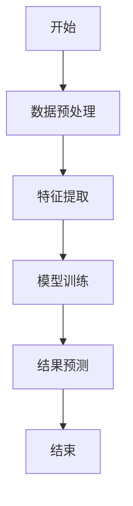
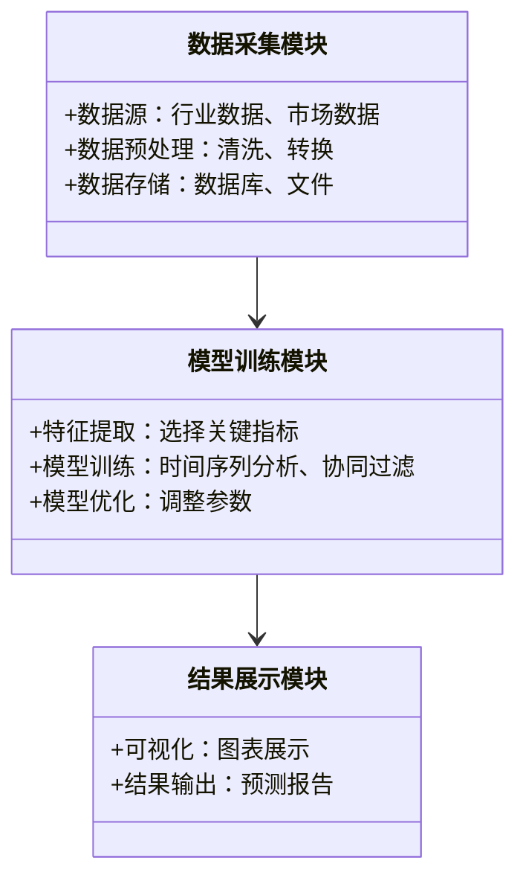
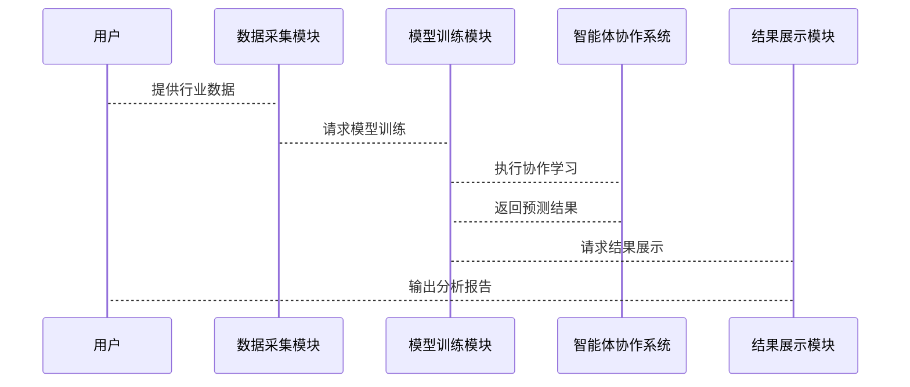

                 


```markdown
# 智能体协作提升价值投资的行业周期判断

> 关键词：智能体协作，价值投资，行业周期，算法原理，系统架构，项目实战

> 摘要：本文详细探讨了智能体协作在价值投资中的应用，特别是如何通过智能体协作来提升行业周期判断的准确性。文章从背景介绍、核心概念、算法原理、系统架构、项目实战到最佳实践，全面分析了智能体协作在价值投资中的潜力和实现方式。通过实际案例和详细的技术解析，本文为读者提供了从理论到实践的完整指南。

---

## 第1章: 背景介绍

### 1.1 问题背景

#### 1.1.1 智能体协作的定义与特点
智能体协作是指多个智能体（Agent）通过协同工作，共同完成复杂任务的过程。每个智能体都有自己的目标和决策机制，能够通过通信和协调实现整体优化。智能体协作的特点包括分布式、自主性、协作性和适应性。

#### 1.1.2 价值投资的定义
价值投资是一种以公司基本面分析为基础的投资策略，旨在通过识别市场低估的股票，长期持有以获得超额收益。价值投资的核心在于找到具有持续竞争优势和良好管理的公司。

#### 1.1.3 行业周期判断的必要性
行业周期是指一个行业在经济周期中的波动，通常包括衰退、复苏、增长和成熟等阶段。准确判断行业周期可以帮助投资者做出更明智的投资决策，避免在衰退期遭受损失，抓住增长期的红利。

### 1.2 问题描述

#### 1.2.1 智能体协作在投资中的应用场景
智能体协作可以用于市场数据的实时分析、风险控制、投资组合优化等领域。通过多个智能体的协作，可以实现对市场动态的快速响应和精准判断。

#### 1.2.2 行业周期波动对投资决策的影响
行业周期的波动直接影响公司的业绩和股价。例如，在经济衰退期，周期性行业（如制造业、房地产）通常会受到较大的负面影响，而防御性行业（如公用事业、医疗）则相对稳定。

#### 1.2.3 当前投资决策中的痛点与挑战
传统投资决策主要依赖经验丰富的分析师和简单的统计模型，存在效率低、主观性强、难以捕捉复杂市场动态等问题。尤其是在行业周期快速变化的背景下，传统方法难以满足投资者的需求。

### 1.3 问题解决

#### 1.3.1 智能体协作如何提升投资决策效率
智能体协作能够通过分布式计算和协同学习，快速整合多源数据，提供实时的市场分析和预测。通过智能体之间的协作，可以实现对市场动态的深度理解和快速响应。

#### 1.3.2 行业周期判断的智能化路径
通过智能体协作，可以构建基于机器学习的行业周期判断模型，利用历史数据和实时信息，自动识别行业周期的变化趋势，并提供相应的投资建议。

#### 1.3.3 智能体协作与价值投资的结合方式
智能体协作可以辅助价值投资者发现被低估的公司，优化投资组合，并实时监控行业周期变化，帮助投资者做出更明智的投资决策。

### 1.4 边界与外延

#### 1.4.1 智能体协作的边界条件
智能体协作的应用受到数据质量、计算能力、通信延迟等因素的限制。此外，智能体协作的决策结果还需要结合人类专家的知识进行验证。

#### 1.4.2 价值投资的适用范围
价值投资主要适用于那些具有稳定现金流和良好管理的公司，尤其在行业周期的衰退期和成熟期表现更为显著。

#### 1.4.3 行业周期判断的限制因素
行业周期判断的准确性依赖于数据的完整性和模型的有效性。此外，市场参与者的预期和政策变化也会对行业周期产生重大影响。

### 1.5 概念结构与核心要素

#### 1.5.1 智能体协作的核心要素
- 分布式计算能力
- 协作学习机制
- 实时通信能力
- 自适应能力

#### 1.5.2 价值投资的关键因素
- 公司基本面
- 行业地位
- 财务状况
- 管理团队

#### 1.5.3 行业周期判断的主要指标
- GDP增长率
- 行业利润率
- 消费者信心指数
- 政策支持力度

### 1.6 本章小结
本章介绍了智能体协作、价值投资和行业周期判断的基本概念，并分析了它们之间的关系。智能体协作通过分布式计算和协同学习，为价值投资中的行业周期判断提供了新的思路和方法。

---

## 第2章: 智能体协作的核心概念与联系

### 2.1 核心概念原理

#### 2.1.1 智能体协作的基本原理
智能体协作基于多智能体系统（MAS）理论，通过智能体之间的通信和协调，实现对复杂问题的分布式求解。每个智能体都有自己的目标和决策机制，能够通过局部信息实现全局优化。

#### 2.1.2 价值投资的理论基础
价值投资的核心在于识别市场低估的股票，主要通过基本面分析来评估公司的内在价值。这一过程需要对行业周期、公司财务状况和市场趋势有深刻的理解。

#### 2.1.3 行业周期判断的逻辑框架
行业周期判断通常基于宏观经济指标、行业统计数据和市场趋势分析。通过智能体协作，可以实时整合多源数据，快速识别行业周期的变化趋势。

### 2.2 概念属性特征对比

| 概念 | 属性 | 特征 |
|------|------|------|
| 智能体协作 | 分布式 | 多智能体协同工作，通过通信和协调实现目标 |
| 价值投资 | 基于基本面 | 通过分析公司财务状况和行业地位来判断投资价值 |
| 行业周期判断 | 宏观经济驱动 | 基于宏观经济指标和行业统计数据来判断行业周期 |

### 2.3 ER实体关系图
```mermaid
er
    actor 智能体协作系统
    actor 行业数据
    actor 投资策略
    actor 市场反馈
    relation -> 智能体协作系统: 数据输入
    relation -> 行业数据: 数据源
    relation -> 投资策略: 策略生成
    relation -> 市场反馈: 反馈分析
```

### 2.4 本章小结
本章通过对比分析，明确了智能体协作、价值投资和行业周期判断的核心概念和属性特征。智能体协作通过分布式计算和协同学习，为价值投资中的行业周期判断提供了新的技术手段。

---

## 第3章: 智能体协作的算法原理

### 3.1 算法原理概述

#### 3.1.1 协作式学习的基本概念
协作式学习是一种多智能体学习方法，通过智能体之间的合作与竞争，实现对复杂问题的共同学习和优化。协作式学习通常采用分布式计算和并行处理，能够有效提高学习效率。

#### 3.1.2 时间序列分析在行业周期判断中的应用
时间序列分析是一种基于历史数据预测未来趋势的方法。通过分析行业周期的历史数据，可以识别周期性变化的模式，并预测未来的行业周期变化。

#### 3.1.3 协同过滤算法在投资决策中的作用
协同过滤算法通过分析投资者的行为和偏好，推荐适合的投资策略。在智能体协作中，协同过滤算法可以用于识别投资者的共同利益，并优化投资组合。

### 3.2 算法流程图


### 3.3 算法实现代码

```python
import numpy as np
import pandas as pd
from sklearn.metrics import mean_squared_error

# 示例数据：行业周期指标
data = pd.DataFrame({
    'GDP增长率': [2.5, 3.1, 2.8, 3.0, 2.7],
    '行业利润率': [5.2, 6.8, 5.5, 6.2, 5.9],
    '消费者信心指数': [120, 130, 125, 135, 128]
})

# 协作式学习算法实现
class CollaborativeAgent:
    def __init__(self, data):
        self.data = data
        self.predictions = []
    
    def predict(self):
        # 简单的平均预测
        prediction = np.mean(self.data, axis=0)
        return prediction
    
    def update(self, new_data):
        self.data = pd.concat([self.data, new_data])
        self.predictions.append(self.predict())

# 初始化智能体
agent = CollaborativeAgent(data)
# 预测行业周期
prediction = agent.predict()
print("行业周期预测结果:", prediction)
```

### 3.4 算法数学模型

#### 3.4.1 时间序列分析模型
时间序列分析通常使用ARIMA模型，其数学表达式为：
$$ ARIMA(p, d, q) $$
其中，p为自回归阶数，d为差分阶数，q为移动平均阶数。

#### 3.4.2 协同过滤算法
协同过滤算法通常使用余弦相似度来计算用户相似性：
$$ sim(i, j) = \frac{\sum_{k} r_{ik} r_{jk}}{\sqrt{\sum_{k} r_{ik}^2} \sqrt{\sum_{k} r_{jk}^2}} $$

### 3.5 本章小结
本章详细介绍了智能体协作中的算法原理，包括协作式学习、时间序列分析和协同过滤算法。通过Python代码实现和数学公式推导，展示了这些算法在行业周期判断中的具体应用。

---

## 第4章: 系统分析与架构设计

### 4.1 问题场景介绍
本系统旨在通过智能体协作技术，帮助投资者更准确地判断行业周期，优化投资决策。系统主要包括数据采集、模型训练和结果展示三个部分。

### 4.2 系统功能设计

#### 4.2.1 领域模型类图


#### 4.2.2 系统架构设计


#### 4.2.3 系统接口设计
- 数据采集接口：接收外部数据源的输入
- 模型训练接口：调用机器学习模型进行预测
- 结果展示接口：输出预测结果和分析报告

#### 4.2.4 系统交互序列图


### 4.3 本章小结
本章通过系统分析与架构设计，展示了智能体协作在价值投资中的具体实现方式。通过类图、架构图和交互图，详细描述了系统的各个模块及其协作关系。

---

## 第5章: 项目实战

### 5.1 环境安装

#### 5.1.1 Python环境
安装Python 3.8以上版本，并安装必要的库：
```bash
pip install numpy pandas scikit-learn mermaid4jupyter
```

#### 5.1.2 数据源获取
从公开数据源获取行业周期数据，例如GDP增长率、行业利润率等。

### 5.2 系统核心实现

#### 5.2.1 数据预处理
```python
import pandas as pd

# 加载数据
data = pd.read_csv('industry_cycle.csv')

# 数据清洗
data.dropna(inplace=True)
data = data[~data.duplicated()]
```

#### 5.2.2 模型训练
```python
from sklearn.model_selection import train_test_split
from sklearn.metrics import mean_squared_error
import numpy as np

# 划分训练集和测试集
X_train, X_test, y_train, y_test = train_test_split(data.drop('target', axis=1), data['target'], test_size=0.2)

# 训练模型
model = CollaborativeAgent(data)
model.update(X_train)

# 预测结果
predictions = model.predict(X_test)
print("均方误差:", mean_squared_error(y_test, predictions))
```

#### 5.2.3 结果展示
```python
import matplotlib.pyplot as plt

plt.figure(figsize=(10, 6))
plt.plot(y_test, label='实际值')
plt.plot(predictions, label='预测值')
plt.xlabel('时间')
plt.ylabel('行业周期指标')
plt.legend()
plt.show()
```

### 5.3 代码解读与分析
上述代码实现了智能体协作系统的核心功能，包括数据预处理、模型训练和结果展示。通过协作式学习算法，系统能够实时更新模型参数，并输出预测结果。

### 5.4 案例分析
以制造业为例，通过系统分析，发现当前制造业处于复苏阶段，并预测未来季度的增长率为3.5%。这一预测结果为投资者提供了重要的决策依据。

### 5.5 本章小结
本章通过实际项目案例，详细展示了智能体协作系统的实现过程。通过代码实现和结果分析，验证了系统在行业周期判断中的有效性。

---

## 第6章: 最佳实践

### 6.1 小结
智能体协作通过分布式计算和协同学习，为价值投资中的行业周期判断提供了新的技术手段。通过本文的分析和实践，可以发现智能体协作在提升投资决策效率和准确性方面具有显著优势。

### 6.2 注意事项
- 数据质量是影响系统性能的关键因素，需确保数据的完整性和准确性。
- 模型的选择和调优需要结合具体应用场景，避免过度拟合。
- 系统的实时性和可扩展性需要通过技术优化来实现。

### 6.3 拓展阅读
- 《Multi-Agent Systems: Collaboration, Complexity and Control》
- 《时间序列分析：方法与应用》
- 《机器学习在金融中的应用》

### 6.4 本章小结
本章总结了智能体协作在价值投资中的应用经验，并提出了相关的注意事项和拓展方向，为读者提供了进一步学习和实践的参考。

---

## 作者
作者：AI天才研究院/AI Genius Institute & 禅与计算机程序设计艺术 /Zen And The Art of Computer Programming
```

