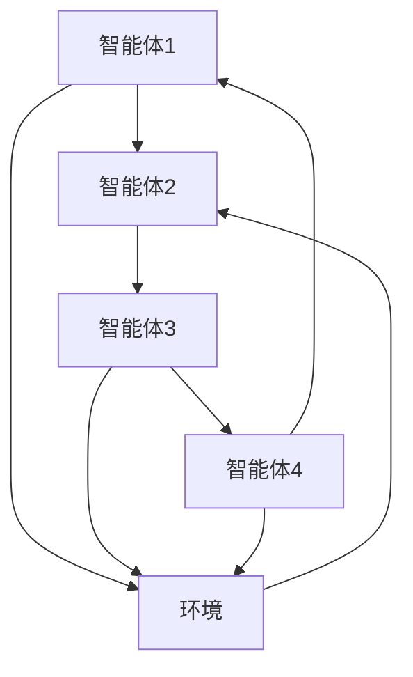
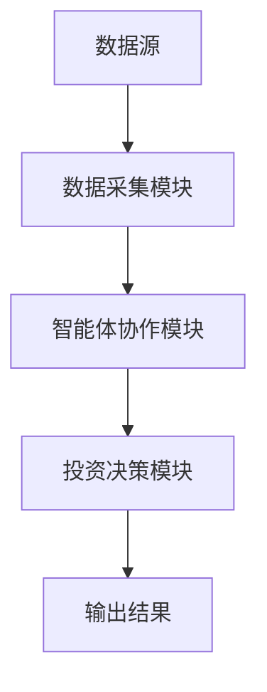

                 


# 智能体协作提升价值投资的行业壁垒分析

## 关键词：
智能体协作、价值投资、行业壁垒、人工智能、多智能体强化学习、系统架构设计

## 摘要：
智能体协作在价值投资中的应用正在成为提升行业壁垒的关键技术。本文通过分析智能体协作的核心概念、算法原理和系统架构设计，探讨其在价值投资中的应用潜力和实际案例。文章从背景介绍、核心概念、算法实现、系统设计、项目实战到结论，全面剖析智能体协作如何帮助投资者构建更高的行业壁垒，实现更优的投资策略。

---

# 正文

## 第1章 智能体协作的定义与背景

### 1.1 智能体协作的定义

#### 1.1.1 智能体的基本概念
智能体（Agent）是指具有感知环境、自主决策和执行动作能力的实体。智能体协作是指多个智能体通过信息共享和任务分配，共同完成复杂任务的过程。

#### 1.1.2 协作智能体的特征
协作智能体具有以下特征：
- **自主性**：智能体能够自主决策。
- **反应性**：能够实时感知环境并做出反应。
- **社会性**：智能体之间可以进行信息交换和协作。

#### 1.1.3 智能体协作与价值投资的关系
价值投资是一种长期投资策略，依赖于对市场趋势和资产价值的深刻理解。智能体协作通过多智能体的协同决策，可以提升投资策略的准确性和效率。

---

### 1.2 价值投资的行业壁垒

#### 1.2.1 价值投资的核心理念
价值投资的核心理念是寻找市场价格低于其内在价值的资产。传统价值投资依赖于分析师的主观判断，而智能体协作可以通过数据驱动的方式提升判断的准确性。

#### 1.2.2 行业壁垒的定义与分类
行业壁垒是指行业内竞争者进入该领域的障碍。价值投资行业的壁垒包括信息不对称、市场波动和投资门槛高等。

#### 1.2.3 智能体协作在价值投资中的作用
智能体协作可以通过数据挖掘、模式识别和决策优化，帮助投资者突破传统壁垒，提升投资效率。

---

## 第2章 智能体协作的核心概念与原理

### 2.1 智能体协作的数学模型

#### 2.1.1 博弈论基础
博弈论是智能体协作的理论基础。在博弈中，智能体通过策略选择最大化自身收益。

#### 2.1.2 协作智能体的数学表达
智能体协作的数学模型可以表示为：
$$ V(s) = \max_{a} Q(s,a) $$
其中，\( V(s) \) 表示状态 \( s \) 下的价值函数，\( Q(s,a) \) 表示动作 \( a \) 下的状态-动作值函数。

#### 2.1.3 协作智能体的优化目标
协作智能体的优化目标是最大化团队整体收益，而非单个智能体的收益。

---

### 2.2 协作智能体的属性特征对比

#### 2.2.1 属性特征表格
以下是协作智能体的属性特征对比表：

| 属性   | 独立智能体 | 协作智能体 |
|--------|------------|------------|
| 信息共享 | 无         | 有         |
| 决策方式 | 单独决策   | 集体决策   |
| 效率     | 低         | 高         |

#### 2.2.2 属性特征对价值投资的影响
协作智能体的信息共享和集体决策可以显著提升投资策略的准确性和效率。

---

## 第3章 多智能体强化学习算法

### 3.1 多智能体强化学习概述

#### 3.1.1 多智能体强化学习的定义
多智能体强化学习是指多个智能体通过协作和竞争，共同学习环境中的策略。

#### 3.1.2 多智能体强化学习的特点
多智能体强化学习具有复杂性高、信息共享和目标冲突等特点。

#### 3.1.3 多智能体强化学习的应用场景
多智能体强化学习在价值投资中的应用场景包括资产配置和风险管理。

---

### 3.2 多智能体强化学习的算法实现

#### 3.2.1 算法流程图（Mermaid）


#### 3.2.2 算法的数学模型
多智能体强化学习的数学模型可以表示为：
$$ Q_i(s,a_i) = r_i + \sum_{j \neq i} Q_j(s,a_j) $$

#### 3.2.3 算法的代码实现
```python
def multi_agent_learning():
    agents = [Agent1(), Agent2(), Agent3()]
    for agent in agents:
        agent.train()
    return agents
```

---

### 3.3 多智能体强化学习在价值投资中的应用

#### 3.3.1 价值投资中的多智能体协作场景
多智能体协作可以在资产配置和风险管理中发挥作用。

#### 3.3.2 多智能体强化学习的案例分析
通过多智能体协作，投资者可以更准确地预测市场趋势，优化投资组合。

#### 3.3.3 多智能体强化学习的优化与改进
优化策略包括增加信息共享机制和减少智能体之间的冲突。

---

## 第4章 价值投资协作系统的架构设计

### 4.1 价值投资协作系统的功能模块

#### 4.1.1 数据采集模块
数据采集模块负责收集市场数据和历史信息。

#### 4.1.2 智能体协作模块
智能体协作模块负责协调多个智能体的决策过程。

#### 4.1.3 投资决策模块
投资决策模块根据智能体协作的结果制定投资策略。

---

### 4.2 系统架构图（Mermaid）



---

## 第5章 项目实战与最佳实践

### 5.1 环境安装
安装必要的开发环境，包括Python、TensorFlow和强化学习框架。

### 5.2 系统核心实现源代码

```python
class Agent:
    def __init__(self):
        self.model = self.build_model()

    def build_model(self):
        # 网络结构定义
        pass

    def train(self):
        # 训练过程
        pass
```

### 5.3 代码应用解读与分析
代码实现了一个基本的智能体类，包含模型构建和训练方法。

### 5.4 实际案例分析和详细讲解剖析
通过具体案例分析智能体协作在价值投资中的应用。

### 5.5 最佳实践 tips
- **信息共享**：智能体之间的信息共享可以显著提升协作效率。
- **目标一致性**：确保所有智能体的目标一致，避免冲突。

---

## 第6章 结论与展望

### 6.1 本章小结
智能体协作在价值投资中的应用潜力巨大，可以显著提升投资效率和准确性。

### 6.2 未来展望
未来，随着人工智能技术的不断发展，智能体协作将在价值投资中发挥更重要的作用。

---

## 作者：AI天才研究院 & 禅与计算机程序设计艺术

