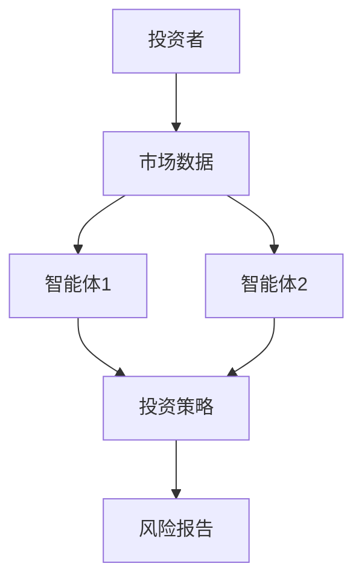
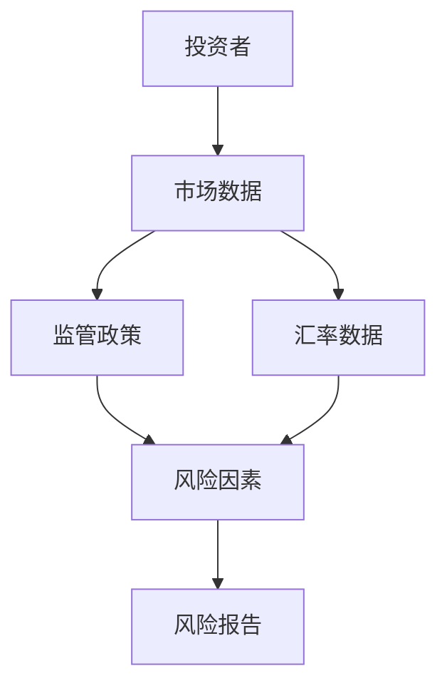
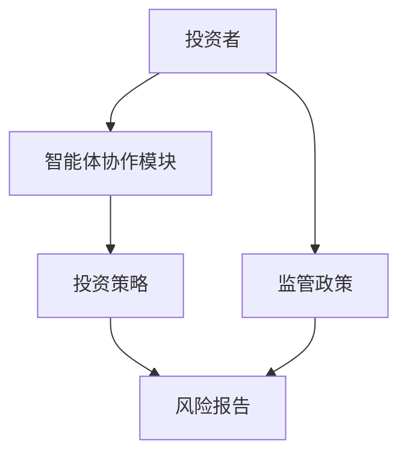

                 


# 智能体协作提升价值投资的跨境监管风险分析

> 关键词：智能体协作，价值投资，跨境监管，风险分析，算法原理

> 摘要：本文探讨了智能体协作在价值投资中的应用，分析了跨境监管风险，并结合算法原理和系统架构设计，提出了提升风险分析效率的方法。通过实际案例分析，展示了智能体协作在跨境监管中的潜力和挑战。

---

## 第1章: 背景介绍

### 1.1 智能体协作的背景与意义

#### 1.1.1 智能体协作的定义与特点
智能体协作是指多个智能体（Agent）通过协同工作，实现共同目标的过程。智能体具备感知环境、决策、执行和学习能力，能够在复杂环境中自主协作。

#### 1.1.2 智能体协作在价值投资中的应用
智能体协作可以分析市场数据、预测价格波动，帮助投资者制定策略。例如，智能体可以通过协同学习，优化投资组合，降低风险。

#### 1.1.3 智能体协作提升价值投资的边界与外延
智能体协作的应用范围包括股票、债券和外汇市场，但需注意数据隐私和模型的泛化能力。

### 1.2 跨境监管风险分析的背景与意义

#### 1.2.1 跨境监管的定义与特点
跨境监管涉及不同国家的金融监管机构，具有复杂性。各国法规差异大，增加了监管难度。

#### 1.2.2 跨境监管风险在价值投资中的影响
合规风险、汇率波动和政策变化会影响投资收益。例如，政策变化可能导致资产贬值。

#### 1.2.3 跨境监管风险分析的边界与外延
跨境监管分析需考虑法律、经济和技术因素，关注合规性、风险敞口和监管协调性。

---

## 第2章: 智能体协作与跨境监管风险的核心概念与联系

### 2.1 智能体协作的核心原理

#### 2.1.1 智能体协作的理论基础
基于博弈论和分布式计算，智能体通过通信和协调实现目标。例如，多个智能体协同预测市场趋势。

#### 2.1.2 智能体协作的属性特征对比表
| 属性 | 单个智能体 | 协作智能体 |
|------|------------|------------|
| 感知 | 单一数据源 | 多源数据融合 |
| 决策 | 个体决策 | 集体决策 |
| 学习 | 个体经验 | 集体经验共享 |

#### 2.1.3 智能体协作的ER实体关系图
```mermaid
erDiagram
    actor 投资者 {
        <属性> 资产配置
        <属性> 风险偏好
    }
    actor 监管机构 {
        <属性> 法律法规
        <属性> 监管政策
    }
    entity 市场数据 {
        <属性> 股价
        <属性> 汇率
    }
    entity 投资策略 {
        <属性> 资产分配
        <属性> 风险评估
    }
    entity 风险报告 {
        <属性> 风险等级
        <属性> 改进建议
    }
    投资者 --> 市场数据 : 获取
    监管机构 --> 市场数据 : 监测
    投资者 --> 投资策略 : 制定
    投资策略 --> 风险报告 : 生成
    监管机构 --> 风险报告 : 审核
```

### 2.2 跨境监管风险分析的核心原理

#### 2.2.1 跨境监管风险分析的理论基础
基于系统论和复杂性科学，分析跨境监管的相互作用。例如，分析不同监管政策对市场的影响。

#### 2.2.2 跨境监管风险分析的属性特征对比表
| 属性 | 国内监管 | 跨境监管 |
|------|-----------|-----------|
| 法律框架 | 单一法律体系 | 多法域复杂性 |
| 风险因素 | 国内政策 | 跨境政策、汇率波动 |
| 数据来源 | 国内数据 | 多国数据 |

#### 2.2.3 跨境监管风险分析的ER实体关系图
```mermaid
erDiagram
    actor 投资者 {
        <属性> 资产配置
        <属性> 风险偏好
    }
    actor 监管机构 {
        <属性> 法律法规
        <属性> 监管政策
    }
    entity 市场数据 {
        <属性> 股价
        <属性> 汇率
    }
    entity 投资策略 {
        <属性> 资产分配
        <属性> 风险评估
    }
    entity 风险报告 {
        <属性> 风险等级
        <属性> 改进建议
    }
    投资者 --> 市场数据 : 获取
    监管机构 --> 市场数据 : 监测
    投资者 --> 投资策略 : 制定
    投资策略 --> 风险报告 : 生成
    监管机构 --> 风险报告 : 审核
```

---

## 第3章: 智能体协作与跨境监管风险的算法原理

### 3.1 智能体协作算法原理

#### 3.1.1 智能体协作的算法流程


#### 3.1.2 智能体协作的数学模型与公式
智能体协作的目标是最优化投资组合：
$$ \max_{w} \left( \mu^T w - \frac{1}{2} \lambda w^T \Sigma w \right) $$
其中，$w$ 是权重向量，$\mu$ 是收益向量，$\Sigma$ 是协方差矩阵，$\lambda$ 是风险厌恶系数。

#### 3.1.3 智能体协作算法的Python实现代码
```python
import numpy as np

def optimize_portfolio(returns, risk_aversion):
    n = len(returns.columns)
    mu = returns.mean().values
    Sigma = returns.cov().values
    ones = np.ones(n)
    inv_Sigma = np.linalg.inv(Sigma)
    w = (inv_Sigma @ mu) / (ones.T @ inv_Sigma @ ones)
    return w
```

### 3.2 跨境监管风险分析算法原理

#### 3.2.1 跨境监管风险分析的算法流程


#### 3.2.2 跨境监管风险分析的数学模型与公式
风险评估模型：
$$ \text{风险值} = \alpha \cdot \text{波动率} + \beta \cdot \text{VaR} $$
其中，$\alpha$ 和 $\beta$ 是权重参数。

#### 3.2.3 跨境监管风险分析算法的Python实现代码
```python
import numpy as np

def calculate_risk(returns, VaR, alpha=0.5):
    volatility = returns.std()
    risk_value = alpha * volatility + (1 - alpha) * VaR
    return risk_value
```

---

## 第4章: 系统分析与架构设计方案

### 4.1 问题场景介绍

#### 4.1.1 智能体协作提升价值投资的场景描述
智能体协作应用于外汇市场，通过多源数据预测汇率波动，优化投资组合。

#### 4.1.2 跨境监管风险分析的场景描述
分析不同国家的监管政策，评估政策变化对投资组合的影响。

### 4.2 系统功能设计

#### 4.2.1 领域模型


### 4.3 系统架构设计

#### 4.3.1 系统架构图


---

## 第5章: 项目实战

### 5.1 环境安装与配置
安装必要的库，如NumPy、Pandas和Matplotlib。

### 5.2 核心代码实现

#### 5.2.1 智能体协作的核心代码
```python
import numpy as np

def optimize_portfolio(returns, risk_aversion):
    n = len(returns.columns)
    mu = returns.mean().values
    Sigma = returns.cov().values
    inv_Sigma = np.linalg.inv(Sigma)
    ones = np.ones(n)
    w = (inv_Sigma @ mu) / (ones.T @ inv_Sigma @ ones)
    return w
```

#### 5.2.2 跨境监管风险分析的核心代码
```python
import numpy as np

def calculate_risk(returns, VaR, alpha=0.5):
    volatility = returns.std()
    risk_value = alpha * volatility + (1 - alpha) * VaR
    return risk_value
```

### 5.3 案例分析与总结
通过具体案例分析，展示智能体协作在跨境监管中的应用效果。

---

## 第6章: 结论与展望

### 6.1 结论
智能体协作能够提升价值投资的效率，但需克服数据隐私和技术挑战。

### 6.2 展望
未来将探索更高效的合作机制，结合区块链技术提升监管透明度。

---

## 第7章: 最佳实践与小结

### 7.1 最佳实践 tips
- 数据隐私保护至关重要。
- 系统设计需考虑可扩展性。

### 7.2 小结
智能体协作与跨境监管的结合具有巨大潜力，但也面临诸多挑战。

---

作者：AI天才研究院/AI Genius Institute & 禅与计算机程序设计艺术 /Zen And The Art of Computer Programming

